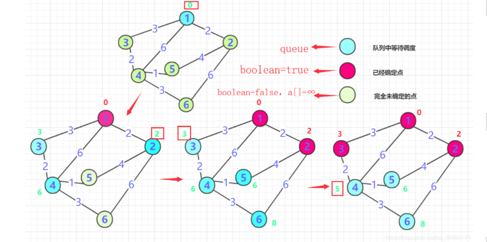
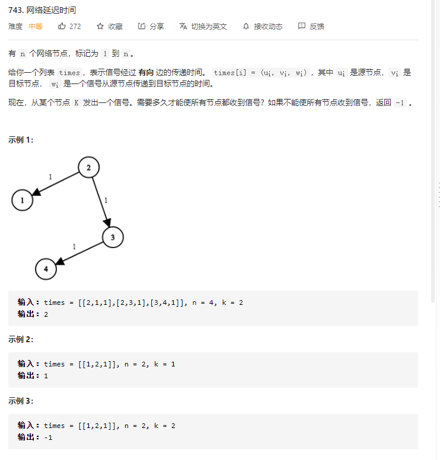

# Dijkstra算法详细 (单源最短路径算法)

单源：
* 从一个顶点出发，Dijkstra只能求一个顶点到其他点的最短距离而不是任意两点

Dijkstra 距离具体实例更加偏向带权更多一点。


## 算法分析
对于一个Dijkstra 算法而言，前提是它的前提条件和环境：
* 一个连通图，若干节点，节点可能有数值，但是 路径一定要有权值。并且路径一定不能为负。否则Dijkstra就不适用。


Dijkstra 的核心思想是贪心算法的思想。以下为实现方式：

### Dijkstra 算法的前提：
1. 首先，Dijkstra处理的带正权值的 有权图，那么就需要 一个 二维数组 存储各个点到达边的权值大小。 （邻接矩阵或者邻接表存储）
2. 需要一个**boolean 数组**判断哪那些点已经最短长度，哪些点没有确定。 **int数组**记录距离（**在算法执行过程可能被多次更新**）。
3. 需要**优先队列**加入已经**确定点的周围点**。 每次抛出确定最短路径的哪个并且确定最短，直到所有点路径确定最短为止。

xxxxxxxxxx ​// b表示模式串，m表示模式串的长度private static int[] getNexts(char[] b, int m) {  int[] next = new int[m];  next[0] = -1;  int k = -1;  for (int i = 1; i < m; ++i) {    while (k != -1 && b[k + 1] != b[i]) {      k = next[k];    }    if (b[k + 1] == b[i]) {      ++k;    }    next[i] = k;  }  return next;}​java

### 流程概括如下：
* 一般从选定点开始抛入优先队列。（路径一般为0），boolean 数组标记**1**的位置，然后**1** 周围连通的点 抛入优先队列中，然后把各个点的距离记录到对应数组内（**如果小于就更新，大于就不动，初始第一次是无穷肯定会更新**），第一次就结束了。
* 从队列中抛出 距离最近的那个点B， （第一次就是**1**周围邻居）。这个点距离一定是最近的（所有权值都是正的，点的距离只能越来越长。）标记这个点为true，并且将这个点的邻居加入队列（下一次确定的最短点在前面未确定和这个点的邻居中产生），并更新通过B 点计算各个位置的长度，如果小于则更新。
* 

* 重复二的操作，直到所有点都确定。


leetcode 例题：


```java
class Solution {
    
    public int networkDelayTime(int[][] times, int n, int k) {

        HashMap<Integer, List<int[]>> graph=new HashMap<>();

        for(int[] edge:times){
            int u=edge[0];
            if(!graph.containsKey(u)){
                graph.put(u,new ArrayList<int[]>());
            }
            graph.get(u).add(new int[]{edge[1],edge[2]});
        }
        // dijkstra

        PriorityQueue<int[]> heap=new PriorityQueue<int[]>((o1,o2)->o1[1]-o2[1]);
        HashMap<Integer,Integer> dist=new HashMap<>();

        heap.offer(new int[]{k,0});

        while(!heap.isEmpty()){
            int[] cur=heap.poll();
            int u=cur[0];
            int w=cur[1];
            //之前已经进去
            if(dist.containsKey(u)) continue;
            dist.put(u,w);

            if(graph.containsKey(u)){
                for(int[] edge:graph.get(u)){
                    int node =edge[0];
                    int l=edge[1];
                    heap.offer(new int[]{node,w+l});
                }
            }
        }
        int maxValue=0;
        for(int i=1;i<=n;i++){
            if(dist.containsKey(i)){
                maxValue=Math.max(dist.get(i),maxValue);
            }else return -1;
        }

        return maxValue;

    }


}
```