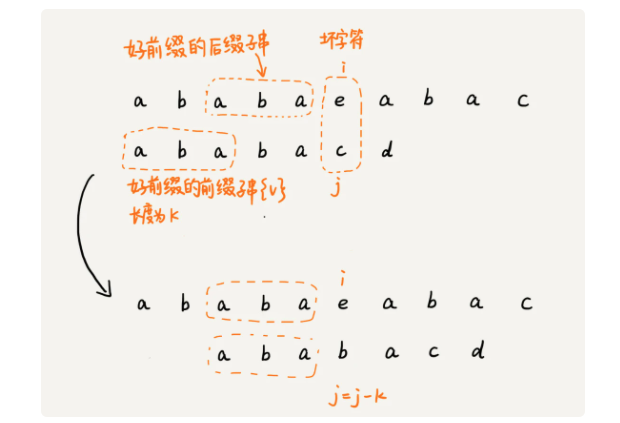
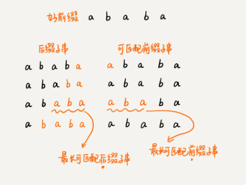

[toc]
# kmp 算法

KMP 是三位大牛： D.E.Knuth   J.H.Morris 和 V.R.Pratt同时发现的.

KMP 算法要解决的问题就是在字符串（也叫主串）中的模式(pattern)定位问题。就是平时常说的关键字搜索。模式串就是关键字，如果它在一个主串中出现，就返回它的具体位置，否则返回-1.


而基于暴力的算法的时间复杂度为O（n*m）。因此每次匹配不成功就要退回子串的其实位置，而之前完成的部分匹配也将作废。 而KMP算法却能将事件复杂度优化为O(n+m)，它是怎么做到的呢？

## kmp算法基本原理

kmp算法的核心思想，假设主串是a,模式串是b，在模式串与主串匹配的过程中，当遇到不可匹配匹配的字符的时候，我们希望找到一些规律，可以将模式串往后多滑动几位，跳过哪些肯定不会匹配的情况。


在模式串和主串匹配的过程中，把不能匹配的那个字符仍然叫做坏字符，把已经匹配的那段字符串叫作好前缀。


当遇到坏字符的时候，我们需要将模式串往后滑动，在滑动的过程中，**只要模式串和好前缀有上下重合，前面几个字符的比较，就相当于拿好前缀的后缀子串，跟模式串的前缀子串在比较。**


kmp算法就是在试图寻找一种规律：在模式串和主串匹配的过程中，当遇到坏字符后，对于已经比对过的好前缀，能否找到一种规律，将模式串一次性滑动很多位？


我们只需要拿好前缀本身，在它的后缀子串中，查找最长的那个可以跟好前缀的前缀子串匹配的。假设最长的可匹配的那部分前缀子串是{v},长度是k。我们把模式串一次性往后滑动j-k位，相当于，每次遇到坏字符的时候，我们就把j更新为k，i不变，然后继续比较。


为了表述起来方便，把好前缀的所有后缀子串中，最长的可匹配前缀子串的那个后缀字串，叫作最长可匹配后缀子串；对应的前缀子串，叫作最长可匹配前缀子串。



如何求解好前缀的最长可匹配前缀和后缀子串呢？通过对模式串本身即可求解，KMP算法提前构建一个数组，用来存储模式串中每个前缀的最长可匹配前缀子串的结尾字符下表。我们把这个数组定义为**next数组**，很多书中还给这个数组起了一个名字，叫**失效函数**。

数组的下标是每个前缀结尾字符下标，数组的值是这个前缀的最长可以匹配前缀子串的结尾字符下标。


因此有了next数组，我们可以很容易地实现了KMP算法了。先假设next数组已经计算好了，献给出KMP算法的框架代码。
```java

// a, b分别是主串和模式串；n, m分别是主串和模式串的长度。
public static int kmp(char[] a, int n, char[] b, int m) {
  int[] next = getNexts(b, m);
  int j = 0;
  for (int i = 0; i < n; ++i) {
    while (j > 0 && a[i] != b[j]) { // 一直找到a[i]和b[j]
      j = next[j - 1] + 1;
    }
    if (a[i] == b[j]) {
      ++j;
    }
    if (j == m) { // 找到匹配模式串的了
      return i - m + 1;
    }
  }
  return -1;
}

```


## 失效函数计算方法


```java

// b表示模式串，m表示模式串的长度
private static int[] getNexts(char[] b, int m) {
  int[] next = new int[m];
  next[0] = -1;
  int k = -1;
  for (int i = 1; i < m; ++i) {
    while (k != -1 && b[k + 1] != b[i]) {
      k = next[k];
    }
    if (b[k + 1] == b[i]) {
      ++k;
    }
    next[i] = k;
  }
  return next;
}

```