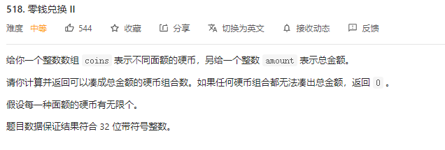

[toc]
# 动态规划

本文摘自 labuladong 公众号的动态规划详解。

**动态规划问题的一般形式就是求最值。**（如爬楼梯最少次数，最长递增子序列，最小编辑距离）

而求最值，**它的核心问题在于穷举**。因为要求最值，肯定要把所有可行的答案穷举出来，然后在其中找最值。

然而，动态规划的穷举有点特别，因为这类问题**存在[重复子问题]**，因此可以用 备忘录或者dp table 来优化穷举过程。


最重要的是，动态规划问题一定 具备[最优子问题]，类似于从子问题的解推导出最终解。


而最终解需要 列出 [状态转移方程] 才能最困难的。


如何思考状态转移方程，
明确[状态] -->定义 dp数组的含义 
明确[选择] -> 明确 base case.

## 动态规划理论
动态规划作为一个非常成熟的算法思想，很多人对此已经做了非常全面的总结。我把这部分理论总结为“一个模型三个特征”。

**一个模型**，指的是动态规划适合解决的问题的模型。把这个模型定义为“多阶段决策最优解模型”。

一般是用动态规划来解决最优问题。而解决问题的过程，需要经历多个决策阶段。每个决策阶段都对应着一组状态。然后我们寻找一组决策序列，经过这组决策序列，能够产生最终期望求解的最优值。

什么是“三个特征”？它们分别是最优子结构，无后效性和重复子问题。 这三个概念比较抽象。

1. 最优子结构
最优子结构指的是，问题的最优解包含子问题的最优解。反之来说就是，可以通过子问题的最优解，推导出问题的最优解。把最优子结构，推导出问题的最优解。如果把最优子结构，对应到动态规划问题模型中，可以理解为，后面阶段的状态可以通过前面阶段的状态推导出来。

2. 无后效性
无后效性由两层含义，第一层含义是，在推导后面阶段的状态的时候，我们只关心前面阶段的状态值，不关心这个状态是一步一步推导出来的。第二层含义是，某阶段状态一旦确定，就不受之后阶段的决策影响。无后效性是一个非常“宽松”的要求。只要满足前面提到的动态规划问题模型，其实基本上都会满足其后效性。

3. 重复子问题
不同的决策序列，到达某个相同的阶段时，可能会产生重复的状态。


## 0-1 背包


```java
import java.util.*;


public class Solution {
    /**
     * 代码中的类名、方法名、参数名已经指定，请勿修改，直接返回方法规定的值即可
     * 计算01背包问题的结果
     * @param V int整型 背包的体积
     * @param n int整型 物品的个数
     * @param vw int整型二维数组 第一维度为n,第二维度为2的二维数组,vw[i][0],vw[i][1]分别描述i+1个物品的vi,wi
     * @return int整型
     */
    public int knapsack (int V, int n, int[][] vw) {
        // write code here
        //动态规划
        //dp[i][j]：对于前i个物品，当前背包容量为j，所能放下的最大价值的东西
        int[][] dp=new int[n+1][V+1];
        
        for(int i=1;i<=n;i++){
            for(int j=1;j<=V;j++){
                if(j<vw[i-1][0]){
                    dp[i][j]=dp[i-1][j];
                }else{
                    dp[i][j]=Math.max(dp[i-1][j],dp[i-1][j-vw[i-1][0]]+vw[i-1][1]);
                }
            }
        }
        
        return dp[n][V];
        
    }
}
```

## 完全背包

```java
class Solution {
    public int change(int amount, int[] coins) {
        // dp[i][j] 使用了前i个硬币能组成j的方式
        int[][] dp=new int[coins.length+1][amount+1];

        for(int i=0;i<=coins.length;i++){
            dp[i][0]=1;
        }

        for(int i=1;i<=coins.length;i++){
            for(int j=1;j<=amount;j++){
                if(j>=coins[i-1]){
                    dp[i][j]=dp[i-1][j]+dp[i][j-coins[i-1]];
                }else
                    dp[i][j]=dp[i-1][j];
            }
        }
        return dp[coins.length][amount];

    }
}
```


## 多重背包