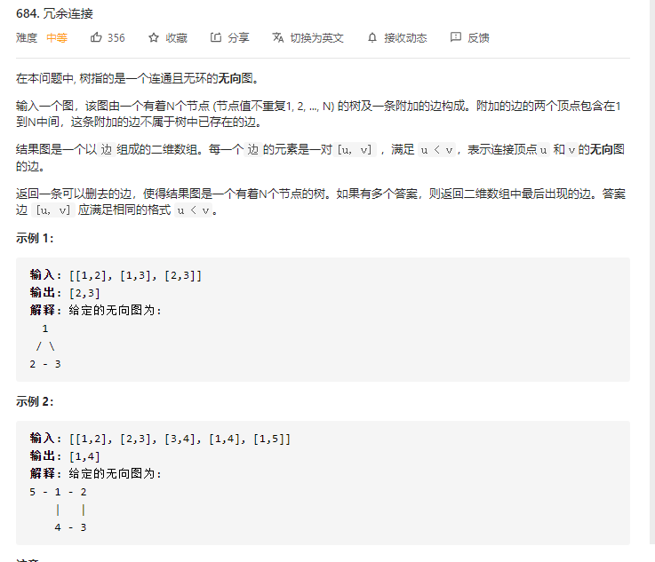

# 并查集

代码模板

```java
class Solution {
    public int[] findRedundantConnection(int[][] edges) {
        int nodesCount = edges.length;
        int[] parent = new int[nodesCount + 1];
        for (int i = 1; i <= nodesCount; i++) {
            parent[i] = i;
        }
        for (int i = 0; i < nodesCount; i++) {
            int[] edge = edges[i];
            int node1 = edge[0], node2 = edge[1];
            if (find(parent, node1) != find(parent, node2)) {
                union(parent, node1, node2);
            } else {
                return edge;
            }
        }
        return new int[0];
    }

    public void union(int[] parent, int index1, int index2) {
        parent[find(parent, index1)] = find(parent, index2);
    }

    public int find(int[] parent, int index) {
        if (parent[index] != index) {
            parent[index] = find(parent, parent[index]);
        }
        return parent[index];
    }
}


```
作者：LeetCode-Solution
链接：https://leetcode-cn.com/problems/redundant-connection/solution/rong-yu-lian-jie-by-leetcode-solution-pks2/
来源：力扣（LeetCode）
著作权归作者所有。商业转载请联系作者获得授权，非商业转载请注明出处。