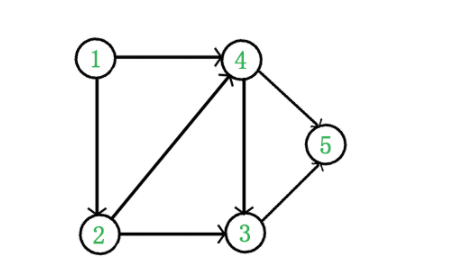

# 拓扑排序


在图论中， 拓扑排序（Topological Sorting） 是一个有向无环图（DAG,Directed Acyclic Graph）的所有顶点的线性序列。且该序列必须满足下面两个条件：
1. 每个顶点出现且只出现一次
2. 若存在一条从顶点A到顶点B的路径，那么在序列中顶点A出现在顶点B之前

有向无环图（DAG）才有拓扑排序，非DAG图没有拓扑排序一说。




对于这个图，
1. 从DAG图选择一个 没有前驱（即入度为0）的顶点并输出。
2. 从图中删除该顶点和所有以它为起点的有向边。
3. 重复1和2直到当前的DAG图为空或 当前图中不存在无前驱的顶点为止。 后一种情况说明有向图中必然存在环。


例题：
一个完整的软件项目往往会包含很多由代码和文档组成的源文件。编译器在编译整个项目的时候，可能需要按照依赖关系来依次编译每个源文件。比如，A.cpp 依赖 B.cpp，那么在编译的时候，编译器需要先编译 B.cpp，才能再编译 A.cpp。 假设现有 0，1，2，3 四个文件，0号文件依赖1号文件，1号文件依赖2号文件，3号文件依赖1号文件，则源文件的编译顺序为 2,1,0,3 或 2,1,3,0。现给出文件依赖关系，如 1,2,-1,1，表示0号文件依赖1号文件，1号文件依赖2号文件，2号文件没有依赖，3号文件依赖1号文件。请补充完整程序，返回正确的编译顺序。注意如有同时可以编译多个文件的情况，按数字升序返回一种情况即可，比如前述案例输出为：2,1,0,3


```java
import java.util.*;


public class Solution {
    /**
     * 代码中的类名、方法名、参数名已经指定，请勿修改，直接返回方法规定的值即可
     * 编译顺序
     * @param input string字符串 
     * @return string字符串
     */
    public String compileSeq (String input) {
        // write code here
        
        // 存储每个点的入度
        
        String[] v= input.split(",");
        HashMap<Integer,List<Integer>> graph=new HashMap<>();
        int[] degree=new int[v.length];
        PriorityQueue<Integer> que=new PriorityQueue<>();
        for(int i=0;i<v.length;i++){
            int node=Integer.parseInt(v[i]);
            if(node>=0){
                 if(!graph.containsKey(node)){
                    graph.put(node,new ArrayList<>());
                  }
                graph.get(node).add(i);
                degree[i]++;
            }else{
                que.offer(i);
            }
        }
        StringBuilder res=new StringBuilder();
        while(!que.isEmpty()){
            int cur=que.poll();
            
            res.append(cur);
            res.append(",");
            if(graph.containsKey(cur)){
                for(int node:graph.get(cur)){
                    degree[node]--;
                    if(degree[node]==0) que.offer(node);
                }
            }
            
        }
        res.deleteCharAt(res.length()-1);
        return res.toString();
        
       
        
    }
}
```