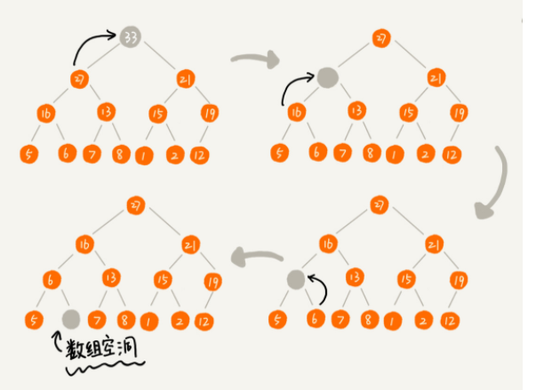
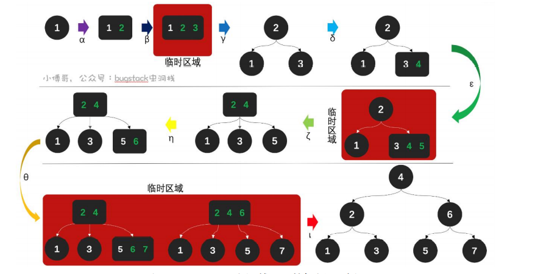
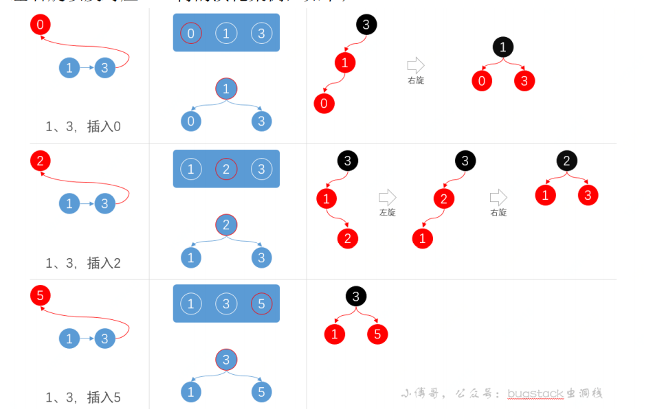

[toc]
# 数据结构


## 跳表
对于一个单链表来讲，即便链表中存储的数据是有序的，如果要想再其中查找某个数据，也只能从头到尾遍历链表，这样查找效率就会很低，时间复杂度会很高，是O(n)。


如何提高查找效率？ 对链表建立索引，


在原来没有索引的时候，查找62需要遍历62个结点，现在只需要遍历11个节点，当链表的长度n比较大时，比如1000，10000的时候，在构建索引之后，查找效率的提升会比较明显。


这种链表加多级索引的结构，就是跳表。

### 查找效率

当有n个节点，当每两个节点会抽出一个节点作为上一级索引的节点，

那么查找效率其实就在用二分查找一样，大概为log(n)。


### 插入和删除

插入：

跟链表的插入一样

删除：
删除的时候除了要删除原始链表中的结点，还要删除索引中的。因为单链表中的删除操作需要拿到要删除节点的前驱节点，然后通过指针操作完成删除。


### 更新索引
当不停地往表中插入数据时，如果不更新索引，就可能出现某2个索引节点之间数据特别多的请开给你。极端情况下，跳表还会退化成单链表。


这时候就需要某种手段来维护索引和原始链表大小之间的平衡，如果链表中的节点多了，索引节点就相应地增加一些，避免复杂度退化。


跳表是通过“随机函数”来维护“平衡性”，
通过一个随机函数，来决定将这个结点插入到哪几集索引中，比如随机函数生成了值K，那我们就将这个结点添加到第一级到第k级这k级索引中。


## 堆（Heap）
堆排序是一种原地的，事件复杂度为O(nlog n)的排序算法。

堆是一种特殊的树。
* 堆是一个完全二叉树；
* 堆中每一个节点的值都必须大于等于（或小于等于）其子树中每个节点的值。（对于每个节点的值都大于等于子树中每个节点值的堆，我们叫做“大顶堆”。对于每个节点的值都小于等于子树中每个节点值的堆，我们叫做“小顶堆”）。
  


如图所示：1，2，为大顶堆， 3为小顶堆。4不是堆

### 如何实现一个堆
堆是完全二叉树，比较适合用数组来存储。


可以看到，下标为i的节点的左子节点，就是下标为i* 2的节点，右子节点就是下标为 i*2+1
节点，父节点就是i/2 的节点。


#### 往堆中插入一个元素。
如果把新插入的元素放到堆的最后，可能会不符合堆的特性，因此需要对其进行调整，让其重新满足堆的特性，这个过程叫做堆化（heapify）


堆化过程就是顺着节点所在的路径，向上或者向下，**对比，然后交换**。

让新插入的节点与父节点对比大小，如果不满足子节点小于等于父节点的大小关系，就互换节点，一直重复这个过程，直到父子节点之间满足刚说的那种大小关系。


顺便附上极客时间的 数据结构与算法之美的 代码：
```java

public class Heap {
  private int[] a; // 数组，从下标1开始存储数据
  private int n;  // 堆可以存储的最大数据个数
  private int count; // 堆中已经存储的数据个数

  public Heap(int capacity) {
    a = new int[capacity + 1];
    n = capacity;
    count = 0;
  }

  public void insert(int data) {
    if (count >= n) return; // 堆满了
    ++count;
    a[count] = data;
    int i = count;
    while (i/2 > 0 && a[i] > a[i/2]) { // 自下往上堆化
      swap(a, i, i/2); // swap()函数作用：交换下标为i和i/2的两个元素
      i = i/2;
    }
  }
 }

```
#### 删除堆顶元素
因为堆顶元素存储的是堆中数据最大值或者最小值。

假设构造的是大顶堆，堆顶元素就是最大的元素，当删除堆顶元素的时候，就需要把第二大的元素放到堆顶，那么第二大元素肯定会出现在左右子节点中。然后我们再迭代地删除第二大节点，一次类推，直到叶子节点被删除。
而这么做容易造成数组空洞,会使得堆不满足完全二叉树的性质。



而这时候，可以改变一下思路，把最后一个节点放到堆顶，然后利用同样的父子节点对比方法，对于不满足父子节点大小关系的，互换两个节点，并且重复这个过程，直到父子节点之间满足大小关系解可。这就是从上到下的堆化方法。


同样的，代码如下：
```java

public void removeMax() {
  if (count == 0) return -1; // 堆中没有数据
  a[1] = a[count];
  --count;
  heapify(a, count, 1);
}

private void heapify(int[] a, int n, int i) { // 自上往下堆化
  while (true) {
    int maxPos = i;
    if (i*2 <= n && a[i] < a[i*2]) maxPos = i*2;
    if (i*2+1 <= n && a[maxPos] < a[i*2+1]) maxPos = i*2+1;
    if (maxPos == i) break;
    swap(a, i, maxPos);
    i = maxPos;

  }
}


```


### 如何进行堆排序
堆排序可以把数组原地建成一个堆，不借助另外一个数组，就在原数组上操作。
#### 建堆
这里有两种方法
第一种，在堆中插入一个元素的思路，尽管数组中包含n个数据，但是假设，最初堆中只有一个数据，然后依次插入，将下标从2到n的数据一次插入到堆中，组织成了堆。


第二种实现思路，跟第一种截然相反，上往下堆化。
因为叶子节点从上往下堆化只能跟本身比较，因此必须跟非叶子节点开始，依次堆化。


第二种方法如下：
```java

private static void buildHeap(int[] a, int n) {
  for (int i = n/2; i >= 1; --i) {
    heapify(a, n, i);
  }
}

private static void heapify(int[] a, int n, int i) {
  while (true) {
    int maxPos = i;
    if (i*2 <= n && a[i] < a[i*2]) maxPos = i*2;
    if (i*2+1 <= n && a[maxPos] < a[i*2+1]) maxPos = i*2+1;
    if (maxPos == i) break;
    swap(a, i, maxPos);
    i = maxPos;
  }
}
```


#### 排序

建堆完成后，数组的数据已经按照大顶堆（小顶堆）的特性来组织，这时候把堆顶的数据跟最后一个元素交换，然后根据上面讲的删除堆顶元素的操作，移除之后，将剩下的n-1个元素重新构建成堆，直到只剩下最后一个元素，排序工作就完成了。

```java

// n表示数据的个数，数组a中的数据从下标1到n的位置。
public static void sort(int[] a, int n) {
  buildHeap(a, n);
  int k = n;
  while (k > 1) {
    swap(a, 1, k);
    --k;
    heapify(a, k, 1);
  }
}

```

## 二叉树


### 二叉树的存储方式

**链式存储法**：每个节点有三个字段，其中一个存储数据，另外两个是指向左右子节点的指针。
大多数二叉树都是通过这种结构实现的。


**顺序存储法**：根节点存储在下标i=1的位置，左子节点存储在下标2 * i=2的位置，右子节点存储在2 * i + 1的位置（<font color=red>这种方法对于非完全二叉树来说会浪费比较浪费空间，因此一般用于完全二叉树</font>）


### 二叉树的遍历
二叉树的遍历方法有三种：
前序遍历：对于树的任意节点来说，先打印这个节点，然后再打印它的左子树，最后打印它的右子树。

中序遍历：对于树的任意节点来说，先打印它的左子树，然后再打印它本身，最后打印它的右子树

后续遍历：对于树的任意节点来说，先打印它的左子树，然后再打印它的右子树，最后打印它本身


代码：
```c++

void preOrder(Node* root) {
  if (root == null) return;
  print root // 此处为伪代码，表示打印root节点
  preOrder(root->left);
  preOrder(root->right);
}

void inOrder(Node* root) {
  if (root == null) return;
  inOrder(root->left);
  print root // 此处为伪代码，表示打印root节点
  inOrder(root->right);
}

void postOrder(Node* root) {
  if (root == null) return;
  postOrder(root->left);
  postOrder(root->right);
  print root // 此处为伪代码，表示打印root节点
}

```

## 二叉查找树
二叉查找树是二叉树最常用的一种类型，也叫二叉搜索树。
顾名思义。二叉查找树是为了实现快速查找而生的。它不仅仅支持快速查找一个数据，还支持快速插入，删除一个数据。

二叉查找树要求，在树中的任意一个节点，其**左子树**中每个节点的值，都要**小于**这个节点的值，而**右子树**节点的值都**大于**这个节点的值。

### 二叉查找树的查找操作
先取根节点，如果是查找的数据，那就返回，如果要查找的数据比根节点的笑，那就在左子树中递归查找，如果要查找的数据比根节点的值大，那就在右子树中递归查找。

```java

public class BinarySearchTree {
  private Node tree;

  public Node find(int data) {
    Node p = tree;
    while (p != null) {
      if (data < p.data) p = p.left;
      else if (data > p.data) p = p.right;
      else return p;
    }
    return null;
  }

  public static class Node {
    private int data;
    private Node left;
    private Node right;

    public Node(int data) {
      this.data = data;
    }
  }
}

```

### 二叉查找树的插入操作
有点类似查找操作。 新插入的数据一般都是在叶子节点上，所以我们只需要从根节点开始，依次比较要插入的数据和节点的大小关系。

如果要插入的数据比节点的数据大，并且节点的右子树为空，就将新数据直接插到右子节点的位置；如果不为空，就再递归遍历右子树，查找插入位置。左子树同理。


```java

public void insert(int data) {
  if (tree == null) {
    tree = new Node(data);
    return;
  }

  Node p = tree;
  while (p != null) {
    if (data > p.data) {
      if (p.right == null) {
        p.right = new Node(data);
        return;
      }
      p = p.right;
    } else { // data < p.data
      if (p.left == null) {
        p.left = new Node(data);
        return;
      }
      p = p.left;
    }
  }
}
```
### 二叉查找树的删除操作
这里有两种情况，
第一种情况， 如果要删除的节点没有子节点，只需要将该节点的父节点指向该节点的指针只为null

第二种情况，如果要删除的节点只有一个子节点（只有左子节点或者右子节点），只需要更新父节点中，指向要删除节点的指针，让它指向要删除节点的子节点就可以了。

第三种情况，如果要删除的节点有两个子节点，需要找到这个节点的右子树的最小节点，把它替换到要删除的节点上。然后再删除掉这个最小节点，因为最小节点肯定没有左子节点（左子节点一定比它小）。


删除代码如下：
```java

public void delete(int data) {
  Node p = tree; // p指向要删除的节点，初始化指向根节点
  Node pp = null; // pp记录的是p的父节点
  while (p != null && p.data != data) {
    pp = p;
    if (data > p.data) p = p.right;
    else p = p.left;
  }
  if (p == null) return; // 没有找到

  // 要删除的节点有两个子节点
  if (p.left != null && p.right != null) { // 查找右子树中最小节点
    Node minP = p.right;
    Node minPP = p; // minPP表示minP的父节点
    while (minP.left != null) {
      minPP = minP;
      minP = minP.left;
    }
    p.data = minP.data; // 将minP的数据替换到p中
    p = minP; // 下面就变成了删除minP了
    pp = minPP;
  }

  // 删除节点是叶子节点或者仅有一个子节点
  Node child; // p的子节点
  if (p.left != null) child = p.left;
  else if (p.right != null) child = p.right;
  else child = null;

  if (pp == null) tree = child; // 删除的是根节点
  else if (pp.left == p) pp.left = child;
  else pp.right = child;
}
```

## 2-3 树（红黑树的前身）

### 2-3树是什么？
2-3树是一种非常巧妙地结构，在保证树结构地基础上，它允许一个节点可以有两个元素，等元素数量等于3个地时候再进行调整。通过这种方式，来保证整个二叉搜索树的平衡性。


### 2-3树的使用？

#### 2-3树的特性


#### 数据插入




#### 数据删除
数据删除对比数据插入就是一个逆向的过程，在删除的时候主要包含以下两种情况：
1. 删除了3-节点（可以分出3个叉），也就是包含两个数据元素的节点，直接删除即可，不会破坏树平衡
2. 删除了2-节点，这时候会破坏树平衡，需要将树高缩短或者元素合并，恢复树平衡。


#### 数据索引
相比于插入和删除，索引的过程比较简单，不需要调整数据结果，原则如下：
* 小于当前节点值，左侧寻找
* 大于当前节点值，右侧寻找
* 一直找到索引所至，停止


## 红黑树


2-3树是红黑树的前身，那么探讨以下红黑树与2-3树的等价性。

### 2-3树与红黑树的等价性


**红黑树的规则**
* 根节点是黑色
* 节点是红黑或者黑色
* 所有叶子节点都是黑色的空节点(NIL)
* 任何相邻的节点不能同时为红色，红色节点是被黑色节点隔开的；
* 每个节点，从该节点到达可到叶子节点的所有路径，都包含相同数目的黑色节点。


#### 为什么既有 2-3树要有红黑树
2-3 树就是一个节点有1个或者2个元素，而实际上2-3树转红黑树是由概念模型 2-3-4树转换而来的。 -4 叉 就是一个节点里有三个元素，这在2-3树里是临时区域，但是在概念模型里会被保留。而如果直接把这样的模型用代码实现会很麻烦，且效率不高。 复杂点包括：

* 2-叉，3-叉，4-叉， 三种结构的节点类型，互相转换复杂度较高
* 3-叉，4-叉，节点在数据比较上需要进行多次，不像2-叉节点，直接布尔类型比较即可 *非左即右*
* 代码实现上对每种差异，都需要有额外的代码，规则不够标准化

所以，希望找到一种平衡关系，既保持2-3树平衡和 O(log n)的特性，又能在代码实现上更加方便，于是诞生了**红黑树**。

#### 简单 2-3树转红黑树


从上图可以看出， 2-3-4树与红黑树的转换关系，包括：
1. 2-叉节点，转换比较简单，只是把原有节点转换为黑色节点
2. 3-叉节点，包括2个元素，先用红色线把两个节点相连，之后拆分出来，最后调整高度黑色节点在上
3. 4-叉节点，包括了3个元素，分别用红黑线连接，之后拆分出来拉升高度。这个拉升过程和2-3树调整一致，只是添加了颜色


#### 复杂2-3树转红黑树


#### 红黑树

##### 平衡操作
在2-3树时在插入节点时不是插到空位置，而是与现有节点融合以及调整，保持整个树的平衡。

而红黑树是2-3-4树的一种概念模型转换而来，在插入节点时通过红色链接相连，也就是插入红色节点。插入完成后进行调整，以保证树接近平衡。（个人理解其实所谓的左旋右旋都是为了让红黑树的结果与2-3树保持一致）。

##### 左右旋转
如何调整，则会用到左旋右旋两个操作， 图中的a,b,r表示子树，可以为空


根据左右旋来与2-3树进行对比：


1. 1, 3 插入0， 左侧底部插入，与2-3树相比，需要右旋保持条件
2. 1, 3 插入2， 中间位置插入，首先左旋调整元素位置，之后进行右旋进行树平衡
3. 1，3 插入5,  右侧位置插入，此时正好保持树平衡， 不需要调整


##### 染色
在2-3树中，插入一个节点，为了保持树平衡时不插入到空位置上的，当插入节点后元素数量有3个后则需要调整中间元素向上，来保持树平衡。与之对应的红黑树需要调整颜色，来保证红黑树的平衡规则。


#####  旋转+染色运用案例


