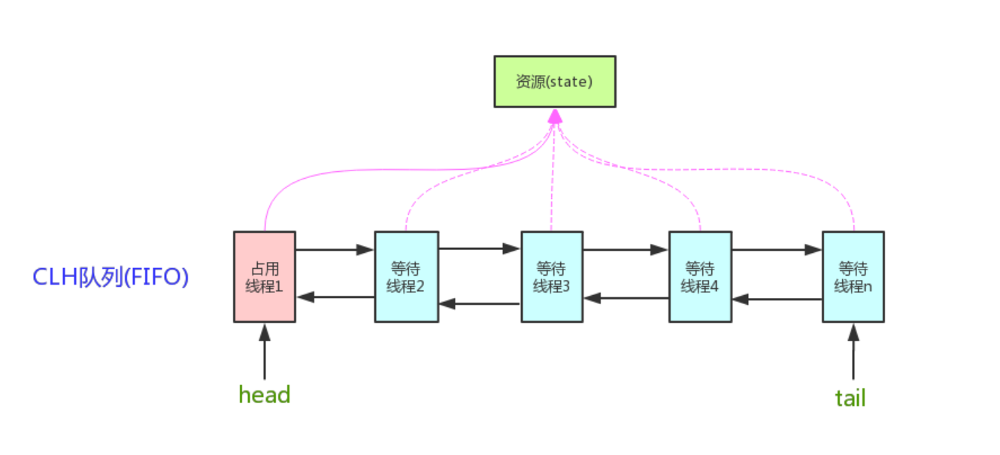
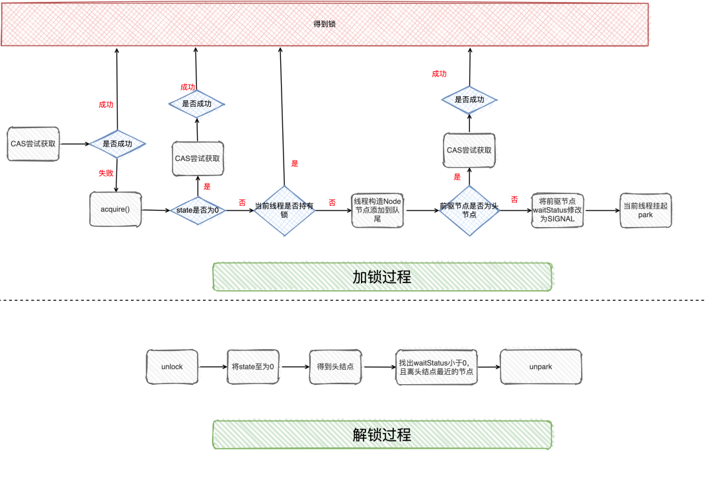
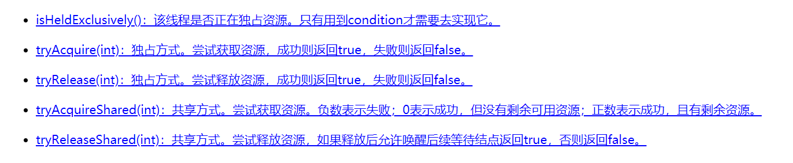

#AQS

##AQS是什么？
AQS全称叫做AbstractQueuedSynchronizer,抽象队列同步器，是一个实现锁的一个【框架】，内部实现的关键就是维护了一个先进先出的队列（多线程征用资源被阻塞时会进入此队列）以及state（代表共享资源）状态变量。





这个先进先出队列存储的载体 叫做**Node**节点，该节点标识着当前的状态值，是独占还是共享模式以及它的前驱和后继节点等等信息。


简单理解就是：AQS定义了模板，具体实现由各个子类完成。（ReentrantLock,ReentrantReadWriteLock,CountDownLatch,Semaphore这些常用的实现类都是基于AQS实现的）它的子类必须重写AQS的几个protected修饰的用来改变同步状态的方法，


AQS支持两种模式：
* Exclusive（独占，只有一个线程能执行，如ReentrantLock）
* Share(共享，多个线程可同时执行，如Semaphore/CountDownLatch)


##ReentrantLock 非公平锁为例讲讲 AQS

ReentrantLock 默认是非公平锁

以默认的非公平锁（jdk1.8）为例， 讲解lock 与unlock的实现

###lock
1）CAS尝试获取锁，获取成功则可以执行同步代码
2）CAS获取失败，则调用acquire()方法，acquire方法实际上就是AQS的模板方法

```java
final void lock() {
            if (compareAndSetState(0, 1))
                setExclusiveOwnerThread(Thread.currentThread());
            else
                acquire(1);
        }
```

3) acquire 首先会调用子类的tryAccquire方法（又回到了ReentrantLock中）
```java
  public final void acquire(int arg) {
        if (!tryAcquire(arg) &&
            acquireQueued(addWaiter(Node.EXCLUSIVE), arg))
            selfInterrupt();
    }

```
4）tryAccquire 方法实际上会判断当前的state (c) 是否等于0，等于0说明没有线程持有锁，则又尝试CAS直接获取锁

```java
  protected final boolean tryAcquire(int acquires) {
            return nonfairTryAcquire(acquires);
        }
```

```java
 final boolean nonfairTryAcquire(int acquires) {
            final Thread current = Thread.currentThread();
            int c = getState();
            if (c == 0) {
                if (compareAndSetState(0, acquires)) {
                    setExclusiveOwnerThread(current);
                    return true;
                }
            }
            else if (current == getExclusiveOwnerThread()) {
                int nextc = c + acquires;
                if (nextc < 0) // overflow
                    throw new Error("Maximum lock count exceeded");
                setState(nextc);
                return true;
            }
            return false;
        }

```


5） 如果CAS获取成功，则可以执行同步代码
1)  如果有锁，那判断当前线程与否就持有锁，如果是持有的锁，那就更新state的值，获取得到锁（处理可重入的逻辑）
2)  CAS失败&&非重入的情况，则回到tryAcquire方法执行[入队列]的操作
3) 将节点入队列之后，会判断【前驱节点】是不是头节点，如果是头节点又会用CAS尝试获取锁
```java
final boolean acquireQueued(final Node node, int arg) {
        boolean failed = true;
        try {
            boolean interrupted = false;
            for (;;) {
                final Node p = node.predecessor();
                if (p == head && tryAcquire(arg)) {
                    setHead(node);
                    p.next = null; // help GC
                    failed = false;
                    return interrupted;
                }
                if (shouldParkAfterFailedAcquire(p, node) &&
                    parkAndCheckInterrupt())
                    interrupted = true;
            }
        } finally {
            if (failed)
                cancelAcquire(node);
        }
    }

```
9)  如果是前驱节点是头节点并获取得到锁，则将当前节点设置为头节点，并且将前置节点置空(实际上就是原来的头节点已经释放锁了)
10) 没获取得到锁，则判断前驱节点的状态是否为SIGNAL，如果不是，则找到合适的前驱节点，并使用CAS将状态设置为SIGNAL
11) 最后调用park 将当前线程挂起
压缩一下：线程CAS获取锁失败，将当前线程入队列，把前驱节点状态设置为SIGNAL 状态，并将自己挂起。

###unlock
1）外界调用unlock方法时，实际上会调用AQS的 release()方法，而release方法会调用子类的tryRelease方法(又回到了ReentrantLock中)
2）tryRelease 会把state 一直减，直至到0，说明当前线程已经把锁释放了
3）随后从队尾往前找节点状态需要<0, 并离头节点最近的节点状态<0,并离头节点最近的节点进行唤醒

唤醒之后，则唤醒的线程则尝试使用CAS获取锁，假设获取锁得到则把头节点给干掉，把自己设置为头节点

压缩一下：把state置0，唤醒头节点下一个合法的节点，被唤醒的节点线程自然就会获取锁


###节点状态

Node 的节点状态
```java

        /** waitStatus value to indicate thread has cancelled */
        static final int CANCELLED =  1;
        /** waitStatus value to indicate successor's thread needs unparking */
        static final int SIGNAL    = -1;
        /** waitStatus value to indicate thread is waiting on condition */
        static final int CONDITION = -2;
        /**
         * waitStatus value to indicate the next acquireShared should
         * unconditionally propagate
         */
        static final int PROPAGATE = -3;

```
ReentrantLock解锁的时候，会判断节点的状态是否小于0，小于等于0才说明要唤醒，这里就是 lock的时候把前驱节点SIGNAL的作用



## 公平锁
公平锁的实现与非公平锁很像，再获取锁的时候**不用CAS**来获取锁，
只有当队列没节点并且state为0的时候才会去获取锁，不然直接把线程放到队列中


#AQS的核心
不同的自定义同步器争用共享资源的方式也不同。自定义同步器在实现时只需要实现共享资源state的获取与释放方式即可，至于具体线程等待队列的维护（如获取资源失败入队/唤醒出队等），AQS已经在顶层实现好了。自定义同步器实现时主要实现以下几种方法：
