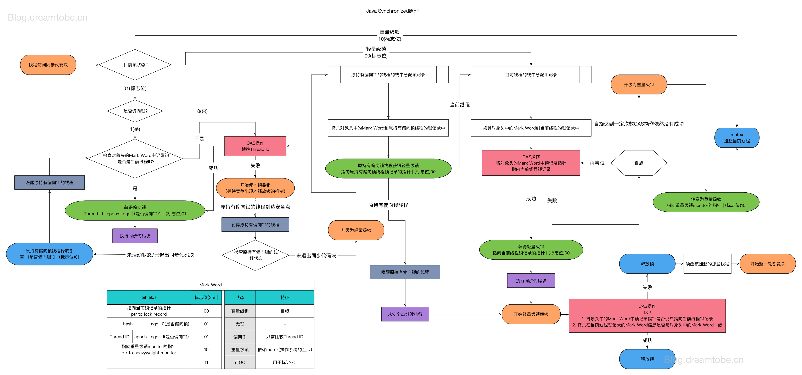
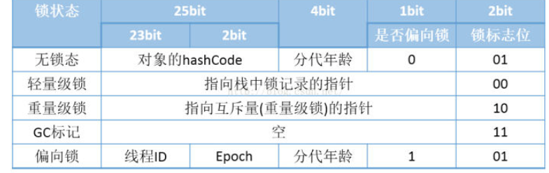
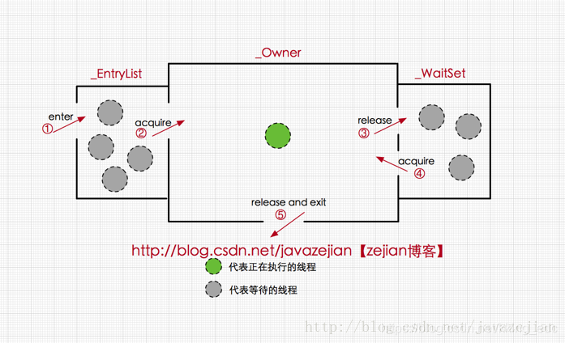
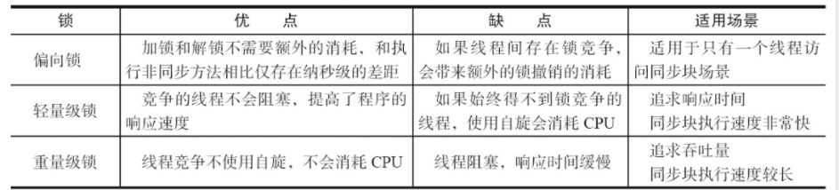

[TOC]

#锁专题


## sychronized 的实现原理是怎么样的？
```java
public class SyncTest {
    public void syncBlock(){
        synchronized (this){
            System.out.println("hello block");
        }
    }
    public synchronized void syncMethod(){
        System.out.println("hello method");
    }
}
```
当SyncTest.java被编译成class文件的时候，synchronized关键字和synchronized方法的字节码略有不同，我们可以用javap -v 命令查看class文件对应的JVM字节码信息，部分信息如下：
```java
{
  public void syncBlock();
    descriptor: ()V
    flags: ACC_PUBLIC
    Code:
      stack=2, locals=3, args_size=1
         0: aload_0
         1: dup
         2: astore_1
         3: monitorenter				 	  // monitorenter指令进入同步块
         4: getstatic     #2                  // Field java/lang/System.out:Ljava/io/PrintStream;
         7: ldc           #3                  // String hello block
         9: invokevirtual #4                  // Method java/io/PrintStream.println:(Ljava/lang/String;)V
        12: aload_1
        13: monitorexit						  // monitorexit指令退出同步块
        14: goto          22
        17: astore_2
        18: aload_1
        19: monitorexit						  // monitorexit指令退出同步块
        20: aload_2
        21: athrow
        22: return
      Exception table:
         from    to  target type
             4    14    17   any
            17    20    17   any
 

  public synchronized void syncMethod();
    descriptor: ()V
    flags: ACC_PUBLIC, ACC_SYNCHRONIZED      //添加了ACC_SYNCHRONIZED标记
    Code:
      stack=2, locals=1, args_size=1
         0: getstatic     #2                  // Field java/lang/System.out:Ljava/io/PrintStream;
         3: ldc           #5                  // String hello method
         5: invokevirtual #4                  // Method java/io/PrintStream.println:(Ljava/lang/String;)V
         8: return
 
}
```
对于synchronized 关键字而言，javac在编译时，会生成对应的monitorenter和monitorexit指令分别对应synchronized 同步块的进入和退出，有两个monitorexit指令的原因是为了保证抛异常的情况下也能释放锁，所以javac为同步代码块添加了一个隐式的try-finally，在finally中会调用monitorexit命令释放锁。


而对于synchronized方法而言，javac为其生成了一个ACC_SYNCHRONIZED关键字，在JVM进行方法调用时，发现调用的方法被ACC_SYNCHRONIZED修饰，则会先尝试获得锁。



在JVM中，对象的内存布局  由 对象头+ 实例数据 + 对其填充三部分组成，而对象头包括 Mark Word+指向对象所属的类指针组成。  Mark Word 主要用于存储对象自身的运行时数据，哈希码，GC分代年龄，锁标志等。



### 偏向锁
根据上面的表来看，Mark Word后三位为101时，加锁对象的状态为偏向锁，偏向锁的意义在于同一个线程访问sychronized代码块时不需要进行加锁，解锁操作，性能开销更低（HotSpo的作者经过研究发现，大多数情况下，锁不仅不存在多线程竞争，而且总是由同一线程多次获得，为了让线程获得锁的代价更低而引入了偏向锁。）


因为在正常情况下，当一个线程访问同步块并获取轻量级锁时，需要进行CAS操作将对象头的锁记录里指向当前线程的栈中的锁记录，执行完毕后需要释放轻量级锁。如果是同一个线程多次访问sychronized 代码块，多次获取和释放轻量级锁，开销会偏大，因此会一开始判断对象是无锁状态，会将对象头设置为偏向锁，并且这个的线程ID添加到锁对象的Mark Word中，后续同一线程判断加锁标志是偏向锁，并且线程ID一致就可以直接执行。
#### 偏向锁的加锁过程：

场景1：当锁对象第一次被线程获得锁的是时候
线程发现是匿名偏向状态（也就是锁对象的Mark Word没有存储线程ID），则会用CAS指令，将 mark word中的thread id由0改成当前线程Id。如果成功，则代表获得了偏向锁，继续执行同步块中的代码。否则，将偏向锁撤销，升级为轻量级锁。

场景2：当获取偏向锁的线程再次进入同步块时
发现锁对象存储的线程ID就是当前线程的ID，会往当前线程的栈中添加一条 DisplacedMarkWord为空的 LockRecord中，然后继续执行同步块的代码，因为操纵的是线程私有的栈，因此不需要用到CAS指令；由此可见偏向锁模式下，当被偏向的线程再次尝试获得锁时，仅仅进行几个简单的操作就可以了，在这种情况下， synchronized关键字带来的性能开销基本可以忽略。


场景3：当没有获得锁的线程进入同步块时
当没有获得锁的线程进入同步块时，发现当前是偏向锁状态，并且存储的是其他线程ID（也就是其他线程正在持有偏向锁），则会进入到撤销锁的逻辑里，一般来说，会在safepoint中去查看偏向的线程是否还存活
* 如果这个线程存货且还在同步块中执行，则将锁升级为轻量级锁，原偏向的线程继续拥有锁，只不过持有的是轻量级锁，继续执行代码块，执行完之后按照轻量级锁的解锁方式进行解锁，而其他线程则进行自旋，尝试获得轻量级锁。
* 如果偏向的线程已经不存活或者不在同步块中，在将对象头的 mark word改为无锁状态。后续的同步操作就如上面介绍的轻量级锁那样执行

####偏向锁的解锁过程
偏向锁解锁过程很简单，只需要测试下是否Object上的偏向锁模式是否还存在，如果存在则解锁成功不需要任何其他额外的操作。

### 轻量级锁
* 加锁
  * 代码进入同步块时，如果此同步对象没有被锁定（锁标志位为01，）,虚拟机首先在当前线程的栈帧中建立一个所记录（Lock Record）空间，用于存储锁对象目前的Mark Word 拷贝（官方把这份拷贝加了一个Displaced前缀，即Displaced Mark Word）
  * 然后，虚拟机使用CAS操作尝试将该对象的Mark Word更新为指向Lock Record的指针，如果更新失败，如果操作成功，则这个线程就拥有了该对象的锁，并且所标识变为00
  * CAS 更新Mark Word 如果失败了，虚拟机首先会检查对象的Mark Word 是否指向当前线程的栈帧，如果是说明了该线程已经拥有了这个对象的锁，那就可以直接进入同步块继续执行，否则说明这个锁对象已经被其他线程抢占了。
  * 这样轻量级锁就不再有效，要膨胀为重量级锁，锁标志的状态值变为10

* 解锁
  * 解锁也是通过CAS操作来进行的，如果对象的Mark Word仍然指向线程的所记录，那就用CAS把对象的Mark Word和线程中加锁时复制的Mark Word 替换回来
  * 如果替换成功则整个同步完成了,如果替换失败则说明其他线程尝试获取该锁，name释放锁的同时同时唤醒被挂起的线程


### 重量级锁
重量级锁也就是通常说synchronized的对象锁，锁标识位为10，其中指针指向的是monitor对象（也称为管程或监视器锁）的起始地址。每个对象都存在着一个 monitor 与之关联，对象与其 monitor 之间的关系有存在多种实现方式，如monitor可以与对象一起创建销毁或当线程试图获取对象锁时自动生成，但当一个 monitor 被某个线程持有后，它便处于锁定状态。

在Java虚拟机（HotSpot）中，monitor是由**ObjectMonitor**实现的，其主要数据结构如下（位于HotSpot虚拟机源码ObjectMonitor.hpp文件，C++实现的）

```c++
ObjectMonitor() {
    _header       = NULL;
    _count        = 0; //记录个数
    _waiters      = 0,
    _recursions   = 0;
    _object       = NULL;
    _owner        = NULL;
    _WaitSet      = NULL; //处于wait状态的线程，会被加入到_WaitSet
    _WaitSetLock  = 0 ;
    _Responsible  = NULL ;
    _succ         = NULL ;
    _cxq          = NULL ;
    FreeNext      = NULL ;
    _EntryList    = NULL ; //处于等待锁block状态的线程，会被加入到该列表
    _SpinFreq     = 0 ;
    _SpinClock    = 0 ;
    OwnerIsThread = 0 ;
  }

```
ObjectMonitor中有两个队列，_WaitSet 和 _EntryList，用来保存ObjectWaiter对象列表( 每个等待锁的线程都会被封装成ObjectWaiter对象)，_owner指向持有ObjectMonitor对象的线程，当多个线程同时访问一段同步代码时，首先会进入 _EntryList 集合，当线程获取到对象的monitor 后进入 _Owner 区域并把monitor中的owner变量设置为当前线程同时monitor中的计数器count加1，若线程调用 wait() 方法，将释放当前持有的monitor，owner变量恢复为null，count自减1，同时该线程进入 WaitSet集合中等待被唤醒。若当前线程执行完毕也将释放monitor(锁)并复位变量的值，以便其他线程进入获取monitor(锁)。


==此处要注意一点：若一个锁对象调用wait或notify，若当前锁级别是轻量级锁或偏向锁，那么将膨胀为重量级锁。==

### 什么时候发生锁升级，锁降级
偏向锁：只有一个线程进入临界区
偏向锁 升级为 轻量级锁： 多个线程交替进入临界区
轻量级锁 升级为 重量级锁： 在轻量级锁 状态时与其他的锁进行争抢，自旋抢占一定次数后就会升级到重量级锁

### synchorinized锁都是非公平的
偏向锁很好理解，如果当前线程id与mark word 存储的不相等，则CAS尝试更换线程ID，CAS成功就获取到锁了，CAS失败就升级为轻量级锁

轻量级锁实际上也是通过CAS 来抢占锁资源(只不过多了拷贝mark word到lock record的过程)，抢占到锁就归属给该线程了，但自旋失败一定次数后升级重量级锁


重量级锁通过monitor对象中的队列存储线程，但线程进入队列前，还是会先尝试获取到锁，如果能获取不到才进入线程等待队列中


综上所述，synchronized无论处理那种锁，都是先尝试获取，获取不到才升级||队列上的，所以是非公平的。


### 锁的优缺点



##参考文章： 
面试造火箭 ->AQS&ReentrantLock
Java中synchronized原理和偏向锁、轻量级锁及重量级锁:
https://blog.csdn.net/zz775854904/article/details/108569248
https://github.com/NotFound9/interviewGuide/blob/master/docs/Lock.md

Java对象头与monitor:https://blog.csdn.net/kking_edc/article/details/108382333
