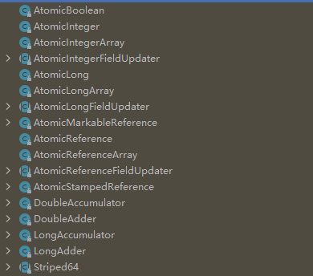
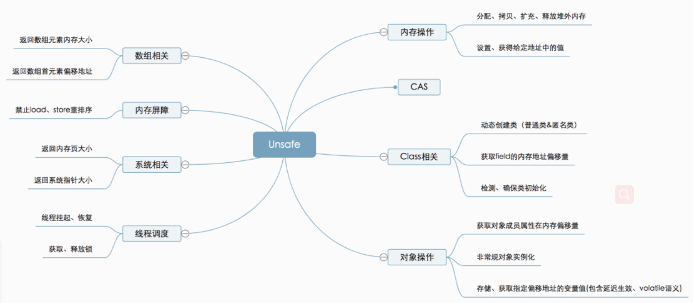
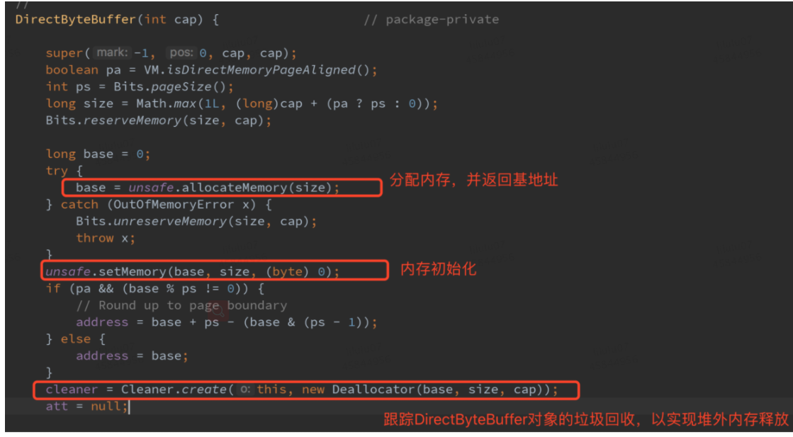
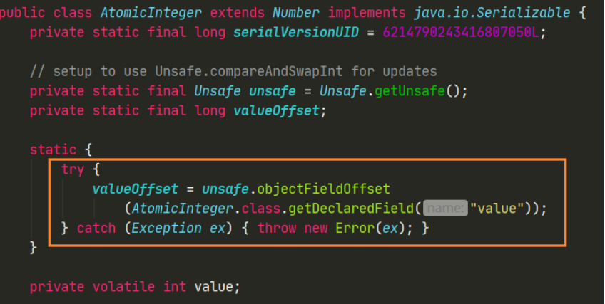
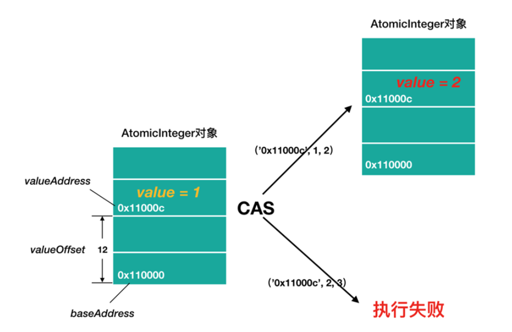

[toc]

# Atomic原子类

## 什么是原子操作？
原子（atom）本意是“不能被进一步分割的最小粒子”，而原子操作（atomic operation) 意为“不可被中断的一个或一系列操作”。在多处理器上实现原子操作就变得有点复杂。


## 原子操作实现方法

### 悲观的解决方案（阻塞同步）
在并发环境下，如果不做任何同步处理，就会有线程安全问题。最重要的方式就是加锁，
```java
public class Counter{
    private int count;

    public synchronized void addCount(){
        this.count++;
    }
}

```
简单的 count++ 操作，线程对象首先需要获取到 Counter 类实例的**对象锁**，然后完成自增操作，最后释放对象锁。整个过程中，无论是获取锁还是释放锁都是相当**消耗成本**的，一旦不能获取到锁，还需要**阻塞**当前线程等等。

使用独占锁机制来解决，是一种**悲观的**并发策略，认为并发操作都是不安全的，每次操作数据的时候都认为别的线程会参与竞争修改，所以直接加锁。同一刻只能有一个线程持有锁，那其他线程就会阻塞。线程的挂起恢复会带来很大的性能开销，尽管 JVM 对于非竞争性的锁的获取和释放做了很多优化，但是一旦有多个线程竞争锁，频繁的阻塞唤醒，还是会有很大的性能开销的。所以，使用 synchronized 或其他重量级锁来处理显然不够合理。

### 乐观的解决方案

把count 变量声明成 **原子变量** ，那么对于count的自增操作都可以以 **原子的** 方式进行，就不存在脏数据的读取了。


乐观的解决方案，顾名思义，就是很大度乐观，每次操作数据的时候，**都认为别的线程不会参与竞争修改**，也不加锁。如果操作成功了那最好；如果失败了，比如中途确有别的线程进入并修改了数据(依赖于冲突检测)，也不会阻塞，可以采取一些补偿机制，一般的策略 就是反复重试，很显然，这种思想相比简单粗暴利用锁来保证同步要合理的多。

原子变量保证了该变量的所有操作都是原子的，不会因为多线程的同时访问而导致脏数据的读取问题。synchronized 关键字也可以做到对变量的原子操作，如果单单只是为了解决对**变量的原子操作**。建立使用原子操作，具体的类可以参见JUC下的atomic包内的原子类。


### Aomic 包
JUC的原子类都存放在java.util.concurrent.atomic 下，如下图所示




在Atomic包里一共有17个类，四种原子更新方式，分别是原子更新基本类型，原子更新数组，原子更新引用和原子更新字段。 Atomic 包里的类都是使用Unsafe 类实现的包装类。

* 原子更新基本类型类：AtomicInteger, AtomicLong, AtomicBoolean(元老级的原子更新，方法几乎一样) DoubleAdder，LongAdder(对Double和long的原子更新性能进行优化提升) DoubleAccumulator，LongAccumulator：支持自定义运算
* 原子更新引用类型：AtomicReference,AtomicReference 的ABA示例，AtomicStampedRefence ,AtomicMarkableRefence;
* 原子更新数组类：AtomicIntegerArray、AtomicLongArray、AtomicReferenceArray；
* 原子更新字段类：AtomicIntegerFieldUpdater、AtomicLongFieldUpdater、AtomicReferenceFieldUpdater

jdk1.8新增的原子类： DoubleAccumulator, DoubleAdder ,LongAccumulator,LongAdder, Striped64


#### 原子更新基本类型类
使用原子的方式更新基本类型，Atomic包提供了以下3个类。
* AtomicBoolean： 原子更新布尔值类型
* AtomicInteger： 原子更新整型
* AtomicLong: 原子更新长整型

以上3个类提供的方法几乎一模一样，以AtomicInteger 为例进行详解，

AtomicInteger 的构造方法如下：
```java
     private volatile int value;

    /**
     * Creates a new AtomicInteger with the given initial value.
     *
     * @param initialValue the initial value
     */
    public AtomicInteger(int initialValue) {
        value = initialValue;
    }

    /**
     * Creates a new AtomicInteger with initial value {@code 0}.
     */
    public AtomicInteger() {
    }
```
可以看到，value 是volatile 修饰的，因此保证了内存可见性


AtomicInteger 的常用方法如下：
```java
// 基于原子操作，获取当前原子变量中的值并为其设置新值
public final int getAndSet(int newValue)
// 基于原子操作，比较当前的value是否等于expect，如果是设置为update并返回true，否则返回false
public final boolean compareAndSet(int expect, int update)
// 基于原子操作，获取当前的value值并自增一
public final int getAndIncrement()
// 基于原子操作，获取当前的value值并自减一
public final int getAndDecrement()
// 基于原子操作，获取当前的value值并为value加上delta
public final int getAndAdd(int delta)
// 此外还有一些反向的方法，比如：先自增在获取值的等等
```

下面实现一个**计数器**的例子
```java
// 自定义一个线程类
public class MyThread extends Thread {
	// 定义一个静态原子变量
    public static AtomicInteger value = new AtomicInteger();

    @Override
    public void run(){
        try {
            Thread.sleep((long) ((Math.random())*100));
            // 原子自增
            value.incrementAndGet();
        } catch (InterruptedException e) {
            e.printStackTrace();
        }
    }
}
// main函数中启动100条线程并让他们启动
public static void main(String[] args) throws InterruptedException {
    Thread[] threads = new Thread[100];
    for (int i = 0; i < 100; i++){
        threads[i] = new MyThread();
        threads[i].start();
    }

    for (int j = 0;j < 100; j++){
        threads[j].join();
    }

    System.out.println("value:" + MyThread.value);
}

```

多次运行会得到相同的结果：
```java
value:100
```

AtomicInteger 是如何实现原子操作的
```java
public final int getAndIncrement() {
        return unsafe.getAndAddInt(this, valueOffset, 1);
}

public final int getAndAddInt(Object o, long offset, int delta) {
        int v;
        do {
            v = getIntVolatile(o, offset);
        } while (!compareAndSwapInt(o, offset, v, v + delta));
        return v;
}
```

这里是获取了旧值，然后要调用compareAndSwapInt(),循环使用CAS 操作更新。

值得注意的是，AtomicBoolean 把Boolean 转成整型，然后使用compareAndSwapInt进行操作


AtomicInteger 类主要利用 **CAS (compare and swap) + volatile 和 native**方法来保证原子操作，从而避免 synchronized 的高开销，执行效率大为提升。

CAS 的原理是拿期望的值和原本的一个值作比较，如果相同则更新成新的值。UnSafe 类的 objectFieldOffset() 方法是一个本地方法，这个方法是用来拿到“原来的值”的内存地址，返回值是 valueOffset。另外 value 是一个 volatile 变量，在内存中可见，因此 JVM 可以保证任何时刻任何线程总能拿到该变量的最新值。

#### 原子更新数组
通过原子的方式更新数组里的某个元素，Atomic 提供了以下的3个类：
* AtomicIntegerArray: 原子更新整型数组里的元素
* AtomicLongArray: 原子更新长整型数组里的元素
* AtomicReferenceArray： 原子更新引用类型数组里的元素

这三类最常用的方法是如下两个方法：
* get(int index):获取索引为index的元素值。
* compareAndSet(int i,int expect,int update) 如果当前值等于预期值，则以原子方式将数组位置i的元素设置为update值。 

下面以AtomicIntegerArray 举例如下：
```java
static int[] value =new int[]{1,2};
	static AtomicIntegerArray ai =new AtomicIntegerArray(value);
	public static void main(String[] args) {
 
		ai.getAndSet(0,2);
		System.out.println(ai.get(0));
		System.out.println(value[0]);
    }

```
输出结果
```java
2
1
```

```java
  public static void main(String[] args) {

        int[] array = {2, 3};
        AtomicIntegerArray atomicIntegerArray = new AtomicIntegerArray(array);
        System.out.println("atomicIntegerArray = " + atomicIntegerArray.addAndGet(1, 2));

        //3+2+5 = 10
        int i = atomicIntegerArray.accumulateAndGet(1, 5, (left, right) ->
                left + right
        );
        System.out.println("i = " + i);

    }
```
```java
atomicIntegerArray = 5
i = 10
```

#### 原子更新引用类型
1. AtomicRefernce
对于一些自定义类或者字符串等这些==引用类型==，Java 并发包也提供了原子变量的接口支持。AtomicReference 内部使用泛型来实现的。
```java
// 泛型保存引用类型
private volatile V value;

public AtomicReference(V initialValue) {
    value = initialValue;
}

public AtomicReference() {}
```

实例：
```java
 public static AtomicReference<User> ai = new AtomicReference<User>();
 
    public static void main(String[] args) {
 
        User u1 = new User("pangHu", 18);
        ai.set(u1);
        User u2 = new User("piKaQiu", 15);
        ai.compareAndSet(u1, u2);
        System.out.println(ai.get().getAge() + ai.get().getName());
 
    }
 
 
static class User {
        private String name;
        private int age;
 
        public User(String name, int age) {
            this.name = name;
            this.age = age;
        }
 
        public String getName() {
            return name;
        }
 
        public void setName(String name) {
            this.name = name;
        }
 
        public int getAge() {
            return age;
        }
 
        public void setAge(int age) {
            this.age = age;
        }
    }
```


#### 原子更新字段类
使用 FieldUpdater 操作非原子变量的字段属性。使用 FieldUpdater 可以不必将字段设置为原子变量，利用反射直接以原子方式操作字段。例如：
```java
// 定义一个计数器
public class Counter {
    // 定义一个普通非原子变量，需用volatile修饰，保证可见性
    private volatile int count;

    public int getCount() {
        return count;
    }

    public void addCount(){
        // 传入类信息与变量信息
        AtomicIntegerFieldUpdater<Counter> updater  = 
            AtomicIntegerFieldUpdater.newUpdater(Counter.class, "count");
        updater.getAndIncrement(this);
    }
}
```

然后创建一百个线程随机调用同一个 Counter 对象的 addCount 方法，无论运行多少次，结果都是一百。这种方式实现的原子操作，对于被操作的变量不需要被包装成原子变量，但是却可以直接以原子方式操作它的数值。

要想原子地更新字段类需要两步。第一步，因为原子更新字段类都是**抽象类**，每次使用的时候必须使用静态方法**newUpdater()**创建一个更新器，并且需要设置想要更新的类和属性。第二步，更新类的字段必须使用 **public volatile**修饰。


# Unsafe类

Unsafe是位于sun.misc包下的一个类，主要提供用于执行 **低级别**，**不安全操作**的方法，如**直接访问系统内存资源**，**自主管理内存资源等**，这些方法在提升Java运行效率，增强Java 语言底层资源操作能力方面起到了很大的作用。


## Unsafe 功能介绍
Unsafe 提供的API 大致可分为 内存操作， CAS ，Class 相关，对象操作、线程调度、系统信息获取、内存屏障、数组操作等几类。




### 内存操作
这部分主要包含堆外内存的分配、拷贝、释放、给定地址值操作等方法。
```java
// 分配内存, 相当于C++的malloc函数
public native long allocateMemory(long bytes);
// 扩充内存
public native long reallocateMemory(long address, long bytes);
// 释放内存
public native void freeMemory(long address);
// 在给定的内存块中设置值
public native void setMemory(Object o, long offset, long bytes, byte value);
// 内存拷贝
public native void copyMemory(Object srcBase, long srcOffset, Object destBase, long destOffset, long bytes);
// 获取给定地址值，忽略修饰限定符的访问限制。与此类似操作还有: getInt，getDouble，getLong，getChar等
public native Object getObject(Object o, long offset);
// 为给定地址设置值，忽略修饰限定符的访问限制，与此类似操作还有:putInt,putDouble，putLong，putChar等
public native void putObject(Object o, long offset, Object x);
public native byte getByte(long address);
// 为给定地址设置byte类型的值（当且仅当该内存地址为allocateMemory分配 时，此方法结果才是确定的）
public native void putByte(long address, byte x);  
```
通常创建的普通对象都处于**堆内内存**（heap）中，堆内内存是由 JVM 所管控的 Java 进程内存，并且它们遵循 JVM 的内存管理机制，JVM 会采用垃圾回收机制统一管理堆内存。与之相对的是**堆外内存**，存在于 JVM 管控之外的内存区域，Java 中对堆外内存的操作，依赖于 Unsafe 提供的操作堆外内存的 **native**方法。

**使用堆外内存的原因**：

对垃圾回收停顿的改善。由于堆外内存是直接受操作系统管理而不是 JVM，所以当我们使用堆外内存时，即可保持较小的堆内内存规模。从而在 GC 时减少回收停顿对于应用的影响。
提升程序 **I/O 操作的性能**。通常在 I/O 通信过程中，会存在堆内内存到堆外内存的数据拷贝操作，对于需要频繁进行内存间数据拷贝且生命周期较短的暂存数据，都建议存储到**堆外内存**。

**典型应用**：
**DirectByteBuffer** 是 Java 用于实现**堆外内存**的一个重要类，通常用在通信过程中做缓冲池，如在 Netty、MINA 等 NIO 框架中应用广泛。DirectByteBuffer 对于堆外内存的创建、使用、销毁等逻辑均由 Unsafe 提供的堆外内存 API 来实现。

下图为 DirectByteBuffer 构造函数，创 建DirectByteBuffer 的时候，通过 Unsafe.allocateMemory 分配内存、 Unsafe.setMemory 进行内存初始化，而后构建 Cleaner 对象用于跟踪 DirectByteBuffer 对象的垃圾回收，以实现当 DirectByteBuffer 被垃圾回收时，分配的堆外内存一起被释放。

### CAS
```java
/**
 * CAS
 * @param o 包含要修改field的对象
 * @param offset 对象中某field的偏移量
 * @param expected 期望值
 * @param update 更新值
 * @return true | false
 */
public final native boolean compareAndSwapObject(Object var1, long var2, Object var4, Object var5);
public final native boolean compareAndSwapInt(Object var1, long var2, int var4, int var5);
public final native boolean compareAndSwapLong(Object var1, long var2, long var4, long var6);
```
**典型应用**：
如下图所示，AtomicInteger 的实现中，静态字段 **valueOffset**即为字段 value 的**内存偏移地址**，valueOffset 的值在 AtomicInteger 初始化时，在**静态代码块**中通过 Unsafe 的 objectFieldOffset 方法获取。在 AtomicInteger 中提供的线程安全方法中，通过字段 valueOffset 的值可以定位到 AtomicInteger 对象中 value 的**内存地址**，从而可以根据 CAS 实现对 value 字段的**原子操作**。



图为某个 AtomicInteger 对象自增操作前后的**内存**示意图，对象的基地址 baseAddress =“0x110000”，通过baseAddress+valueOffset 得到 value 的内存地址 valueAddress =“0x11000c”；然后通过 CAS 进行原子性的更新操作，成功则返回，否则继续重试，直到更新成功为止。

### 线程调度
包括线程挂起、恢复、锁机制等方法。
```java
// 取消阻塞线程
public native void unpark(Object thread);
// 阻塞线程
public native void park(boolean isAbsolute, long time);
// 获得对象锁（可重入锁）
@Deprecated
public native void monitorEnter(Object o);
// 释放对象锁
@Deprecated
public native void monitorExit(Object o);
// 尝试获取对象锁
@Deprecated
public native boolean tryMonitorEnter(Object o);
```
方法 park、unpark 即可实现线程的挂起与恢复，将一个线程进行挂起是通过 park 方法实现的，调用 park 方法后，线程将一直阻塞直到超时或者中断等条件出现；unpark 可以终止一个挂起的线程，使其恢复正常。

典型应用：

Java 锁和同步器框架的核心类 AbstractQueuedSynchronizer **（AQS)**，就是通过调用 **LockSupport.park()** 和**LockSupport.unpark()** 实现线程的阻塞和唤醒的，而 LockSupport 的 park、unpark 方法实际是调用 Unsafe 的 park、unpark 方式来实现。
###  内存屏障
在 Java 8 中引入，用于定义**内存屏障**（也称内存栅栏，内存栅障，屏障指令等，是一类同步屏障指令，是 CPU 或编译器在对内存随机访问的操作中的一个同步点，使得此点之前的所有读写操作都执行后才可以开始执行此点之后的操作），避免代码重排序。
```java
// 内存屏障，禁止load操作重排序。屏障前的load操作不能被重排序到屏障后，屏障后的load操作不能被重排序到屏障前
public native void loadFence();
// 内存屏障，禁止store操作重排序。屏障前的store操作不能被重排序到屏障后，屏障后的store操作不能被重排序到屏障前
public native void storeFence();
// 内存屏障，禁止load、store操作重排序
public native void fullFence();
```