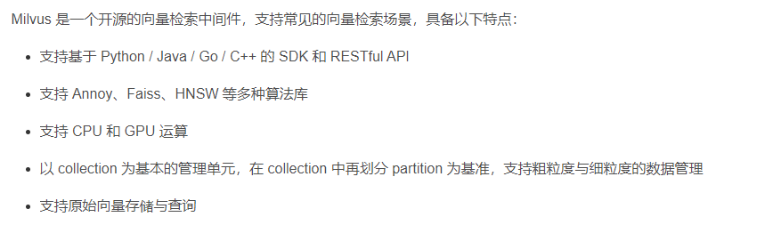
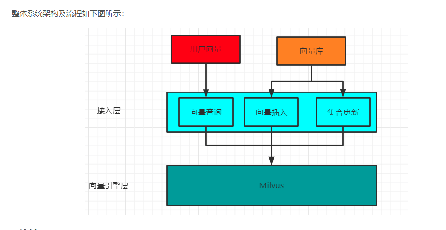

# 项目架构


本次项目根据论文改成，

主要分为两个业务，一个为任务匹配业务，另一个为任务求解业务，


## 任务匹配业务


## 任务求解业务


## 任务流程分析

/*
用户提交匹配任务->为每个任务生成雪花id，然后每个匹配任务分为 特征构造，特征入库，特征匹配 等子任务， 根据id% size ，按照任务顺序发送。
*/

用户提交匹配任务，写入mq，消费者完成特征构造，特征匹配。


用户提交求解任务--->写入mq->mq调用dubbo 完成求解后,写入数据库。


## 数据库表设计
1. 用户表（自增主键，账号id, 账号 varchar 密码 varchar，创建时间，编辑时间）
2. 用户信息表（账号id，姓名，名字，邮箱，用户类别，创建时间，编辑时间）
3. 任务表（分布式id（雪花算法，64位（41位时间戳，10位机器标识，12位序列号，1ms4096个），varchar 任务地址，创建时间，编辑时间））
4. 特征表（id，特征存放地址，mivlus_id,创建时间，最后编辑时间）
5. 解表（id，解存放地址，创建时间，最后编辑时间）
6. 任务清单表（任务自增id，分布式id，相似任务id，映射特征地址,is_optimized,创建时间, 最后编辑时间）


## dubbo配置
zookeeper  三个节点
为什么要使用dubbo？

## rocketmq
双主双从

为什么要使用rocketmq？


rocketmq 我设置了两个topic ，因为我把任务划分为两部分，一部分为匹配，一部分为求解。

每个任务都是需要顺序消费的， 匹配的流程是   特征构造---> Milvus 查询

求解的流程是  特征映射---> 解的映射


### 目的
异步：特征映射，小规模任务求解可以同时执行，异步

解耦：

削峰：服务器对任务有一个请求的上线，因此把全部请求丢到消息队列里，慢慢地消费


### 选型
1. 开发语言：
2. 顺序消息：


### RocketMQ 实现原理

RocketMQ 由NameServer 注册中心集群，Producer 生产者集群，Consumer消费者集群和若干Borker （RocketMQ进程），它的架构原理是这样的。
1. Broker 在启动的时候去向所有的NameServer注册，保持长连接，每30s发送一次心跳
2. Producer 在发送消息的时候会从nameserver获取broker服务器地址，根据负载均衡算法选择一台服务器来发送消息
3. conusmer消费消息的时候同样从nameserver 获取broker 地址，然后主动拉取消息来消费。


## Milvus

```xml
<dependency>
            <groupId>io.milvus</groupId>
            <artifactId>milvus-sdk-java</artifactId>
            <version>0.8.0</version>
</dependency>
```
###为什么要使用Milvus？

我的项目中是需要对新来的任务构建特征然后进行特征匹配。
而特征我这里通过自编码器对任务抽象成了十维的数据，但是要匹配到这个任务的topk的相似任务时，肯定不能一条条把其他任务的特征读出来计算一遍距离，这样的耗时随着数据规模的增大而越来越大。

任务求解的目的其中一方面是为了提高优化速度，因此在特征匹配上不能再响应上浪费时间。

通俗的讲，milvus可以让你在海量向量库中快速检索到和目标向量最相似的若干个向量，这里相似度量标准可以是内积或者欧式距离等。借用官方的话说就是：
>Milvus 是一款开源的、针对海量特征向量的相似性搜索引擎。基于异构众核计算框架设计，成本更低，性能更好。 在有限的计算资源下，十亿向量搜索仅毫秒响应。

向量检索服务的本质就是把高维空间的数据切分到子空间进行搜索。通过对向量建立索引，减少搜索范围，实现高性能的向量数据分析。关于向量索引的分类有：

* 基于量化的索引

通过聚类方法把空间里的点划分成多个单元。那么在查询时先把目标向量与所有单元的中心做距离比较，选出最近单元，得到最终结果。 

* 基于图的索引

将图的中心位置设为导航点，然后通过特定的选边策略来控制每个点的出度。使得搜索时既能减少内存使用，又能快速定位到目标位置附近。

* 基于树的索引

用超平面把高维空间分割成多个子空间，并把这些子空间以树型结构存储的索引方式。

* 基于哈希的索引

基于哈希的索引通过设计一个哈希函数，使特征向量经过哈希函数映射后得到哈希值。

### Milvus 提供支持


Milvus 支持java
Fassis不支持

### Milvus 整体系统架构

