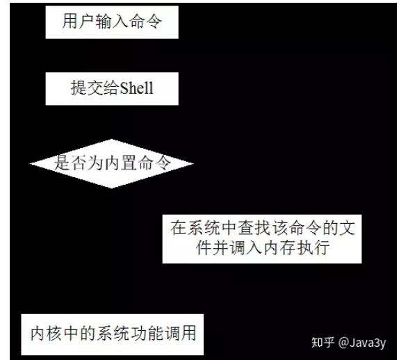
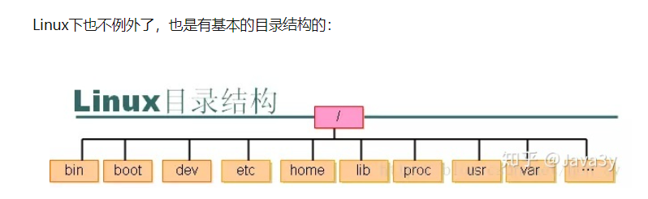
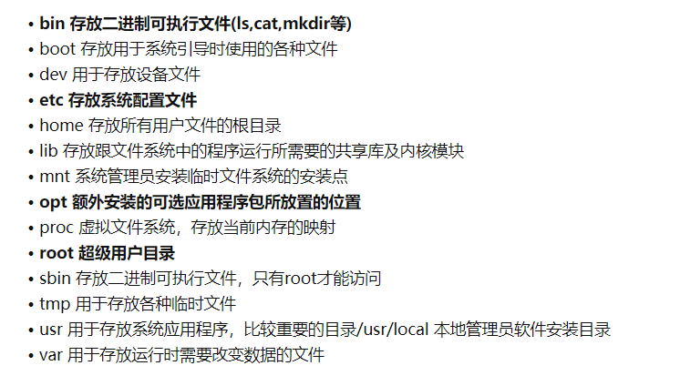
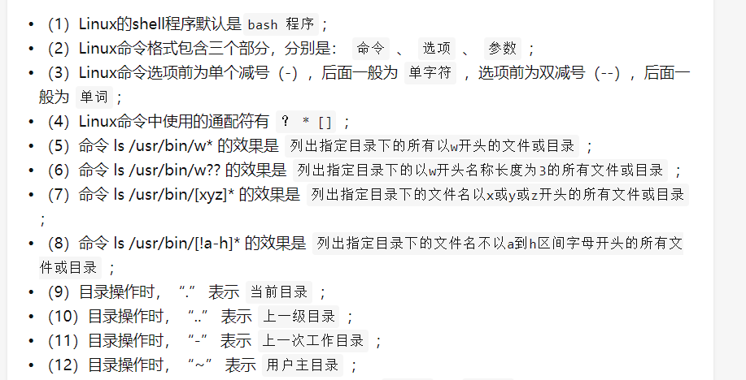
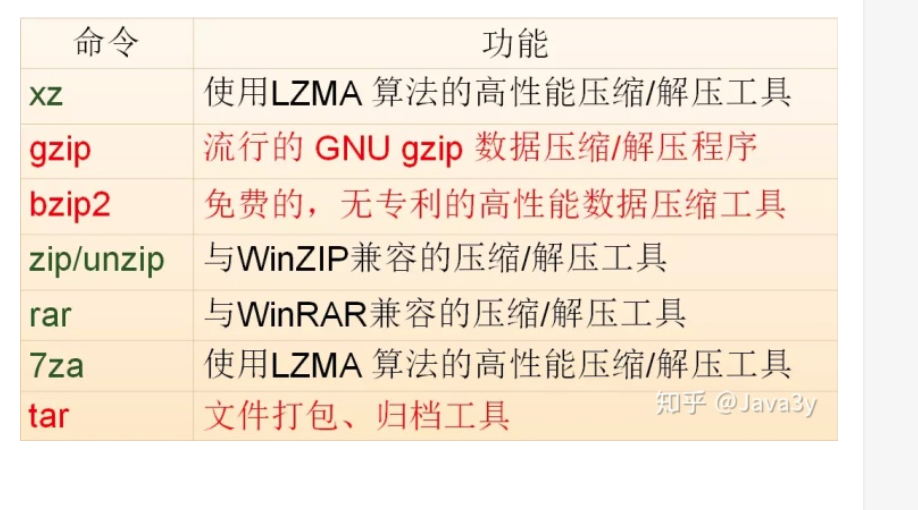
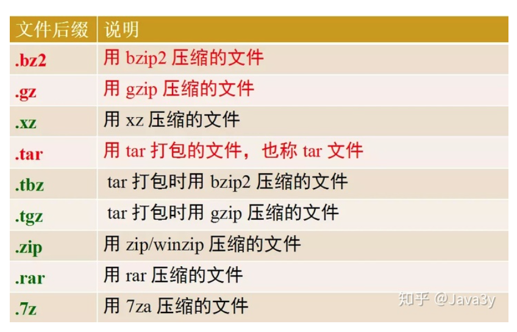
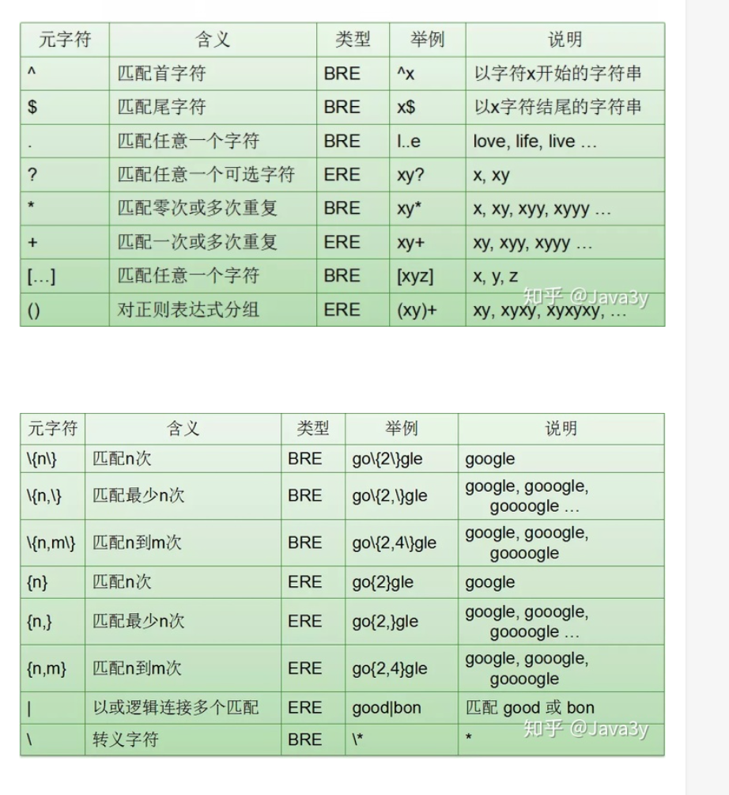
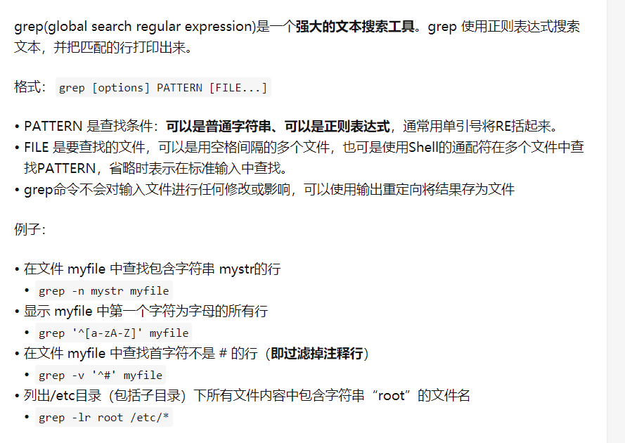
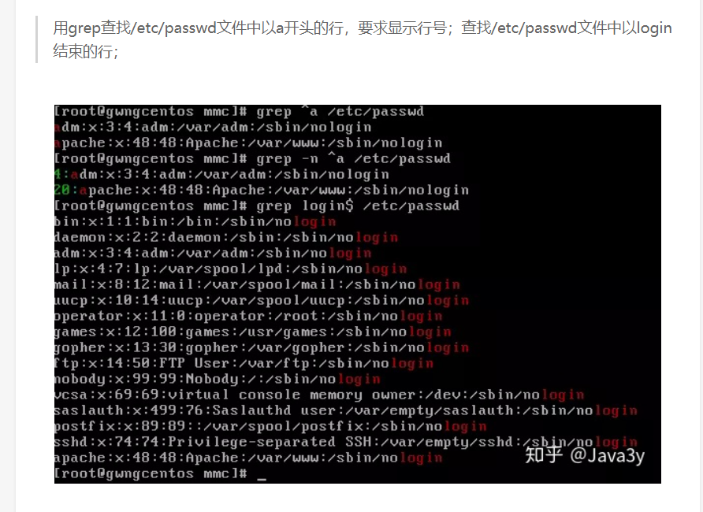
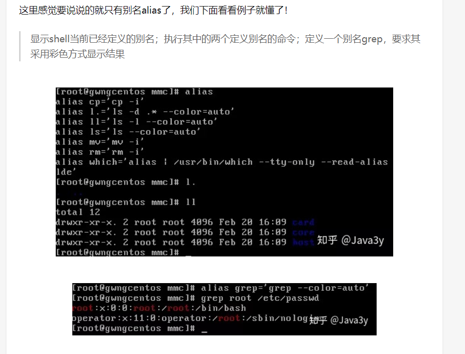

# Linux 的 基础知识

Linux 系统的组成：
1. Linux 内核：（linus团队管理）
2. shell：用户与内核交互的接口
3. 文件系统：ext3,ext4. windows 有 fat32 ,ntfs
4. 第三方应用软件


## Shell 的基本知识
>Shell 是用户的用户界面，提供了用户与内核进行交互操作的一种接口（命令解释器）

Shell 可以执行：
* 内部命令
* 应用程序
* shell脚本



使用 ```type``` 命令可以区分 内部命令和外部命令

可以利用shell做以下事情：

* 命令行解释
* 命令的多种执行顺序
* 通配符
* 命令补全，别名机制，命令历史
* I/O重定向
* 管道
* 命令替换
* shell编程语言

shell默认的版本（常用的）就是 bash

使用```ps```命令观察正在执行的shell


## Linux 基本目录结构


Linux 文件系统是一个目录树的结构，文件系统结构从一个根目录开始，根目录下可以有任意多个文件和子目录，子目录中又可以有任意多个文件和子目录




### 命令基本格式
```cmd [options] [arguments]```, options 称为选项，argumetns称为参数
选项和参数都作为Shell 命令执行时的输入，它们**之间用空格分隔开**。

**一般来说**，后面跟的选项如果单字符选项前使用**一个** 减号-。**单词选项**前使用两个减号 -- 。


在Linux中，可执行的文件也进行了分类：
* **内置命令**：处于效率的考虑，将一些常用命令的解是程序构造在shell内部。
* **外置命令**：存放在/bin ，/sbin 目录下的命令
* **实用程序**：存放在/usr/bin、/usr/sbin、/usr/share、/usr/local/bin等目录下的实用程序
* **用户程序**：用户程序经过编译生成可执行文件后，可作为Shell命令运行
* **Shell脚本**：由Shell语言编写的批处理文件，可作为Shell命令运行


### 通配符
* ```*```： 匹配任何字符和任何数目的字符
* ```?```:  匹配单一数目的任何字符
* ```[]```: 匹配[]之间的任意一个字符
* ```[! ]```: 匹配除了```[! ]```之外的任意一个字符


## 常用的命令


### 常用的文件，目录操作命令
* 可用```pwd``` 命令查看用户的当前目录
* 可用```cd``` 命令来切换目录
* 可用```.```  表示当前目录
* 可用```..``` 表示当前目录的上一级目录
* 可用```-``` 表示用cd命令切换目录前所在的目录
* 可用```~``` 表示用户主目录的绝对路径名


### 绝对路径
* 以斜线(/)开头，描述到文件位置的完整说明，任何时候你想指定文件名的时候都可以使用

### 相对路径：
* 不以斜线(/)开头， 指定相对于你当前工作目录而言的位置，可以被用作指定文件名的简介方式


tips: 输入命令的时候要重用tab键来补全

* ```ls``` ： 显示文件或目录信息
* ```mkdir```： 当前目录下创建一个空目录
* ```rmdir```:  要求目录为空
* ```touch```:  生成一个空文件或更改文件的时间
* ```cp```:  复制文件或目录
* ```mv```: 移动文件或目录
* ```rm```： 删除文件或目录
* ```ln```:  建立链接文件
* ```find```:  查找文件
* ```find/stat```:  查看文件类型或文件属性信息
* ```cat```: 查看文本文件内容
* ```more```: 可以分页看
* ```less```: 不仅可以分页，还可以方便地搜索，回翻等操作
* ```tail -10```: 查看文件的尾部10行
* ```head -20```: 查看文件的头部20行
* ```echo```: 吧内容重定向到指定的文件中，有则打开，无则创建
* 管道命令  | ： 将前面的结果给后面的命令， 例如 ：  ls-la | wc, 将ls的结果加油wc命令来统计字数
* 重定向 > 是覆盖模式， >> 是追加模式， 例如：  echo "Java3y , zhen de hen xi huan ni" > 把左边的输出放到右边的文件里去


### 文件，目录操作练习题



### 文件打包和压缩命令






压缩的方式有如下几种，
* gzip
* bzip2
* tar

常用的压缩的命令就有：
* gzip filename
* bzip2 filename
* tar -cvzf filename


常用的解压命令有：
* gzip -d filename.gz
* bzip2 -d filename.bz2
* tar -xzvf filename.tar.gz

### 正则表达式+grep
快速查看这个文本文件下的某些关键字是否存在。

#### 正则表达式



#### grep命令




### 几种提高工作效率的方法
* 自动补全命令
  * TAB 键
* 历史命令
  * 上下箭头
* 别名alias




### Shell 变量和Shell 环境

Shell 变量大致可以**分为三类**：
* **内部变量**：由系统提供，用户只能使用不能修改。
* ？
* GROUPS
* **环境变量**：这些变量决定了用户工作的环境，他们不需要用户去定义，可以直接在shell中使用，其中某些变量用户可以修改。
* **用户变量**：由用户建立和修改，在shell脚本编写中会经常用到
  * 变量赋值（定义变量）
  * varName=Value
  * export varName=Value
  * 引用变量 $varName


Shell变量的**作用域**：

* **局部变量**的作用范围仅仅**限制在命令行所在的Shell或Shell脚本文件中**；
* 全局变量的作用范围则包括**本 Shell进程及其所有子进程**。
* 局部变量与全局变量**互换**： 可以使用 export 内置命令将局部变量设置位全局变量。可以使用export 内置命令将全局变量设置位局部变量。


