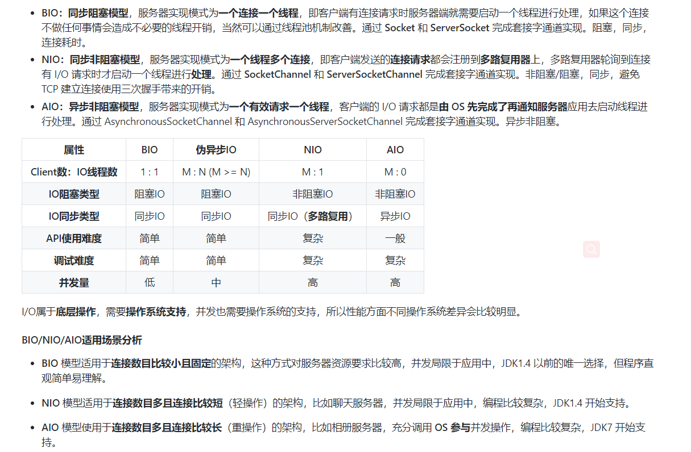

[TOC]

# Java 网络IO

**IO模型**就是说用什么样的**通道进行数据的发送和接收**， Java共支持3种网络编程**BIO**,**NIO**,**AIO**。 它们是JAVA语言对**操作系统的各种IO模型的封装**。程序员在使用这些API的时候，不需要关心操作系统层面的知识，也不需要关心操作系统层面的知识，也不需要根据不同操作系统编写不同的代码。只需要使用Java 的API 就可以了。


## 基本概念

### 1.同步与异步

同步和异步是针对应用程序和内核的交互而言的，同步和异步关注的是消息通信机制。

* 同步：两个同步任务**相互依赖**，并且一个任务必须以依赖于另一任务的某种方式执行。比如在A->B事件模型中，需要先完成A才能执行B。
* 异步：两个异步的任务完全独立的，一方的执行不需要等待另外一方的执行。再换句话说，异步调用不需要等待结果返回，而结果返回的时候通过回调函数或者其他方式拿着结果在做相关事情，例如：按下电饭锅的煮饭按钮，然后去炒菜或者做别的事情，当电饭锅向的时候，再回去把饭盛出来。显然，异步式编程要比同步式编程高效的多。


### 2. 阻塞与非阻塞
**阻塞和非阻塞** 是针对于 **进程在访问数据** 的时候，根据IO操作的就绪状态来采取的不同方式，是一种读取或者写入操作函数的实现方式，阻塞方式下读取或者写入函数将一直等待，而非阻塞方式下，读取或者写入函数会立即返回一个状态值。 阻塞和非阻塞关注的是程序在等待调用结果(消息，返回值)时的状态。

* **阻塞**：阻塞就是发起一个请求，调用者一直等待请求结果返回，也就是当前线程会被挂起，无法从事其他任务，只有当条件就绪才能继续。

* **非阻塞**： 非阻塞就是发起一个请求，调用者不用一直等着结果返回，可以先去干其他事情，在不能立即得到结果之前，该调用不会阻塞当前线程。例子：打电话问书店老板有没有某本书，不管老板有没有告诉你结果，可以自己先一边去玩，当然也要偶尔过几分钟check 一下老板有没有返回结果。

同步和异步是目的，阻塞和非阻塞是实现方式。 同步/异步是从行为角度描述事物的，而阻塞和非阻塞描述的当前的事物的状态(等待调用结果时的状态)。

### 3. 总结
* **同步阻塞IO (BIO)**:用户进程发起一个IO操作以后，必须等待IO操作的真正完成后，才能继续运行。
* **同步非阻塞IO(NIO)**: 用户进程发起一个 IO 操作以后 可做其他事情，但用户进程需要经常询问IO操作是否完成，这样造成不必要的CPU浪费。
* **异步非阻塞IO(AIO)**:用户进程发起一个IO操作然后立即返回，等IO操作真正完成以后，应用程序会得到IO操作完成的通知。 类比 **future** 模式。


## BIO(Blocking IO)
### 1. 概述
BIO是面向流的同步阻塞IO，是一种同步阻塞模型。 面向流意味着每次从流中读一个或多个字节，直到读取所有字节，没有被缓存到任何地方。同步阻塞I/O模式，数据的读取写入必须阻塞在一个线程内等待其完成，阻塞的时候线程什么都不能做。


服务端提供 IP 和监听端口， 客户端通过连接操作向服务器监听的地址发起连接请求，通过三次握手连接，如果连接成功，双方就可以通过套接字进行通信。 传统的同步阻塞模型开发中，ServerSocket负责 IP地址，启动**监听**端口;socket 负责 发起**连接操作**，连接成功后，双方通过**输入流和输出流 进行同步阻塞式**通信。

### 2. 模型图示
采用BIO通信模型的**服务端**通常由一个**Acceptor线程**负责监听客户端的连接，它收到客户端连接请求后为**每个客户端创建一个新的线程** 进行链路处理，处理完成后，通过输出流返回应答给客户端，线程销毁。

这就是典型的一请求一应答通信模型，BIO 通信（一请求一应答）模型图如下：


一般通过在while(true)循环中服务端会调用accept()方法等待接收客户端的连接的方式监听请求，请求一旦接收到一个连接请求，就可以建立通信套接字在这个通信套接字上进行读写操作，此时不能再接收其他客户端连接请求，只能等待同当前连接的客户端的操作执行完成，不过可以通过多线程来支持多个客户端的连接，如上图所示。

### 3. 伪异步IO模型
客户端向服务端发送请求，服务端会为**每个客户端建立一个线程**来响应，问题来了，如果客户端出现了延时等异常，服务端为客户端建立的线程，就会一直处于等待状态，这个线程就会占用很长事件(因为数据的准备和处理都在这个线程上完成)，更糟糕的式，如果由大量并发访问，服务器就会**建立大量线程响应**，引起服务器**资源枯竭**。

为了改进这种一连接一线程的模型，可以使用 线程池 来管理这些线程，实现1个或多个线程处理N个 客户端的典型(但是底层还是使用的同步阻塞I/O),这种被称为“**伪/异步I/O模型**”。


## NIO（Non-Block IO，New IO）
### 1.概述
NIO库是在JDK1.4中引入的，提供了高速的，面向块的I/O，也叫Non-Block IO 是一种同步非阻塞的通信模型。

同步非阻塞，服务器实现模式为一个线程可以处理多个请求(连接)，客户端发送的连接请求都会注册到多路复用器**selector**上，**多路复用器**轮循到**连接有IO请求**就进行处理。

使用场景： NIO方式适用于**连接数目多且连接比较短**的架构，比如 **聊天服务器**，**弹幕系统**，**服务期间通讯**，**编程比较复杂**，JDK1.4开始支持。但实际上用NIO写代码，比较复杂。直接用**netty**就行了，但是NIO的模型很重要。


### 2. 流与块
BIO与NIO最重要的区别是**数据打包和传输**的方式，
==BIO以流的方式处理数据，而NIO以块的方式处理数据。==


**面向流**的 I/O 一次处理一个字节数据：一个输入流产生一个字节数据，一个输出流消费一个字节数据。为流式数据创建过滤器非常容易，链接几个过滤器，以便每个过滤器只负责复杂处理机制的一部分。不利的是，面向流的I/O通常比较慢。


面向块的 I/O一次处理一个数据块， 按块处理数据比按流处理数据要快得多。 但是面向块的I/O缺少一些面向流的I/O所具有的优雅性和简单性。

I/O 包和 NIO 已经很好地集成了，java.io.* 已经以 NIO 为基础重新实现了，所以现在它可以利用 NIO 的一些特性。例如，java.io.* 包中的一些类包含以块的形式读写数据的方法，这使得即使在面向流的系统中，处理速度也会更快。


### NIO模型概述与核心组件
NIO 有三大核心组件： **Channel(通道)**，**Buffer(缓冲区)**， **Selector(多路复用器/选择器)**

客户端和服务器通过 Channel 通信。 NIO 可以在Channel 进行读写操作。这些Channel都会被注册在Selector 多路复用器上。

NIO实现了 ==IO多路复用中的 Reactor模型==，一个线程Thread 使用一个 Selector 通过轮询的方式去监听多个通道Channel 上的事件，从而让一个线程就可以处理多个事件。


* channel 类似于流，每个channel 对应一个buffer缓冲区，buffer底层就是个数组。
* channel 会注册到selector上，由selector根据channel读写事件的发生将其交由某个空闲的线程处理。
* selector 可以对应一个或多个线程。
* NIO 的Buffer 和channel 都是即可以读也可以写。

(1) 通道Channel
通道Channel是对原IO包中的流的模拟，可以通过它读取和写入数据。 通道与流的不同之处在于， **流**是单向的，只能在**一个方向**上移动（一个流必须是输入流InputStream 或者 输出流OutputStream 的子类），而**通道是双向**的，**可以用于读，写或者同时** 用于读写。

通常来说NIO 的所有IO 都是从 Channel(通道)开始的。
* 从通道进行数据读取：创建一个**缓冲区**，然后请求通道读取数据。
* 从通道进行数据写入：创建一个**缓冲区**，填充数据，并要求通道写入数据。


**通道**都实现了 **Channel 接口**，大致有如下实现类：
* FileChannel：从**文件**中读写数据；
* DatagramChannel： 通过 UDP读写网络中数据；
* SocketChannel： 通过 TCP读写网络中数据；
* ServerSocketChannel: 可以监听新进来的TCP连接，对每一个新进来的**连接**都会创建一个SocketChannel。

(2) 缓冲区Buffer
**从通道读入**与**写出数据**都必须先经过**缓冲区**，不会**直接**对通道进行读写数据。

缓冲区实际上是一个**数组**，但它功能更多，缓冲区提供了对数据的 **结构化** 访问，而且还可以跟踪系统的 读/写进程。

缓冲区都继承于**抽象类 Buffer**，包括如下实现类：ByteBuffer, CharBuffer,ShortBuffer, IntBuffer,LongBuffer,FloatBuffer, DoubleBuffer等。

(3) 多路复用器Selector
**Selector** 可以对应一个或多个线程。 Selector 通过 **一个线程不停地轮询注册的** Channel， 找出已经准备就绪的通道执行IO 操作。

**Selector IO多路复用** 底层一般用的 Linux API(select,poll,epoll)来实现，它们的区别如下表：


(4) 缓冲区状态变量
有几重要的变量用于 **描述缓冲区** 的状态。
* capacity: **最大容量**
* position： 当前 **已经读写** 的字节数。
* limit：**还可以读写** 的字节数。

Buffer的**操作**一般遵循几个步骤，操作模式分为 **读模式和写模式**：
* 调用 allocate()方法分配缓冲区内存。
* 写入数据到Buffer
* 调用flip()方法进行模式切换。可以将写模式切换到读模式。
* 从Buffer 中读取数据。
* 调用clear()方法，清理buffer
* 
状态变量的改变过程举例：


### 多路复用器Selector
多路复用器提供选择已经就绪的任务的能力，它会不断地**轮询注册在其上的通道**(Channel),如果某个通道处于就绪状态，会被Selector轮询出来，然后通过**SelectionKey** 可以取得就绪的**Channel集合**，从而进行后续的IO操作。服务器端只要提供一个线程负责Selector的轮询，就可以接入成千上万个客户端，这就是**NIO**库的巨大进步。

通过配置监听的通道Channel为非阻塞，那么当Channel上的IO事件还未到达时，就不会进入阻塞状态一直等待，而是继续轮询其他Channel，找到IO 事件已经到达的Channel 并处理事件。因为创建和切换线程的开销很大，因此使用一个线程来处理多个事件而不是一个线程处理一个事件，对于IO密集型的应用具有很好地性能。

一个Selector 可以同时轮询多个 Channel, 因为JDK使用了epoll()代替传统的select()实现，没有最大连接句柄的限制，所以只需要一个线程负责Seletor轮询，就可以接入成千上万的客户端连接。


####(1) 创建多路复用器
```java
// 创建多路复用器
Selector selector = Selector.open();
```
####(2) 将通道注册到选择器上
```java
// 打开一个服务端Channel
ServerSocketChannel ssChannel = ServerSocketChannel.open();
// 设置为非阻塞 必须配置
ssChannel.configureBlocking(false);
// 将Channel注册到Selector上
ssChannel.register(selector, SelectionKey.OP_ACCEPT);
```
**通道**必须配置为**非阻塞模式**，否则使用选择器就没有任何意义了，因为如果通道在某个事件上被阻塞，那么服务器就不能响应其它事件，必须等待这个事件处理完毕才能去处理其它事件，显然这和选择器的作用背道而驰。

在将通道注册到选择器上时，还需要制定要注册的具体事件，主要有以下几类：
* SelectionKey.OP_CONNECT：连接就绪。
* SelectionKey.OP_ACCEPT：接收就绪。
* SelectionKey.OP_READ：读就绪。
* SelectionKey.OP_WRITE：写就绪。

它们在SelectionKey 的定义如下：
```java
public static final int OP_READ = 1 << 0;
public static final int OP_WRITE = 1 << 2;
public static final int OP_CONNECT = 1 << 3;
public static final int OP_ACCEPT = 1 << 4;
```

可以看出每个事件可以被当作一个**位域**，从而组成**事件集整数**。例如：
```java
int interestSet = SelectionKey.OP_READ | SelectionKey.OP_WRITE;
```

####(3) 监听事件
```java
int num = selector.select();
```
使用select()来**监听**达到的事件，它会**一直阻塞**直到有**至少一个**事件到达，可能有**多个**事件到达。

####(4) 获取到达的事件
Selector 在有通道**事件到达**的时候返回 **SelectionKey 的集合**，之后可以进行数据处理。这里循环**遍历**已经选择键集合中的**每一个键**（因为可能有多个通道的事件需要处理），并检测各个**键所对应的通道事件的类型**进而做出不同的处理。
```java
// 遍历SelectionKey事件
Set<SelectionKey> keys = selector.selectedKeys();
Iterator<SelectionKey> keyIterator = keys.iterator();
while (keyIterator.hasNext()) {
    SelectionKey key = keyIterator.next();
    // 判断事件类型
    if (key.isAcceptable()) {
        // ...
    } else if (key.isReadable()) {
        // ...
    }
    keyIterator.remove();
}
```

####(5)事件循环
因为一次 select() 调用不能处理完所有的事件，并且服务器端有可能需要一直监听事件，因此服务器端处理事件的代码一般会放在一个死循环内。
```java
while (true) {
    int num = selector.select();
    Set<SelectionKey> keys = selector.selectedKeys();
    Iterator<SelectionKey> keyIterator = keys.iterator();
    while (keyIterator.hasNext()) {
        SelectionKey key = keyIterator.next();
        if (key.isAcceptable()) {
            // ...
        } else if (key.isReadable()) {
            // ...
        }
        keyIterator.remove();
    }
}
```

**NIO 模型中通过 SocketChannel 和 ServerSocketChannel 完成套接字通道的实现。非阻塞/阻塞，同步，避免 TCP 建立连接使用三次握手带来的开销。**

####(6) 代码实现与分析

NIO服务器代码示例：
```java
public class NioServer {

    //public static ExecutorService pool = Executors.newFixedThreadPool(10);

    public static void main(String[] args) throws IOException {
        // 创建一个在本地端口进行监听的服务Socket通道.并设置为非阻塞方式，把它当成一个服务器就行了
        ServerSocketChannel serverSocketChannel = ServerSocketChannel.open();
        // 必须配置为非阻塞才能往selector上注册，否则会报错，selector模式本身就是非阻塞模式
        serverSocketChannel.configureBlocking(false);
        // 绑定端口
        serverSocketChannel.socket().bind(new InetSocketAddress(9000));
        // 创建一个选择器selector
        Selector selector = Selector.open();
        // 把ServerSocketChannel注册到selector上，并且selector对客户端accept连接操作感兴趣
        serverSocketChannel.register(selector, SelectionKey.OP_ACCEPT);

        while (true) {
            System.out.println("等待事件发生。。");
            // 轮询监听channel里的key，select是阻塞的，accept()也是阻塞的，在此处阻塞了。
            int select = selector.select();
            System.out.println("有事件发生了。。");
            // 有客户端请求，被轮询监听到
            Iterator<SelectionKey> it = selector.selectedKeys().iterator();
            while (it.hasNext()) {
                SelectionKey key = it.next();
                // 删除本次已处理的key，防止下次select重复处理
                it.remove();
                // 这里可以使用线程池来处理事件：但是也可能出现并发问题
                handle(key);
            }
        }
    }

    /**
     * 处理事件:分事件进行分别处理
     */
    private static void handle(SelectionKey key) throws IOException {
        if (key.isAcceptable()) {
            System.out.println("有客户端连接事件发生了。。");
            ServerSocketChannel serverSocketChannel = (ServerSocketChannel) key.channel();
            // serverSocketChannel阻塞等到连接事件发生，然后将这个链接对应的通道
            // socketChannel注册到多路复用器上,此处是非阻塞的体现之一：调用accept
            // 是阻塞的，但是这里因为是发生了连接事件，所以这个方法会马上执行完，所以不会阻塞
            SocketChannel socketChannel = serverSocketChannel.accept();
            socketChannel.configureBlocking(false);
            // 通过Selector监听Channel时对读事件感兴趣
            socketChannel.register(key.selector(), SelectionKey.OP_READ);

            // 读事件
        } else if (key.isReadable()) {
            System.out.println("有客户端数据可读事件发生了。。");
            // 注意这个channel跟上面不一样！
            SocketChannel socketChannel = (SocketChannel) key.channel();
            // 分配数据缓冲区
            ByteBuffer buffer = ByteBuffer.allocate(1024);
            // NIO非阻塞体现:首先read方法不会阻塞，其次这种事件响应模型，
            // 当调用到read方法时肯定是发生了客户端发送数据的事件
            int len = socketChannel.read(buffer);
            if (len != -1) {
                System.out.println("读取到客户端发送的数据：" + new String(buffer.array(), 0, len));
            }
            ByteBuffer bufferToWrite = ByteBuffer.wrap("HelloClient".getBytes());
            socketChannel.write(bufferToWrite);
            key.interestOps(SelectionKey.OP_READ | SelectionKey.OP_WRITE);
        } else if (key.isWritable()) {
            System.out.println("Write事件");
            // 服务端的write事件就是写数据给客户端
            SocketChannel socketChannel = (SocketChannel) key.channel();
            // NIO事件触发是水平触发
            // 使用Java的NIO编程的时候，在没有数据可以往外写的时候要取消写事件，
            // 在有数据往外写的时候再注册写事件
            key.interestOps(SelectionKey.OP_READ);
            //sc.close();
        }
    }
}
```


NIO客户端代码示例：
```java
public class NioClient {

    /**
     * 多路复用器
     */
    private Selector selector;

    /**
     * 启动客户端测试
     *
     * @throws IOException IOException
     */
    public static void main(String[] args) throws IOException {
        NioClient client = new NioClient();
        // 初始化
        client.initClient("127.0.0.1", 9000);
        // 连接
        client.connect();
    }

    /**
     * 获得一个Socket通道，并对该通道做一些初始化的工作
     *
     * @param ip   连接的服务器的ip
     * @param port 连接的服务器的端口号
     * @throws IOException IOException
     */
    public void initClient(String ip, int port) throws IOException {
        // 获得一个Socket通道
        SocketChannel channel = SocketChannel.open();
        // 设置通道为非阻塞
        channel.configureBlocking(false);
        // 获得一个通道管理器
        this.selector = Selector.open();

        // 客户端连接服务器,其实方法执行并没有实现连接，需要在listen()方法中调
        // 用channel.finishConnect() 才能完成连接
        channel.connect(new InetSocketAddress(ip, port));
        // 将通道管理器和该通道绑定，并为该通道注册SelectionKey.OP_CONNECT事件
        channel.register(selector, SelectionKey.OP_CONNECT);
    }

    /**
     * 采用轮询的方式监听selector上是否有需要处理的事件，如果有，则进行处理
     *
     * @throws IOException IOException
     */
    public void connect() throws IOException {
        // 轮询访问selector
        while (true) {
            selector.select();
            // 获得selector中选中的项的迭代器
            Iterator<SelectionKey> it = this.selector.selectedKeys().iterator();
            while (it.hasNext()) {
                SelectionKey key = (SelectionKey) it.next();
                // 删除已选的key,以防重复处理
                it.remove();
                // 连接事件发生
                if (key.isConnectable()) {
                    SocketChannel channel = (SocketChannel) key.channel();
                    // 如果正在连接，则完成连接
                    if (channel.isConnectionPending()) {
                        channel.finishConnect();
                    }
                    // 设置成非阻塞
                    channel.configureBlocking(false);
                    // 在这里可以给服务端发送信息哦
                    ByteBuffer buffer = ByteBuffer.wrap("HelloServer".getBytes());
                    channel.write(buffer);
                    // 在和服务端连接成功之后，为了可以接收到服务端的信息，需要给通道设置读的权限。
                    // 获得了可读的事件
                    channel.register(this.selector, SelectionKey.OP_READ);
                } else if (key.isReadable()) {
                    read(key);
                }
            }
        }
    }

    /**
     * 处理读取服务端发来的信息 的事件
     *
     * @param key 事件key
     * @throws IOException IOException
     */
    public void read(SelectionKey key) throws IOException {
        //和服务端的read方法一样
        // 服务器可读取消息:得到事件发生的Socket通道
        SocketChannel channel = (SocketChannel) key.channel();
        // 创建读取的缓冲区
        ByteBuffer buffer = ByteBuffer.allocate(1024);
        int len = channel.read(buffer);
        if (len != -1) {
            System.out.println("客户端收到信息：" + new String(buffer.array(), 0, len));
        }
    }
}
```


####7. 文件 NIO（一次传2g）
注意：只有套接字Channel 才能配置为非阻塞，而FileChannel不能，为FileChannel配置非阻塞也没有意义。使用NIO读取数据基本流程：
* 从FileInputStream 获取Channel。
* 创建Buffer。
* 将数据从Channel读取到Buffer中。

以下展示了使用NIO快速复制文件的示例：
```java
public static void fastCopy(String src, String dist) throws IOException {

    /* 获得源文件的输入字节流 */
    FileInputStream fin = new FileInputStream(src);

    /* 获取输入字节流的文件通道 */
    FileChannel fcin = fin.getChannel();

    /* 获取目标文件的输出字节流 */
    FileOutputStream fout = new FileOutputStream(dist);

    /* 获取输出字节流的文件通道 */
    FileChannel fcout = fout.getChannel();

    /* 为缓冲区分配 1024 个字节 */
    ByteBuffer buffer = ByteBuffer.allocateDirect(1024);

    while (true) {

        /* 从输入通道中读取数据到缓冲区中 */
        int r = fcin.read(buffer);

        /* read() 返回 -1 表示 EOF */
        if (r == -1) {
            break;
        }

        /* 切换读写 */
        buffer.flip();

        /* 把缓冲区的内容写入输出文件中 */
        fcout.write(buffer);

        /* 清空缓冲区 */
        buffer.clear();
    }
}
```

### 8.传输大文件

## AIO
### 1.概述
在Java 7引入了AIO，它是异步非阻塞的IO模型。 AIO是异步IO的缩写，虽然NIO在网络操作中，提供了非阻塞的方法，但是NIO的IO行为还是同步的.异步IO是基于事件和回调机制实现的，也就是应用操作之后会直接返回，不会堵塞在那里，当后台处理完成，操作系统会通知相应的线程进行后续的操作。

AIO最大的一个特性就是异步能力，这种能力对socket与文件I/O都起作用。AIO其实是一种在读写操作结束之前允许进行其他操作的I/O处理。

Jdk7 主要增加了三个新的异步通道：
* AsynchronousFileChannel:用于 **文件** 异步读写
* AsynchronousSocketChannel: **客户端**异步socket
* AsynchronousServerSocketChannel：**服务器**异步socket

AIO是真正异步的IO，它把IO**读写操作完全交给了操作系统**。因为AIO的实施需**充分调用**OS参与，IO需要操作系统支持，并发也同样需要操作系统的支持，所以性能方面不同操作系统差异会比较明显。

* **异步非阻塞**，服务器实现模式为一个有效请求一个线程，客户端的 I/O 请求都是由 OS 先**完成了**再通知服务器应用去启动线程进行处理。
* AIO方式使用于连接数目多且连接比较长的结构，比如相册服务器，充分调用OS参与并发操作,编程比较复杂，JDK7开始支持。


AIO并**没有采用NIO的多路复用器**，而是使用**异步通道**的概念，其read，write方法的返回类型都是**Future对象**。而**Future 模型是异步**的，其核心思想是：去主函数等待时间。


AIO 模型中 AsynchronousSocketChannel 和 AsynchronousServerSocketChannel 完成套接字通道的实现异步非阻塞。但是 AIO 底层还是用的 **NIO**，其实就是对 NIO 的封装，其性能没准还不如 NIO，所以用的不广泛，不如直接用**Netty** 是对更底层的封装。


##对比：



## Reactor 模式和Proactor模式


### 1.Reactor模式
Reactor 模式应用于 同步I/O 的场景。分别以**读操作和写操作**为例来看看Reactor的具体步骤。读取操作：

* 应用程序注册读就绪事件和相关联的事件处理器
* 事件分离器等待事件的发生。
* 当发生读就绪事件的时候，事件分离器调用第一步注册的事件处理器。
* 事件处理器首先执行实际的读取操作，然后根据读取到的内容进行进一步的处理。

写入操作类似于读取操作，只不过第一步注册的是读就绪事件。


### 2. Proactor模式
Proactor 模式中读取操作和写入操作的过程。读取操作：
* 应用程序初始化一个异步读取操作，然后注册相应的事件处理器，此时事件处理器不关注读取就绪事件，而是关注读取完成事件，这时区别于Reactor的**关键**。
* 事件分离器等待读取操作完成事件。
* 在事件分离器等待读取操作完成的时候，操作系统调用内核线程完成读取操作(异步IO 都是操作系统负责将数据读写到应用传递进来的缓冲区供应用程序操作，操作系统扮演了重要角色，并将读取的内容放入用户传递过来的缓存区中，这也是区别于Reactor的一点，Proactor中，应用程序需要传递缓存区。)
* 事件分离器捕获到读取完成事件后，激活应用程序注册的事件处理器，事件处理器直接从缓存区读取数据，而不需要进行实际的读取操作。

Proactor 中写入操作和读取操作类似，只不过感兴趣的事件是写入完成事件。

Reactor 和 Proactor模式的主要区别就是**真正的读取和写入操作是有谁来完成的**，Reactor中需要应用程序自己读取或者写入数据，而Proactor模式中，应用程序不需要进行实际的读写操作，它只需要从**缓存区读取或者写入即可**，操作系统会读取缓存区或者写入缓存区到真正的IO设备。