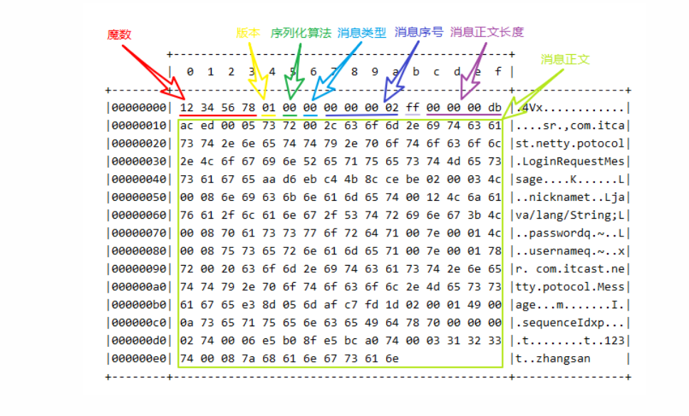

[toc]

# Netty进阶


## Netty粘包半包

### 1.概述

TCP 粘包半包是指发送包发送的**若干数据包**到接收方接收时**粘成一包**或 **某个数据包被拆开接收**。如下图所示，client 发了两个数据包D1和D2，但是server端可能会收到如下几种情况的数据。


分析上述现象以及原因：

#### 粘包
* 现象， 发送D2  D1 接收D2D1
* 原因
  * 应用层（Netty）:接收方ByteBuf设置太大(Netty默认1024)
  * 滑动窗口(tcp)：假设发送方256 bytes 表示一个完整报文，但由于接收方处理不及时且窗口大小足够大，这256 bytes字节就会缓冲在接收方的滑动窗口中，当滑动窗口中缓冲了多个报文就会粘包
  * Nagle算法(TCP,将多次间隔较小且数据量小的数据)，合并成一个大的数据块，然后进行封包。这样做虽然提高了效率，但是接收端就难于**分辨出完整的数据包**了，因为面向流的通信是**无消息保护边界**的。


#### 半包
* 现象， 发送D2， 接收到了  D2_2 D2_1
* 原因
  * 应用层：接收方ByteBuf 小于实际发送数据量
  * 滑动窗口(tcp):假设接收方的窗口只剩了128 bytes，发送方的报文大小是 256 bytes，这时放不下了，只能先发送前128 bytes，等待ack后才能发送剩余部分，这就造成了半包
  * MSS限制：当发送的数据超过MSS限制后，会将数据切分发送，就会造成半包。

本质是因为： TCP 是 **面向连接**的，面向**流**的，提供高可靠性服务。收发两端(客户端和服务器端)都要有**成对的 socket**，发送端为了将多个包更有效的发给对方，使用了 优化算法(Nagle 算法)，将多次间隔较小且数据量小的数据，**合并成一个大的数据块，然后进行封包**。这样做虽然提高了效率，但是接收端 就难于分辨出**完整的数据包了**，因为面向流的通信是无消息保护边界的。

1. 滑动窗口
* TCP 以一个段(segment)为单位，每发送一个段就需要进行一次确认应答(ack)处理，但如果这么做，缺点是包的往返时间越长性能就越差。


* 为了解决此问题，引入了窗口概念，窗口大小即决定了无需等待应答而可以继续发送的数据最大值


   
* 窗口实际就起到一个缓冲区的作用，同时也能起到流量控制的作用
  * 图中深色的部分即要发送的数据，高亮的部分即窗口
  * 窗口内的数据才允许被发送，当应答未到达前，窗口必须停止滑动
  * 接收方也会维护一个窗口，只有落到窗口内的数据才能允许接收

MSS限制
* 链路层对一次能够发送的最大数据有限制，这个限制称之为MTU(maximum transmission unit),不同的链路设备的MTU值也不同，例如
* 以太网的MTU是1500
* FDDI(光钎分布式数据接口)的MTU是4352
* 本地回环地址的MTU是65535-本地测试不走网卡
* MSS是最大段长度(maximum segment size)，它是MTU刨去 tcp 头和ip 头后剩余能够作为数据传输的字节数
* ipv4  tcp头占用20 bytes， ip 头 占用20 bytes，因此以太网MSS的值为1500-40=1460
* TCP 在传递大量数据时，会按照MSS大小将数据进行分割发送
* MSS 的值在三次握手时通知对方自己的MSS的值，然后在两者之间选择一个小值做为MSS


Nagle算法
* 即使发送一个字节，也需要加入**tcp头和ip头**，也就是总字节数会使用41 bytes，非常不经济。因此为了提高 网络利用率，tcp希望尽可能发送足够大的数据，这就是Nagle算法产生的缘由。

* 该算法是指发送端即使还有应该发送的数据，但如果这部分数据很少的话，即进行延迟发送
  * 如果SO_SNDBUF 的数据达到MSS，则需要发送
  * 如果SO_SNDBUF中含有 FIN(表示需要连接关闭) 这时将剩余数据发送，再关闭
  * 如果 TCP_NODELAY=true, 则需要发送
  * 已发送的数据都收到ack时，则需要发送
  * 上述条件不满足，但发生超时(一般为200ms)则需要发送
  * 除上述情况，延迟发送


### 解决方案

 1. 短链接，发一个包建立一次连接，这样连接建立到连接断开之间就是消息的边界，缺点的效率太低
 2. 每一条消息采用固定长度，不足的以空格补全，缺点浪费空间
 3. 每一条消息采用报文分隔符， 例如\n, 缺点需要转义
 4. 每一条消息分为head和body，head中包含body的长度

#### 固定长度
让所有数据包长度固定(假设长度为8字节)，服务器端加入
```java
ch.pipeline().addLast(new FixedLengthFrameDecoder(8));
```
对于使用**固定长度的粘包和拆包场景**，可以使用FixedLengthFrameDecoder，该编码器会**每次读取固定长度的消息**，如果当前读取到的消息不足指定长度，那么就会**等待**下一个消息到达后进行补足。其使用也比较简单，只需要在**构造函数中指定每个消息的长度**即可。这里需要注意的是，FixedLengthFrameDecoder 只是一个解码器，Netty也只提供了一个解码器，这是因为对于解码是需要等待下一个包的进行补全的，代码相对复杂，而对于编码器，用户可以自行编码，因为编码时只需要将不足指定长度的部分补全即可。
```java
public class EchoServer {

    public void bind(int port) throws InterruptedException {
        EventLoopGroup bossGroup = new NioEventLoopGroup();
        EventLoopGroup workerGroup = new NioEventLoopGroup();
        try {
            ServerBootstrap bootstrap = new ServerBootstrap();
            bootstrap.group(bossGroup, workerGroup)
                .channel(NioServerSocketChannel.class)
                .option(ChannelOption.SO_BACKLOG, 1024)
                .handler(new LoggingHandler(LogLevel.INFO))
                .childHandler(new ChannelInitializer<SocketChannel>() {
                    @Override
                    protected void initChannel(SocketChannel ch) throws Exception {
                        // 这里将FixedLengthFrameDecoder添加
                        // 到pipeline中，指定固定长度为20
                        ch.pipeline()
                            .addLast(new FixedLengthFrameDecoder(20));
                        // 将前一步解码得到的数据转码为字符串
                        ch.pipeline().addLast(new StringDecoder());
                        // 这里FixedLengthFrameEncoder是自定义的，
                        // 用于将长度不足20的消息进行补全空格
                        ch.pipeline().addLast(new FixedLengthFrameEncoder(20));
                        // 最终的数据处理
                        ch.pipeline().addLast(new EchoServerHandler());
                    }
                });

            ChannelFuture future = bootstrap.bind(port).sync();
            future.channel().closeFuture().sync();
        } finally {
            bossGroup.shutdownGracefully();
            workerGroup.shutdownGracefully();
        }
    }

    public static void main(String[] args) throws InterruptedException {
        new EchoServer().bind(8080);
    }
}

```

缺点是，数据包的大小不好把握
* 长度定的太大，浪费
* 长度定的太小，对某些数据包有显得不够

### 固定分隔符 （LineBasedFrameDecoder与DelimiterBasedFrameDecoder）

对于通过**分隔符进行粘包和拆包问题**的处理，Netty提供了两个编码的类，LineBasedFrameDecoder与DelimiterBasedFrameDecoder。这里LineBasedFrameDecoder的作用主要是通过换行符，即\n 或者\r\n对数据进行处理；
而DelimiterBasedFrameDecoder的作用是通过**用户指定的分隔符**对数据进行粘包和拆包处理。同样的，这两个类都是编解码器类。

如何使用，则在服务器端加入
```java
ch.pipeline().addLast(new LineBasedFrameDecoder(1024));
ch.pipeline().addLast(new DelimiterBasedFrameEncoder("_$"));
```
上述的1024为指定长度，如果超出指定仍未出现分隔符，则抛出异常


### 预设长度（LengthFieldBasedFrameDecoder）

在发送消息前，先约定用定长字节标识接下来的数据长度
```java
// 最大长度，长度偏移，长度占用字节，长度调整，剥离字节数
ch.pipeline().addLast(new LengthFieldBasedFrameDecoder(1024, 0, 1, 0, 1));
```

客户端代码
```java
public class HelloWorldClient {
    static final Logger log = LoggerFactory.getLogger(HelloWorldClient.class);

    public static void main(String[] args) {
        NioEventLoopGroup worker = new NioEventLoopGroup();
        try {
            Bootstrap bootstrap = new Bootstrap();
            bootstrap.channel(NioSocketChannel.class);
            bootstrap.group(worker);
            bootstrap.handler(new ChannelInitializer<SocketChannel>() {
                @Override
                protected void initChannel(SocketChannel ch) throws Exception {
                    log.debug("connetted...");
                    ch.pipeline().addLast(new LoggingHandler(LogLevel.DEBUG));
                    ch.pipeline().addLast(new ChannelInboundHandlerAdapter() {
                        @Override
                        public void channelActive(ChannelHandlerContext ctx) throws Exception {
                            log.debug("sending...");
                            Random r = new Random();
                            char c = 'a';
                            ByteBuf buffer = ctx.alloc().buffer();
                            for (int i = 0; i < 10; i++) {
                                byte length = (byte) (r.nextInt(16) + 1);
                                // 先写入长度
                                buffer.writeByte(length);
                                // 再
                                for (int j = 1; j <= length; j++) {
                                    buffer.writeByte((byte) c);
                                }
                                c++;
                            }
                            ctx.writeAndFlush(buffer);
                        }
                    });
                }
            });
            ChannelFuture channelFuture = bootstrap.connect("192.168.0.103", 9090).sync();
            channelFuture.channel().closeFuture().sync();

        } catch (InterruptedException e) {
            log.error("client error", e);
        } finally {
            worker.shutdownGracefully();
        }
    }
}

```

## Netty 协议设计与解析

### 为什么需要协议？
TCP/IP 中消息传输基于流的方式，没有边界
协议的目的就是划定消息的边界，制定通信双方要共同遵守的通信规则。


那么如何设计协议呢？ 其实就是给网络传输的信息加上“标点符号”。但通过分隔符来断句不是很好，因为分隔符本身如果用于传输，那么必须加以区分。因此，下面一种协议较为常用
```java
定长字节表示内容长度+实际内容
```


### redis协议举例
```java
NioEventLoopGroup worker = new NioEventLoopGroup();
byte[] LINE = {13, 10};
try {
    Bootstrap bootstrap = new Bootstrap();
    bootstrap.channel(NioSocketChannel.class);
    bootstrap.group(worker);
    bootstrap.handler(new ChannelInitializer<SocketChannel>() {
        @Override
        protected void initChannel(SocketChannel ch) {
            ch.pipeline().addLast(new LoggingHandler());
            ch.pipeline().addLast(new ChannelInboundHandlerAdapter() {
                // 会在连接 channel 建立成功后，会触发 active 事件
                @Override
                public void channelActive(ChannelHandlerContext ctx) {
                    set(ctx);
                    get(ctx);
                }
                private void get(ChannelHandlerContext ctx) {
                    ByteBuf buf = ctx.alloc().buffer();
                    buf.writeBytes("*2".getBytes());
                    buf.writeBytes(LINE);
                    buf.writeBytes("$3".getBytes());
                    buf.writeBytes(LINE);
                    buf.writeBytes("get".getBytes());
                    buf.writeBytes(LINE);
                    buf.writeBytes("$3".getBytes());
                    buf.writeBytes(LINE);
                    buf.writeBytes("aaa".getBytes());
                    buf.writeBytes(LINE);
                    ctx.writeAndFlush(buf);
                }
                private void set(ChannelHandlerContext ctx) {
                    ByteBuf buf = ctx.alloc().buffer();
                    buf.writeBytes("*3".getBytes());
                    buf.writeBytes(LINE);
                    buf.writeBytes("$3".getBytes());
                    buf.writeBytes(LINE);
                    buf.writeBytes("set".getBytes());
                    buf.writeBytes(LINE);
                    buf.writeBytes("$3".getBytes());
                    buf.writeBytes(LINE);
                    buf.writeBytes("aaa".getBytes());
                    buf.writeBytes(LINE);
                    buf.writeBytes("$3".getBytes());
                    buf.writeBytes(LINE);
                    buf.writeBytes("bbb".getBytes());
                    buf.writeBytes(LINE);
                    ctx.writeAndFlush(buf);
                }

                @Override
                public void channelRead(ChannelHandlerContext ctx, Object msg) throws Exception {
                    ByteBuf buf = (ByteBuf) msg;
                    System.out.println(buf.toString(Charset.defaultCharset()));
                }
            });
        }
    });
    ChannelFuture channelFuture = bootstrap.connect("localhost", 6379).sync();
    channelFuture.channel().closeFuture().sync();
} catch (InterruptedException e) {
    log.error("client error", e);
} finally {
    worker.shutdownGracefully();
}
```
上述示例可以对redis 写入数据， redis的默认端口是6379


### http 协议举例
```java
NioEventLoopGroup boss = new NioEventLoopGroup();
NioEventLoopGroup worker = new NioEventLoopGroup();
try {
    ServerBootstrap serverBootstrap = new ServerBootstrap();
    serverBootstrap.channel(NioServerSocketChannel.class);
    serverBootstrap.group(boss, worker);
    serverBootstrap.childHandler(new ChannelInitializer<SocketChannel>() {
        @Override
        protected void initChannel(SocketChannel ch) throws Exception {
            ch.pipeline().addLast(new LoggingHandler(LogLevel.DEBUG));
            ch.pipeline().addLast(new HttpServerCodec());
            ch.pipeline().addLast(new SimpleChannelInboundHandler<HttpRequest>() {
                @Override
                protected void channelRead0(ChannelHandlerContext ctx, HttpRequest msg) throws Exception {
                    // 获取请求
                    log.debug(msg.uri());

                    // 返回响应
                    DefaultFullHttpResponse response =
                            new DefaultFullHttpResponse(msg.protocolVersion(), HttpResponseStatus.OK);

                    byte[] bytes = "<h1>Hello, world!</h1>".getBytes();

                    response.headers().setInt(CONTENT_LENGTH, bytes.length);
                    response.content().writeBytes(bytes);

                    // 写回响应
                    ctx.writeAndFlush(response);
                }
            });
            /*ch.pipeline().addLast(new ChannelInboundHandlerAdapter() {
                @Override
                public void channelRead(ChannelHandlerContext ctx, Object msg) throws Exception {
                    log.debug("{}", msg.getClass());

                    if (msg instanceof HttpRequest) { // 请求行，请求头

                    } else if (msg instanceof HttpContent) { //请求体

                    }
                }
            });*/
        }
    });
    ChannelFuture channelFuture = serverBootstrap.bind(8080).sync();
    channelFuture.channel().closeFuture().sync();
} catch (InterruptedException e) {
    log.error("server error", e);
} finally {
    boss.shutdownGracefully();
    worker.shutdownGracefully();
}
```


### 自定义协议要素

* 魔数， 用于在第一时间判定是否是无效数据包
* 版本号， 可以支持协议的升级
* 序列化算法， 消息正文到底采用那种序列化反序列化方式，可以由此扩展，例如：json，protobuf，hessian，jdk
* 指令类型，是登录，注册，单聊，群聊，跟业务相关
* 请求序号，为了双工通信，提供异步能力
* 正文长度
* 消息正文

### 解编码器
根据上面的要素，设计一个登录请求消息和登录响应消息，并使用Netty 完成收发
```java
public class MessageCodec extends ByteToMessageCodec<Message> {

    @Override
    protected void encode(ChannelHandlerContext ctx, Message msg, ByteBuf out) throws Exception {
        // 1. 4 字节的魔数
        out.writeBytes(new byte[]{1, 2, 3, 4});
        // 2. 1 字节的版本,
        out.writeByte(1);
        // 3. 1 字节的序列化方式 jdk 0 , json 1
        out.writeByte(0);
        // 4. 1 字节的指令类型
        out.writeByte(msg.getMessageType());
        // 5. 4 个字节
        out.writeInt(msg.getSequenceId());
        // 无意义，对齐填充
        out.writeByte(0xff);
        // 6. 获取内容的字节数组
        ByteArrayOutputStream bos = new ByteArrayOutputStream();
        ObjectOutputStream oos = new ObjectOutputStream(bos);
        oos.writeObject(msg);
        byte[] bytes = bos.toByteArray();
        // 7. 长度
        out.writeInt(bytes.length);
        // 8. 写入内容
        out.writeBytes(bytes);
    }

    @Override
    protected void decode(ChannelHandlerContext ctx, ByteBuf in, List<Object> out) throws Exception {
        int magicNum = in.readInt();
        byte version = in.readByte();
        byte serializerType = in.readByte();
        byte messageType = in.readByte();
        int sequenceId = in.readInt();
        in.readByte();
        int length = in.readInt();
        byte[] bytes = new byte[length];
        in.readBytes(bytes, 0, length);
        ObjectInputStream ois = new ObjectInputStream(new ByteArrayInputStream(bytes));
        Message message = (Message) ois.readObject();
        log.debug("{}, {}, {}, {}, {}, {}", magicNum, version, serializerType, messageType, sequenceId, length);
        log.debug("{}", message);
        out.add(message);
    }
}
```

测试：
```java
EmbeddedChannel channel = new EmbeddedChannel(
    new LoggingHandler(),
    new LengthFieldBasedFrameDecoder(
        1024, 12, 4, 0, 0),
    new MessageCodec()
);
// encode
LoginRequestMessage message = new LoginRequestMessage("zhangsan", "123", "张三");
//        channel.writeOutbound(message);
// decode
ByteBuf buf = ByteBufAllocator.DEFAULT.buffer();
new MessageCodec().encode(null, message, buf);

ByteBuf s1 = buf.slice(0, 100);
ByteBuf s2 = buf.slice(100, buf.readableBytes() - 100);
s1.retain(); // 引用计数 2
channel.writeInbound(s1); // release 1
channel.writeInbound(s2);
```
解读




### 什么时候可以加@Sharable
* 当handler 不保存状态时，就可以安全地在多线程下被共享
* 但要注意对于编解码器类，不能继承ByteToMessageCodec或 CombinedChannelDuplexHandler 父类，他们的构造方法对@Sharable 有限制
* 如果能确保编码器不会保存状态，可以继承MessageToMessageCodec 父类