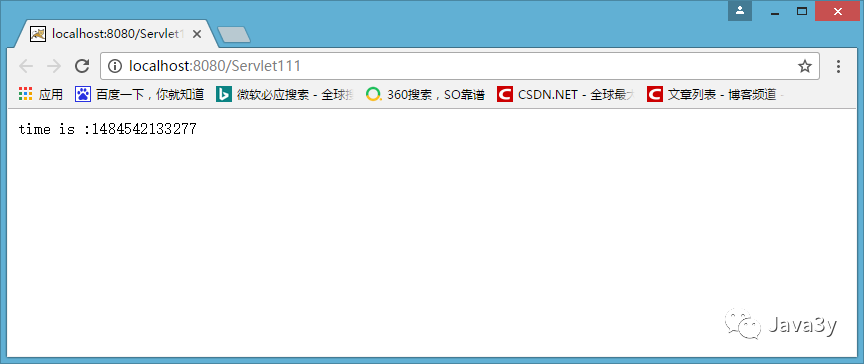

#[request和responce简介，responce的常见应用]


##responce、request对象
Tomcat收到客户端的http请求，会针对每一次请求，分别创建一个**代表请求的request对象**、和**代表响应的response对象**


request对象代表http请求，那么我们**获取浏览器提交过来的数据，找request对象即可**。
responce对象代表http响应，那么**向浏览器输出数据，找responce对象即可**


##HttpServletResponce对象

http响应由状态行，实体内容，消息头，一个空行组成。HttpServletResponce对象就封装了http响应的信息。


###HttpServletResponce的应用

1.**调用getOutputStream()方法向浏览器输出数据**
* 调用getOutputSream()方法像浏览器输出数据，该方法可以使用print()也可以是write()

* outpurstream是输出二进制数据的，print()方法接受了一个字符串，然而需要将其转成二进制，此时Tomcat需要使用IOS 8859-1编码对其进行转换，中文 对IOS 8859-1编码不支持。但是write()方法却可以因为 responce.getOutputStream().write("哈哈".getBytes());  时getBytes()在转换时默认gb2312编码，可以正常显示
* 可能如此浏览器依旧乱码，因为浏览器并未使用该编码，因此通过设置消息头，告诉浏览器回送的数据编码是什么，有两种方法
  * 1.Servlet API设置
   ```JAVA
  /设置头信息，告诉浏览器我回送的数据编码是utf-8的
        response.setHeader("Content-Type", "text/html;charset=UTF-8");

        response.getOutputStream().write("你好呀我是中国".getBytes("UTF-8"));
   ```
   * 2.使用html的标签模拟html的标签模拟消息头
  ```JAVA
        //获取到servletOutputStream对象
        ServletOutputStream servletOutputStream = response.getOutputStream();


        //使用meta标签模拟http消息头，告诉浏览器回送数据的编码和格式
        servletOutputStream.write("<meta http-equiv='content-type' content='text/html;charset=UTF-8'>".getBytes());

        servletOutputStream.write("我是中国".getBytes("UTF-8"));
  ```


2.**调用getWriter()方法向浏览器输出数据**
* 对于getWriter()方法而言，是Writer的子类，那么只能向浏览器输出字符数据，不能输出二进制数据
* getWriter().write("中文”)时会报错，因为 Tomcat编码不支持中文， 因此需要设置编码
  ```
  responce.setCharacterEncoding("UTF-8);
  ```
* 注意，这样设置了还是可能会出现乱码，因为浏览器并不一定使用使用UTF-8码表来显示数据
* 因此可以由两种方法：
  * 【使用标签模拟消息头，设置消息头】
  * 使用Servlet的方法
    * ```JAVA
        //设置浏览器用UTF-8编码显示数据
        response.setContentType("text/html;charset=UTF-8");
        ```


3.**实现文件下载**
* 既然浏览器发送所有的请求都是去找Servlet的话，那么我就写一个Servlet，当别人访问我这个Servlet的时候，它们就可
以下载我这个图片了！
    实现方法：
    1. 实现文件读取
   ```JAVA
    //获取到资源的路径
        String path = this.getServletContext().getRealPath("/download/1.png");

        //读取资源
        FileInputStream fileInputStream = new FileInputStream(path);

        //获取到文件名,路径在电脑上保存是\\形式的。
        String fileName = path.substring(path.lastIndexOf("\\") + 1); 
  ```
   2.告诉浏览器，要下载这个文件
   ```JAVA
        //设置消息头，告诉浏览器，我要下载1.png这个图片
        response.setHeader("Content-Disposition", "attachment; filename="+fileName);
   ```
   3.将读取到的内容会送给浏览器
   ```JAVA
    //把读取到的资源写给浏览器
        int len = 0;
        byte[] bytes = new byte[1024];
        ServletOutputStream servletOutputStream = response.getOutputStream();

        while ((len = fileInputStream.read(bytes)) > 0) {
            servletOutputStream.write(bytes, 0, len);
        }

        //关闭资源
        servletOutputStream.close();
        fileInputStream.close();
   ```

 Tips:若中文出现乱码：
 ```JAVA
    response.setHeader("Content-Disposition", "attachment; filename=" + URLEncoder.encode(fileName, "UTF-8"));
 ```


 4.**实现自动刷新**
 * 以规定的时间实现自动刷新， 修改了消息头
  ```JAVA
     //每3秒自动刷新网页一次
        response.setHeader("Refresh", "3");
  ```
 *  为了更好的看效果，我们加入时间值进去

 * 每三秒时间值就会发生变化
    

  * 这种方法可以实现页面的跳转
  ```JAVA
        response.setContentType("text/html;charset=UTF-8");
        response.getWriter().write("3秒后跳转页面.....");

        //三秒后跳转到index.jsp页面去，web应用的映射路径我设置成/，url没有写上应用名
        response.setHeader("Refresh", "3;url='/index.jsp'");

  ```


5.**设置缓存**
* 浏览器本身具有缓存机制
* 第一次访问的目标在第二次访问时自动从缓存里取出来
* 当为了股票类型的网页是不能取缓存的数据的，数据都是要不断更新的。下面禁止缓存的功能

```JAVA
    //浏览器有三消息头设置缓存，为了兼容性！将三个消息头都设置了
        response.setDateHeader("Expires", -1);
        response.setHeader("Cache-Control","no-cache");
        response.setHeader("Pragma", "no-cache");


        //这里为了看效果
        PrintWriter printWriter = response.getWriter();
        printWriter.print("你好啊" + new Date().toString());

```

6. **实现数据压缩**
   在将数据传给浏览器的时候，需要将数据压缩，然后可以节省流量
   同时在发送压缩后的数据后，告诉浏览器这是一个压缩的数据。


7. **生出随机图片**
   生成随机图片这是非常常见的。**在我们登陆的时候经常要写验证码，而那些验证码是一张图片，就是通过HttpServletResponse写给浏览器的。**

   * 要生成一张图片，java提供了BufferedImage类供我们使用
  ```JAVA
    //在内存中生成一张图片,宽为80,高为20，类型是RGB
        BufferedImage bufferedImage = new BufferedImage(80, 20, BufferedImage.TYPE_INT_RGB);

        //获取到这张图片
        Graphics graphics = bufferedImage.getGraphics();

        //往图片设置颜色和字体
        graphics.setColor(Color.BLUE);
        graphics.setFont(new Font(null, Font.BOLD, 20));

        //往图片上写数据，先写个12345，横坐标是0，纵坐标是20【高度】
        graphics.drawString("12345", 0, 20);e
  ```

  * 将生成的图片发送给浏览器
  ```JAVA
        //要往浏览器写一张图片，那要告诉浏览器回送的类型是一张图片
        response.setHeader("ContentType", "jpeg");

        //java提供了图片流给我们使用，这是一个工具类
        //把图片传进去，类型是jpg，写给浏览器
        ImageIO.write(bufferedImage, "jpg", response.getOutputStream());

  ```

  * 随机生成数字
    ```JAVA
       private String makeNum() {

        Random random = new Random();

        //这样就会生成0-7位的随机数，现在问题又来了，如果随机数不够7位呢？如果不够7位，我们加到7位就行了
        int anInt = random.nextInt(9999999);

        //将数字转成是字符串
        String num = String.valueOf(anInt);

        //判断位数有多少个，不够就加
        StringBuffer stringBuffer = new StringBuffer();
        for (int i = 0; i < 7 - num.length(); i++) {
            stringBuffer.append("0");
        }

        return stringBuffer.append(num).toString();

    } 
    ```


7.**重定向跳转**
 重定向跳转：**通知浏览器跳转到另外的一个页面就叫重定向跳转。是通知浏览器去跳转，这很重要**

 页面之间的跳转有两种方式：重定向和转发

 * 例如使用HttpServletResponce对象的重定向
  ```JAVA
         //重定向到index.jsp页面
        response.sendRedirect("/zhongfucheng/index.jsp");
  ```

* **重定向时通过302状态码和跳转调制实现的。因此可以通过设置http消息头就可以实现重定向跳转**
  ```JAVA
        //设置状态码是302
        response.setStatus(302);

        //HttpServletResponse把常用的状态码封装成静态常量了，所以我们可以使用SC_MOVED_TEMPORARILY代表着302
        response.setStatus(HttpServletResponse.SC_MOVED_TEMPORARILY);

        //跳转的地址是index.jsp页面
        response.setHeader("Location", "/zhongfucheng/index.jsp");

  ```
  其实sendRedirect()方法就是对setStatus()和setHeader()进行封装，原理就是setStatus()和setHeader()

8. **getWriter()和getOutputStream()细节**
   1. getWriter()和getOutputStream()两个方法不能同时调用。如果同时调用就会出现异常
   2. Servlet程序向ServletOutputStream或PrintWriter对象中写入的数据将被Servlet引擎从response里面获取，Servlet引擎将这些数据当作响应消息的正文，然后再与响应状态行和各响应头组合后输出到客户端。
   3. Servlet的serice()方法结束后【也就是doPost()或者doGet()结束后】，Servlet引擎将检查getWriter或getOutputStream方法返回的输出流对象是否已经调用过close方法，如果没有，Servlet引擎将调用close方法关闭该输出流对象.
   