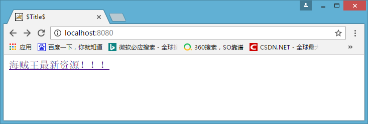
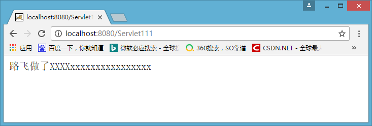
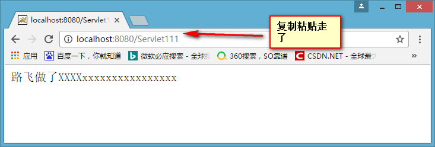

# request对象常用方法，应用


##什么是HttpSevletRequest

* HttpServletRequest对象代表客户端的请求，当客户端通过HTTP协议访问服务器时，HTTP请求头中的所有信息都封装在这个对象中，开发人员通过这个对象的方法，可以获得客户这些信息

简单来说，**要获得浏览器信息，就找HttpServletRequest对象**


##HttpServletRequest常用方法
###获得客户机【浏览器】信息
* getRequestURL方法返回客户端发出请求时的完整URL。
* getRequestURI方法返回请求行中的资源名部分。
* getQueryString 方法返回请求行中的参数部分。
* getPathInfo方法返回请求URL中的额外路径信息。额外路径信息是请求URL中的位于Servlet的路径之后和查询参数之前的内容，它以“/”开头。
* getRemoteAddr方法返回发出请求的客户机的IP地址
* getRemoteHost方法返回发出请求的客户机的完整主机名
* getRemotePort方法返回客户机所使用的网络端口号
* getLocalAddr方法返回WEB服务器的IP地址。
* getLocalName方法返回WEB服务器的主机名


###获得客户机请求头
* getHeader方法
* getHeaders方法
* getHeaderNames方法

###获得客户机请求参数（客户端提交的数据）
* getParameter方法
* getParameterValues (String name) 方法
* getParameterNames方法
* getParameterMap方法
  


##HttpServletRequest应用
###防盗链
什么是防盗链呢？比如：**我现在有海贼王最新的资源，想要看海贼王的要在我的网页上看。现在别的网站的人看到我有海贼王的资源，想要把我的资源粘贴在他自己的网站上。这样我独家的资源就被一个CTRL+C和CTRL+V抢走了？而反盗链就是不能被他们CRTL+C和CRTL+V

* 下面模拟一个场景。首页先有一个超链接，指向着海贼王最新资源
    
* 点进去，就可以获取资源
  *  
* 然而同时也可以得到资源的网址，其他人可以登陆这个网址从而获取资源
*   
* 如此一来就被盗链了，为了让想要别人必须从自己的首页进入
* 想要实现这样的效果，就要获取Referer这个消息头，判断Referer是不是从我的首页来的。如果不是从我的首页来的，跳转回我的首页。
  ```JAVA
    //获取到网页是从哪里来的
        String referer =request.getHeader("Referer");
    //如果不是从我的首页或者从地址栏直接访问的，
    if (referer==null||!referer.contains("localhost:8080/zhongfucheng/index.jsp")){
        responce.sendRedirect("/zhongfucheng/index.jsp");
        return;
    }
    //能执行下面的语句，说明是从我的首页点击劲来的，那没问题，照常显示
    responce.setContentType("text/html;charset=UTF-8");
    response.getWriter().write("路飞做了XXXXxxxxxxxxxxxxxxxx");
  ```


###表单提交数据【通过post方式提交数据】


###实现转发
