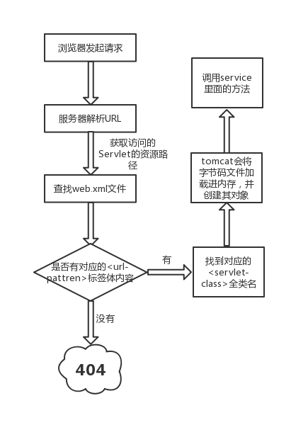
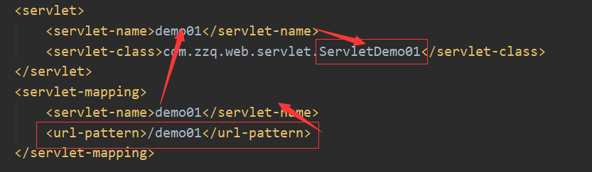
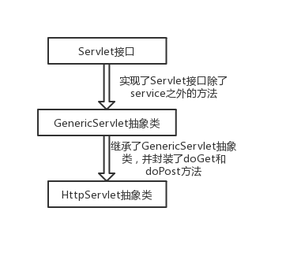
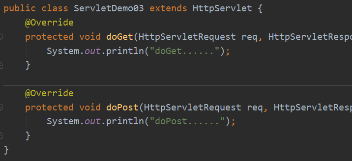

#Servlet执行原理，生命周期，继承体系
## Servlet 执行原理
    

  * 步骤：
  1.当服务器接收到客户端浏览器的请求后，解析请求URL路径，获取访问的Servlet的资源路径
  2.查找web.xml文件，是否有对应的<url-pattern>标签体内容
  3.如果有，则找到对应的<servlet-class>全类名
  4.tomcat会将字节码文件加载进内存，并且创建其对象
  5.调用其方法
  再看回web.xml，实质上是通过servlet-name做"中间介质"去找到类
  


## Servlet 接口:
  
```
 public interface Servlet {
    void init(ServletConfig var1) throws ServletException;

    ServletConfig getServletConfig();

    void service(ServletRequest var1, ServletResponse var2) throws ServletException, IOException;

    String getServletInfo();

    void destroy();
}
  ```

  ## Servlet 生命周期
   1. **加载Servlet**。当Tomcat第一次访问Servlet的时候，**Tomcat会负责创建Servlet的实例**
   2. **初始化**。当Servlet被实例化后，Tomcat会调用**init()方法初始化这个对象**
   3. **处理服务**。当浏览器访问Servlet的时候，Servlet**会调用service()方法处理请求**
   4. **销毁**。当Tomcat关闭时或者检测到Servlet要从Tomcat删除的时候会自动调用destory方法，**让实例释放掉所占的资源**。一个Servlet如果长时间不使用，也会被service()方法自动销毁
   5. **卸载**。当Servlet调用完destroy()方法后，等待垃圾回收。如果**有需要再次使用这个Servlet，会重新调用init()方法进行初始化操作**。
   6. 只要访问Servlet，service()就会被调用。init()只有第一次访问Servlet的时候才会被调用。 destroy()只有在Tomcat关闭的时候才会被调用。


## Servlet 继承体系
  
HttpServlet为接收数据与处理数据提供了很多方便的方法，如下所示:
  

  其中doGet方法可以用来处理浏览器的Get请求；doPost方法可以处理Post请求
因为HttpServlet提供了便捷的方法，我们以后都会使用HttpServlet
最后总结使用HttpServlet的步骤：

  1.定义类继承HttpServlet
  2.复写doGet/doPost方法