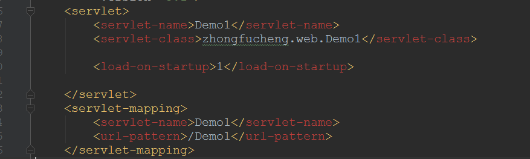
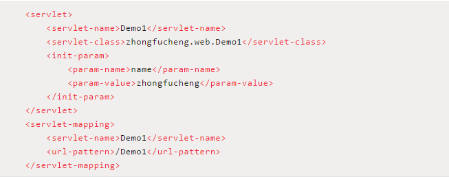

#Servlet 细节

 * Servlet的调用图  


## Servlet的细节
  * Servlet的映射可以被多次映射，映射的URL可以使用通配符
  ```
  <servlet>
    <servlet-name>MyServlet</servlet-name>
    <servlet-class>cn.cqu.MyServlet</servlet-class>
  </servlet>

  <servlet-mapping>
    <servlet-name>MyServlet</servlet-name>
    <url-pattern>/demo1</url-pattern>
  </servlet-mapping>

  <servlet-mapping>
    <servlet-name>MyServlet</servlet-name>
    <url-pattern>/demo2</url-pattern>
  </servlet-mapping>

  <servlet-mapping>
    <servlet-name>MyServlet</servlet-name>
    <url-pattern>/*</url-pattern>
  </servlet-mapping>

  
  ```


##Servlet是单例的
###为什么是单例的
**浏览器多次对Servlet的请求**，一般情况下，**服务器只创建一个Servlet对象**，也就是说，Servlet对象一旦创建了，就会驻留在内存中，为后续的请求做服务，直到服务器关闭。

###每次访问请求对象和响应对象都是新的
对于每次访问请求，Servlet引擎都会**创建一个新的HttpServletRequest请求对象和一个新的HttpServletResponse响应对象**，然后将这两个**对象作为参数传递给它调用的Servlet的service()方法，service方法再根据请求方式分别调用doXXX方法**。

###线程安全问题
当多个用户访问Servlet的时候，服务器会为每个用户创建一个线程。当多个用户并发访问Servlet共享资源的时候就会出现线程安全问题。

原则：
如果一个变量需要多个用户共享，则应当在访问该变量的时候，加同步机制synchronized (对象){}
如果一个变量不需要共享，则直接在 doGet() 或者 doPost()定义.这样不会存在线程安全问题


### load-on-startup
如果在元素中配置了一个元素，那么**WEB应用程序在启动时**，就会**装载并创建Servlet的实例对象、以及调用Servlet实例对象的init()方法。**
  
  

作用：

为web应用写一个InitServlet，这个servlet配置为启动时装载，为整个web应用创建必要的数据库表和数据
完成一些定时的任务[定时写日志，定时备份数据]


###在web访问任何资源都是在访问Servlet
总结：无论在web中访问什么资源【包括JSP】，都是在访问Servlet。没有手工配置缺省Servlet的时候，你访问静态图片，静态网页，缺省Servlet会在你web站点中寻找该图片或网页，如果有就返回给浏览器，没有就报404错误


## ServletConfig
### ServletConfig对象有什么用？
通过此对象可以读取web.xml中配置的初始化参数。
在web.xml中配置参数是为了让程序更灵活

### 获取web.xml文件配置的参数信息
* 为Demo1这个Servlet配置一个参数，参数名时name，值是zhongfucheng
*   


* 在Servlet中获取ServletConfig对象，通过ServletConfig对象获取web.xml文件配置的参数
*   
  


##ServletContext对象
###什么是ServletContext对象？
当Tomcat启动的时候，就会创建一个ServletContext对象。它代表着当前web站点

###ServletContext有什么用？
1. ServletContext 既然代表着当前web的站点，那么所有Servlet都共享着一个ServletContext对象，所以Servlet之间可以通过ServletContext实现通讯。
2. ServletConfig获取的是配置的是单个Servlet的参数信息，ServletContext可以获取的是配置整个web站点的参数信息
3. 利用ServletContext读取web站点的资源文件
4. 实现Servlet的转发【用ServletContext转发不多，主要用request转发】


##Servlet之间实现通信
* ServletContext对象可以被称之为**域对象**
（将域对象可以简单理解成一个**容器[类似于Map集合]**）
* 实现Servlet之间通讯就要用到ServletContext的setAttribute(String name, Object obj)方法，第一个参数是关键字，第二个参数是你要存储的对象
* Demo1
```JAVA
  ServletContext servletContext =this.getServletContext();
  String value="zhongfucheng";
  //MyName 作为关键字,value作为值存进         域对象【类型于Map集合】
  servletContext.setAttribute("Myname",value);
```
* Demo2
```JAVA
//获取ServletContext 对象
ServletContext servletContext =this.getServletContext();

//通过关键字获取域对象的值
String value=(String) servletContext.getAttribute("MyName");

System.out.println(value);
```

* 访问Demo2 可以获取Demo1存储的信息，从而实现多个Servlet之间的通讯
    


##获取web站点配置的信息
如果所有的Servlet都能够获取到连接数据库的信息，不可能在web.xml文件中每个Servlet中都配置一下。
* 因此在web.xml文件中对整个站点进行配置参数信息【**所有Servlet都可以取到参数信息**】
```XML
<context-param>
    <param-name>name</param-name>
    <param-value>zhongfucheng</param-value>
<context-param>
```

如此在不同的Servlet均可以获取这个参数
```JAVA
 ServletContext servletContext=this.getServletContext();
 
 String value=servlet.getInitParameter("name");

 System.out.println(value);

```