[toc]
#Spring Boot功能整合-web

##核心功能
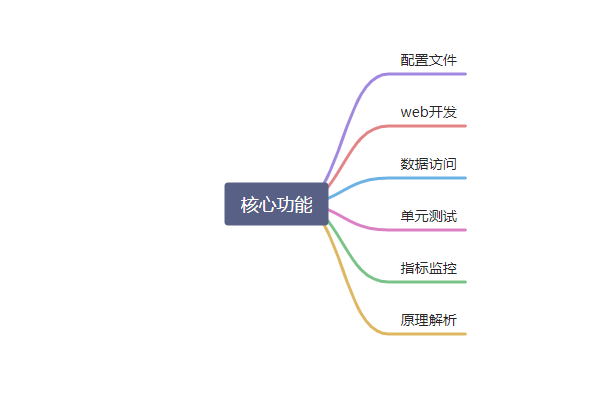


##配置文件

###1. 文件类型

####1.1 properties

同以前的properties用法

####1.2 yaml


#####基础语法

* key:value kv之间有空格
* 大小写敏感
* 使用缩进表示层级关系
* 缩进不允许使用tab，只允许空格（IDEA没关系）
* 缩进的空格数不重要，只要相同层级的元素左对齐即可
* '#'表示注释
* 字符串无需加引号，如果加了双引号 不会转义字符，单引号会转义


#####数据类型
* 字面量：单个的，不可再分的值。 date，boolean,string,number,null

```yaml
k: v
```
* 对象：键值对的集合。map hash set object
```yaml
行内写法：  k: {k1:v1,k2:v2,k3:v3}
#或
k: 
  k1: v1
  k2: v2
  k3: v3
```

* 数组：一组按次序排列的值。array、list、queue
```yaml
行内写法：  k: [v1,v2,v3]
#或者
k:
 - v1
 - v2
 - v3
```

#####示例

```java
@Component
@ConfigurationProperties(prefix="person")
@Data
public class Person {
    
    private String userName;
    private Boolean boss;
    private Date birth;
    private Integer age;
    private Pet pet;
    private String[] interests;
    private List<String> animal;
    private Map<String, Object> score;
    private Set<Double> salarys;
    private Map<String, List<Pet>> allPets;
}

@Data
@Component
public class Pet {
    private String name;
    private Double weight;
}
```

```yaml
# yaml表示以上对象
person:
  userName: zhangsan
  boss: false
  birth: 2019/12/12 20:12:33
  age: 18
  pet: 
    name: tomcat
    weight: 23.4
  interests: [篮球,游泳]
  animal: 
    - jerry
    - mario
  score:
    english: 
      first: 30
      second: 40
      third: 50
    math: [131,140,148]
    chinese: {first: 128,second: 136}
  salarys: [3999,4999.98,5999.99]
  allPets:
    sick:
      - {name: tom}
      - {name: jerry,weight: 47}
    health: [{name: mario,weight: 47}]
```
###配置提示
自定义的类和配置文件绑定一般没有提示
```xml
 <dependency>
            <groupId>org.springframework.boot</groupId>
            <artifactId>spring-boot-configuration-processor</artifactId>
            <optional>true</optional>
        </dependency>


 <build>
        <plugins>
            <plugin>
                <groupId>org.springframework.boot</groupId>
                <artifactId>spring-boot-maven-plugin</artifactId>
                <configuration>
                    <excludes>
                        <exclude>
                            <groupId>org.springframework.boot</groupId>
                            <artifactId>spring-boot-configuration-processor</artifactId>
                        </exclude>
                    </excludes>
                </configuration>
            </plugin>
        </plugins>
    </build>
```

##web开发
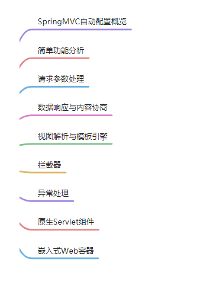
###1.Spring MVC自动配置概览
https://docs.spring.io/spring-boot/docs/current/reference/html/spring-boot-features.html#boot-features-developing-web-applications

###2. 简单功能分析

###2.1 静态资源访问

#### 静态资源目录
只要静态资源放在类路径下：/static (or /public or /resources or /META-INF/resources)

访问：当前项目根路径/+静态资源名   就可以访问


原理： 静态映射/**。
请求进来，先去找Controller看能不能处理。不能处理的所有请求又都交给静态资源处理器。静态资源也找不到则响应404页面

改变默认的静态资源路径
```yaml
spring:
  mvc:
    static-path-pattern: /res/**
//静态资源的前缀名

  resources:
    static-locations: [classpath:/haha/]
//静态资源的默认地址
```


#### 静态资源访问前缀
```yaml
spring:
  mvc:
    static-path-pattern: /res/**
```
当前项目 + static-path-pattern + 静态资源名 = 静态资源文件夹下找


#### webjar
```xml
<dependency>
            <groupId>org.webjars</groupId>
            <artifactId>jquery</artifactId>
            <version>3.5.1</version>
        </dependency>

```

###2.2欢迎页支持
* 静态资源路径下 index.html （只要在静态资源的默认地址）
  * 可以配置静态资源路径
  * 但是不可以配置静态资源的访问前缀，否则无法访问到index.html

```yaml
spring:
#  mvc:
#    static-path-pattern: /res/**   这个会导致welcome page功能失效

  resources:
    static-locations: [classpath:/haha/]
```
* controller 能处理 /index


### 2.3 自定义 Favicon
favicon.ico 放在静态资源目录下即可
```yaml
spring:
#  mvc:
#    static-path-pattern: /res/**   这个会导致 Favicon 功能失效
```


### 2.4 静态资源配置原理
* SpringBoot启动默认加载  xxxAutoConfiguration类(自动配置类)
* Spring MVC功能的自动配置类WebMvcAutoConfiguration，生效
```java
@Configuration(proxyBeanMethods = false)
@ConditionalOnWebApplication(type = Type.SERVLET)
@ConditionalOnClass({ Servlet.class, DispatcherServlet.class, WebMvcConfigurer.class })
@ConditionalOnMissingBean(WebMvcConfigurationSupport.class)
@AutoConfigureOrder(Ordered.HIGHEST_PRECEDENCE + 10)
@AutoConfigureAfter({ DispatcherServletAutoConfiguration.class, TaskExecutionAutoConfiguration.class,
        ValidationAutoConfiguration.class })
public class WebMvcAutoConfiguration {}
```


* 给容器中配了什么
```java
@Configuration(proxyBeanMethods = false)
@Import(EnableWebMvcConfiguration.class)
@EnableConfigurationProperties({ WebMvcProperties.class, ResourceProperties.class })
@Order(0)
public static class WebMvcAutoConfigurationAdapter implements WebMvcConfigurer {}
```
* 配置文件的相关属性和xxx进行了绑定。WebMvcProperties==spring.mvc、ResourceProperties==spring.resources


####1.配置类只有一个有参构造器->不需要@Autowired注解，参数位置的组件还是可以自动从容器中获取
```java
  //有参构造器所有参数的值都会从容器中确定
//ResourceProperties resourceProperties；获取和spring.resources绑定的所有的值的对象
//WebMvcProperties mvcProperties 获取和spring.mvc绑定的所有的值的对象
//ListableBeanFactory beanFactory Spring的beanFactory
//HttpMessageConverters 找到所有的HttpMessageConverters
//ResourceHandlerRegistrationCustomizer 找到 资源处理器的自定义器。=========
//DispatcherServletPath  
//ServletRegistrationBean   给应用注册Servlet、Filter....
    public WebMvcAutoConfigurationAdapter(ResourceProperties resourceProperties, WebMvcProperties mvcProperties,
                ListableBeanFactory beanFactory, ObjectProvider<HttpMessageConverters> messageConvertersProvider,
                ObjectProvider<ResourceHandlerRegistrationCustomizer> resourceHandlerRegistrationCustomizerProvider,
                ObjectProvider<DispatcherServletPath> dispatcherServletPath,
                ObjectProvider<ServletRegistrationBean<?>> servletRegistrations) {
            this.resourceProperties = resourceProperties;
            this.mvcProperties = mvcProperties;
            this.beanFactory = beanFactory;
            this.messageConvertersProvider = messageConvertersProvider;
            this.resourceHandlerRegistrationCustomizer = resourceHandlerRegistrationCustomizerProvider.getIfAvailable();
            this.dispatcherServletPath = dispatcherServletPath;
            this.servletRegistrations = servletRegistrations;
        }

```

####2.资源处理的默认规则
```java
@Override
public void addResourceHandlers(ResourceHandlerRegistry registry) {
            if (!this.resourceProperties.isAddMappings()) {
                logger.debug("Default resource handling disabled");
                return;
            }
            Duration cachePeriod = this.resourceProperties.getCache().getPeriod();
            CacheControl cacheControl = this.resourceProperties.getCache().getCachecontrol().toHttpCacheControl();
            //webjars的规则
            if (!registry.hasMappingForPattern("/webjars/**")) {
                customizeResourceHandlerRegistration(registry.addResourceHandler("/webjars/**")
                        .addResourceLocations("classpath:/META-INF/resources/webjars/")
                        .setCachePeriod(getSeconds(cachePeriod)).setCacheControl(cacheControl));
            }
            
            //
            String staticPathPattern = this.mvcProperties.getStaticPathPattern();
            if (!registry.hasMappingForPattern(staticPathPattern)) {
                customizeResourceHandlerRegistration(registry.addResourceHandler(staticPathPattern)
                        .addResourceLocations(getResourceLocations(this.resourceProperties.getStaticLocations()))
                        .setCachePeriod(getSeconds(cachePeriod)).setCacheControl(cacheControl));
            }
}

```


```yaml
spring:
#  mvc:
#    static-path-pattern: /res/**

  resources:
    add-mappings: false   禁用所有静态资源规则
```
```java
@ConfigurationProperties(prefix = "spring.resources", ignoreUnknownFields = false)
public class ResourceProperties {

    private static final String[] CLASSPATH_RESOURCE_LOCATIONS = { "classpath:/META-INF/resources/",
            "classpath:/resources/", "classpath:/static/", "classpath:/public/" };

    /**
     * Locations of static resources. Defaults to classpath:[/META-INF/resources/,
     * /resources/, /static/, /public/].
     */
    private String[] staticLocations = CLASSPATH_RESOURCE_LOCATIONS;

```


####3.欢迎页的处理规则
```java
//HandlerMapping：处理器映射。保存了每一个Handler能处理哪些请求。  

    @Bean
        public WelcomePageHandlerMapping welcomePageHandlerMapping(ApplicationContext applicationContext,
                FormattingConversionService mvcConversionService, ResourceUrlProvider mvcResourceUrlProvider) {
            WelcomePageHandlerMapping welcomePageHandlerMapping = new WelcomePageHandlerMapping(
                    new TemplateAvailabilityProviders(applicationContext), applicationContext, getWelcomePage(),
                    this.mvcProperties.getStaticPathPattern());
            welcomePageHandlerMapping.setInterceptors(getInterceptors(mvcConversionService, mvcResourceUrlProvider));
            welcomePageHandlerMapping.setCorsConfigurations(getCorsConfigurations());
            return welcomePageHandlerMapping;
        }

    WelcomePageHandlerMapping(TemplateAvailabilityProviders templateAvailabilityProviders,
            ApplicationContext applicationContext, Optional<Resource> welcomePage, String staticPathPattern) {
        if (welcomePage.isPresent() && "/**".equals(staticPathPattern)) {
            //要用欢迎页功能，必须是/**
            logger.info("Adding welcome page: " + welcomePage.get());
            setRootViewName("forward:index.html");
        }
        else if (welcomeTemplateExists(templateAvailabilityProviders, applicationContext)) {
            // 调用Controller  /index
            logger.info("Adding welcome page template: index");
            setRootViewName("index");
        }
    }
```


###3. 请求参数处理
####0. 请求映射
#####1. rest使用与原理
* @xxxMapping
* Rest风格支持（使用HTTTP请求方式动词来表达对资源的操作）
  * 以前：/getUser 获取用户 /deleteUser 删除用户  /editUser 修改用户
  /saveUser 保存用户
* 现在： /user GET-获取用户  DELETE-删除用户  PUT-修改用户  POST-保存用户
* 核心Filter; HiddenHttpMethodFilter
  
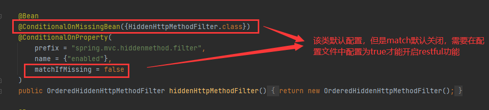
```yaml
spring:
  mvc:
    hiddenmethod:
      filter:
        enabled: true   #开启页面表单的Rest功能
```

```java

  @RequestMapping(value = "/user",method = RequestMethod.GET)
    public String getUser(){
        return "GET-张三";
    }

    @RequestMapping(value = "/user",method = RequestMethod.POST)
    public String saveUser(){
        return "POST-张三";
    }


    @RequestMapping(value = "/user",method = RequestMethod.PUT)
    public String putUser(){
        return "PUT-张三";
    }

    @RequestMapping(value = "/user",method = RequestMethod.DELETE)
    public String deleteUser(){
        return "DELETE-张三";
    }


    @Bean
    @ConditionalOnMissingBean(HiddenHttpMethodFilter.class)
    @ConditionalOnProperty(prefix = "spring.mvc.hiddenmethod.filter", name = "enabled", matchIfMissing = false)
    public OrderedHiddenHttpMethodFilter hiddenHttpMethodFilter() {
        return new OrderedHiddenHttpMethodFilter();
    }


//自定义filter
    @Bean
    public HiddenHttpMethodFilter hiddenHttpMethodFilter(){
        HiddenHttpMethodFilter methodFilter = new HiddenHttpMethodFilter();
        methodFilter.setMethodParam("_m");
        return methodFilter;
    }
```

Rest原理 (表单提交要使用rest的时候)
* 表单提交会带上_method=PUT
* 请求过来被HiddenHttpMethodFilter拦截
  * 请求是否正常，并且是POST
    * 获取到_method的值。
    * 兼容一下请求；PUT DELETE PATCH
    * 原生request(post),包装模式requestWrapper重写了getMethod方法，返回的是传入的值。
    * 过滤器链放行的时候用warpper。以后的方法调用getMethod是调用requestWrapper的。

Rest使用客户端工具：
* 如PostMan 直接发送Put，delete 等方式请求，无需Filter。


#####2.请求映射原理
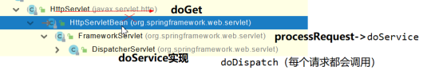


SpringMVC功能分析都从 org.springframework.web.servlet.DispatcherServlet-》doDispatch（）
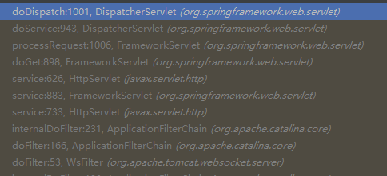
```java
protected void doDispatch(HttpServletRequest request, HttpServletResponse response) throws Exception {
        HttpServletRequest processedRequest = request;
        HandlerExecutionChain mappedHandler = null;
        boolean multipartRequestParsed = false;

        WebAsyncManager asyncManager = WebAsyncUtils.getAsyncManager(request);

        try {
            ModelAndView mv = null;
            Exception dispatchException = null;

            try {
                processedRequest = checkMultipart(request);
                multipartRequestParsed = (processedRequest != request);

                // 找到当前请求使用哪个Handler（Controller的方法）处理
                mappedHandler = getHandler(processedRequest);
                
                //HandlerMapping：处理器映射。/xxx->>xxxx
```
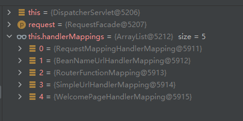

RequestMappingHandlerMapping：保存了所有@RequestMapping 和handler的映射规则。

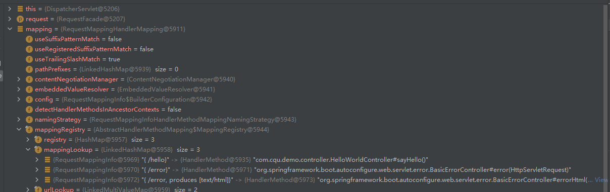
所有的请求映射都在HandlerMapping中


* SpringBoot自动配置欢迎页的WelcomePageHandlerMapping。 访问/能访问到index.html;
* SpringBoot自动配置了默认的 RequestMappingHandlerMapping
* **请求进来，挨个尝试所有的HandlerMapping是否有请求信息**。
  * 如果有就找到这个请求对应的handler（sayhello方法等等）
  * 如果没有就是一下一个HandlerMapping
* 我们需要一些自定义的映射处理，我们可以给容器中放HandlerMapping。自定义HanderMapping
```java
   protected HandlerExecutionChain getHandler(HttpServletRequest request) throws Exception {
        if (this.handlerMappings != null) {
            for (HandlerMapping mapping : this.handlerMappings) {
                HandlerExecutionChain handler = mapping.getHandler(request);
                if (handler != null) {
                    return handler;
                }
            }
        }
        return null;
    }
```

####1.普通参数与基本注解
#####1.1 注解
@PathVariable、@RequestHeader、@ModelAttribute、@RequestParam、@MatrixVariable、@CookieValue、@RequestBody
```java
RestController
public class ParameterTestController {


    //  car/2/owner/zhangsan
    @GetMapping("/car/{id}/owner/{username}")
    public Map<String,Object> getCar(@PathVariable("id") Integer id,
                                     @PathVariable("username") String name,
                                     @PathVariable Map<String,String> pv,
                                     @RequestHeader("User-Agent") String userAgent,
                                     @RequestHeader Map<String,String> header,
                                     @RequestParam("age") Integer age,
                                     @RequestParam("inters") List<String> inters,
                                     @RequestParam Map<String,String> params,
                                     @CookieValue("_ga") String _ga,
                                     @CookieValue("_ga") Cookie cookie){


        Map<String,Object> map = new HashMap<>();

//        map.put("id",id);
//        map.put("name",name);
//        map.put("pv",pv);
//        map.put("userAgent",userAgent);
//        map.put("headers",header);
        map.put("age",age);
        map.put("inters",inters);
        map.put("params",params);
        map.put("_ga",_ga);
        System.out.println(cookie.getName()+"===>"+cookie.getValue());
        return map;
    }


    @PostMapping("/save")
    public Map postMethod(@RequestBody String content){
        Map<String,Object> map = new HashMap<>();
        map.put("content",content);
        return map;
    }


    //1、语法： 请求路径：/cars/sell;low=34;brand=byd,audi,yd
    //2、SpringBoot默认是禁用了矩阵变量的功能
    //      手动开启：原理。对于路径的处理。UrlPathHelper进行解析。
    //              removeSemicolonContent（移除分号内容）支持矩阵变量的
    //3、矩阵变量必须有url路径变量才能被解析
    @GetMapping("/cars/{path}")
    public Map carsSell(@MatrixVariable("low") Integer low,
                        @MatrixVariable("brand") List<String> brand,
                        @PathVariable("path") String path){
        Map<String,Object> map = new HashMap<>();

        map.put("low",low);
        map.put("brand",brand);
        map.put("path",path);
        return map;
    }

    // /boss/1;age=20/2;age=10

    @GetMapping("/boss/{bossId}/{empId}")
    public Map boss(@MatrixVariable(value = "age",pathVar = "bossId") Integer bossAge,
                    @MatrixVariable(value = "age",pathVar = "empId") Integer empAge){
        Map<String,Object> map = new HashMap<>();

        map.put("bossAge",bossAge);
        map.put("empAge",empAge); 
        return map;

    }

}

```
 
#####1.2 Servlet API：
WebRequest、ServletRequest、MultipartRequest、 HttpSession、javax.servlet.http.PushBuilder、Principal、InputStream、Reader、HttpMethod、Locale、TimeZone、ZoneId


#####1.3 复杂参数
Map、Model（map、model里面的数据会被放在request的请求域  request.setAttribute）、Errors/BindingResult、RedirectAttributes（ 重定向携带数据）、ServletResponse（response）、SessionStatus、UriComponentsBuilder、ServletUriComponentsBuilder

https://www.yuque.com/atguigu/springboot/vgzmgh


####3 参数处理原理


###4.数据响应与内容协商
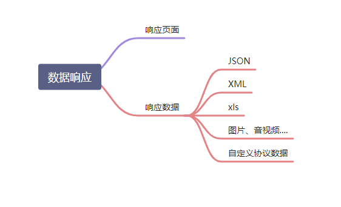
#### 1.响应json
#####1.jackson.jar+@ResponseBody
```xml
 <dependency>
            <groupId>org.springframework.boot</groupId>
            <artifactId>spring-boot-starter-web</artifactId>
        </dependency>
web场景自动引入了json场景
    <dependency>
      <groupId>org.springframework.boot</groupId>
      <artifactId>spring-boot-starter-json</artifactId>
      <version>2.3.4.RELEASE</version>
      <scope>compile</scope>
    </dependency>
```
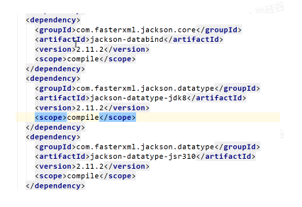

给前端自动返回json数据

1. 返回值解析器

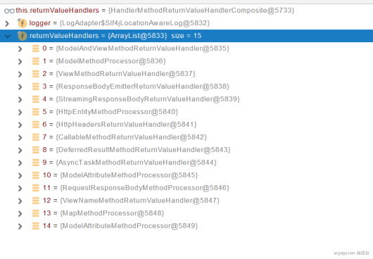


2. 返回值解析器原理
   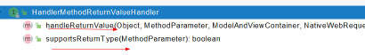


#####1.2 Spring MVC支持哪些返回值
```
ModelAndView
Model
View
ResponseEntity 
ResponseBodyEmitter
StreamingResponseBody
HttpEntity
HttpHeaders
Callable
DeferredResult
ListenableFuture
CompletionStage
WebAsyncTask
有 @ModelAttribute 且为对象类型的
@ResponseBody 注解 ---> RequestResponseBodyMethodProcessor；

```
#### 2.内容协商

###5.视图解析与模板引擎

视图解析：SpringBoot默认不支持jsp，需要引入第三方模板引擎技术实现页面渲染。


####1.视图解析原理流程

####2.模板引擎-Thymeleaf

####3.thymeleaf使用
https://www.thymeleaf.org/doc/tutorials/3.0/usingthymeleaf.html#setting-value-to-specific-attributes
1. 引入starter
```xml
 <dependency>
    <groupId>org.springframework.boot</groupId>
    <artifactId>spring-boot-starter-thymeleaf</artifactId>
</dependency>
```

2. 自动配置好了thymeleaf
 * 1. 所有thymeleaf的配置值都在 ThymeleafProperties
 * 2. 配置好了SpringTemplateEngine
 * 3. 配好了ThymeleafViewResolver
 * 4. 我们只需要直接开发页面

3. 页面开发
```html
<!DOCTYPE html>
<html lang="en" xmlns:th="http://www.thymeleaf.org">
<head>
    <meta charset="UTF-8">
    <title>Title</title>
</head>
<body>
<h1 th:text="${msg}">哈哈</h1>
<h2>
    <a href="www.atguigu.com" th:href="${link}">去百度</a>  <br/>
    <a href="www.atguigu.com" th:href="@{link}">去百度2</a>
</h2>
</body>
</html>
```


####4.构建后台管理系统

#####1. 项目创建
thymeleaf，web-starter，devtools,lombok

#####2.静态资源处理
自动配置好，我们只需要把所有静态资源放大static文件夹下

#####3. 路径构建


th:action="@{/login}"


#####4.模板抽取
th:insert/replace/include


#####5.页面跳转
```java
   @PostMapping("/login")
    public String main(User user, HttpSession session, Model model){

        if(StringUtils.hasLength(user.getUserName()) && "123456".equals(user.getPassword())){
            //把登陆成功的用户保存起来
            session.setAttribute("loginUser",user);
            //登录成功重定向到main.html;  重定向防止表单重复提交
            return "redirect:/main.html";
        }else {
            model.addAttribute("msg","账号密码错误");
            //回到登录页面
            return "login";
        }

    }
```

#####6.数据渲染
```java
 @GetMapping("/dynamic_table")
    public String dynamic_table(Model model){
        //表格内容的遍历
        List<User> users = Arrays.asList(new User("zhangsan", "123456"),
                new User("lisi", "123444"),
                new User("haha", "aaaaa"),
                new User("hehe ", "aaddd"));
        model.addAttribute("users",users);

        return "table/dynamic_table";
    }
```

```html
     <table class="display table table-bordered" id="hidden-table-info">
        <thead>
        <tr>
            <th>#</th>
            <th>用户名</th>
            <th>密码</th>
        </tr>
        </thead>
        <tbody>
        <tr class="gradeX" th:each="user,stats:${users}">
            <td th:text="${stats.count}">Trident</td>
            <td th:text="${user.userName}">Internet</td>
            <td >[[${user.password}]]</td>
        </tr>
        </tbody>
        </table>
```


####5.拦截器

如登录检查，需要判断你是否登入

#####1. HandlerInterceptor 接口

```java
/**
 * 登录检查
 * 1、配置好拦截器要拦截哪些请求
 * 2、把这些配置放在容器中
 */
@Slf4j
public class LoginInterceptor implements HandlerInterceptor {

    /**
     * 目标方法执行之前
     * @param request
     * @param response
     * @param handler
     * @return
     * @throws Exception
     */
    @Override
    public boolean preHandle(HttpServletRequest request, HttpServletResponse response, Object handler) throws Exception {

        String requestURI = request.getRequestURI();
        log.info("preHandle拦截的请求路径是{}",requestURI);

        //登录检查逻辑
        HttpSession session = request.getSession();

        Object loginUser = session.getAttribute("loginUser");

        if(loginUser != null){
            //放行
            return true;
        }

        //拦截住。未登录。跳转到登录页
        request.setAttribute("msg","请先登录");
//        re.sendRedirect("/");
        request.getRequestDispatcher("/").forward(request,response);
        return false;
    }

    /**
     * 目标方法执行完成以后
     * @param request
     * @param response
     * @param handler
     * @param modelAndView
     * @throws Exception
     */
    @Override
    public void postHandle(HttpServletRequest request, HttpServletResponse response, Object handler, ModelAndView modelAndView) throws Exception {
        log.info("postHandle执行{}",modelAndView);
    }

    /**
     * 页面渲染以后
     * @param request
     * @param response
     * @param handler
     * @param ex
     * @throws Exception
     */
    @Override
    public void afterCompletion(HttpServletRequest request, HttpServletResponse response, Object handler, Exception ex) throws Exception {
        log.info("afterCompletion执行异常{}",ex);
    }
}
```

#####2.配置拦截器

```java
/**
 * 1、编写一个拦截器实现HandlerInterceptor接口
 * 2、拦截器注册到容器中（实现WebMvcConfigurer的addInterceptors）
 * 3、指定拦截规则【如果是拦截所有，静态资源也会被拦截】
 */
@Configuration
public class AdminWebConfig implements WebMvcConfigurer {

    @Override
    public void addInterceptors(InterceptorRegistry registry) {
        registry.addInterceptor(new LoginInterceptor())
                .addPathPatterns("/**")  //所有请求都被拦截包括静态资源
                .excludePathPatterns("/","/login","/css/**","/fonts/**","/images/**","/js/**"); //放行的请求
    }
}
```


#####3.拦截器原理

1. 根据当前请求，找到HandlerExecutionChain【可以处理请求的handler以及handler的所有拦截器】
2. 先来顺序执行所有拦截器的preHandle方法
   1. 如果当前拦截器prehandler返回为true。则执行下一个拦截器的preHadnle
   2. 如果当前拦截器返回为false。直接，倒序执行所有已经执行了的拦截器的afterCompletion
3. **如果任何一个拦截器返回false。直接跳出不执行目标方法**
4. **所有拦截器都返回true。执行目标方法**
5. **倒序执行所有拦截器的postHandle方法。**
6. **前面的步骤有任何异常都会直接倒序触发**  afterCompletion
7. 也没面成功渲染完成以后，也会倒序触发   afterCompletion 

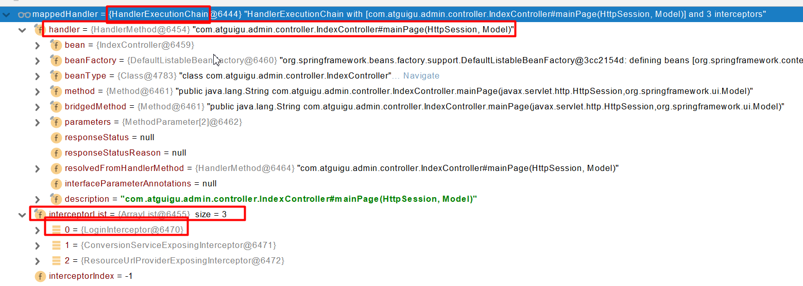

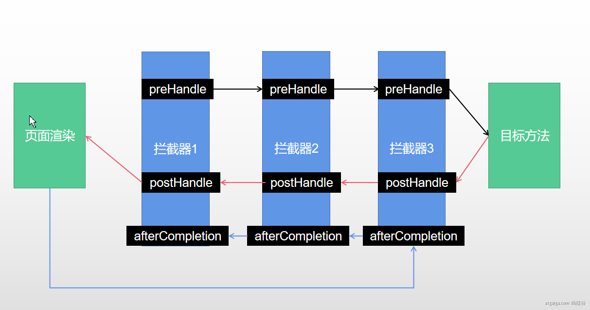

####7.文件上传

#####1，页面表单
```html
<form method="post" action="/upload" enctype="multipart/form-data">
    <input type="file" name="file"><br>
    <input type="submit" value="提交">
</form>
```


#####2.文件上传代码
```java
 /**
     * MultipartFile 自动封装上传过来的文件
     * @param email
     * @param username
     * @param headerImg
     * @param photos
     * @return
     */
    @PostMapping("/upload")
    public String upload(@RequestParam("email") String email,
                         @RequestParam("username") String username,
                         @RequestPart("headerImg") MultipartFile headerImg,
                         @RequestPart("photos") MultipartFile[] photos) throws IOException {

        log.info("上传的信息：email={}，username={}，headerImg={}，photos={}",
                email,username,headerImg.getSize(),photos.length);

        if(!headerImg.isEmpty()){
            //保存到文件服务器，OSS服务器
            String originalFilename = headerImg.getOriginalFilename();
            headerImg.transferTo(new File("H:\\cache\\"+originalFilename));
        }

        if(photos.length > 0){
            for (MultipartFile photo : photos) {
                if(!photo.isEmpty()){
                    String originalFilename = photo.getOriginalFilename();
                    photo.transferTo(new File("H:\\cache\\"+originalFilename));
                }
            }
        }


        return "main";
    }
```

#####3.自动配置原理
文件上传自动配置类-MultipartAutoConfiguration-MultipartProperties
* 自动配置好了StandardServletMultipartResolver【文件上传解析器】
* 原理步骤
  * 1. 请求进来使用文件上传解析器判断（isMultipart）并封装
  * 2. 参数解析器来解析请求中的文件内容分装成MultipartFile
  * 3. 将request中文件信息封装为一个Map； MultiValueMap<String, MultipartFile>
  * FileCopyUtils 实现文件流的拷贝
```java
 @PostMapping("/upload")
    public String upload(@RequestParam("email") String email,
                         @RequestParam("username") String username,
                         @RequestPart("headerImg") MultipartFile headerImg,
                         @RequestPart("photos") MultipartFile[] photos)

```
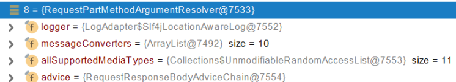!


####8. 异常处理
#####1. 错误处理
######1. 默认规则
* 默认情况下，SpringBoot 提供/error 处理所有错误的映射
* 对于机器客户端，它将生成JSON响应，其中包含错误，HTTP 状态和异常消息的详细信息。对于浏览器客户端，响应一个“whitelable”错误视图，以HTML格式呈现相同的数据
* 
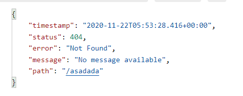


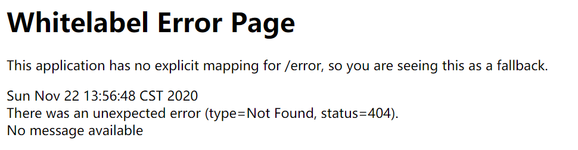

* 要对其进行自定义，添加View 解析为error
* 要完全替换默认行为，可以实现 ErrorController 并注册该类型的Bean 定义，或添加 ErrorAttributes 类型的组件  以实现现有机制但替换其内容。、
* error/下的4xx ,5xx 页面会被自动解析
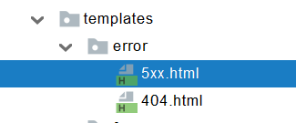


######2. 异常处理步骤流程
1. 执行目标方法，目标方法运行期间有任何异常都会被catch，而且标志当前请求结束，并且用 **dispatchException**
2. 进入视图解析流程（页面渲染？）
3. processDispatchResult(processedRequest, response, mappedHandler, mv, dispatchException);
4. **mv = processHandlerException**；处理handler发生的异常，处理完成返回ModelAndView；
   1. 遍历所有的 **handlerExceptionResolvers**，看谁能处理当前异常【HandlerExceptionResolver处理器异常解析器】
   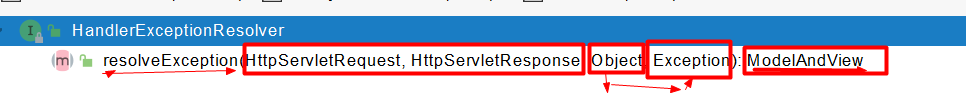
   2. 系统默认的异常解析器
   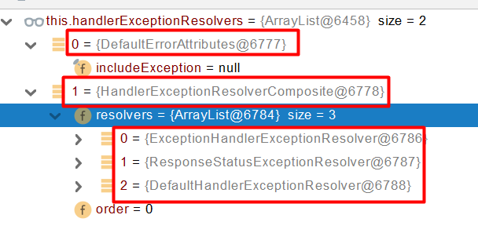
    * DefaultErrorAttributes先来处理异常。把异常信息保存到rrequest域，并且返回null；
    * 默认没有任何人能处理异常，所以异常会被抛出
    * 如果没有任何人能处理最终底层就会发送 /error 请求。会被底层的BasicErrorController处理
    * 解析错误视图；遍历所有的  ErrorViewResolver  看谁能解析。
  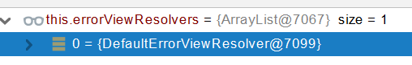
    * 默认的 DefaultErrorViewResolver ,作用是把响应状态码作为错误页的地址，error/500.html
    * 模板引擎最终响应这个页面 error/500.html


#### 9. Web原生组件组入（Servlet,Filter,Listener）

##### 1. 使用Servlet API
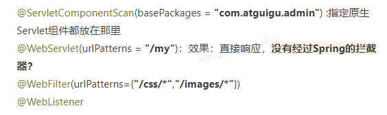

扩展：DispatchServlet 如何注册进来
• 容器中自动配置了  DispatcherServlet  属性绑定到 WebMvcProperties；对应的配置文件配置项是 spring.mvc。
• 通过 ServletRegistrationBean<DispatcherServlet> 把 DispatcherServlet  配置进来。
• 默认映射的是 / 路径。

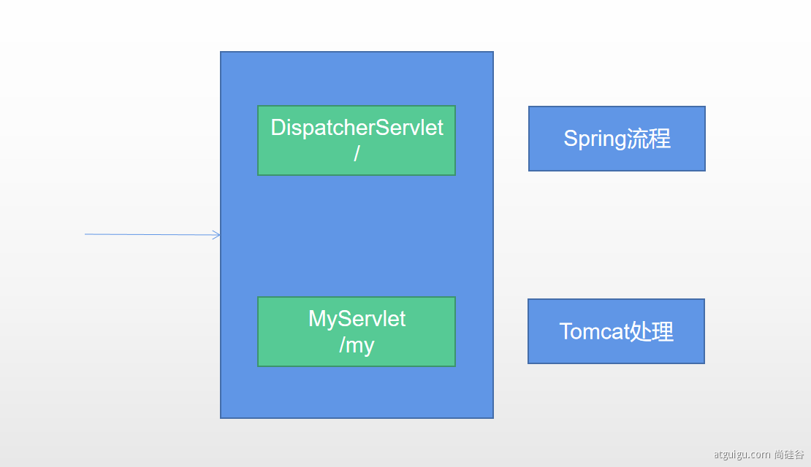

这就导致了两个Servlet 发送请求时，根据精确优选原则

Tomcat-Servlet；
多个Servlet都能处理到同一层路径，精确优选原则
A： /my/
B： /my/1


##### 2. 使用RegistrationBean
ServletRegistrationBean, FilterRegistrationBean, and ServletListenerRegistrationBean

```java
@Configuration
public class MyRegistConfig {

    @Bean
    public ServletRegistrationBean myServlet(){
        MyServlet myServlet = new MyServlet();

        return new ServletRegistrationBean(myServlet,"/my","/my02");
    }


    @Bean
    public FilterRegistrationBean myFilter(){

        MyFilter myFilter = new MyFilter();
//        return new FilterRegistrationBean(myFilter,myServlet());
        FilterRegistrationBean filterRegistrationBean = new FilterRegistrationBean(myFilter);
        filterRegistrationBean.setUrlPatterns(Arrays.asList("/my","/css/*"));
        return filterRegistrationBean;
    }

    @Bean
    public ServletListenerRegistrationBean myListener(){
        MySwervletContextListener mySwervletContextListener = new MySwervletContextListener();
        return new ServletListenerRegistrationBean(mySwervletContextListener);
    }
}
```


#### 11.定制化
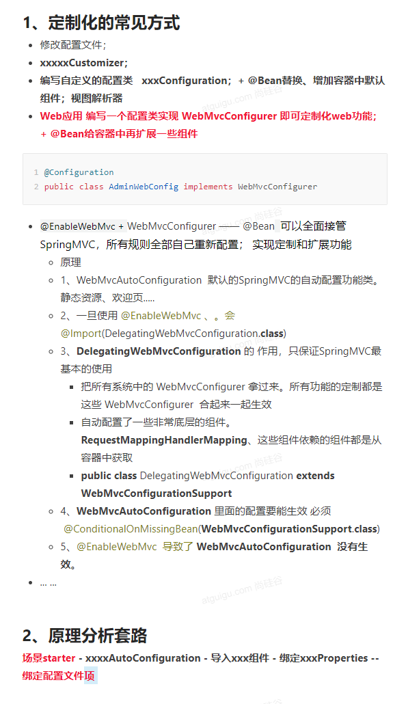