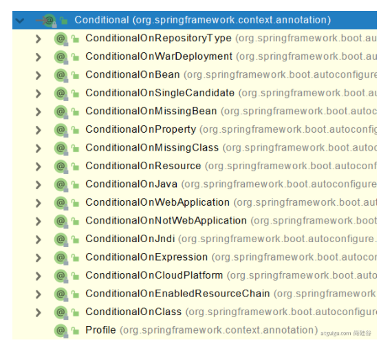
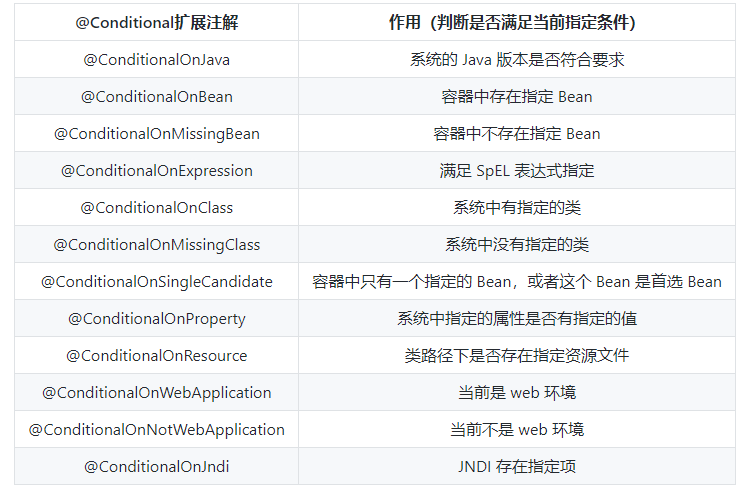
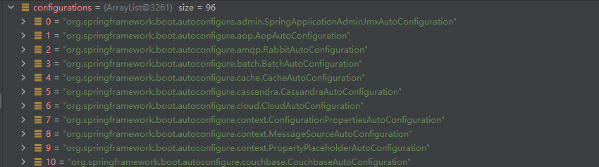
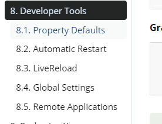

[TOC]


#1. SpringBoot 特点
Spring 开发文档
https://docs.spring.io/spring-boot/docs/current/reference/html/index.html

##依赖管理

###项目依赖管理

* 依赖管理
```xml

 <parent>
        <groupId>org.springframework.boot</groupId>
        <artifactId>spring-boot-starter-parent</artifactId>
        <version>1.5.9.RELEASE</version>
        <relativePath/> <!-- lookup parent from repository -->
    </parent>
  
```
* 他的父项目:
```xml
	<parent>
		<groupId>org.springframework.boot</groupId>
		<artifactId>spring-boot-dependencies</artifactId>
		<version>1.5.9.RELEASE</version>
		<relativePath>../../spring-boot-dependencies</relativePath>
	</parent>
```
它才真正管理 Spring Boot 应用里面的**所有依赖的版本**。如果这个项目里面有依赖的版本号，那么导入依赖的时候就不需要写版本号，否则需要指定版本号。
* 无需关注版本号，自动版本仲裁
```xml
1. 引入依赖默认可以不写版本
2. 引入非版本仲裁的jar，要写版本号。

```

* 可以修改默认版本号
```xml
1、查看spring-boot-dependencies里面规定当前依赖的版本 用的 key。
2、在当前项目里面重写配置
    <properties>
        <mysql.version>5.1.43</mysql.version>
    </properties>
```

* 开发导入starter场景启动器
Spring Boot 将所有的功能场景都抽取出来，做成一个个的starters(启动器)，只需要在项目里面引入这些starter相关场景的所有依赖都会导入进来。要用什么功能就导入什么场景的启动器。
```xml
1、见到很多 spring-boot-starter-* ： *就某种场景
2、只要引入starter，这个场景的所有常规需要的依赖我们都自动引入
3、SpringBoot所有支持的场景
https://docs.spring.io/spring-boot/docs/current/reference/html/using-spring-boot.html#using-boot-starter
4、见到的  *-spring-boot-starter： 第三方为我们提供的简化开发的场景启动器。
5、所有场景启动器最底层的依赖
<dependency>
  <groupId>org.springframework.boot</groupId>
  <artifactId>spring-boot-starter</artifactId>
  <version>2.3.4.RELEASE</version>
  <scope>compile</scope>
</dependency>
```


###自动配置
* 自动配好Tomcat
  * 引入Tomcat依赖
  * 配置Tomcat
```xml
<dependency>
	<groupId>org.springframework.boot</groupId>
	<artifactId>spring-boot-starter-tomcat</artifactId>
	<version>1.5.9.RELEASE</version>
</dependency>
```

* 自动配好Web常用功能，如：字符编码问题
  * Spring Boot帮助我们配置好了所有web开发的常见场景。
  
* 默认的包结构
  * 主程序所在包及其下面的所有子包里面的组件都会默认扫描进来
  * 无需以前的包扫描配置
  * 想要改变扫描路径
  * @SpringBootApplication((scanBasePackages="com.atguigu")
    * 或者@CompontentScan 指定扫描路径

```java
@SpringBootApplication
等同于
@SpringBootConfiguration
@EnableAutoConfiguration
@ComponentScan("com.atguigu.boot")
```

* 各种配置拥有默认值
  * 默认配置最终都是映射到某个类上，如：MultipartProperties
  * 配置文件的值最终会绑定每个类上，这个类会在容器中创建对象

* 按需加载所有自动配置项
  * 非常多的starter
  * 引入了哪些场景这个场景的自动配置才会开启
  * SpringBoot的所有自动配置功能都在spring-boot-autoconfigure包里面


# 2. 容器功能
## 添加组件
### @Configuration
* 基本使用
* Full模式与Lite模式
* proxyBeanMethods：代理bean的方法
*  Full(proxyBeanMethods = true)、【保证每个@Bean方法被调用多少次返回的组件都是单实例的】(单例)
*  Lite(proxyBeanMethods = false)【每个@Bean方法被调用多少次返回的组件都是新创建的】（非单例）

```java
#############################Configuration使用示例######################################################
/**
 * 1、配置类里面使用@Bean标注在方法上给容器注册组件，默认也是单实例的
 * 2、配置类本身也是组件
 * 3、proxyBeanMethods：代理bean的方法
 *      Full(proxyBeanMethods = true)、【保证每个@Bean方法被调用多少次返回的组件都是单实例的】
 *      Lite(proxyBeanMethods = false)【每个@Bean方法被调用多少次返回的组件都是新创建的】
 *      组件依赖必须使用Full模式默认。其他默认是否Lite模式
 *
 *
 *
 */
@Configuration(proxyBeanMethods = false) //告诉SpringBoot这是一个配置类 == 配置文件
public class MyConfig {

    /**
     * Full:外部无论对配置类中的这个组件注册方法调用多少次获取的都是之前注册容器中的单实例对象
     * @return
     */
    @Bean //给容器中添加组件。以方法名作为组件的id。返回类型就是组件类型。返回的值，就是组件在容器中的实例
    public User user01(){
        User zhangsan = new User("zhangsan", 18);
        //user组件依赖了Pet组件
        zhangsan.setPet(tomcatPet());
        return zhangsan;
    }

    @Bean("tom")
    public Pet tomcatPet(){
        return new Pet("tomcat");
    }
}


################################@Configuration测试代码如下########################################
@SpringBootConfiguration
@EnableAutoConfiguration
@ComponentScan("com.atguigu.boot")
public class MainApplication {

    public static void main(String[] args) {
        //1、返回我们IOC容器
        ConfigurableApplicationContext run = SpringApplication.run(MainApplication.class, args);

        //2、查看容器里面的组件
        String[] names = run.getBeanDefinitionNames();
        for (String name : names) {
            System.out.println(name);
        }

        //3、从容器中获取组件

        Pet tom01 = run.getBean("tom", Pet.class);

        Pet tom02 = run.getBean("tom", Pet.class);

        System.out.println("组件："+(tom01 == tom02));


        //4、com.atguigu.boot.config.MyConfig$$EnhancerBySpringCGLIB$$51f1e1ca@1654a892
        MyConfig bean = run.getBean(MyConfig.class);
        System.out.println(bean);

        //如果@Configuration(proxyBeanMethods = true)代理对象调用方法。SpringBoot总会检查这个组件是否在容器中有。
        //保持组件单实例
        User user = bean.user01();
        User user1 = bean.user01();
        System.out.println(user == user1);


        User user01 = run.getBean("user01", User.class);
        Pet tom = run.getBean("tom", Pet.class);

        System.out.println("用户的宠物："+(user01.getPet() == tom));


    }
}

```


### @Bean、@Component、@Controller、@Service、@Repository
与Spring中一致，在包扫描范围内即可


### @ComponentScan、@Import

@Import({User.class,DBHelper.class})
给容器中自动创建出这两个类型的组件,默认组件的名字就是全类名


### @Conditional
条件装配，必须是@Conditional**指定的条件成立，才给容器中装配组件**，配置配里面的所有内容才生效。




## 原生配置文件引入
**1 @ImportResource**

```xml
======================beans.xml=========================
<?xml version="1.0" encoding="UTF-8"?>
<beans xmlns="http://www.springframework.org/schema/beans"
       xmlns:xsi="http://www.w3.org/2001/XMLSchema-instance"
       xmlns:context="http://www.springframework.org/schema/context"
       xsi:schemaLocation="http://www.springframework.org/schema/beans http://www.springframework.org/schema/beans/spring-beans.xsd http://www.springframework.org/schema/context https://www.springframework.org/schema/context/spring-context.xsd">

    <bean id="haha" class="com.atguigu.boot.bean.User">
        <property name="name" value="zhangsan"></property>
        <property name="age" value="18"></property>
    </bean>

    <bean id="hehe" class="com.atguigu.boot.bean.Pet">
        <property name="name" value="tomcat"></property>
    </bean>
</beans>
```

```java
@ImportResource("classpath:beans.xml")
public class MyConfig {}

======================测试=================
        boolean haha = run.containsBean("haha");
        boolean hehe = run.containsBean("hehe");
        System.out.println("haha："+haha);//true
        System.out.println("hehe："+hehe);//true
```


### 配置绑定

properties或者yml文件
```
mycar.brand=BYD
mycar.price=1000
```

实体类：
```java

public class Car(){
    private String brand;
    private Integer price;

}
```

###@ConfigurationProperties+@Component
@Component 只有在容器中的组件，才可以有用SpringBoot的其他功能
```java
@Component
@ConfigurationProperties(prefix="mycar")
public class Car(){
    private String brand;
    private Integer price;

}
```


###@EnableConfigurationProperties+@ConfigurationProperties
```java
@Configuration
@EnableConfigurationProperties(Car.class)
//1.开启Car配置绑定功能
//2.把Car自动注册到容器中，就不需要@Component
prublic class MyConfig{

}


@ConfigurationProperties(prefix="mycar")
public class Car(){
    private String brand;
    private Integer price;

}

```
#3.自动配置原理入门

##3.1引导加载自动配置类
@SpringBootApplication
```java
@SpringBootConfiguration
@EnableAutoConfiguration
@ComponentScan(
    excludeFilters = {@Filter(
    type = FilterType.CUSTOM,
    classes = {TypeExcludeFilter.class}
), @Filter(
    type = FilterType.CUSTOM,
    classes = {AutoConfigurationExcludeFilter.class}
)}
)
```


###1.@SpringBootConfiguration
@Configuration。代表当前是一个配置类

###2.@ComponentScan
指定扫描哪些，Spring注解；

###3.@EnableAutoConfiguration
```java
@AutoConfigurationPackage
@Import({EnableAutoConfigurationImportSelector.class})
public @interface EnableAutoConfiguration {}

```

####1.@AutoConfigurationPackage
自动配置包，制定了默认的包规则
```java
@Import({Registrar.class})
public @interface AutoConfigurationPackage {
}
//利用Registrar给容器导入一系列组件

  static class Registrar implements ImportBeanDefinitionRegistrar, DeterminableImports {
        Registrar() {
        }

        public void registerBeanDefinitions(AnnotationMetadata metadata, BeanDefinitionRegistry registry) {
            AutoConfigurationPackages.register(registry, (new AutoConfigurationPackages.PackageImport(metadata)).getPackageName());
        }

        public Set<Object> determineImports(AnnotationMetadata metadata) {
            return Collections.singleton(new AutoConfigurationPackages.PackageImport(metadata));
        }
    }
}
//将指定的一个包下的所有组件导入进来 ， 主程序该文件所在包下
```

####2.Import({EnableAutoConfigurationImportSelector.class})
。
selectImports方法内以下有如下方法：
```java
 //获取到所有需要导入到容器的配置类
List<String> configurations = this.getCandidateConfigurations(annotationMetadata, attributes);

//得到所有的组件
 List<String> configurations = SpringFactoriesLoader.loadFactoryNames(this.getSpringFactoriesLoaderFactoryClass(), this.getBeanClassLoader());
```

SpringFactoriesLoader.loadFactoryNames() 扫描所有 jar 包类路径下的**META-INF/spring.factories** 文件，把扫描到的这些文件的内容包装成 properties 对象，从 properties 中获取到 **EnableAutoConfiguration.class**类（类名）对应的值，然后把他们添加在容器中。



每一个这样的xxAutoConfiguration 类都是容器中的一个组件

##3.2按需开启自动配置项
```
虽然我们127个场景的所有自动配置启动的时候默认全部加载。xxxxAutoConfiguration
按照条件装配规则（@Conditional），最终会按需配置。
```


##3.3 修改默认配置
```java
@Bean
@ConditionalOnBean(MultipartResolver.class)  //容器中有这个类型组件
@ConditionalOnMissingBean(name = DispatcherServlet.MULTIPART_RESOLVER_BEAN_NAME) //容器中没有这个名字 multipartResolver 的组件
public MultipartResolver multipartResolver(MultipartResolver resolver) {
        //给@Bean标注的方法传入了对象参数，这个参数的值就会从容器中找。
        //SpringMVC multipartResolver。防止有些用户配置的文件上传解析器不符合规范
        // Detect if the user has created a MultipartResolver but named it incorrectly
        return resolver;
}
//给容器中加入了文件上传解析器；
```

SpirngBoot 默认会在底层配好所有的组件，但是如果用户自己配置了以用户的优先

```java
 @Bean
    @ConditionalOnMissingBean
    public CharacterEncodingFilter characterEncodingFilter() {
    }
```


总结：
* SpringBoot先加载所有的自动配置类，xxxAutoConfiguration
* 每个自动配置类按照条件进行生效，默认都会绑定配置文件指定的值，
  xxxProperties里面拿。xxxProperties和配置文件进行了绑定
* 生效的配置类就会给容器中装配很多组件
* 只要容器中有这些组件，相当于这些功能就有了
* 定制化配置
  * 用户直接自己@Bean替换底层的组件
  * 用户去看这个组件是获取的配置文件什么值就去修改。
xxxxxAutoConfiguration ---> 组件  ---> xxxxProperties里面拿值  ----> application.properties


##3.4 最佳实践

* 引入场景依赖
  * https://docs.spring.io/spring-boot/docs/current/reference/html/using-spring-boot.html#using-boot-starter
* 查看自动配置做了哪些（选做）
  * 自动分析，引入场景对应的自动配置一般都生效了
  * 配置文件设置  debug=true 开启自动配置报道 Negative （不生效），\Positive(生效)
* 是否需要修改
  * 参照文档修改配置项
    * https://docs.spring.io/spring-boot/docs/current/reference/html/appendix-application-properties.html#common-application-properties
    * 自己分析。xxxProperties绑定了配置文件的哪些
* 自定义加入或者替换组件
  * @Bean @Component...
* 自定义器 xxxxCustomizer;
* ...
  

# 4 开发小技巧
## 4.1 Lombok
简化JavaBean开发
```xml
<dependency>
            <groupId>org.projectlombok</groupId>
            <artifactId>lombok</artifactId>
        </dependency>


idea中搜索安装lombok插件
```

```java
===============================简化JavaBean开发===================================
@NoArgsConstructor   //无参构造器
//@AllArgsConstructor //全参构造器
@Data          //get setter 方法
@ToString
@EqualsAndHashCode //用属性重写hashcode
public class User {

    private String name;
    private Integer age;

    private Pet pet;

    public User(String name,Integer age){
        this.name = name;
        this.age = age;
    }


}
================================简化日志开发===================================
@Slf4j         //注入日志类
@RestController
public class HelloController {
    @RequestMapping("/hello")
    public String handle01(@RequestParam("name") String name){
        
        log.info("请求进来了....");
        
        return "Hello, Spring Boot 2!"+"你好："+name;
    }
}

```


##4.2 dev-tools
自动重启，每次修改完代码只需要ctrl+f9（build）后就可以重新加载

```xml
  <dependency>
            <groupId>org.springframework.boot</groupId>
            <artifactId>spring-boot-devtools</artifactId>
            <optional>true</optional>
        </dependency>
```


##4.3 Spring Initailizr（项目初始化向导）

0.选择开发场景

1.自动依赖引入
2.自动创建项目结构
3.自动编写好主配置类