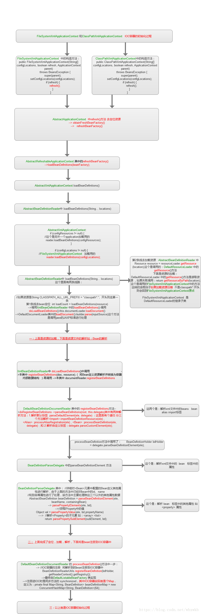

#Spring 源码解析
[TOC]

##Spring IOC容器的加载流程

spring ioc 容器的加载，大体上经过以下几个过程:资源文件定位，解析，注册，实例化


1.**Resource资源文件定位**,这个Resource指的是BeanDefinition的资源定位。这个过程就是容器寻找数据的时候，就像水桶装水需要先找到水一样
2.**BeanDefinition的载入过程**，这个载入过程是把用户定义好的Bean表示成Bean表示成IOC容器内部的数据结构，而这个容器的数据结果就是BeanDefition
3.**向IOC容器注册这些BeanDefinition的过程**，这个过程就是将前面的BeanDefition保存到HashMap中的过程。


###整体流程
  

ioc容器实例化代码

####1.Resource定位
```java
 ClassPathXmlApplicationContext context = new ClassPathXmlApplicationContext("spring-config.xml");
```
进入ClassPathXmlApplicationContext中的构造方法：
```java
public ClassPathXmlApplicationContext(String[] configLocations, boolean refresh, @Nullable ApplicationContext parent) throws BeansException {
        super(parent);
        this.setConfigLocations(configLocations);
        if (refresh) {
            this.refresh();
        }

    }
```
进入**AbstractApplicationContext** 中的refresh()方法 去定位资源->**obtainFreshBeanFactory()**->**refreshBeanFactory()**->该方法实现了配置文件的加载，解析，注册
```java
 protected ConfigurableListableBeanFactory obtainFreshBeanFactory() {
        this.refreshBeanFactory();
        return this.getBeanFactory();
    }
```


进入**AbstractRefreshableApplicationContext**类中的**refreshBeanFactory()**->首先如果有了BeanFactory实例，就先清空。然后通过**createBeanFactory()** 方法，创建一个DefaultListableBeanFactory的实例
```java
 protected final void refreshBeanFactory() throws BeansException {
        if (this.hasBeanFactory()) {
            this.destroyBeans();
            this.closeBeanFactory();
        }

        try {
            DefaultListableBeanFactory beanFactory = this.createBeanFactory();
            beanFactory.setSerializationId(this.getId());
            this.customizeBeanFactory(beanFactory);
            this.loadBeanDefinitions(beanFactory);
            synchronized(this.beanFactoryMonitor) {
                this.beanFactory = beanFactory;
            }
        } catch (IOException var5) {
            throw new ApplicationContextException("I/O error parsing bean definition source for " + this.getDisplayName(), var5);
        }
    }
```

然后设置ID唯一标识
```java
beanFactory.setSerializationId(this.getId());
```
然后允许设置自定义的配置customizeBeanFactory
```java
protected void customizeBeanFactory(DefaultListableBeanFactory beanFactory) {
        if (this.allowBeanDefinitionOverriding != null) {
            beanFactory.setAllowBeanDefinitionOverriding(this.allowBeanDefinitionOverriding);
        }
        if (this.allowCircularReferences != null) {
            beanFactory.setAllowCircularReferences(this.allowCircularReferences);
        }
        beanFactory.setAutowireCandidateResolver(new QualifierAnnotationAutowireCandidateResolver());
    }
```

然后，就是核心的loadBeanDefinitions()方法->**AbstractXmlApplicationContext: loadBeanDefinitions()**
```java
 protected void loadBeanDefinitions(DefaultListableBeanFactory beanFactory) throws BeansException, IOException {
        XmlBeanDefinitionReader beanDefinitionReader = new XmlBeanDefinitionReader(beanFactory);
        beanDefinitionReader.setEnvironment(this.getEnvironment());
        beanDefinitionReader.setResourceLoader(this);
        beanDefinitionReader.setEntityResolver(new ResourceEntityResolver(this));
        this.initBeanDefinitionReader(beanDefinitionReader);
        this.loadBeanDefinitions(beanDefinitionReader);
    }

```
在上面首先会创建一个XmlBeanDefinitionReader的实例，然后进行初始化。->值得注意的是，BeanDefinitionReader是用来解析 配置文件的。因此 ``` this.loadBeanDefinitions(beanDefinitionReader);``` 这行代码，就是Bean定义读取实际发生的地方。这里的工作，主要是XmlBeanDefinitionReader完成的


接下来则重点介绍loadBeanDefinitions过程
由上面的 **this.loadBeanDefinitions(beanDefinitionReader);** ->该方法内实现了获取配置文件的路径

```java
protected void loadBeanDefinitions(XmlBeanDefinitionReader reader) throws BeansException, IOException {
        Resource[] configResources = this.getConfigResources();
        if (configResources != null) {
            reader.loadBeanDefinitions(configResources);
        }

        String[] configLocations = this.getConfigLocations();
        if (configLocations != null) {
            reader.loadBeanDefinitions(configLocations);
        }

    }
```
当获取了配置文件的路径之后，作为参数传入了**AbstractBeanDefinitionReader的loadBeanDefinitions()方法里**

```java
 public int loadBeanDefinitions(String location) throws BeanDefinitionStoreException {
        return this.loadBeanDefinitions(location, (Set)null);
    }
```
该方法又调用了重载方法
```java
public int loadBeanDefinitions(String location, @Nullable Set<Resource> actualResources) throws BeanDefinitionStoreException {
        ResourceLoader resourceLoader = this.getResourceLoader();
        if (resourceLoader == null) {
            throw new BeanDefinitionStoreException("Cannot load bean definitions from location [" + location + "]: no ResourceLoader available");
        } else {
            int count;
            if (resourceLoader instanceof ResourcePatternResolver) {
                try {
                    Resource[] resources = ((ResourcePatternResolver)resourceLoader).getResources(location);
                    count = this.loadBeanDefinitions(resources);
                    if (actualResources != null) {
                        Collections.addAll(actualResources, resources);
                    }

                    if (this.logger.isTraceEnabled()) {
                        this.logger.trace("Loaded " + count + " bean definitions from location pattern [" + location + "]");
                    }

                    return count;
                } catch (IOException var6) {
                    throw new BeanDefinitionStoreException("Could not resolve bean definition resource pattern [" + location + "]", var6);
                }
            } else {
                Resource resource = resourceLoader.getResource(location);
                count = this.loadBeanDefinitions((Resource)resource);
                if (actualResources != null) {
                    actualResources.add(resource);
                }

                if (this.logger.isTraceEnabled()) {
                    this.logger.trace("Loaded " + count + " bean definitions from location [" + location + "]");
                }

                return count;
            }
        }
    }
```
首先**getResourceLoader()**的实现条件是因为**XmlBeanDefinitionReader**在实例化的时候已经确定了创建了实例ResourceLoader实例, 代码位于**AbstractBeanDefinitionReader**->由**XmlBeanDefinitionReader**实例化调用父类初始化方法获得
```java
    protected AbstractBeanDefinitionReader(BeanDefinitionRegistry registry) {
        Assert.notNull(registry, "BeanDefinitionRegistry must not be null");
        this.registry = registry;
        if (this.registry instanceof ResourceLoader) {
            this.resourceLoader = (ResourceLoader)this.registry;
        } else {
            this.resourceLoader = new PathMatchingResourcePatternResolver();
        }

        if (this.registry instanceof EnvironmentCapable) {
            this.environment = ((EnvironmentCapable)this.registry).getEnvironment();
        } else {
            this.environment = new StandardEnvironment();
        }

    }
```

这个方法比较长，**BeanDefinitionReader**不能直接加载配置文件，需要把配置文件封装成Resource，然后才能调用重载方法**loadBeanDefinitions(Resource... resources)**。所以这个方法其实就是2段，第一部分是委托ResourceLoader 将配置文件封装成Resource，第二部分是调用**loadBeanDefinitions(Resource... resources)** 方法，对Resource进行解析。
而这里的ResourceLoader,在上文中因为 **beanDefinitionReader.setResourceLoader(this)**;this指向就是前面的**ClassPathXmlApplicationContext**，**ApplicationContext** 接口，是继承自ResourceLoader接口的，Resource也是一个接口体系，在web环境下，这里就是**ServletContextResource**

####2.BeanDefinition的解析过程
接下来进入重载方法**loadBeanDefinitions(Resource... resources)**

```java
  public int loadBeanDefinitions(Resource... resources) throws BeanDefinitionStoreException {
        Assert.notNull(resources, "Resource array must not be null");
        int count = 0;
        Resource[] var3 = resources;
        int var4 = resources.length;

        for(int var5 = 0; var5 < var4; ++var5) {
            Resource resource = var3[var5];
            count += this.loadBeanDefinitions((Resource)resource);
        }

        return count;
    }
```

这里就是把Resource作为参数，继续用重载方法，
```java
 public int loadBeanDefinitions(Resource resource) throws BeanDefinitionStoreException {
        return this.loadBeanDefinitions(new EncodedResource(resource));
    }
```
继续调用重载方法，对传进来的Resource进行了一次封装，变成了编码后的Resource
```java
 public int loadBeanDefinitions(EncodedResource encodedResource) throws BeanDefinitionStoreException {
        Assert.notNull(encodedResource, "EncodedResource must not be null");
        if (this.logger.isTraceEnabled()) {
            this.logger.trace("Loading XML bean definitions from " + encodedResource);
        }

        Set<EncodedResource> currentResources = (Set)this.resourcesCurrentlyBeingLoaded.get();
        if (currentResources == null) {
            currentResources = new HashSet(4);
            this.resourcesCurrentlyBeingLoaded.set(currentResources);
        }

        if (!((Set)currentResources).add(encodedResource)) {
            throw new BeanDefinitionStoreException("Detected cyclic loading of " + encodedResource + " - check your import definitions!");
        } else {
            int var5;
            try {
                InputStream inputStream = encodedResource.getResource().getInputStream();

                try {
                    InputSource inputSource = new InputSource(inputStream);
                    if (encodedResource.getEncoding() != null) {
                        inputSource.setEncoding(encodedResource.getEncoding());
                    }

                    var5 = this.doLoadBeanDefinitions(inputSource, encodedResource.getResource());
                } finally {
                    inputStream.close();
                }
            } catch (IOException var15) {
                throw new BeanDefinitionStoreException("IOException parsing XML document from " + encodedResource.getResource(), var15);
            } finally {
                ((Set)currentResources).remove(encodedResource);
                if (((Set)currentResources).isEmpty()) {
                    this.resourcesCurrentlyBeingLoaded.remove();
                }

            }

            return var5;
        }
    }

```
该方法时loadBeanDefinitions最后一个重载方法，可以拆分为两部分来看：
第一部分，是处理线程相关的工作，把当前你正在解析的工作，设置为当前Resource

```java
 Assert.notNull(encodedResource, "EncodedResource must not be null");
        if (this.logger.isTraceEnabled()) {
            this.logger.trace("Loading XML bean definitions from " + encodedResource);
        }

        Set<EncodedResource> currentResources = (Set)this.resourcesCurrentlyBeingLoaded.get();
        if (currentResources == null) {
            currentResources = new HashSet(4);
            this.resourcesCurrentlyBeingLoaded.set(currentResources);
        }
```

第二部分，是核心，首先把Resource还原为InputStream，然后调用实际解析的方法doLoadBeanDefinitions()。**可以看到，这种命名方式是值得学习的，一种业务方法，比如parse()，可能需要做一些外围的工作，然后实际解析的方法，可以明明为doParse(),这种doXXX()的命名方法，在很多开源框架中都有应用，比如logback等。**
```java
 try {
                InputStream inputStream = encodedResource.getResource().getInputStream();

                try {
                    InputSource inputSource = new InputSource(inputStream);
                    if (encodedResource.getEncoding() != null) {
                        inputSource.setEncoding(encodedResource.getEncoding());
                    }

                    var5 = this.doLoadBeanDefinitions(inputSource, encodedResource.getResource());
                } finally {
                    inputStream.close();
                }
            } catch (IOException var15) {
                throw new BeanDefinitionStoreException("IOException parsing XML document from " + encodedResource.getResource(), var15);
            } finally {
                ((Set)currentResources).remove(encodedResource);
                if (((Set)currentResources).isEmpty()) {
                    this.resourcesCurrentlyBeingLoaded.remove();
                }

            }
```
进入doLoadBeanDefinitions()方法
```java
protected int doLoadBeanDefinitions(InputSource inputSource, Resource resource) throws BeanDefinitionStoreException {
        try {
            Document doc = this.doLoadDocument(inputSource, resource);
            int count = this.registerBeanDefinitions(doc, resource);
            if (this.logger.isDebugEnabled()) {
                this.logger.debug("Loaded " + count + " bean definitions from " + resource);
            }

            return count;
        } catch (BeanDefinitionStoreException var5) {
            throw var5;
        } catch (SAXParseException var6) {
            throw new XmlBeanDefinitionStoreException(resource.getDescription(), "Line " + var6.getLineNumber() + " in XML document from " + resource + " is invalid", var6);
        } catch (SAXException var7) {
            throw new XmlBeanDefinitionStoreException(resource.getDescription(), "XML document from " + resource + " is invalid", var7);
        } catch (ParserConfigurationException var8) {
            throw new BeanDefinitionStoreException(resource.getDescription(), "Parser configuration exception parsing XML from " + resource, var8);
        } catch (IOException var9) {
            throw new BeanDefinitionStoreException(resource.getDescription(), "IOException parsing XML document from " + resource, var9);
        } catch (Throwable var10) {
            throw new BeanDefinitionStoreException(resource.getDescription(), "Unexpected exception parsing XML document from " + resource, var10);
        }
    }

```
抛弃异常处理：核心代码如下：
```java
 Document doc = this.doLoadDocument(inputSource, resource);
 int count = this.registerBeanDefinitions(doc, resource);
```
doLoadDocument方法将InputStream读取成标准的Document对象，然后调用registerBeanDefinitions(),进行解析工作。

```java
 protected Document doLoadDocument(InputSource inputSource, Resource resource) throws Exception {
        return this.documentLoader.loadDocument(inputSource, this.getEntityResolver(), this.errorHandler, this.getValidationModeForResource(resource), this.isNamespaceAware());
    }
```

然后看一下registerBeanDefinitions
```java
public int registerBeanDefinitions(Document doc, Resource resource) throws BeanDefinitionStoreException {
    //创建的其实是DefaultBeanDefinitionDocumentReader 的实例，利用反射创建的。
        BeanDefinitionDocumentReader documentReader = this.createBeanDefinitionDocumentReader();
        int countBefore = this.getRegistry().getBeanDefinitionCount();
        documentReader.registerBeanDefinitions(doc, this.createReaderContext(resource));
        return this.getRegistry().getBeanDefinitionCount() - countBefore;
    }
```


>注意
1.Document对象，是W3C定义的标准XML对象，与Spring无关，
2。ducumentReader创建时使用反射创建的，代码如下：
```java
protected BeanDefinitionDocumentReader    
 createBeanDefinitionDocumentReader() {   
          return BeanDefinitionDocumentReader.class.cast(BeanUtils.
            instantiateClass(this.documentReaderClass));
}
```
追溯源码时发现documentReaderClass
```java
private Class<? extends BeanDefinitionDocumentReader> documentReaderClass = DefaultBeanDefinitionDocumentReader.class;
```
所以创建的是**documentReaderClass**是**DefaultBeanDefinitionDocumentReader**类的实例。 接下来就进入**DefaultBeanDefinitionDocumentReader** 中定义的registerBeanDefinitions()方法看看
```java
public void registerBeanDefinitions(Document doc, XmlReaderContext readerContext) {
        this.readerContext = readerContext;
        this.doRegisterBeanDefinitions(doc.getDocumentElement());
    }
```
进入doRegisterBeanDefinitions()方法，
```java
   protected void doRegisterBeanDefinitions(Element root) {
        BeanDefinitionParserDelegate parent = this.delegate;
        this.delegate = this.createDelegate(this.getReaderContext(), root, parent);
        if (this.delegate.isDefaultNamespace(root)) {
            String profileSpec = root.getAttribute("profile");
            if (StringUtils.hasText(profileSpec)) {
                String[] specifiedProfiles = StringUtils.tokenizeToStringArray(profileSpec, ",; ");
                if (!this.getReaderContext().getEnvironment().acceptsProfiles(specifiedProfiles)) {
                    if (this.logger.isDebugEnabled()) {
                        this.logger.debug("Skipped XML bean definition file due to specified profiles [" + profileSpec + "] not matching: " + this.getReaderContext().getResource());
                    }

                    return;
                }
            }
        }

        this.preProcessXml(root);
        this.parseBeanDefinitions(root, this.delegate);
        this.postProcessXml(root);
        this.delegate = parent;
    }

```
将上述方法拆开来看，
```java
String profileSpec = root.getAttribute("profile");
            if (StringUtils.hasText(profileSpec)) {
                String[] specifiedProfiles = StringUtils.tokenizeToStringArray(profileSpec, ",; ");
                if (!this.getReaderContext().getEnvironment().acceptsProfiles(specifiedProfiles)) {
                    if (this.logger.isDebugEnabled()) {
                        this.logger.debug("Skipped XML bean definition file due to specified profiles [" + profileSpec + "] not matching: " + this.getReaderContext().getResource());
                    }

                    return;
                }
```
如何配置文件中由元素，配有profile属性，就会进入这一段，不过一般不会

然后进入第二段代码
```java
 this.preProcessXml(root);
 this.parseBeanDefinitions(root, this.delegate);
 this.postProcessXml(root);
 this.delegate = parent;
```

在这里创建了**BeanDefinitionParserDelegate**对象，preProcessXml以及postProcessXml都是空方法，这里又把**BeanDefinition**解析和注册的工作，委托给了**BeanDefinitionParserDelegate**，在**parseBeanDefinitions()** 方法中完成总的
解析

解析工作的委托如下：
**ClassPathXmlApplicationContext**->**XmlBeanDefinitionReader**->**DefaultBeanDefinitionDocumentReader**->**BeanDefinitionParserDelegate**.
**ClassPathXmlApplicationContext** 作为最外围的组件，发起解析的请求 **XmlBeanDefinitionReader** 将配置文件路径封装为Resource，读取出w3c定义的Document对象，然后委托给**DefaultBeanDefinitionDocumentReader**  **DefaultBeanDefinitionDocumentReader** 就开始做实际的解析工作了，但是涉及到bean的具体解析，它还是会继续委托给BeanDefinitionParserDelegate来做。 接下来在parseBeanDefinitions()方法中发生了什么，以及BeanDefinitionParserDelegate类完成的工作，在下面继续介绍。


####3.BeanDefinitions的注册
> BeanDefinition的解析，已经走到了DefaultBeanDefinitionDocumentReader里，这时候配置文件已经被加载，并解析成w3d的Document对象。接下来将继续介绍，**DefaultBeanDefinitionDocumentReader**和**BeanDefinitionParserDelegate**类，是怎么协同完成bean的解析和注册的


进入this.parseBeanDefinitions(root, this.delegate)方法，从该方法开始，BeanDefinitionParserDelegate开始发挥作用，
```java
protected void parseBeanDefinitions(Element root, BeanDefinitionParserDelegate delegate) {
        if (delegate.isDefaultNamespace(root)) {
            NodeList nl = root.getChildNodes();

            for(int i = 0; i < nl.getLength(); ++i) {
                Node node = nl.item(i);
                if (node instanceof Element) {
                    Element ele = (Element)node;
                    if (delegate.isDefaultNamespace(ele)) {
                        this.parseDefaultElement(ele, delegate);
                    } else {
                        delegate.parseCustomElement(ele);
                    }
                }
            }
        } else {
            delegate.parseCustomElement(root);
        }

}

```
首先判断是否属于默认的命名空间，
```java
public boolean isDefaultNamespace(@Nullable String namespaceUri) {
        return !StringUtils.hasLength(namespaceUri) || "http://www.springframework.org/schema/beans".equals(namespaceUri);
}

public boolean isDefaultNamespace(Node node) {
        return this.isDefaultNamespace(this.getNamespaceURI(node));
}
```

如果是的话，就调用parseDefaultElement()，否则调用delegate上的parseCustomElement()方法.

从上文可以看到，只有**http://www.springframework.org/schema/beans** 会被认为是默认的命名空间，也就是说，beans、bean这些元素，会认为属于默认的命名空间，而像task:scheduled这些，就认为不属于默认命名空间。 根节点beans的一个子节点bean，是属于默认命名空间的，所以会进入parseDefaultElement()方法。

```java
private void parseDefaultElement(Element ele, BeanDefinitionParserDelegate delegate) {
        if (delegate.nodeNameEquals(ele, "import")) {
            this.importBeanDefinitionResource(ele);
        } else if (delegate.nodeNameEquals(ele, "alias")) {
            this.processAliasRegistration(ele);
        } else if (delegate.nodeNameEquals(ele, "bean")) {
            this.processBeanDefinition(ele, delegate);
        } else if (delegate.nodeNameEquals(ele, "beans")) {
            this.doRegisterBeanDefinitions(ele);
        }

}
```

这里可能有4种情况：import，ablias,bean,beans,分别有一个方法与之对应，这里解析的是bean元素，所以会进入processBeanDefinition()方法

```java
protected void processBeanDefinition(Element ele, BeanDefinitionParserDelegate delegate) {
        BeanDefinitionHolder bdHolder = delegate.parseBeanDefinitionElement(ele);
        if (bdHolder != null) {
            bdHolder = delegate.decorateBeanDefinitionIfRequired(ele, bdHolder);

            try {
                BeanDefinitionReaderUtils.registerBeanDefinition(bdHolder, this.getReaderContext().getRegistry());
            } catch (BeanDefinitionStoreException var5) {
                this.getReaderContext().error("Failed to register bean definition with name '" + bdHolder.getBeanName() + "'", ele, var5);
            }

            this.getReaderContext().fireComponentRegistered(new BeanComponentDefinition(bdHolder));
        }

}
```
这里主要有3个步骤，先是委托delegate对bean进行解析，然后委托delegate对bean进行装饰，最后由一个工具类来完成BeanDefinition的注册可以看出来，DefaultBeanDefinitionDocumentReader不负责任何具体的bean解析，它面向的是xmlDocument对象。根据其元素的命名空间和名称，起一个类似路由的作用。所以这个类的命名，是比较贴切的，突出了其面向Document的特性。具体的工作，是由BeanDefinitionParserDelegate来完成的。

下面看下parseBeanDefinitionElement()方法
```java
 @Nullable
public BeanDefinitionHolder parseBeanDefinitionElement(Element ele) {
        return this.parseBeanDefinitionElement(ele, (BeanDefinition)null);
}

@Nullable
public BeanDefinitionHolder parseBeanDefinitionElement(Element ele, @Nullable BeanDefinition containingBean) {
        String id = ele.getAttribute("id");
        String nameAttr = ele.getAttribute("name");
        List<String> aliases = new ArrayList();
        if (StringUtils.hasLength(nameAttr)) {
            String[] nameArr = StringUtils.tokenizeToStringArray(nameAttr, ",; ");
            aliases.addAll(Arrays.asList(nameArr));
        }

        String beanName = id;
        if (!StringUtils.hasText(id) && !aliases.isEmpty()) {
            beanName = (String)aliases.remove(0);
            if (this.logger.isTraceEnabled()) {
                this.logger.trace("No XML 'id' specified - using '" + beanName + "' as bean name and " + aliases + " as aliases");
            }
        }

        if (containingBean == null) {
            this.checkNameUniqueness(beanName, aliases, ele);
        }

        AbstractBeanDefinition beanDefinition = this.parseBeanDefinitionElement(ele, beanName, containingBean);
        if (beanDefinition != null) {
            if (!StringUtils.hasText(beanName)) {
                try {
                    if (containingBean != null) {
                        beanName = BeanDefinitionReaderUtils.generateBeanName(beanDefinition, this.readerContext.getRegistry(), true);
                    } else {
                        beanName = this.readerContext.generateBeanName(beanDefinition);
                        String beanClassName = beanDefinition.getBeanClassName();
                        if (beanClassName != null && beanName.startsWith(beanClassName) && beanName.length() > beanClassName.length() && !this.readerContext.getRegistry().isBeanNameInUse(beanClassName)) {
                            aliases.add(beanClassName);
                        }
                    }

                    if (this.logger.isTraceEnabled()) {
                        this.logger.trace("Neither XML 'id' nor 'name' specified - using generated bean name [" + beanName + "]");
                    }
                } catch (Exception var9) {
                    this.error(var9.getMessage(), ele);
                    return null;
                }
            }

            String[] aliasesArray = StringUtils.toStringArray(aliases);
            return new BeanDefinitionHolder(beanDefinition, beanName, aliasesArray);
        } else {
            return null;
        }
}
```
将该方法拆分来看
第一段主要处理跟alias，id等标识相关的东西
```java
        String id = ele.getAttribute("id");
        String nameAttr = ele.getAttribute("name");
        List<String> aliases = new ArrayList();
        if (StringUtils.hasLength(nameAttr)) {
            String[] nameArr = StringUtils.tokenizeToStringArray(nameAttr, ",; ");
            aliases.addAll(Arrays.asList(nameArr));
        }

        String beanName = id;
        if (!StringUtils.hasText(id) && !aliases.isEmpty()) {
            beanName = (String)aliases.remove(0);
            if (this.logger.isTraceEnabled()) {
                this.logger.trace("No XML 'id' specified - using '" + beanName + "' as bean name and " + aliases + " as aliases");
            }
        }

        if (containingBean == null) {
            this.checkNameUniqueness(beanName, aliases, ele);
        }
```

接下来进行实际的解析，**重点**
```java
AbstractBeanDefinition beanDefinition = parseBeanDefinitionElement(ele, beanName, containingBean);
```

接下来的是后置处理，对beanName进行处理。
```java
 if (beanDefinition != null) {
            if (!StringUtils.hasText(beanName)) {
                try {
                    if (containingBean != null) {
                        beanName = BeanDefinitionReaderUtils.generateBeanName(beanDefinition, this.readerContext.getRegistry(), true);
                    } else {
                        beanName = this.readerContext.generateBeanName(beanDefinition);
                        String beanClassName = beanDefinition.getBeanClassName();
                        if (beanClassName != null && beanName.startsWith(beanClassName) && beanName.length() > beanClassName.length() && !this.readerContext.getRegistry().isBeanNameInUse(beanClassName)) {
                            aliases.add(beanClassName);
                        }
                    }

                    if (this.logger.isTraceEnabled()) {
                        this.logger.trace("Neither XML 'id' nor 'name' specified - using generated bean name [" + beanName + "]");
                    }
                } catch (Exception var9) {
                    this.error(var9.getMessage(), ele);
                    return null;
                }
            }

            String[] aliasesArray = StringUtils.toStringArray(aliases);
            return new BeanDefinitionHolder(beanDefinition, beanName, aliasesArray);
        } else {
            return null;
        }
```


重点分析上面的核心代码==AbstractBeanDefinition beanDefinition = parseBeanDefinitionElement(ele, beanName, containingBean);==

```java
public AbstractBeanDefinition parseBeanDefinitionElement(
            Element ele, String beanName, BeanDefinition containingBean) {
        this.parseState.push(new BeanEntry(beanName));
        String className = null;
        if (ele.hasAttribute(CLASS_ATTRIBUTE)) {
            className = ele.getAttribute(CLASS_ATTRIBUTE).trim();
        }
        try {
            String parent = null;
            if (ele.hasAttribute(PARENT_ATTRIBUTE)) {
                parent = ele.getAttribute(PARENT_ATTRIBUTE);
            }
            AbstractBeanDefinition bd = createBeanDefinition(className, parent);
            parseBeanDefinitionAttributes(ele, beanName, containingBean, bd);
            bd.setDescription(DomUtils.getChildElementValueByTagName(ele, DESCRIPTION_ELEMENT));
            parseMetaElements(ele, bd);
            parseLookupOverrideSubElements(ele, bd.getMethodOverrides());
            parseReplacedMethodSubElements(ele,   bd.getMethodOverrides());
            parseConstructorArgElements(ele, bd);
            parsePropertyElements(ele, bd);
            parseQualifierElements(ele, bd);
            bd.setResource(this.readerContext.getResource());
            bd.setSource(extractSource(ele));
            return bd;
        }
        catch (ClassNotFoundException ex) {
            error("Bean class [" + className + "] not found", ele, ex);
        }
        catch (NoClassDefFoundError err) {
            error("Class that bean class [" + className + "] depends on not found", ele, err);
        }
        catch (Throwable ex) {
            error("Unexpected failure during bean definition parsing", ele, ex);
        }
        finally {
            this.parseState.pop();
        }
        return null;
}
```
继续将上述代码拆分，
第一段是从配置中抽取出类名。接下来长长一段，把异常处理先抛开，看看具体的业务
```java
        this.parseState.push(new BeanEntry(beanName));
        String className = null;
        if (ele.hasAttribute(CLASS_ATTRIBUTE)) {
            className = ele.getAttribute(CLASS_ATTRIBUTE).trim();
        }
```

第二段中每个方法，都说明了要干什么,可以一个个跟进去看，经过这里的解析，得到了一个完整的BeanDefinitionHolder。
```java
            AbstractBeanDefinition bd = this.createBeanDefinition(className, parent);
            this.parseBeanDefinitionAttributes(ele, beanName, containingBean, bd);
            bd.setDescription(DomUtils.getChildElementValueByTagName(ele, "description"));
            this.parseMetaElements(ele, bd);
            this.parseLookupOverrideSubElements(ele, bd.getMethodOverrides());
            this.parseReplacedMethodSubElements(ele, bd.getMethodOverrides());
            this.parseConstructorArgElements(ele, bd);
            this.parsePropertyElements(ele, bd);
            this.parseQualifierElements(ele, bd);
            bd.setResource(this.readerContext.getResource());
            bd.setSource(this.extractSource(ele));
            AbstractBeanDefinition var7 = bd;
            return var7;
```

接下来是对本文485行的==bdHolder = delegate.decorateBeanDefinitionIfRequired(ele, bdHolder);==分析，这里只是对之前生成的bdHolder进行一些必要的装饰

```java
    public BeanDefinitionHolder decorateBeanDefinitionIfRequired(Element ele, BeanDefinitionHolder definitionHolder) {
        return this.decorateBeanDefinitionIfRequired(ele, definitionHolder, (BeanDefinition)null);
    }

    public BeanDefinitionHolder decorateBeanDefinitionIfRequired(Element ele, BeanDefinitionHolder definitionHolder, @Nullable BeanDefinition containingBd) {
        BeanDefinitionHolder finalDefinition = definitionHolder;
        NamedNodeMap attributes = ele.getAttributes();

        for(int i = 0; i < attributes.getLength(); ++i) {
            Node node = attributes.item(i);
            finalDefinition = this.decorateIfRequired(node, finalDefinition, containingBd);
        }

        NodeList children = ele.getChildNodes();

        for(int i = 0; i < children.getLength(); ++i) {
            Node node = children.item(i);
            if (node.getNodeType() == 1) {
                finalDefinition = this.decorateIfRequired(node, finalDefinition, containingBd);
            }
        }

        return finalDefinition;
    }
```

然后代码继续运行到DefaultBeanDefinitionDocumentReader中的==processBeanDefinition中的registerBeanDefinition()==
```java

public static void registerBeanDefinition(BeanDefinitionHolder definitionHolder, BeanDefinitionRegistry registry) throws BeanDefinitionStoreException {
        String beanName = definitionHolder.getBeanName();
        // 其实调用的是DefaultListableBeanFactory中的registerBeanDefinition方法
        registry.registerBeanDefinition(beanName, definitionHolder.getBeanDefinition());
        String[] aliases = definitionHolder.getAliases();
        if (aliases != null) {
            String[] var4 = aliases;
            int var5 = aliases.length;

            for(int var6 = 0; var6 < var5; ++var6) {
                String alias = var4[var6];
                registry.registerAlias(beanName, alias);
            }
        }

}
```
上面代码的**其实调用的是DefaultListableBeanFactory中的registerBeanDefinition方法这句话**，
因为在最开始时
**XmlBeanDefinitionReader beanDefinitionReader = new XmlBeanDefinitionReader(beanFactory);**
这里的beanFactory指向DefaultListableBeanFactory，然后导致beanDefinitionReader调用父类的初始化后，this.registry = registry;这里的registry指向DefaultListableBeanFactory.
进入DefaultListableBeanFactory中的registerBeanDefinition()实例方法的具体实现：
```java
public void registerBeanDefinition(String beanName, BeanDefinition beanDefinition) throws BeanDefinitionStoreException {
        Assert.hasText(beanName, "Bean name must not be empty");
        Assert.notNull(beanDefinition, "BeanDefinition must not be null");
        if (beanDefinition instanceof AbstractBeanDefinition) {
            try {
                ((AbstractBeanDefinition)beanDefinition).validate();
            } catch (BeanDefinitionValidationException var8) {
                throw new BeanDefinitionStoreException(beanDefinition.getResourceDescription(), beanName, "Validation of bean definition failed", var8);
            }
        }

        BeanDefinition existingDefinition = (BeanDefinition)this.beanDefinitionMap.get(beanName);
        if (existingDefinition != null) {
            if (!this.isAllowBeanDefinitionOverriding()) {
                throw new BeanDefinitionOverrideException(beanName, beanDefinition, existingDefinition);
            }

            if (existingDefinition.getRole() < beanDefinition.getRole()) {
                if (this.logger.isInfoEnabled()) {
                    this.logger.info("Overriding user-defined bean definition for bean '" + beanName + "' with a framework-generated bean definition: replacing [" + existingDefinition + "] with [" + beanDefinition + "]");
                }
            } else if (!beanDefinition.equals(existingDefinition)) {
                if (this.logger.isDebugEnabled()) {
                    this.logger.debug("Overriding bean definition for bean '" + beanName + "' with a different definition: replacing [" + existingDefinition + "] with [" + beanDefinition + "]");
                }
            } else if (this.logger.isTraceEnabled()) {
                this.logger.trace("Overriding bean definition for bean '" + beanName + "' with an equivalent definition: replacing [" + existingDefinition + "] with [" + beanDefinition + "]");
            }

            this.beanDefinitionMap.put(beanName, beanDefinition);
        } else {
            if (this.hasBeanCreationStarted()) {
                synchronized(this.beanDefinitionMap) {
                    this.beanDefinitionMap.put(beanName, beanDefinition);
                    List<String> updatedDefinitions = new ArrayList(this.beanDefinitionNames.size() + 1);
                    updatedDefinitions.addAll(this.beanDefinitionNames);
                    updatedDefinitions.add(beanName);
                    this.beanDefinitionNames = updatedDefinitions;
                    this.removeManualSingletonName(beanName);
                }
            } else {
                this.beanDefinitionMap.put(beanName, beanDefinition);
                this.beanDefinitionNames.add(beanName);
                this.removeManualSingletonName(beanName);
            }

            this.frozenBeanDefinitionNames = null;
        }

        if (existingDefinition != null || this.containsSingleton(beanName)) {
            this.resetBeanDefinition(beanName);
        }

    }
```

代码追溯之后发现这个方法里，最关键的是以下2行
```java
this.beanDefinitionMap.put(beanName, beanDefinition);
this.beanDefinitionNames.add(beanName);
```

前者是将BeanDefinition放到map中，后者把beanname放到队列里，到此注册就完成了。到后面实例化的时候，就是把beanDefinitionMap中的BeanDefinition取出来，逐一实例化BeanFactory准备完毕之后，代码又回到了ClassPathXmlApplicationContext里
```java
 public void refresh() throws BeansException, IllegalStateException {
        synchronized(this.startupShutdownMonitor) {
            this.prepareRefresh();
            ConfigurableListableBeanFactory beanFactory = this.obtainFreshBeanFactory();
            this.prepareBeanFactory(beanFactory);

            try {
                this.postProcessBeanFactory(beanFactory);
                this.invokeBeanFactoryPostProcessors(beanFactory);
                this.registerBeanPostProcessors(beanFactory);
                this.initMessageSource();
                this.initApplicationEventMulticaster();
                this.onRefresh();
                this.registerListeners();
                this.finishBeanFactoryInitialization(beanFactory);
                this.finishRefresh();
            } catch (BeansException var9) {
                if (this.logger.isWarnEnabled()) {
                    this.logger.warn("Exception encountered during context initialization - cancelling refresh attempt: " + var9);
                }

                this.destroyBeans();
                this.cancelRefresh(var9);
                throw var9;
            } finally {
                this.resetCommonCaches();
            }

        }
    }
```

也就是obtainFreshBeanFactory()方法执行之后，再进行下面的步骤。总结来说，ApplicationContext将解析配置文件的工作委托给BeanDefinitionReader,然后BeanDefinitionReader将配置文件读取为xml的Document文档之后，又委托给BeanDefinitionDocumentReader,这个组件时根据xml元素的命名空间和元素名，起到一个路由的作用，实际的解析工作，是委托给BeanDefinitionParserDelegate来完成的。

BeanDefinitionParserDelegate的解析工作完成以后，会返回BeanDefinitionHolder给BeanDefinitionDocumentReader，在这里，会委托给DefaultListableBeanFactory完成bean的注册 XmlBeanDefinitionReader（计数、解析XML文档），BeanDefinitionDocumentReader（依赖xml文档，进行解析和注册），BeanDefinitionParserDelegate（实际的解析工作）。

可以看出，在解析bean的过程中，这3个组件的分工是比较清晰的，各司其职，这种设计思想值得学习 到此为止，bean的解析、注册、spring ioc 容器的实例化过程就基本分析结束了。