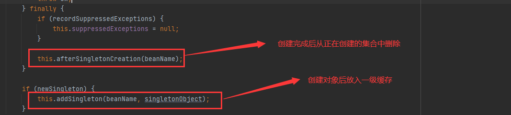

[TOC]
# Spring 实例化Bean


Spring 什么时候实例化Bean，首先要分为两种情况：
第一：如果使用BeanFactory作为Spring Bean的工厂类，则所有的bean都是在第一次使用该Bean的时候实例化
第二：如果你使用ApplicationContext作为Spring Bean的工厂类，则又分为以下几种情况：
(1)：如果bean的scope是singleton的，并且lazy-init为false(默认为false,所以可以不用设置)，则ApplicationContext启动的时候就实例化该Bean，并且将实例化的Bean放在一个map结构的缓存中，下次再使用该Bean的时候，直接从这个缓存中取
(2)：如果bean的scope是singleton的，并且lazy-init为true，则该Bean的实例化是在第一次使用该Bean的时候进行实例化
(3):如果bean的scope是prototype的，则该Bean的实例化是在第一次使用该Bean的时候进行实例化

* org.springframework.context.support.AbstractApplicationContext#refresh**(入口)**
* org.springframework.context.support.AbstractApplicationContext#finishBeanFactoryInitialization **(初始化单例对象入口)** 
* org.springframework.beans.factory.support.DefaultListableBeanFactory #preInstantiateSingletons **(初始化单例对象入口)** 
* org.springframework.beans.factory.support.AbstractBeanFactory#getBean(java.lang.String)**（万恶之源，获取并创建Bean的入口）**
* org.springframework.beans.factory.support.AbstractBeanFactory#doGetBean **（实际的获取并创建Bean的实现）**
* org.springframework.beans.factory.support.DefaultSingletonBeanRegistry#getSingleton(java.lang.String) **（从缓存中尝试获取）**
* org.springframework.beans.factory.support.AbstractAutowireCapableBeanFactory#createBean(java.lang.String, org.springframework.beans.factory.support.RootBeanDefinition, java.lang.Object[]) **（实例化Bean）**
* org.springframework.beans.factory.support.AbstractAutowireCapableBeanFactory#doCreateBean **（实例化Bean具体实现）**
* org.springframework.beans.factory.support.AbstractAutowireCapableBeanFactory#createBeanInstance **（具体实例化过程）**
* org.springframework.beans.factory.support.DefaultSingletonBeanRegistry#addSingletonFactory **（将实例化后的Bean添加到三级缓存）**
* org.springframework.beans.factory.support.AbstractAutowireCapableBeanFactory#populateBean **（实例化后属性注入）**
* org.springframework.beans.factory.support.AbstractAutowireCapableBeanFactory#initializeBean(java.lang.String, java.lang.Object, org.springframework.beans.factory.support.RootBeanDefinition) **（初始化入口）**

## 实例化流程
### 1.在AbstractApplicationContext中refresh()方法中
  

### 2.预实例化所有的非懒加载的单例bean
  

### 3.初始化单例所有的单例bean

```java
 public void preInstantiateSingletons() throws BeansException {
        if (this.logger.isTraceEnabled()) {
            this.logger.trace("Pre-instantiating singletons in " + this);
        }

        List<String> beanNames = new ArrayList(this.beanDefinitionNames);
        Iterator var2 = beanNames.iterator();

        while(true) {
            String beanName;
            Object bean;
            do {
                while(true) {
                    RootBeanDefinition bd;
                    do {
                        do {
                            do {
                                if (!var2.hasNext()) {
                                    var2 = beanNames.iterator();

                                    while(var2.hasNext()) {
                                        beanName = (String)var2.next();
                                        Object singletonInstance = this.getSingleton(beanName);
                                        if (singletonInstance instanceof SmartInitializingSingleton) {
                                            SmartInitializingSingleton smartSingleton = (SmartInitializingSingleton)singletonInstance;
                                            if (System.getSecurityManager() != null) {
                                                AccessController.doPrivileged(() -> {
                                                    smartSingleton.afterSingletonsInstantiated();
                                                    return null;
                                                }, this.getAccessControlContext());
                                            } else {
                                                smartSingleton.afterSingletonsInstantiated();
                                            }
                                        }
                                    }

                                    return;
                                }

                                beanName = (String)var2.next();
                                bd = this.getMergedLocalBeanDefinition(beanName);
                            } while(bd.isAbstract());
                        } while(!bd.isSingleton());
                    } while(bd.isLazyInit());

                    if (this.isFactoryBean(beanName)) {
                        bean = this.getBean("&" + beanName);
                        break;
                    }

                    this.getBean(beanName);
                }
            } while(!(bean instanceof FactoryBean));

            FactoryBean<?> factory = (FactoryBean)bean;
            boolean isEagerInit;
            if (System.getSecurityManager() != null && factory instanceof SmartFactoryBean) {
                SmartFactoryBean var10000 = (SmartFactoryBean)factory;
                ((SmartFactoryBean)factory).getClass();
                isEagerInit = (Boolean)AccessController.doPrivileged(var10000::isEagerInit, this.getAccessControlContext());
            } else {
                isEagerInit = factory instanceof SmartFactoryBean && ((SmartFactoryBean)factory).isEagerInit();
            }

            if (isEagerInit) {
                this.getBean(beanName);
            }
        }
    }
```

  

### 4.getBean,获取并创建Bean的入口
getBean有很多重载方法
  

### 5.实际的获取并创建Bean的实现
具体分析doGetBean方法：

```java
protected <T> T doGetBean(String name, @Nullable Class<T> requiredType, @Nullable Object[] args, boolean typeCheckOnly) throws BeansException {
        String beanName = this.transformedBeanName(name);
        Object sharedInstance = this.getSingleton(beanName);
        Object bean;
        // Eagerly check singleton cache for manually registered singletons.
        // 创建bean之前，检查单例缓存中是否存在手工注册的bean对象
        if (sharedInstance != null && args == null) {
            if (this.logger.isTraceEnabled()) {
                if (this.isSingletonCurrentlyInCreation(beanName)) {
                    this.logger.trace("Returning eagerly cached instance of singleton bean '" + beanName + "' that is not fully initialized yet - a consequence of a circular reference");
                } else {
                    this.logger.trace("Returning cached instance of singleton bean '" + beanName + "'");
                }
            }
            // 如果缓存中存在，判断是否是FactoryBean类型
            bean = this.getObjectForBeanInstance(sharedInstance, name, beanName, (RootBeanDefinition)null);
        } else {  // 缓存中不存在
            if (this.isPrototypeCurrentlyInCreation(beanName)) {
                throw new BeanCurrentlyInCreationException(beanName);
            }

            BeanFactory parentBeanFactory = this.getParentBeanFactory();
            if (parentBeanFactory != null && !this.containsBeanDefinition(beanName)) {
                String nameToLookup = this.originalBeanName(name);
                if (parentBeanFactory instanceof AbstractBeanFactory) {
                    return ((AbstractBeanFactory)parentBeanFactory).doGetBean(nameToLookup, requiredType, args, typeCheckOnly);
                }

                if (args != null) {
                    return parentBeanFactory.getBean(nameToLookup, args);
                }

                if (requiredType != null) {
                    return parentBeanFactory.getBean(nameToLookup, requiredType);
                }

                return parentBeanFactory.getBean(nameToLookup);
            }

            if (!typeCheckOnly) {
                this.markBeanAsCreated(beanName);
            }

            try {
                RootBeanDefinition mbd = this.getMergedLocalBeanDefinition(beanName);
                this.checkMergedBeanDefinition(mbd, beanName, args);

                 // 保证在当前bean初始化之前让dependson的bean先实例化
                String[] dependsOn = mbd.getDependsOn();
                String[] var11;
                if (dependsOn != null) {
                    var11 = dependsOn;
                    int var12 = dependsOn.length;

                    for(int var13 = 0; var13 < var12; ++var13) {
                        String dep = var11[var13];
                        if (this.isDependent(beanName, dep)) {
                            throw new BeanCreationException(mbd.getResourceDescription(), beanName, "Circular depends-on relationship between '" + beanName + "' and '" + dep + "'");
                        }

                        this.registerDependentBean(dep, beanName);

                        try {
                            this.getBean(dep);
                        } catch (NoSuchBeanDefinitionException var24) {
                            throw new BeanCreationException(mbd.getResourceDescription(), beanName, "'" + beanName + "' depends on missing bean '" + dep + "'", var24);
                        }
                    }
                }
                 // 如果是单例，则创建单例bean
                if (mbd.isSingleton()) {
                    sharedInstance = this.getSingleton(beanName, () -> {
                        try {
                            return this.createBean(beanName, mbd, args);
                        } catch (BeansException var5) {
                            this.destroySingleton(beanName);
                            throw var5;
                        }
                    });
                    bean = this.getObjectForBeanInstance(sharedInstance, name, beanName, mbd);
                    // 如果bean的原型模式，非单例，那么就不会缓存对象
                } else if (mbd.isPrototype()) {
                    var11 = null;

                    Object prototypeInstance;
                    try {
                          // 创建bean对象前，将正在创建的beanName缓存，阻断循环依赖
                        this.beforePrototypeCreation(beanName);
                         // 创建bean对象，和单例时流程一样，只是不缓存
                        prototypeInstance = this.createBean(beanName, mbd, args);
                    } finally {
                         // 从当前正在创建的容器中删除
                        this.afterPrototypeCreation(beanName);
                    }

                    bean = this.getObjectForBeanInstance(prototypeInstance, name, beanName, mbd);
                } else {
                    String scopeName = mbd.getScope();
                    Scope scope = (Scope)this.scopes.get(scopeName);
                    if (scope == null) {
                        throw new IllegalStateException("No Scope registered for scope name '" + scopeName + "'");
                    }

                    try {
                        Object scopedInstance = scope.get(beanName, () -> {
                            this.beforePrototypeCreation(beanName);

                            Object var4;
                            try {
                                var4 = this.createBean(beanName, mbd, args);
                            } finally {
                                this.afterPrototypeCreation(beanName);
                            }

                            return var4;
                        });
                        bean = this.getObjectForBeanInstance(scopedInstance, name, beanName, mbd);
                    } catch (IllegalStateException var23) {
                        throw new BeanCreationException(beanName, "Scope '" + scopeName + "' is not active for the current thread; consider defining a scoped proxy for this bean if you intend to refer to it from a singleton", var23);
                    }
                }
            } catch (BeansException var26) {
                this.cleanupAfterBeanCreationFailure(beanName);
                throw var26;
            }
        }

        if (requiredType != null && !requiredType.isInstance(bean)) {
            try {
                T convertedBean = this.getTypeConverter().convertIfNecessary(bean, requiredType);
                if (convertedBean == null) {
                    throw new BeanNotOfRequiredTypeException(name, requiredType, bean.getClass());
                } else {
                    return convertedBean;
                }
            } catch (TypeMismatchException var25) {
                if (this.logger.isTraceEnabled()) {
                    this.logger.trace("Failed to convert bean '" + name + "' to required type '" + ClassUtils.getQualifiedName(requiredType) + "'", var25);
                }

                throw new BeanNotOfRequiredTypeException(name, requiredType, bean.getClass());
            }
        } else {
            return bean;
        }
    }
```

首先根据beanName到缓存中取找
  
### 6.从缓存中尝试获取

三级缓存：
singletonObjects(一级，日常实际获取Bean的地方)；
earlySingletonObjects(二级，已实例化，但还没进行属性注入，由三级缓存放进来)
singletonFactories(三级，Value是一个对象工厂)

  


  


getSingleton方法：
  

创建后放入一级缓存中，然后把bean对象返回
  

接下来查看具体如何创建bean
### 8.实例化Bean
  

createBean方法中：
  

### 9.实例化Bean具体实现 doCreateBean

```java
 protected Object doCreateBean(String beanName, RootBeanDefinition mbd, @Nullable Object[] args) throws BeanCreationException {
         // Instantiate the bean.
        BeanWrapper instanceWrapper = null;
        if (mbd.isSingleton()) {
            instanceWrapper = (BeanWrapper)this.factoryBeanInstanceCache.remove(beanName);
        }
        // 创建bean实例，在内存堆中创建一个对象
        if (instanceWrapper == null) {
            instanceWrapper = this.createBeanInstance(beanName, mbd, args);
        }

        Object bean = instanceWrapper.getWrappedInstance();
        Class<?> beanType = instanceWrapper.getWrappedClass();
        if (beanType != NullBean.class) {
            mbd.resolvedTargetType = beanType;
        }

        synchronized(mbd.postProcessingLock) {
            if (!mbd.postProcessed) {
                try {
                    // 在这里CommonAnnotationBeanPostProcessor和AutowiredAnnotationBeanPostProcessor完成类注解信息的收集
                    this.applyMergedBeanDefinitionPostProcessors(mbd, beanType, beanName);
                } catch (Throwable var17) {
                    throw new BeanCreationException(mbd.getResourceDescription(), beanName, "Post-processing of merged bean definition failed", var17);
                }

                mbd.postProcessed = true;
            }
        }
     /**
     * bean是单例，且允许循环依赖，并且正在创建，那么就会把它先放到三级缓存
     */
        boolean earlySingletonExposure = mbd.isSingleton() && this.allowCircularReferences && this.isSingletonCurrentlyInCreation(beanName);
        if (earlySingletonExposure) {
            if (this.logger.isTraceEnabled()) {
                this.logger.trace("Eagerly caching bean '" + beanName + "' to allow for resolving potential circular references");
            }
            // 把正在创建的bean（还没有初始化）先放到三级缓存中
            this.addSingletonFactory(beanName, () -> {
                return this.getEarlyBeanReference(beanName, mbd, bean);
            });
        }

        Object exposedObject = bean;

        try {
             // 设置bean的属性
            this.populateBean(beanName, mbd, instanceWrapper);
            // 对bean进行初始化
            exposedObject = this.initializeBean(beanName, exposedObject, mbd);
        } catch (Throwable var18) {
            if (var18 instanceof BeanCreationException && beanName.equals(((BeanCreationException)var18).getBeanName())) {
                throw (BeanCreationException)var18;
            }

            throw new BeanCreationException(mbd.getResourceDescription(), beanName, "Initialization of bean failed", var18);
        }

        if (earlySingletonExposure) {
            Object earlySingletonReference = this.getSingleton(beanName, false);
            if (earlySingletonReference != null) {
                if (exposedObject == bean) {
                    exposedObject = earlySingletonReference;
                } else if (!this.allowRawInjectionDespiteWrapping && this.hasDependentBean(beanName)) {
                    String[] dependentBeans = this.getDependentBeans(beanName);
                    Set<String> actualDependentBeans = new LinkedHashSet(dependentBeans.length);
                    String[] var12 = dependentBeans;
                    int var13 = dependentBeans.length;

                    for(int var14 = 0; var14 < var13; ++var14) {
                        String dependentBean = var12[var14];
                        if (!this.removeSingletonIfCreatedForTypeCheckOnly(dependentBean)) {
                            actualDependentBeans.add(dependentBean);
                        }
                    }

                    if (!actualDependentBeans.isEmpty()) {
                        throw new BeanCurrentlyInCreationException(beanName, "Bean with name '" + beanName + "' has been injected into other beans [" + StringUtils.collectionToCommaDelimitedString(actualDependentBeans) + "] in its raw version as part of a circular reference, but has eventually been wrapped. This means that said other beans do not use the final version of the bean. This is often the result of over-eager type matching - consider using 'getBeanNamesOfType' with the 'allowEagerInit' flag turned off, for example.");
                    }
                }
            }
        }

        try {
            this.registerDisposableBeanIfNecessary(beanName, bean, mbd);
            return exposedObject;
        } catch (BeanDefinitionValidationException var16) {
            throw new BeanCreationException(mbd.getResourceDescription(), beanName, "Invalid destruction signature", var16);
        }
    }
```

### 10.具体实例化过程
在上面代码上。在内存中创建bean对象
  

###11.将实例化的Bean添加到三级缓存
  

### 12.实例化属性注入
设置bean的属性并初始化bean对象
  


###13.初始化入口
  


初始化完成后，会得到一个exposedObject 可以暴露的bean对象，到这里bean就创建完成了，至于设置属性、依赖注入、循环依赖、初始化等具体细节，在后面再来分析。

### 14.总结->bean的实例化过程
1： refresh的最后，会实例化所有的非懒加载的单例bean
2： 创建过程，首先回到一级缓存singletonObjects中尝试获取，如果能拿到，则说明之前已经创建过，直接返回，不能再创建
3:  如果是单例的、非抽象类、非懒加载的，则创建bean对象，在创建之前，会把beanName放入正在创建的容器中标记
4： 调用回调放入getObject进行创建工作，主要内容有 在内存堆中创建裸对象、设置对象的属性、初始化对象
5： 创建完成后，从正在创建的容器中删除该beanName，然后将exposedObject放入一级缓存中