[TOC]

# 循环依赖

## 循环依赖的概念

通俗的讲就是N个Bean互相引用对方，最终形成闭环。
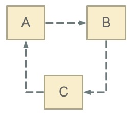  


如果设想一下以下场景：
如果在日常开发中我们用new对象的方式，若构造函数之间发生这种**循环依赖**的话，程序会在运行时一直循环调用**最终导致内存溢出**，示例代码如下：
```java
public class Main {

    public static void main(String[] args) throws Exception {
        System.out.println(new A());
    }

}

class A {
    public A() {
        new B();
    }
}

class B {
    public B() {
        new A();
    }
}
```
运行报错：
```java
Exception in thread "main" java.lang.StackOverflowError
```

以上便是**循环依赖**问题。接下来便简单介绍  Spring 是如何巧妙解决**三大循环依赖问题**的~

## Spring Bean的循环依赖

### 构造器循环依赖

```java
@Service
public class A {
    public A(B b) {
    }
}
@Service
public class B {
    public B(A a) {
    }
}
```
结果：项目启动失败抛出异常 ```BeanCurrentlyInCreationException```
```java
Caused by: org.springframework.beans.factory.BeanCurrentlyInCreationException: Error creating bean with name 'a': Requested bean is currently in creation: Is there an unresolvable circular reference?
	at org.springframework.beans.factory.support.DefaultSingletonBeanRegistry.beforeSingletonCreation(DefaultSingletonBeanRegistry.java:339)
	at org.springframework.beans.factory.support.DefaultSingletonBeanRegistry.getSingleton(DefaultSingletonBeanRegistry.java:215)
	at org.springframework.beans.factory.support.AbstractBeanFactory.doGetBean(AbstractBeanFactory.java:318)
	at org.springframework.beans.factory.support.AbstractBeanFactory.getBean(AbstractBeanFactory.java:199)
```

>构造器注入构成的循环依赖，此种循环依赖方式是无法解决的，只能抛出BeanCurrentlyInCreationException异常表示循环依赖。这也是构造器注入的最大劣势(它有很多独特的优势，请小伙伴自行发掘)


* 根本原因： Spring解决循环依赖依靠的是Bean这个中间态的概念，即已经实例化，但尚未初始化的状态。而构造器是完成初始化，所以构造器的循环依赖无法解决

### field属性注入（setter属性注入）循环依赖

该方式是**最为常用**的依赖注入方式
```java
@Service
public class A {
    @Autowired
    private B b;
}

@Service
public class B {
    @Autowired
    private A a;
}
```

可以正常运行

### prototype field 属性注入循环依赖

```java
@Scope(ConfigurableBeanFactory.SCOPE_PROTOTYPE)
@Service
public class A {
    @Autowired
    private B b;
}

@Scope(ConfigurableBeanFactory.SCOPE_PROTOTYPE)
@Service
public class B {
    @Autowired
    private A a;
}

```

结果：需要注意的是 非单例Bean 默认不会初始化，需要在使用的时候初始化，因此需要手动getBean(),这样就会报错


## Spring循环依赖情况总结
1.不能解决的情况
 构造器注入循环依赖
 prototype field属性注入循环依赖

2.能解决的情况：
 setter方法注入 循环依赖

## Spring解决循环依赖的原理分析

Spring的循环依赖的理论依据基于Java的引用传递，当获得对象的引用时，对象的属性是可以延后设置的。（但是构造器必须是在获取引用之前，毕竟你的引用是靠构造器给你生成的，儿子能先于爹出生？哈哈）

### Spring 创建Bean的流程
首先需要了解是Spring 它创建Bean的流程，大致调用栈绘图如下：
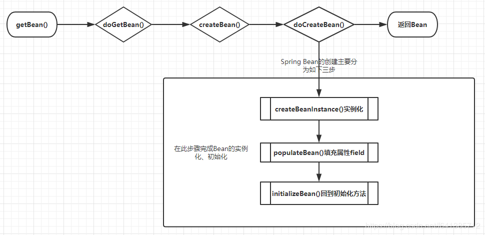  

对Bean的创建最为核心三个方法解释如下：

* createBeanInstance： 实例化，调用对象的构造方法实例化对象
* populateBean: 填充属性，这一步主要始对bean的依赖属性进行注入（@Autowired）
* initializeBean: 回到一些形如 initMethod, InitializingBean 等方法
  

循环依赖主要发生在**第二步（populateBean）**,也就是field属性注入的处理。

### Spring容器的‘三级缓存’

```java
    private final Map<String, Object> singletonObjects = new ConcurrentHashMap(256);
    private final Map<String, ObjectFactory<?>> singletonFactories = new HashMap(16);
    private final Map<String, Object> earlySingletonObjects = new HashMap(16);
    private final Set<String> registeredSingletons = new LinkedHashSet(256);
    private final Set<String> singletonsCurrentlyInCreation = Collections.newSetFromMap(new ConcurrentHashMap(16));
```
注：AbstractBeanFactory 继承自  DefaultSingletonBeanFactory
1. **singletonObjects**:用于存放完全初始化好的bean，从该缓存中取出的bean可以直接使用 beanName->bean实例
2. **earlySingletonObjects**：循环对象依赖列表，对象在创建之后，进行注入过程中，发现产生了循环依赖，那么会将对下给你放入这个map里，并且从singletonFactories移除
3. **singletonFactories**：单例对象工厂的cache，存放bean工厂。beanName->beanFactory
4. **singletonsCurrentlyInCreation**:正在创建的单例对象
5. **registeredSingletons**：已经创建成功的单例对象


我们在此假设两个  Bean A B，相互setter依赖，A中有B的属性，B中有A的属性

假设首先实例化A，
在spring容器启动的最后阶段是需要实例化，其最后会通过遍历beanNames来进行bean的实例化，通过getBean方法来进行bean的实例化工作，而getBean方法的最终执行是在：
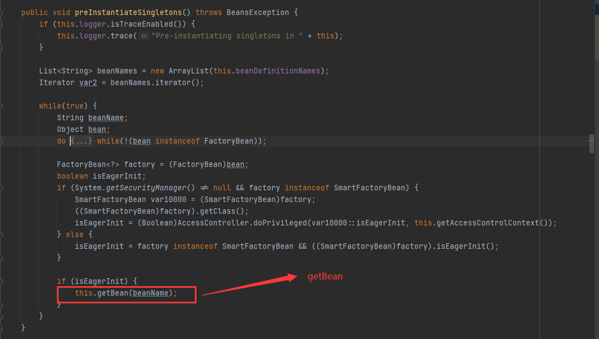  
跟进getBean，
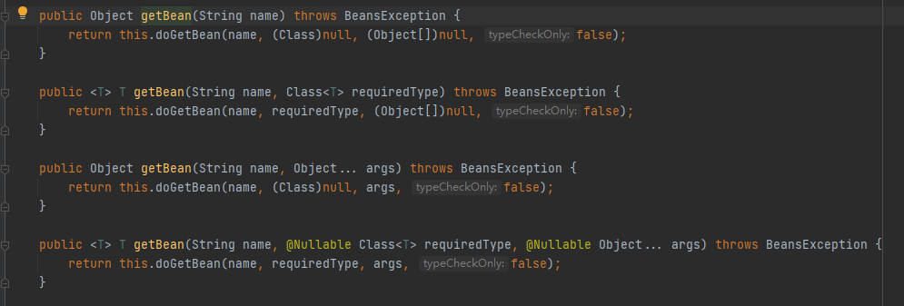  
进入doGetBean

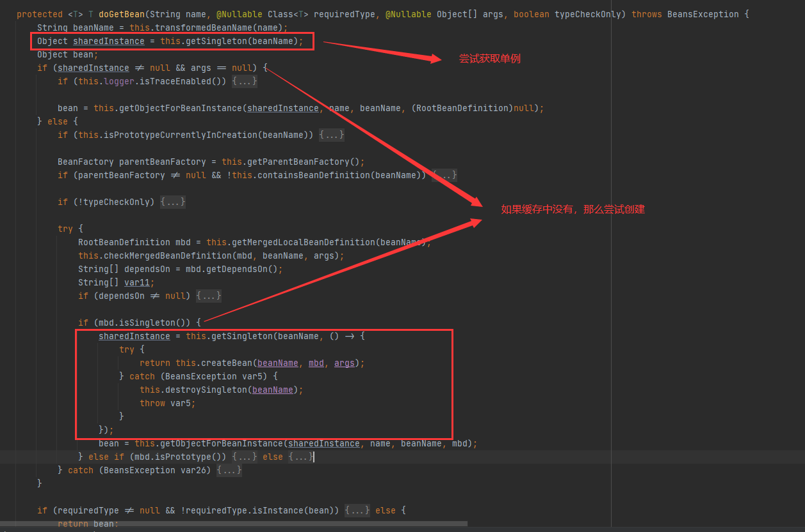  

获取单例Bean的源码如下：
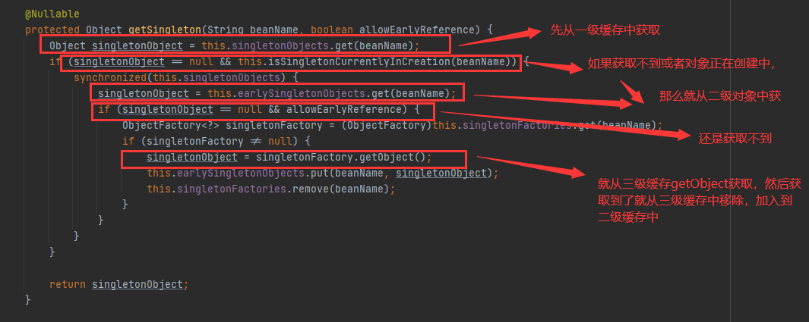  


尝试创建单例Bean


getSingleton->回调createBean
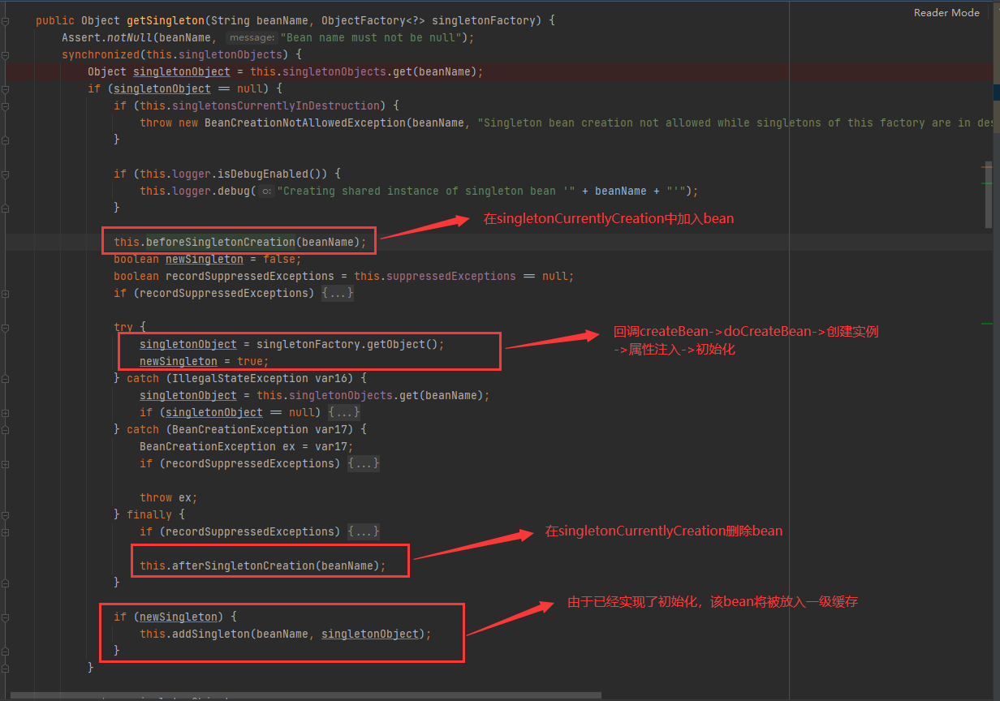  


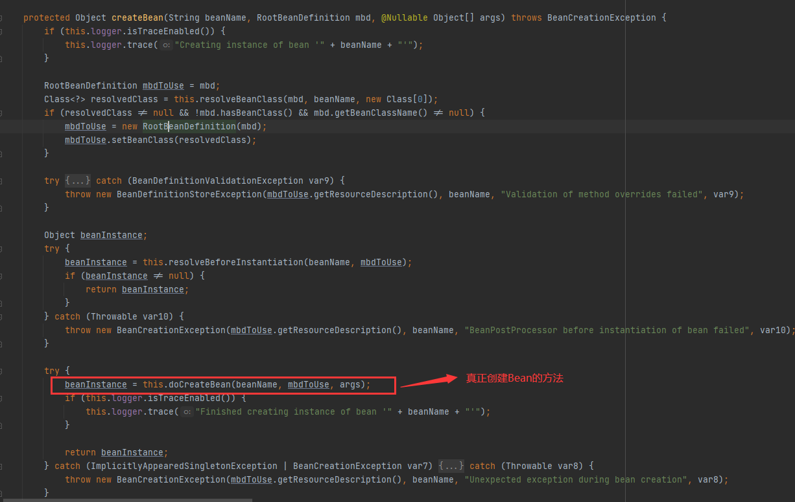  

进入doCreateBean
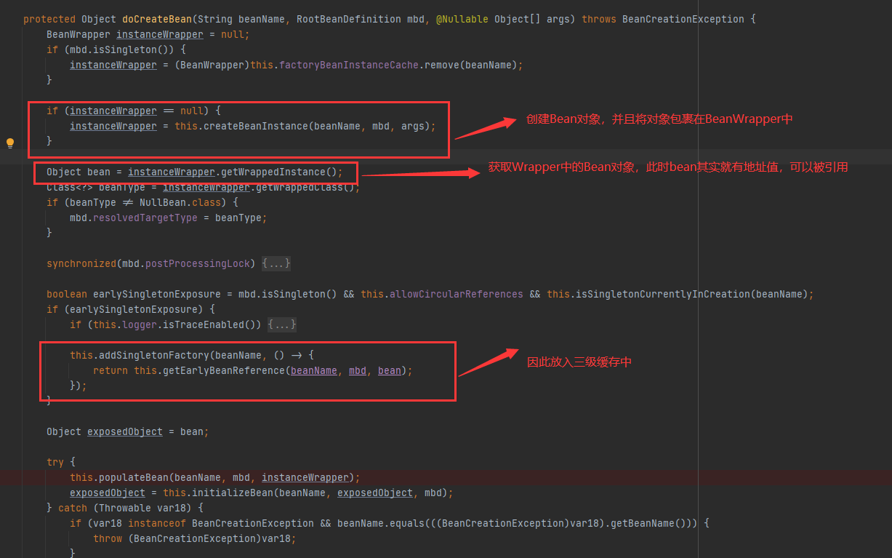  

### 循环依赖流程
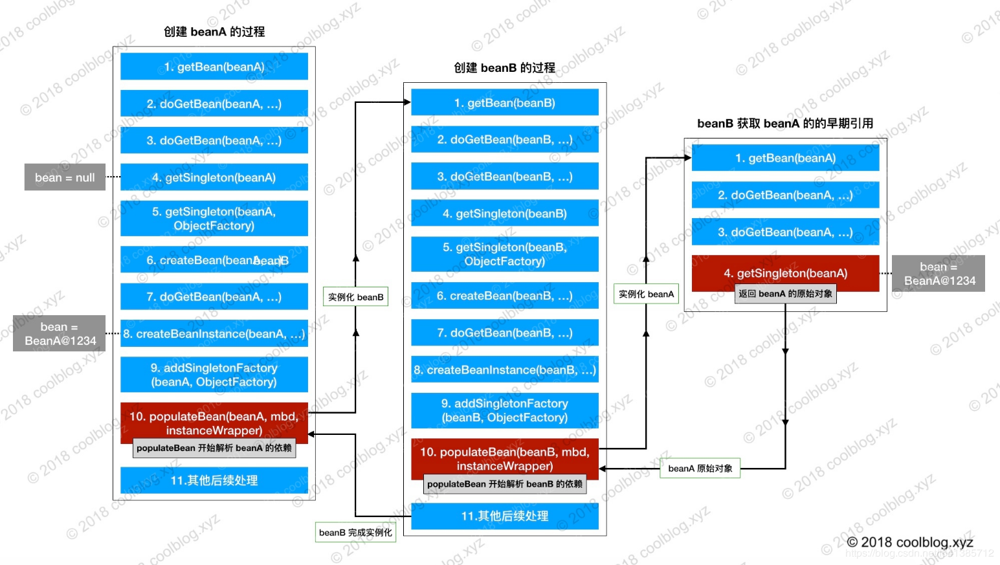  

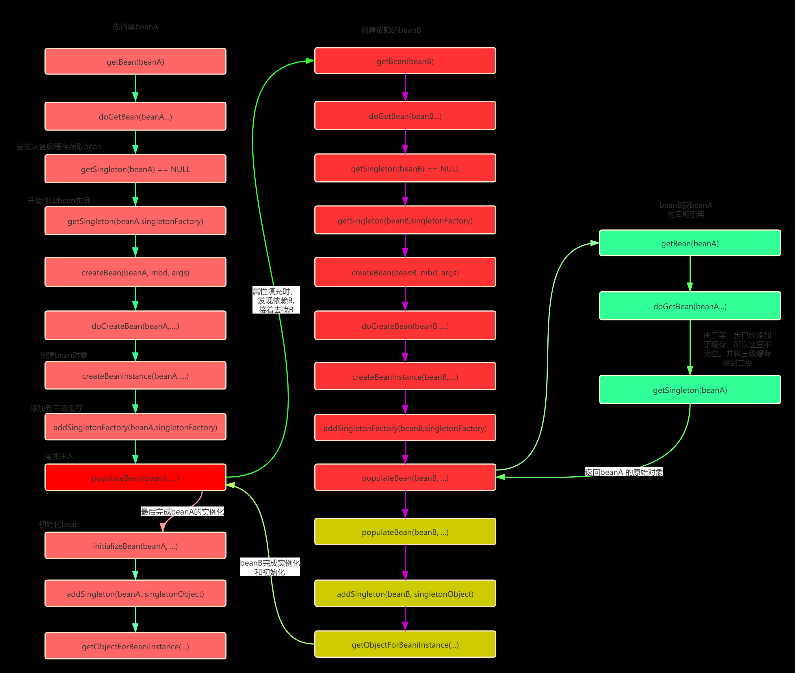  

