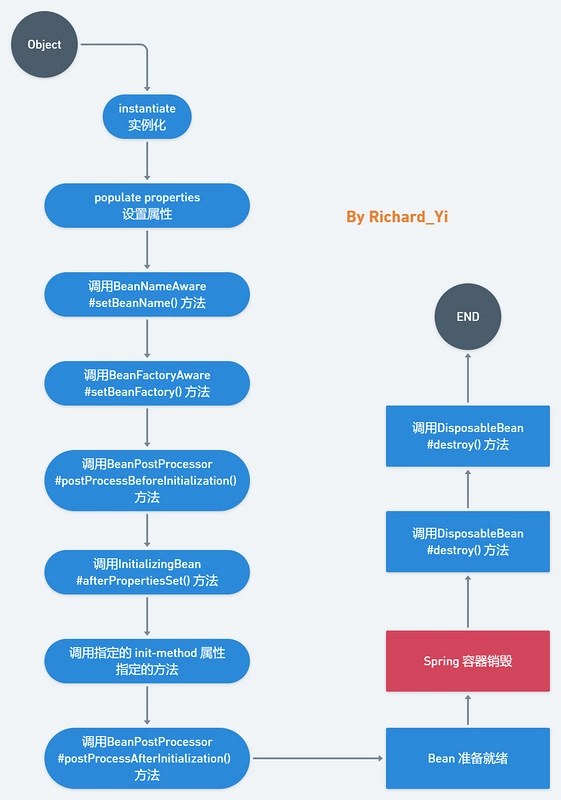
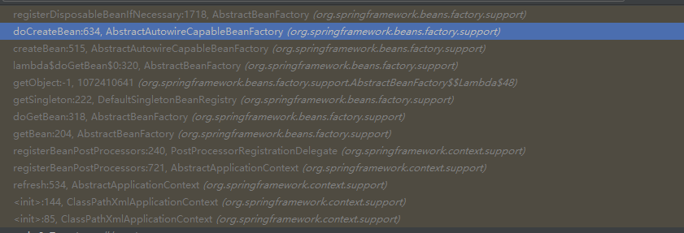

[TOC]
#Spring 生命周期

##生命周期图片描述
  


##实例演示
1.定义一个Person类,实现了DisposableBean, InitializingBean, BeanFactoryAware, BeanNameAware这4个接口，同时还有自定义的init-method和destroy-method。这里，如果不了解这几个接口的读者，可以先去看看这几个接口的定义。
```java
public class Person implements DisposableBean, InitializingBean, BeanFactoryAware, BeanNameAware {

    private String name;

    Person() {
        System.out.println("Constructor of person bean is invoked!");
    }

    public String getName() {
        return name;
    }
    public void setName(String name) {
        this.name = name;
    }

    @Override
    public void setBeanFactory(BeanFactory beanFactory) throws BeansException {
        System.out.println("setBeanFactory method of person is invoked");
    }

    @Override
    public void setBeanName(String name) {
        System.out.println("setBeanName method of person is invoked");
    }

    public void init() {
        System.out.println("custom init method of person bean is invoked!");
    }

    //Bean initialization code  equals to
    @Override
    public void afterPropertiesSet() throws Exception {
        System.out.println("afterPropertiesSet method of person bean is invoked!");
    }

    //Bean destruction code
    @Override
    public void destroy() throws Exception {
        System.out.println("DisposableBean Destroy method of person bean is invoked!");
    }

    public void destroyMethod() {
        System.out.println("custom Destroy method of person bean is invoked!");
    }

}
```

2.定义一个MyBeanPostProcessor实现BeanPostProcessor接口。
```java
public class MyBeanPostProcessor implements BeanPostProcessor {


    @Override
    public Object postProcessBeforeInitialization(Object bean, String beanName) throws BeansException {
        System.out.println("post Process Before Initialization is invoked");
        return bean;
    }

    @Override
    public Object postProcessAfterInitialization(Object bean, String beanName) throws BeansException {
        System.out.println("post Process after Initialization is invoked");
        return bean;
    }
}
```
3.配置文件，指定init-method和destroy-method属性
```xml
<?xml version="1.0" encoding="UTF-8"?>
<beans xmlns="http://www.springframework.org/schema/beans"
       xmlns:xsi="http://www.w3.org/2001/XMLSchema-instance"
       xmlns:context="http://www.springframework.org/schema/context"
       xmlns:aop="http://www.springframework.org/schema/aop"
       xsi:schemaLocation="http://www.springframework.org/schema/beans
       http://www.springframework.org/schema/beans/spring-beans.xsd
       http://www.springframework.org/schema/context
       http://www.springframework.org/schema/context/spring-context.xsd"
       default-autowire="byName">

    <bean name="myBeanPostProcessor" class="cqu.wjj.learn.MyBeanPostProcessor" />
    <bean name="personBean" class="cqu.wjj.learn.Person"
          init-method="init" destroy-method="destroyMethod">
        <property name="name" value="Wjj" />
    </bean>


</beans>
```
4.启动容器，销毁容器
```java
public class Test {
    public static void main(String[] args) {
        ApplicationContext context =new ClassPathXmlApplicationContext("spring-config.xml");
        ((ClassPathXmlApplicationContext) context).destroy();
    }
}

```
5.输出
```java
Constructor of person bean is invoked!
setBeanName method of person is invoked
setBeanFactory method of person is invoked
post Process Before Initialization is invoked
afterPropertiesSet method of person bean is invoked!
custom init method of person bean is invoked!
post Process after Initialization is invoked
DisposableBean Destroy method of person bean is invoked!
custom Destroy method of person bean is invoked!
```

##源码解析

###容器初始化

Spring IoC 依赖注入的阶段，创建Bean有三个关键步骤

1.createBeanInstance() 实例化
2.populateBean(); 属性装配
3.initializeBean() 处理Bean初始化之后的各种回调事件

其中，initializeBean()负责处理Bean初始化后的各种回调事件。
```java
 protected Object initializeBean(String beanName, Object bean, @Nullable RootBeanDefinition mbd) {
        if (System.getSecurityManager() != null) {
            AccessController.doPrivileged(() -> {
                this.invokeAwareMethods(beanName, bean);
                return null;
            }, this.getAccessControlContext());
        } else {
            this.invokeAwareMethods(beanName, bean);
        }

        Object wrappedBean = bean;
        if (mbd == null || !mbd.isSynthetic()) {
            wrappedBean = this.applyBeanPostProcessorsBeforeInitialization(bean, beanName);
        }

        try {
            this.invokeInitMethods(beanName, wrappedBean, mbd);
        } catch (Throwable var6) {
            throw new BeanCreationException(mbd != null ? mbd.getResourceDescription() : null, beanName, "Invocation of init method failed", var6);
        }

        if (mbd == null || !mbd.isSynthetic()) {
            wrappedBean = this.applyBeanPostProcessorsAfterInitialization(wrappedBean, beanName);
        }

        return wrappedBean;
    }

```
其中 invokeAwareMethods 会先调用一系列的**Aware**接口实现

```java
private void invokeAwareMethods(String beanName, Object bean) {
        if (bean instanceof Aware) {
            if (bean instanceof BeanNameAware) {
                ((BeanNameAware)bean).setBeanName(beanName);
            }

            if (bean instanceof BeanClassLoaderAware) {
                ClassLoader bcl = this.getBeanClassLoader();
                if (bcl != null) {
                    ((BeanClassLoaderAware)bean).setBeanClassLoader(bcl);
                }
            }

            if (bean instanceof BeanFactoryAware) {
                ((BeanFactoryAware)bean).setBeanFactory(this);
            }
        }

    }
```

在执行BeanPostProcessor的postProcessorBeforeInitialization回调
```java
 public Object applyBeanPostProcessorsBeforeInitialization(Object existingBean, String beanName) throws BeansException {
        Object result = existingBean;

        Object current;
        for(Iterator var4 = this.getBeanPostProcessors().iterator(); var4.hasNext(); result = current) {
            BeanPostProcessor processor = (BeanPostProcessor)var4.next();
            current = processor.postProcessBeforeInitialization(result, beanName);
            if (current == null) {
                return result;
            }
        }

        return result;
    }
```

然后再调用初始化方法，其中包括InitializingBean的afterPropertiesSet方法和指定的init-method方法，
```java
 protected void invokeInitMethods(String beanName, Object bean, @Nullable RootBeanDefinition mbd) throws Throwable {
        boolean isInitializingBean = bean instanceof InitializingBean;
        if (isInitializingBean && (mbd == null || !mbd.isExternallyManagedInitMethod("afterPropertiesSet"))) {
            if (this.logger.isTraceEnabled()) {
                this.logger.trace("Invoking afterPropertiesSet() on bean with name '" + beanName + "'");
            }

            if (System.getSecurityManager() != null) {
                try {
                    AccessController.doPrivileged(() -> {
                        ((InitializingBean)bean).afterPropertiesSet();
                        return null;
                    }, this.getAccessControlContext());
                } catch (PrivilegedActionException var6) {
                    throw var6.getException();
                }
            } else {
                ((InitializingBean)bean).afterPropertiesSet();
            }
        }

        if (mbd != null && bean.getClass() != NullBean.class) {
            String initMethodName = mbd.getInitMethodName();
            if (StringUtils.hasLength(initMethodName) && (!isInitializingBean || !"afterPropertiesSet".equals(initMethodName)) && !mbd.isExternallyManagedInitMethod(initMethodName)) {
                this.invokeCustomInitMethod(beanName, bean, mbd);
            }
        }

    }
```

最后再执行BeanPostProcessor的postProcessAfterInitialization回调
```java

    public Object applyBeanPostProcessorsAfterInitialization(Object existingBean, String beanName) throws BeansException {
        Object result = existingBean;

        Object current;
        for(Iterator var4 = this.getBeanPostProcessors().iterator(); var4.hasNext(); result = current) {
            BeanPostProcessor processor = (BeanPostProcessor)var4.next();
            current = processor.postProcessAfterInitialization(result, beanName);
            if (current == null) {
                return result;
            }
        }

        return result;
    }

```

这里完成了Bean加载过程当中的各种回调实现，下面介绍Spring容器销毁阶段


###容器关闭
与Bean初始化类似，当容器关闭时，可以看到对Bean销毁方法的调用。销毁过程是这样的。顺着close()-> doClose() -> destroyBeans() -> destroySingletons() -> destroySingleton() -> destroyBean() -> bean.destroy() ，会看到最终调用Bean的销毁方法。


```java
protected void destroyBean(String beanName, DisposableBean bean) {
        // 忽略

        // Actually destroy the bean now...
        if (bean != null) {
            try {
                bean.destroy();
            }
            catch (Throwable ex) {
                logger.error("Destroy method on bean with name '" + beanName + "' threw an exception", ex);
            }
        }

        // 忽略
    }
```
这里注意哦，这个Bean的类型实际上是DisposableBeanAdapter,DisposableBeanAdapter是管理Spring Bean的销毁的，实际上这里运用了适配器模式。再来看看destroy()的具体方法。
```java
 public void destroy() {
        if (!CollectionUtils.isEmpty(this.beanPostProcessors)) {
            Iterator var1 = this.beanPostProcessors.iterator();

            while(var1.hasNext()) {
                DestructionAwareBeanPostProcessor processor = (DestructionAwareBeanPostProcessor)var1.next();
                processor.postProcessBeforeDestruction(this.bean, this.beanName);
            }
        }

        if (this.invokeDisposableBean) {
            if (logger.isTraceEnabled()) {
                logger.trace("Invoking destroy() on bean with name '" + this.beanName + "'");
            }

            try {
                if (System.getSecurityManager() != null) {
                    AccessController.doPrivileged(() -> {
                        ((DisposableBean)this.bean).destroy();
                        return null;
                    }, this.acc);
                } else {
                    ((DisposableBean)this.bean).destroy();
                }
            } catch (Throwable var3) {
                String msg = "Invocation of destroy method failed on bean with name '" + this.beanName + "'";
                if (logger.isDebugEnabled()) {
                    logger.info(msg, var3);
                } else {
                    logger.info(msg + ": " + var3);
                }
            }
        }

        if (this.destroyMethod != null) {
            this.invokeCustomDestroyMethod(this.destroyMethod);
        } else if (this.destroyMethodName != null) {
            Method methodToInvoke = this.determineDestroyMethod(this.destroyMethodName);
            if (methodToInvoke != null) {
                this.invokeCustomDestroyMethod(ClassUtils.getInterfaceMethodIfPossible(methodToInvoke));
            }
        }

    }
```

###BeanPostProcessor 是什么时候注册到容器的？
前面只介绍了BeanPostProcessor类在 Spring Bean 生命周期中的回调实现，却没有说明 BeanPostProcessor 是什么时候注册到容器的。下面我们来介绍下。

在Spring IoC 容器初始化的时候，容器会做一些初始化操作，其中就包括了BeanPostProcessor的register过程。详细的过程可以看我这篇IoC 容器初始化。


源码位置AbstractApplicationContext#refresh()
```java
public void refresh() throws BeansException, IllegalStateException {
        synchronized(this.startupShutdownMonitor) {
            this.prepareRefresh();
            ConfigurableListableBeanFactory beanFactory = this.obtainFreshBeanFactory();
            this.prepareBeanFactory(beanFactory);

            try {
                //Allows post-processing of the bean factory in context subclasses.
                this.postProcessBeanFactory(beanFactory);
                // Invoke factory processors registered as beans in the context.

                this.invokeBeanFactoryPostProcessors(beanFactory);

                //
                this.registerBeanPostProcessors(beanFactory);
                this.initMessageSource();
                this.initApplicationEventMulticaster();
                this.onRefresh();
                this.registerListeners();
                this.finishBeanFactoryInitialization(beanFactory);
                this.finishRefresh();
            } catch (BeansException var9) {
                if (this.logger.isWarnEnabled()) {
                    this.logger.warn("Exception encountered during context initialization - cancelling refresh attempt: " + var9);
                }

                this.destroyBeans();
                this.cancelRefresh(var9);
                throw var9;
            } finally {
                this.resetCommonCaches();
            }

        }
    }
```

```java
 protected void registerBeanPostProcessors(ConfigurableListableBeanFactory beanFactory) {
        PostProcessorRegistrationDelegate.registerBeanPostProcessors(beanFactory, this);
    }
```


源码位置PostProcessorRegistrationDelegate#registerBeanPostProcessors()

```java
public static void registerBeanPostProcessors(ConfigurableListableBeanFactory beanFactory, AbstractApplicationContext applicationContext) {
        String[] postProcessorNames = beanFactory.getBeanNamesForType(BeanPostProcessor.class, true, false);
        int beanProcessorTargetCount = beanFactory.getBeanPostProcessorCount() + 1 + postProcessorNames.length;
        beanFactory.addBeanPostProcessor(new PostProcessorRegistrationDelegate.BeanPostProcessorChecker(beanFactory, beanProcessorTargetCount));
        List<BeanPostProcessor> priorityOrderedPostProcessors = new ArrayList();
        List<BeanPostProcessor> internalPostProcessors = new ArrayList();
        List<String> orderedPostProcessorNames = new ArrayList();
        List<String> nonOrderedPostProcessorNames = new ArrayList();
        String[] var8 = postProcessorNames;
        int var9 = postProcessorNames.length;

        String ppName;
        BeanPostProcessor pp;
        for(int var10 = 0; var10 < var9; ++var10) {
            ppName = var8[var10];
            if (beanFactory.isTypeMatch(ppName, PriorityOrdered.class)) {
                pp = (BeanPostProcessor)beanFactory.getBean(ppName, BeanPostProcessor.class);
                priorityOrderedPostProcessors.add(pp);
                if (pp instanceof MergedBeanDefinitionPostProcessor) {
                    internalPostProcessors.add(pp);
                }
            } else if (beanFactory.isTypeMatch(ppName, Ordered.class)) {
                orderedPostProcessorNames.add(ppName);
            } else {
                nonOrderedPostProcessorNames.add(ppName);
            }
        }

        sortPostProcessors(priorityOrderedPostProcessors, beanFactory);
        registerBeanPostProcessors(beanFactory, (List)priorityOrderedPostProcessors);
        List<BeanPostProcessor> orderedPostProcessors = new ArrayList();
        Iterator var14 = orderedPostProcessorNames.iterator();

        while(var14.hasNext()) {
            String ppName = (String)var14.next();
            BeanPostProcessor pp = (BeanPostProcessor)beanFactory.getBean(ppName, BeanPostProcessor.class);
            orderedPostProcessors.add(pp);
            if (pp instanceof MergedBeanDefinitionPostProcessor) {
                internalPostProcessors.add(pp);
            }
        }

        sortPostProcessors(orderedPostProcessors, beanFactory);
        registerBeanPostProcessors(beanFactory, (List)orderedPostProcessors);
        List<BeanPostProcessor> nonOrderedPostProcessors = new ArrayList();
        Iterator var17 = nonOrderedPostProcessorNames.iterator();

        while(var17.hasNext()) {
            ppName = (String)var17.next();
            pp = (BeanPostProcessor)beanFactory.getBean(ppName, BeanPostProcessor.class);
            nonOrderedPostProcessors.add(pp);
            if (pp instanceof MergedBeanDefinitionPostProcessor) {
                internalPostProcessors.add(pp);
            }
        }

        registerBeanPostProcessors(beanFactory, (List)nonOrderedPostProcessors);
        sortPostProcessors(internalPostProcessors, beanFactory);
        registerBeanPostProcessors(beanFactory, (List)internalPostProcessors);
        beanFactory.addBeanPostProcessor(new ApplicationListenerDetector(applicationContext));
    }
```
上述过程可以分为四步:
* 通过beanFactory.getBeanNamesForType(BeanPostProcessor.class, true, false);方法获取beanFactory里继承了BeanPostProcessor接口的name的集合；
* 把后置器beans分为PriorityOrdered、Ordered、nonOrdered三大类，前两类是增加了排序条件的后置器；（Spring可以通过PriorityOrdered和Ordered接口控制处理器的优先级），这里实际上还有一类是MergedBeanDefinitionPostProcessor，不是核心点，不展开讲。
* 第三步可以分为以下小步
    * priorityOrderedPostProcessors，先排序后注册
    * orderedPostProcessors，先排序后注册
    * 注册nonOrderedPostProcessors，就是一般的处理器
    * internalPostProcessors，先排序后注册
    * 注册一个ApplicationListenerDetector的 processor


###DisposableBeanAdapter 什么时候注册到容器的？
DisposableBeanAdapter和上文的BeanPostProcessor的抽象层级不同，这个是和Bean绑定的，所以它的注册时机是在Spring Bean的依赖注入阶段，

源码位置：AbstractBeanFactory#registerDisposableBeanIfNecessary()
```java
protected void registerDisposableBeanIfNecessary(String beanName, Object bean, RootBeanDefinition mbd) {
        AccessControlContext acc = (System.getSecurityManager() != null ? getAccessControlContext() : null);
        if (!mbd.isPrototype() && requiresDestruction(bean, mbd)) {
            if (mbd.isSingleton()) {
                // 注册一个DisposableBean实现，该实现将执行给定bean的所有销毁工作。
                // 包括：DestructionAwareBeanPostProcessors，DisposableBean接口，自定义destroy方法。
                registerDisposableBean(beanName,
                        new DisposableBeanAdapter(bean, beanName, mbd, getBeanPostProcessors(), acc));
            }
            else {
                // A bean with a custom scope...
                Scope scope = this.scopes.get(mbd.getScope());
                if (scope == null) {
                    throw new IllegalStateException("No Scope registered for scope name '" + mbd.getScope() + "'");
                }
                scope.registerDestructionCallback(beanName,
                        new DisposableBeanAdapter(bean, beanName, mbd, getBeanPostProcessors(), acc));
            }
        }
    }

```

该方法的堆栈图：
  
可以发现，DisposableBeanAdapter是在创建Bean的时候注册的。

