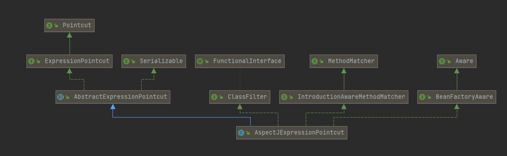

[TOC]
#Spring AOP

##AOP 原理

通过代理模式为目标对象生产代理对象，并将横切逻辑插入到目标方法执行的前后。


##AOP术语及相应的实现
AOP全称是Aspect Oriented Programming,面向切面的编程，AOP是一种开发理念。通过AOP，我们可以把一些非业务逻辑的代码，比如安全检查，监控等代码从业务方法中抽取出来，以非侵入的方式与原方法进行协同。这样可以使原方法更专注于业务逻辑，代码结构会更加清晰，便于维护。


在此说明:AOP并非是Spring独创，AOP有自己的标准，也有机构再维护这个标准。Spring AOP目前也遵循相关标准。


### 连接点-Jointpoint

连接点是指程序执行过程中的一些点，比如方法调用，异常处理等。再Spirng AOP中，进支持方法级别的连接点。下面举个例子说明一下，现在我们有一个用户服务UserService接口，该接口定义如下：

```java
public interface UserService {
    void save(User user);
    void update(User user);
    void delete(String userId);
    User findOne(String userId);
    List<User> findAll();
    boolean exists(String userId);
}
```

该接口的实现类时UserServiceImpl，假设该类的方法调用如下：
  

如下所示，每个方法都是一个连接点。连接点的定义如下：
```java

public interface Joinpoint {
    //用于执行拦截器链中的下一个拦截器逻辑
    Object proceed() throws Throwable;

    Object getThis();

    AccessibleObject getStaticPart();
}
```

再这个Joinpoint接口中，proceed方法时核心，该方法用于执行拦截器逻辑。以执行目标方法前，该拦截器首先会执行前置通知逻辑，如果拦截器链中还有其他的拦截器，则继续调用下一个拦截器逻辑。直到拦截器链中没有其他的拦截器后，再去调用目标方法。

上面说到一个方法调用就是一个连接点，看一下**方法调用**这个接口的定义：
```java
public interface Invocation extends Joinpoint {
    Object[] getArguments();
}

public interface MethodInvocation extends Invocation {
    Method getMethod();
}

```
如上所示，方法调用接口 MethodInvocation 继承自 Invocation，Invocation 接口又继承自 Joinpoint。看了上面的代码，我想大家现在对连接点应该有更多的一些认识了。接下面，我们来继续看一下 Joinpoint 接口的一个实现类 ReflectiveMethodInvocation。当然不是看源码，而是看它的继承体系图。如下：
  

###切点-Pointcut
切点是用于选择连接点的，先根据Pointcut接口的定义
```java
public interface Pointcut {
    Pointcut TRUE = TruePointcut.INSTANCE;
    // 返回一个类型过滤器
    ClassFilter getClassFilter();
    // 返回一个方法匹配器
    MethodMatcher getMethodMatcher();
}

```
Pointcut接口定义了两个接口，分别用于返回类型过滤器和方法匹配器。
```java
public interface ClassFilter {
    ClassFilter TRUE = TrueClassFilter.INSTANCE;

    boolean matches(Class<?> var1);
}

public interface MethodMatcher {
    MethodMatcher TRUE = TrueMethodMatcher.INSTANCE;

    boolean matches(Method var1, Class<?> var2);

    boolean isRuntime();

    boolean matches(Method var1, Class<?> var2, Object... var3);
}

```

上面的两个定义接口均实现了matches方法，用户只要实现了matches方法，即可对连接点进行选择。在日常使用中，大家通常是用AspectJ表达式对连接点进行选择。Spring 中提供了一个AspectJ表达式切点类-AspectJExpressionPointcut,下面可以来看该类的继承体系图：
  
如上所示，这个类最终实现了Pointcut,ClassFilter和MethodMacher接口，因此该类具备了通过AspectJ表达式对连接点进行选择的能力。
下面写一个表达式对上一节的连接点进行选择，比如：
```java
execution(* *.find*(..))
```
该表达式用于选择以find的开头的方法，选择结果如下：
  

通过上面的表达式，可以选中findOne和findAll两个方法了。
之后就该（Advice）上场了。

### 通知-Advice
通过Advice 即定义的横切逻辑，比如我们可以定义一个用于监控方法性能的通知，也可以定义一个安全检查的通知。如果切点解决了通知在哪里调用的问题，那么还需要考虑一个问题，即通知在何时被调用？是在目标方法前被调用，还是目标方法返回后被调用。

Spring 中定义了以下几种通知类型:
* 前置通知（Before advice）- 在目标方法调用前执行通知
* 后置通知（After advice）-在目标方法后执行通知
* 返回通知 (After returning advice) -在目标方法执行成功后，调用通知
* 异常通知 (After throwing advice) -在目标方法抛出异常后，执行通知
* 环绕通知 (Around advice) -在目标方法调用前后均可执行自定义逻辑

上面是对通知的介绍，下面来看通知的源码。
```java
public interface Advice {
}

```
由于该接口没有定义方法，去它的子类接口
```java
//BeforeAdvice
public interface BeforeAdvice extends Advice {
}
public interface MethodBeforeAdvice extends BeforeAdvice {
    void before(Method var1, Object[] var2, @Nullable Object var3) throws Throwable;
}

//AfterAdvice
public interface AfterAdvice extends Advice {
}
public interface AfterReturningAdvice extends AfterAdvice {
    void afterReturning(@Nullable Object var1, Method var2, Object[] var3, @Nullable Object var4) throws Throwable;
}
```

在上面的代码可以看出，Advice接口的子类接口里定了一些方法。下面继续看看Advice接口的具体实现类AspectJMethodBeforeAdvice 的继承体系图：

  

由于现在有了切点Pointcut以及通知Advice,由于这两个模块目前还是分离的，现在把它们整合在一起。这样切点就可以为通知导航，然后由通知逻辑实现精准打击。

这样，就用**切面**来整合这两个模块。

###切面 -Aspect
切面Aspect整合了切点和通知两个模块，切点解决了where问题，通知解决了when和how问题。切面把两者整合起来，就可以解决对什么方法(where)在何时（when-前置还是后置）执行什么样的横切逻辑(how)的三连发问题。在AOP中，切面只是一个概念，并没有一个具体的接口或类与此对应。不过Spring中倒是有一个接口的用途和切面很想，这个接口就是切点通知器 PointcutAdvisor. 先看这个接口的定义，如下：
```java
public interface Advisor {
    Advice EMPTY_ADVICE = new Advice() {
    };

    Advice getAdvice();

    boolean isPerInstance();
}

public interface PointcutAdvisor extends Advisor {
    Pointcut getPointcut();
}

```
简单来说  PointcutAdvisor 及其父接口Advisor,Advisor 中有一个getAdvice方法，用于返回通知。PointcutAdvisor 在Advisor基础上，新增了getPointcut方法，用于返回切点对象。因此PointcutAdcisor的实现类即可以返回切点，也可以返回通知。


接下来看看PointcutAdvisor的实现类 AspectJPointcutAdvisor的继承体系图。如下：

  


###织入-weaving
所谓织入就是在切点的引导下，将通知逻辑插入到方法调用上，使得我们的通知逻辑在方法调用时得以执行。
在Spring中，通过实现后置处理器BeanPostProcessor接口。该接口是Spring提供的一个扩展接口，通过实现该接口，用户可在bean初始化前后做一些自定义操作。

而Spring在bean初始化完成后，即bean执行完（init-method）.Spring 通过切点对bean类的方法进行匹配。若匹配成功，则回味bean生成代理对象返回给容器。容器在后置处理器
输入bean对象，得到对象的代理，这样就完成了织入过程。


###初始化总结
* Spring 加载 自动代理器AnnotationAwareAspectJAutoCreator,当作一个系统组件
* 当一个bean加载到spring中，会触发自动代理器的bean后置处理，然后会先扫描bean所有的Advisor->在这里会根据@Aspect，@Async等生成Advisor
  Advisor类架构==https://blog.csdn.net/u012422440/article/details/87924776==
* 然后用Advisor和其他参数构建ProxyFactory
* ProxyFactory会跟剧配置和目标对象的类型寻找代理的方式（JDK动态代理或CGLIG代理）
* 然后代理出来的对象放回context，完成Spring AOP代理

