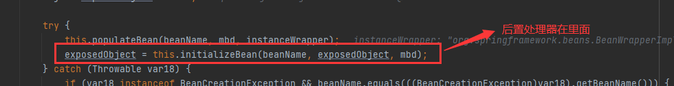
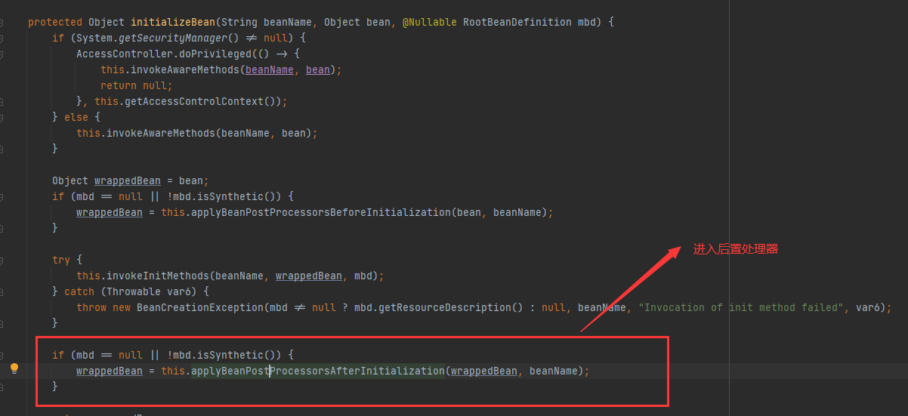
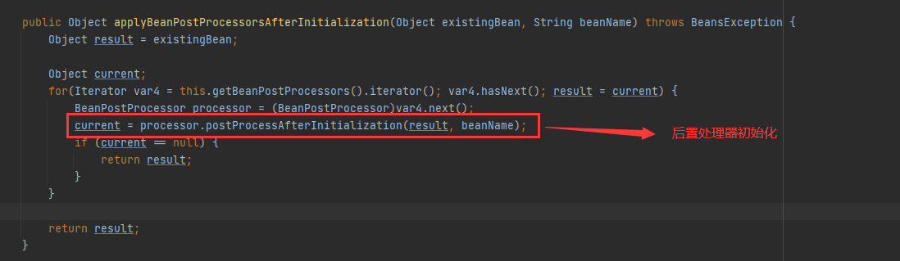

[TOC]
#Spring AOP 源码分析-筛选合适的通知器


Spring 通过拓展点BeanPostProcessor接口，并在bean初始化后置处理中向bean中织入通知。

##AOP入口分析

  

  

  

在AbstractAutoProxyCreator->postProcessAfterInitialization
```java
//bean初始化后之方法
public Object postProcessAfterInitialization(@Nullable Object bean, String beanName) {
        if (bean != null) {
            Object cacheKey = this.getCacheKey(bean.getClass(), beanName);

            if (this.earlyProxyReferences.remove(cacheKey) != bean) {
                //生成代理对象
                return this.wrapIfNecessary(bean, beanName, cacheKey);
            }
        }

        return bean;
}
protected Object wrapIfNecessary(Object bean, String beanName, Object cacheKey) {
        if (StringUtils.hasLength(beanName) && this.targetSourcedBeans.contains(beanName)) {
            return bean;
        } else if (Boolean.FALSE.equals(this.advisedBeans.get(cacheKey))) {
            return bean;
        /*
         * 如果是基础设施类（Pointcut、Advice、Advisor 等接口的实现类），或是应该跳过的类，
         * 则不应该生成代理，此时直接返回 bean
         */ 

        } else if (!this.isInfrastructureClass(bean.getClass()) && !this.shouldSkip(bean.getClass(), beanName)) {
            // 为目标 bean 查找合适的通知器

            Object[] specificInterceptors = this.getAdvicesAndAdvisorsForBean(bean.getClass(), beanName, (TargetSource)null);
            if (specificInterceptors != DO_NOT_PROXY) {
                this.advisedBeans.put(cacheKey, Boolean.TRUE);
                Object proxy = this.createProxy(bean.getClass(), beanName, specificInterceptors, new SingletonTargetSource(bean));
                this.proxyTypes.put(cacheKey, proxy.getClass());
                /*
             * 返回代理对象，此时 IOC 容器输入 bean，得到 proxy。此时，
             * beanName 对应的 bean 是代理对象，而非原始的 bean
             */ 
                return proxy;
            } else {
                this.advisedBeans.put(cacheKey, Boolean.FALSE);
                return bean;
            }
        } else {
            this.advisedBeans.put(cacheKey, Boolean.FALSE);
            return bean;
        }
}
```

以上就是Spring AOP 创建代理对象的入口方法分析，过程比较简单，总结如下：
* 若bean是AOP基础设施类型，则直接返回
* 为bean查找合适的通知器
* 如果通知器数组不为空，则为bean生成代理对象，并返回该对象
* 若数组为空，则返回原始bean

###筛选合适的通知器
在向目标bean中织入通知之前，我们先要为bean筛选出合适的通知器(通知器持有通知)。如何筛选呢？方法由很多，比如我们可以通过正则表达式匹配方法名，当然更多的时候用的是AspectJ表达式进行匹配。

参考：https://www.imooc.com/article/43378

查找通知器->筛选合适的通知器->拓展筛选出通知器列表