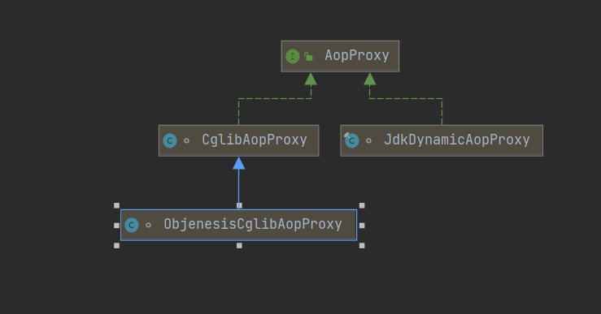
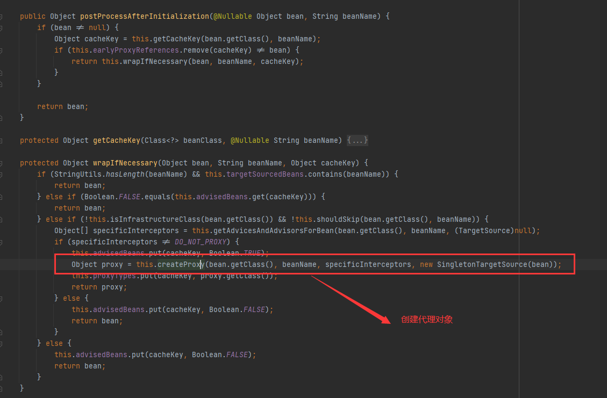
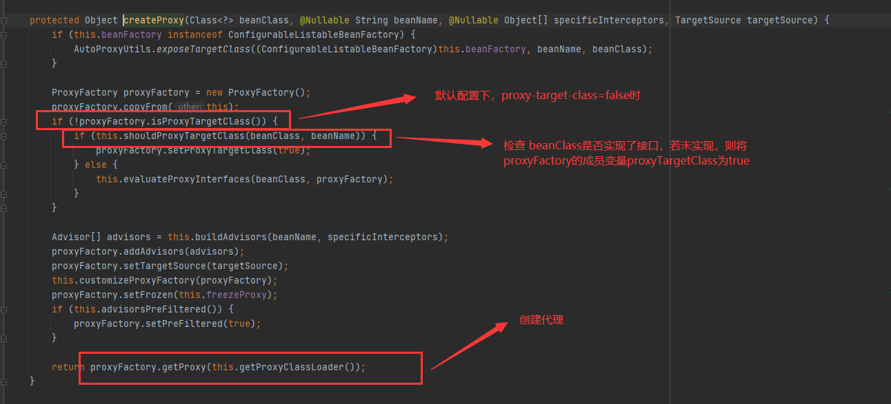
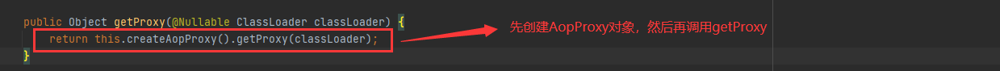

[TOC]
#Spring AOP源码分析-创建代理对象

Spring将通知器筛选好后，接下来就需要通过代理的方式将通知器所持有的通知织入到bean的某些方法前后。


##背景知识
###proxy-target-class
在Spring AOP配置中，proxy-target-class属性可影响Spring生成的代理对象的类型，以XML配置为例，可进行如下配置:
```xml
<aop:aspectj-autoproxy proxy-target-class="true"/>

<aop:config proxy-target-class="true">
    <aop:aspect id="xxx" ref="xxxx">
        <!-- 省略 -->
    </aop:aspect>
</aop:config>
```

如上，默认情况下proxy-target-class属性为false.当目标bean实现了接口时，Spring会proxy-target-class属性为false.当目标bean实现了接口时，Spring 会基于JDK动态代理为目标bean创建代理对象。若未实现任何接口，Spring则会通过CGLIB创建代理。而当proxy-target-class属性设为true时，则会强制Spring 通过CGLIB的方式创建代理对象，即使目标实现了接口。

###[动态代理](./Spring%20JDK和cglib动态代理.md)


##源码分析
在为目标bean创建代理对象前，需要先创建AopProxy对象，然后再调用该对象的getProxy方法创建实际的代理类。
```java

public interface AopProxy {
    Object getProxy();

    Object getProxy(@Nullable ClassLoader var1);
}

```
在Spring中，有两个类实现了AopProxy，如下：
  

Spring在为目标创建代理的过程中，要根据bean是否实现接口，以及一些其他配置来决定使用AopProxy何种实现类为目标bean创建代理对象。

接下来进入代理创建的过程。如下：
  

  
  


而这里先调用createAop创建AopProxy实现类对象，然后再调用AopProxy实现类对象中的getProxy创建代理对象。

```java
protected final synchronized AopProxy createAopProxy() {
        if (!this.active) {
            this.activate();
        }

        return this.getAopProxyFactory().createAopProxy(this);
    }
```


```java
   public AopProxy createAopProxy(AdvisedSupport config) throws AopConfigException {
        if (!config.isOptimize() && !config.isProxyTargetClass() && !this.hasNoUserSuppliedProxyInterfaces(config)) {
            return new JdkDynamicAopProxy(config);
        } else {
            Class<?> targetClass = config.getTargetClass();
            if (targetClass == null) {
                throw new AopConfigException("TargetSource cannot determine target class: Either an interface or a target is required for proxy creation.");
            } else {
                return (AopProxy)(!targetClass.isInterface() && !Proxy.isProxyClass(targetClass) ? new ObjenesisCglibAopProxy(config) : new JdkDynamicAopProxy(config));
            }
        }
    }

```

如上，DefaultAopProxy根据一些条件决定生成什么类型的AopProxy实现类对象。生成好AopProxy实现类对象后，下面就要为目标bean创建代理对象了。这里以JdkDynamicAopProxy为例，这类的getProxy方法的逻辑时怎样的。

```java
    public Object getProxy() {
        return this.getProxy(ClassUtils.getDefaultClassLoader());
    }

    public Object getProxy(@Nullable ClassLoader classLoader) {
        if (logger.isTraceEnabled()) {
            logger.trace("Creating JDK dynamic proxy: " + this.advised.getTargetSource());
        }

        Class<?>[] proxiedInterfaces = AopProxyUtils.completeProxiedInterfaces(this.advised, true);
        this.findDefinedEqualsAndHashCodeMethods(proxiedInterfaces);
        return Proxy.newProxyInstance(classLoader, proxiedInterfaces, this);
    }

```
可以发现，jdkDynamicAopProxy最终调用Proxy.newProxyInstance方法创建代理对象。