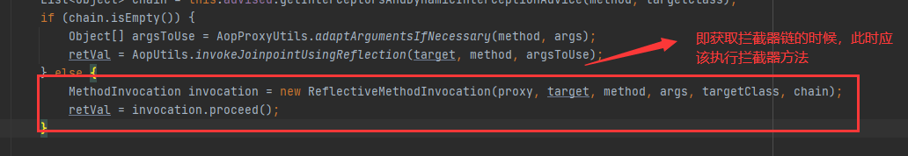

[TOC]

#Spring AOP 源码分析-拦截器链的执行过程

Spring AOP首先为目标bean筛选合适的通知器，以及如何创建代理对象的成功。现在我们的得到了bean的代理对象，且通知也以合适的方式插在了目标方法的前后。

接下来要做的事情，就是执行通知逻辑了。通知可能再目标方法前执行，也可能再目标方法后执行，具体的执行实际，取决于用户的配置。当目标方法被多个通知匹配到时，Spring 通过引入拦截器链来保证每个通知的正常执行。


##背景知识

关于expoese-proxy，我们先说有什么用。Spring 引入expose-proxy特性是为了解**决目标方法调用同对象中其他方法时，其他方法的切面逻辑无法执行的问题**。

先配置expose-proxy
```xml
<bean id="hello" class="xyz.coolblog.aop.Hello"/>
<bean id="aopCode" class="xyz.coolblog.aop.AopCode"/>

<aop:aspectj-autoproxy expose-proxy="true" />

<aop:config expose-proxy="true">
    <aop:aspect id="myaspect" ref="aopCode">
        <aop:pointcut id="helloPointcut" expression="execution(* xyz.coolblog.aop.*.hello*(..))" />
        <aop:before method="before" pointcut-ref="helloPointcut" />
    </aop:aspect>
</aop:config>

```

如上，expose-proxy可配置再```<aop:config/>```和```<aop:aspectj-autoproxy/>```标签上。再使用expose-proxy时，需要对内部调用进行改造，比如:
```java
public class Hello implements IHello {

    @Override
    public void hello() {
        System.out.println("hello");
        this.hello("world");
    }

    @Override
    public void hello(String hello) {
        System.out.println("hello " +  hello);
    }
}
```
hello()方法调用了同类中的另一个方法hello(String)，此时hello(String)上的切面逻辑就无法执行了。这里，我们要对hello()方法进行改造，强调它调用代理对象中的hello(String)。
```java
public class Hello implements IHello {

    @Override
    public void hello() {
        System.out.println("hello");
        ((IHello) AopContext.currentProxy()).hello("world");
    }

    @Override
    public void hello(String hello) {
        System.out.println("hello " +  hello);
    }
}

```
如上，AopContext.currentProxy()用于获取当前的代理对象。当 expose-proxy 被配置为 true 时，该代理对象会被放入 ThreadLocal 中。关于 expose-proxy，这里先说这么多，后面分析源码时会再次提及。


##源码分析
本次分析源码均来自JdkDynamicAopProxy

### JDK动态代理逻辑分析

对于JDK动态代理，代理逻辑封装在InvocationHandler接口实现类的invoke方法中.JdkDynamicAopProxy实现了InvocationHander
  


总结invoke方法的执行流程，如下：
1.检测expose-proxy是否为true，若为true，则暴露代理对象
2.获取适合当前方法的拦截器
3.如果拦截器链为空，则直接通过反射执行目标方法
4.若拦截器链不为空，则创建方法调用ReflectiveMethodInvocation对象
5.调用ReflectiveMethodInvocation对象的procceed()方法启动拦截器链


### 获取所有的拦截器
```java
//AdvisedSupport->getInterceptorsAndDynamicInterceptionAdvice
 public List<Object> getInterceptorsAndDynamicInterceptionAdvice(Method method, @Nullable Class<?> targetClass) {
        AdvisedSupport.MethodCacheKey cacheKey = new AdvisedSupport.MethodCacheKey(method);
        List<Object> cached = (List)this.methodCache.get(cacheKey);
        if (cached == null) {
            cached = this.advisorChainFactory.getInterceptorsAndDynamicInterceptionAdvice(this, method, targetClass);
            this.methodCache.put(cacheKey, cached);
        }

        return cached;
    }
```

```java
//DefaultAdvisorChainFactory->getInterceptorsAndDynamicInterceptionAdvice
 public List<Object> getInterceptorsAndDynamicInterceptionAdvice(Advised config, Method method, @Nullable Class<?> targetClass) {
        AdvisorAdapterRegistry registry = GlobalAdvisorAdapterRegistry.getInstance();
        Advisor[] advisors = config.getAdvisors();
        List<Object> interceptorList = new ArrayList(advisors.length);
        Class<?> actualClass = targetClass != null ? targetClass : method.getDeclaringClass();
        Boolean hasIntroductions = null;
        Advisor[] var9 = advisors;
        int var10 = advisors.length;

        for(int var11 = 0; var11 < var10; ++var11) {
            Advisor advisor = var9[var11];
            if (advisor instanceof PointcutAdvisor) {
                PointcutAdvisor pointcutAdvisor = (PointcutAdvisor)advisor;
                if (config.isPreFiltered() || pointcutAdvisor.getPointcut().getClassFilter().matches(actualClass)) {
                    MethodMatcher mm = pointcutAdvisor.getPointcut().getMethodMatcher();
                    boolean match;
                    if (mm instanceof IntroductionAwareMethodMatcher) {
                        if (hasIntroductions == null) {
                            hasIntroductions = hasMatchingIntroductions(advisors, actualClass);
                        }

                        match = ((IntroductionAwareMethodMatcher)mm).matches(method, actualClass, hasIntroductions);
                    } else {
                        match = mm.matches(method, actualClass);
                    }

                    if (match) {
                        MethodInterceptor[] interceptors = registry.getInterceptors(advisor);
                        if (mm.isRuntime()) {
                            MethodInterceptor[] var17 = interceptors;
                            int var18 = interceptors.length;

                            for(int var19 = 0; var19 < var18; ++var19) {
                                MethodInterceptor interceptor = var17[var19];
                                interceptorList.add(new InterceptorAndDynamicMethodMatcher(interceptor, mm));
                            }
                        } else {
                            interceptorList.addAll(Arrays.asList(interceptors));
                        }
                    }
                }
            } else if (advisor instanceof IntroductionAdvisor) {
                IntroductionAdvisor ia = (IntroductionAdvisor)advisor;
                if (config.isPreFiltered() || ia.getClassFilter().matches(actualClass)) {
                    Interceptor[] interceptors = registry.getInterceptors(advisor);
                    interceptorList.addAll(Arrays.asList(interceptors));
                }
            } else {
                Interceptor[] interceptors = registry.getInterceptors(advisor);
                interceptorList.addAll(Arrays.asList(interceptors));
            }
        }

        return interceptorList;
    }

```

```java
 public MethodInterceptor[] getInterceptors(Advisor advisor) throws UnknownAdviceTypeException {
        List<MethodInterceptor> interceptors = new ArrayList(3);
        Advice advice = advisor.getAdvice();
        if (advice instanceof MethodInterceptor) {
            interceptors.add((MethodInterceptor)advice);
        }

        Iterator var4 = this.adapters.iterator();

        while(var4.hasNext()) {
            AdvisorAdapter adapter = (AdvisorAdapter)var4.next();
            if (adapter.supportsAdvice(advice)) {
                interceptors.add(adapter.getInterceptor(advisor));
            }
        }

        if (interceptors.isEmpty()) {
            throw new UnknownAdviceTypeException(advisor.getAdvice());
        } else {
            return (MethodInterceptor[])interceptors.toArray(new MethodInterceptor[0]);
        }
    }

```

以上就是获取拦截器的过程，总结如下
第一个方法
1.从缓存中获取当前方法的拦截器链  
2.若缓存未命中，则调用getInterceptorsAndDynamicInterceptionAdvice 获取拦截器链
第二个方法

3.遍历通知器列表
```java
 Advisor[] advisors = config.getAdvisors();

 //
 for ()
```
4.对于PointcutAdcisor类型的通知器，这里要通知通知器所持有的切点（pointcut）对类和方法进行匹配，匹配成功说明应向当前方法织入通知逻辑。
5.调用getInterceptors方法对非MethodInterceptor类型的通知进行转换
6.返回拦截器数组，并在随后存入缓存中


### 启动拦截器链

启动拦截器链的过程在于procceed 方法
  

```java
public class ReflectiveMethodInvocation implements ProxyMethodInvocation {

    private int currentInterceptorIndex = -1;

    public Object proceed() throws Throwable {
        // 拦截器链中的最后一个拦截器执行完后，即可执行目标方法
        if (this.currentInterceptorIndex == this.interceptorsAndDynamicMethodMatchers.size() - 1) {
            // 执行目标方法
            return invokeJoinpoint();
        }

        Object interceptorOrInterceptionAdvice =
                this.interceptorsAndDynamicMethodMatchers.get(++this.currentInterceptorIndex);
        if (interceptorOrInterceptionAdvice instanceof InterceptorAndDynamicMethodMatcher) {
            InterceptorAndDynamicMethodMatcher dm =
                    (InterceptorAndDynamicMethodMatcher) interceptorOrInterceptionAdvice;
            /*
             * 调用具有三个参数（3-args）的 matches 方法动态匹配目标方法，
             * 两个参数（2-args）的 matches 方法用于静态匹配
             */
            if (dm.methodMatcher.matches(this.method, this.targetClass, this.arguments)) {
                // 调用拦截器逻辑
                return dm.interceptor.invoke(this);
            }
            else {
                // 如果匹配失败，则忽略当前的拦截器
                return proceed();
            }
        }
        else {
            // 调用拦截器逻辑，并传递 ReflectiveMethodInvocation 对象
            return ((MethodInterceptor) interceptorOrInterceptionAdvice).invoke(this);
        }
    }
}

```

如上，proceed根据this.currentInterceptorIndex来确定当前应执行哪个拦截器，并在调用拦截器的invoke方法时，将自己作为参数传给该方法。

由于存在迁至拦截器以及后置拦截器，因此 查看以下由三个拦截器组成的拦截器链是如何执行的，如下：
  


执行目标方法：
   


