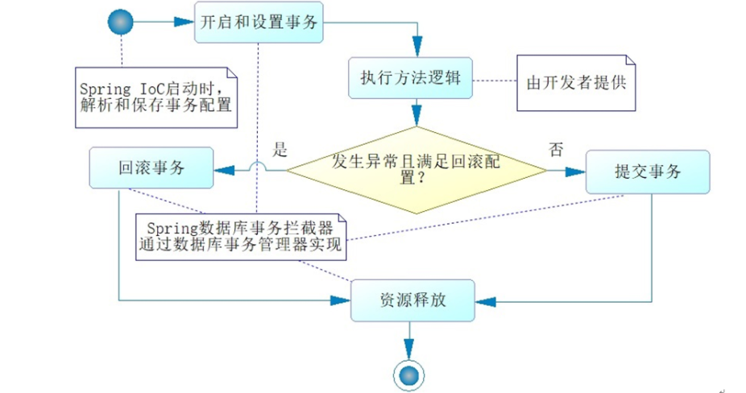
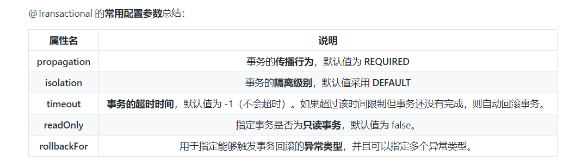
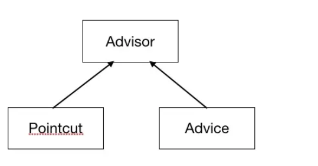
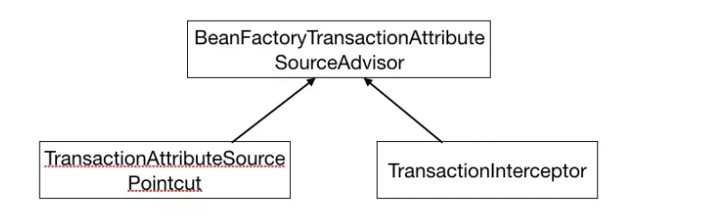

[TOC]
#Spring 事务用法示例与实现原理


##基础

###1.概述

注意：程序是否支持事务首先取决于数据库，比如使用MySql的话，如果选择的是Innodb引擎，是可以支持事务的，但是如果使用的是myisam引擎的话那就是不支持事务的。

>Mysql如何保证原子性的？
如果想要保证事务的原子性，就需要在异常发生时，对已经执行的操作进行**回滚**，在mysql中，恢复机制是通过**回滚日志**(undo log)实现的，所有**事务**进行的修改都会**先记录到这个回滚日志**中，然后在执行相关的操作。如果执行过程中遇到异常的话，可以直接利用**回滚日志**中的信息将数据回滚到修改之前的样子即可！并且回滚日志会会**先于**数据数据持久化到磁盘上。这样就保证了即使遇到数据库突然宕机等情况，当用户再次启动数据库的时候，数据库还能够通过**查询回滚日志**来回滚之前未完成的事务。


##Spring 管理事务的方式

Spring 对事务的支持有两种。
1. **编程式**事务：在代码中**硬编码**（不推荐使用）
2. **声明式**事务：在**配置文件**中配置（推荐使用）

Spring 数据库事务是通过**AOP**技术 提供服务的， AOP将除去SQL之外**公共的代码**抽离出来单独实现。 Spring数据库事务通常多采用 **声明式**事务，编程式事务已经用的不多了。


声明式事务又分为两种：
1.基于**XML**的声明式事务。
2.基于**注解**的声明式事务。

###编程式事务管理
通过 TransactionTemplate 或者 TransactionManager 手动管理事务，实际应用中很少使用。

使用TransactionTemplate 进行编程式事务管理的示例代码如下：

```java
@Autowired
private TransactionTemplate transactionTemplate;
public void testTransaction() {
	// 执行事务
    transactionTemplate.execute(new TransactionCallbackWithoutResult() {
        @Override
        protected void doInTransactionWithoutResult(TransactionStatus transactionStatus) {
            try {
                // 业务代码
            } catch (Exception e){
                // 回滚
                transactionStatus.setRollbackOnly();
            }
        }
    });
}
```


使用TransactionManager 进行编程式事务管理的实例代码如下：
```java
@Autowired
private PlatformTransactionManager transactionManager;

public void testTransaction() {
    TransactionStatus status = transactionManager.getTransaction(new DefaultTransactionDefinition());
    try {
        // ...业务代码
        transactionManager.commit(status);
    } catch (Exception e) {
        transactionManager.rollback(status);
    }
}
```


### 声明式事务管理

推荐使用（代码侵入性最小），实际上通过使用AOP实现（基于@Transactional的全注解方式使用最多）。

#### 概述

Spring 数据库的事务约定如下：


**声明式事务的优缺点**：

* 优点：不需要再业务逻辑代码中编写事务相关代码，只需要再配置文件配置或使用注解(@Transaction),这种方法没有侵入性
* 缺点：声明式事务的最细粒度作用在**方法**上，如果像代码块也有事务需求，只有变通下，将代码块变为方法。


#### @Transactional注解概述

对于 **声明式事务**，Spring 通过注解 @Transactional 进行标注，告诉Spring 在什么地方启动数据库事务功能，这个注解可以标注到 **方法，类或接口上。**
@Transactional 还可以配置**隔离级别和传播行为**等。 无论异常与否，Spring
都会释放事务。

@Transactional 注解使用的范围：

方法 ：推荐将注解使用于方法上，注意：该注解只能应用到**public** 方法上，否则不生效。
类 ：如果这个注解使用在类上的话，表明该注解对该类中**所有的 public 方法**都生效。
接口 ：不推荐在接口上使用。


使用 @Transactional 注解进行事务管理的实例代码如下：
```java
@Service
public class UserServiceImpl implements UserService {

    @Autowired
    private UserDao userDao = null;

    
    // 定义了隔离级别和超时时间
    @Transactional(isolation = Isolation.READ_COMMITTED, timeout = 1)
    @Override
    public int insertUser(User user) {
        return userDao.insertUser(user);
    }

    
    @Transactional(isolation = Isolation.READ_COMMITTED, timeout = 1)
    @Override
    public User getUser(Long id) {
        return userDao.getUser(id);
    }
}
```
**@Transactional** 源码如下，可以看看可以配置哪些东西。
```java
package org.springframework.transaction.annotation;

import java.lang.annotation.Documented;
import java.lang.annotation.ElementType;
import java.lang.annotation.Inherited;
import java.lang.annotation.Retention;
import java.lang.annotation.RetentionPolicy;
import java.lang.annotation.Target;
import org.springframework.core.annotation.AliasFor;

@Target({ElementType.TYPE, ElementType.METHOD})
@Retention(RetentionPolicy.RUNTIME)
@Inherited
@Documented
public @interface Transactional {
    // 通过bean name指定事务管理器
    @AliasFor("transactionManager")
    String value() default "";

    // 同value属性
    @AliasFor("value")
    String transactionManager() default "";

    // 指定传播行为
    Propagation propagation() default Propagation.REQUIRED;

    // 指定隔离级别
    Isolation isolation() default Isolation.DEFAULT;

    // 指定超时时间
    int timeout() default -1;

    // 是否只读事务
    boolean readOnly() default false;

    // 下面是关于异常回滚的内容
    Class<? extends Throwable>[] rollbackFor() default {};

    String[] rollbackForClassName() default {};

    Class<? extends Throwable>[] noRollbackFor() default {};

    String[] noRollbackForClassName() default {};
}

```




#### @Transactional注解原理
@Transactional 的工作机制是基于 AOP 实现的，AOP 又是使用动态代理实现的。如果目标对象实现了接口，默认情况下会采用 JDK 的动态代理，如果目标对象没有实现了接口,会使用 CGLIB 动态代理。

createAopProxy() 方法决定了是使用 JDK 还是 CGLIB 来做动态代理，源码如下：
```java
public class DefaultAopProxyFactory implements AopProxyFactory, Serializable {

    @Override
    public AopProxy createAopProxy(AdvisedSupport config) throws AopConfigException {
        if (config.isOptimize() || config.isProxyTargetClass() || hasNoUserSuppliedProxyInterfaces(config)) {
            Class<?> targetClass = config.getTargetClass();
            if (targetClass == null) {
                throw new AopConfigException("TargetSource cannot determine target class: " + "Either an interface or a target is required for proxy creation.");
            }
            // 用JDK动态代理
            if (targetClass.isInterface() || Proxy.isProxyClass(targetClass)) {
                return new JdkDynamicAopProxy(config);
            }
            // 用CGLIB代理
            return new ObjenesisCglibAopProxy(config);
        }
        else {
            return new JdkDynamicAopProxy(config);
        }
    }
    //.......
}
```

**声明式事务原理**：如果一个类或者一个类中的public 方法上被标注@Transactional 注解的话，Spring 容器就会在 启动的时候为其创建一个代理类， 在 **调用被@Transactional注解的public方法的时候，实际调用的是TransactionInterceptor类中的invoke()方法**。这个方法的作用就是在 目标方法之前开启事务，方法的执行过程中如果遇到异常的时候回滚事务，方法调用完成之后提交事务。

TransactionInterceptor 类中的 invoke() 方法内部实际调用的是 TransactionAspectSupport 类的 invokeWithinTransaction() 方法。由于新版本的 Spring 对这部分重写很大，而且用到了很多响应式编程的知识，这里就不列源码了。


####Spring Aop方法自调用问题

若同一类的其他**没有@Transactional注解的方法内部调用有@Transactional注解的方法，有@Transactional注解方法的事务会失效**。


这是由于 Spring AOP 方式实现代理的原因造成的，因为只有当 @Transactional 注解的方法在**类以外**被调用的时候，Spring 事务管理才生效。

例如下面的MyService类method1()方法调用method2()就会导致method2()的事务失效。

```java
@Service
public class MyService {
    // 普通方法
    private void method1() {
		// 调用事务方法
        method2();
        //......
    }
    // 事务方法    
    @Transactional
    public void method2() {
        //......
    }
}
```

解决办法就是避免同一类中自调用或者使用 AspectJ 取代 Spring AOP 代理。


### Spring 事务管理实现接口
Spring 框架中，事务管理相关最重要的3个接口如下：

* PlatformTransactionManager:事务管理器，Spring 事务策略的核心，
* TransactionDefinition：事务定义信息（事务隔离级别，传播行为，超时，只读，回滚规则）
* TransactionStatus：事务运行状态。

https://github.com/nanodaemony/ShiftJava/blob/master/H%20Spring/E%20Spring%E4%BA%8B%E5%8A%A1.md


## 实现原理
关于Spring事务的实现原理，是使用**AOP**实现的，AOP 在进行解析的时候，最终会生成一个Advisor对象，这个 Advisor对象中封装了织面织入所需要的所有信息，其中就包括最重要的两个部分就是 Pointcut 和 Adivce属性。 这里Pointcut 用于判断目标bean是否需要织入当前切面逻辑；Advice则封装了需要织入的切面逻辑。 如下这三个部分的简要关系图：


同样的，对于Spring 事务，其既然是使用Spring Aop实现的，同样会有这三个成员。
注册的Advisor和Advice（即BeanFactoryTransactionAttributeSourceAdvisor和TransactionInterceptor）

而Pointcut则在**BeanFactoryTransactionAttributeSourceAdvisor**的源码可以发现，其内部声明了一个**TransactionAttributeSourcePointcut**类型的属性，并且直接在内部进行了实现，这就是我们需要找的Pointcut。这里这三个对象对应的关系如下：



###Spring事务值切点解析详解
https://my.oschina.net/zhangxufeng/blog/1943983


###Spring事务实现原理详解
https://my.oschina.net/zhangxufeng/blog/1973493

###Spring事务传播性
https://my.oschina.net/zhangxufeng/blog/1942450


###Spring 事务隔离级别详解
https://my.oschina.net/zhangxufeng/blog/1942110


