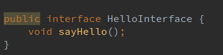
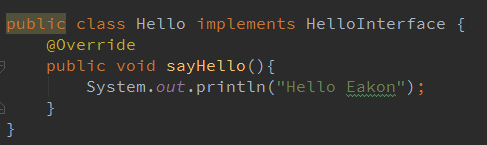
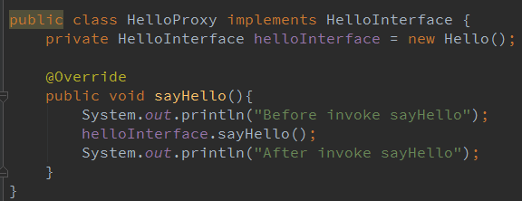
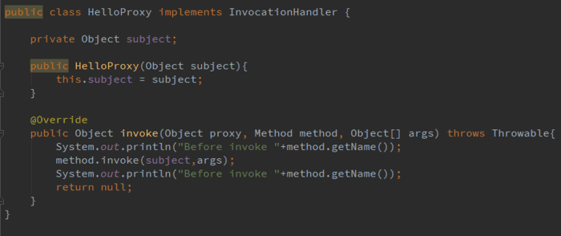
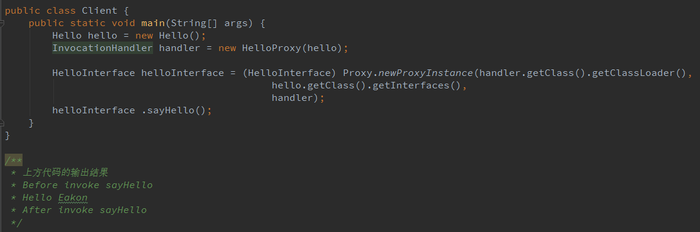

[TOC]
#Spring代理介绍
Java中代理的实现一般分为三种:JDK静态代理，JDK动态代理以及CGLIB动态代理。
在Spring的AOP实现中，主要应用了JDK动态代理以及CGLIB动态代理。

代理一般实现的模式为JDK静态代理：创建一个接口，然后创建被代理的类实现该接口并且实现该接口中的抽象方法。之后再创建一个代理类，同时使其也实现这个接口。在代理类中持有一个被代理对象的引用，而后在代理类方法中调用该对象的方法。

其实就是代理类为被代理类预处理消息、过滤消息并在此之后将消息转发给被代理类，之后还能进行消息的后置处理。代理类和被代理类通常会存在关联关系(即上面提到的持有的被带离对象的引用)，代理类本身不实现服务，而是通过调用被代理类中的方法来提供服务。

##静态代理
接口

被代理类

代理类

静态代理的缺点是一个类就需要创建一个代理类。比较繁琐。
##JDK动态代理
接口

被代理类

代理类

测试类以及输出结果

JDK动态代理其实也是基本接口实现的。因为通过接口指向实现类实例的多态方式，可以有效地将具体实现与调用解耦，便于后期的修改与维护，
JDK动态代理是利用反射机制在运行时创建代理类的。 其实在动态代理中，核心是InvocationHandler。每一个代理的实例都会有一个关联的调用处理程序(InvocationHandler)。对待代理实例进行调用时，将对方法的调用进行编码并指派到它的调用处理器(InvocationHandler)的invoke方法。所以对代理对象实例方法的调用都是通过InvocationHandler中的invoke方法来完成的，而invoke方法会根据传入的代理对象、方法名称以及参数决定调用代理的哪个方法。
##深入理解CGLIB动态代理机制
cglib是一个强大的，高性能的代码生成包，它广泛被许多AOP框架使用，为他们提供方法的拦截。下图是我网上找到的一张Cglib与一些框架和语言的关系：
