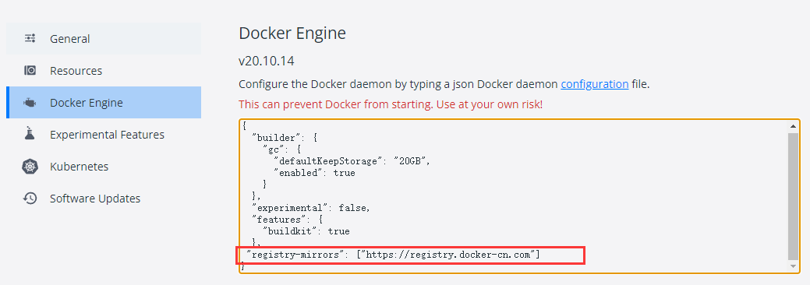
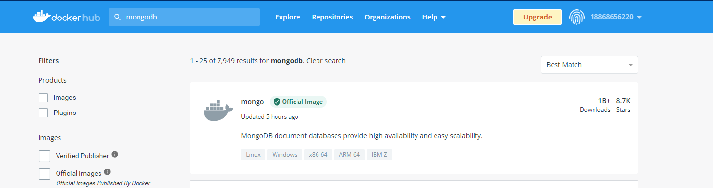
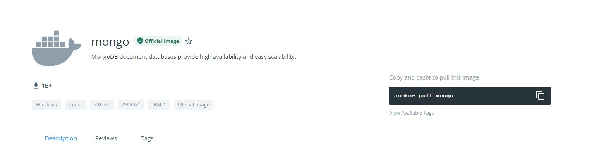
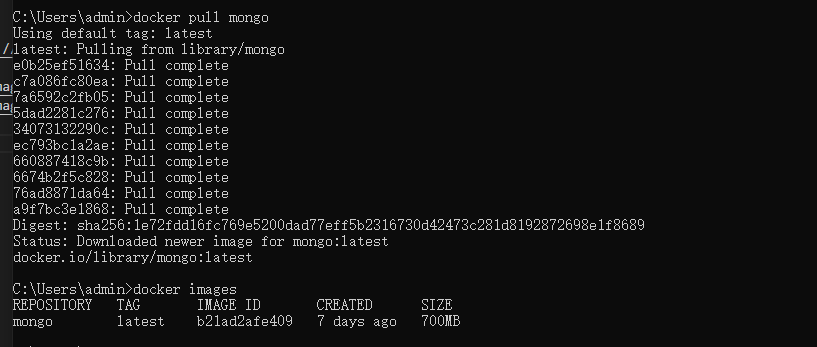

[toc]
# Docker 操作

为了学习《玩转Spring全家桶》后续的开发环境要配置MonggoDB和Redis，因此，记录下在win10下安装Docker，以及如何启动MongDB。


## Docker安装

```
https://www.docker.com

```
访问Docker的官方网站,当前 docker 默认都是安装docker desktop，


安装好docker desktop后，为了保证下载速度，配置一下国内镜像



可在dockerhub 上搜索镜像,并根据它右侧的下载指令下载镜像

```
https://hub.docker.com/
```





