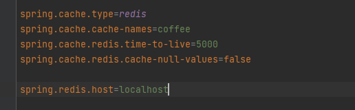
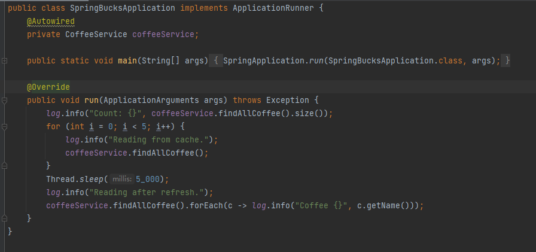

[toc]

# REDIS


Redis 是一款开源的内存KV存储，支持多种数据结构
* https：//redis.io

Spring 对Redis 的支持
* Spring Data Redis
  * 支持的客户端 Jedis / Lettuce
  * RedisTemplate
  * Repository支持


# Jedis 客户端的简单使用
* Jedis 不是线程安全的
* 通过JedisPool获得Jedis 实例
* 直接使用Jedis 中的方法


#Redis docker 安装

安装镜像命令：
```
docker pull redis
```


创建镜像容器
1. 创建volume
```
docker volume create --name myredis
```

2. 创建镜像容器
```
docker run --name redis -p 6379:6379 -v myredis:/data -d redis
```
--name: 容器
-d: 使用指定的镜像在后台运行容器
-p: 宿舍机端口与容器端口映射
-v: 挂载，经容器中的redis持久化数据挂载到宿舍机，避免容器重启导致的数据丢失


# 通过Spring Boot 配置Redis 缓存







