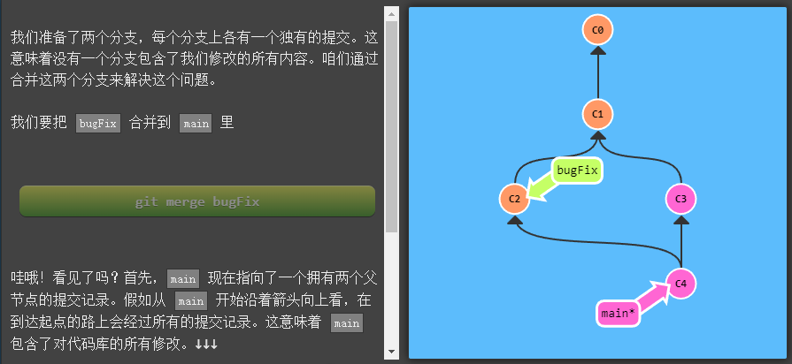

[toc]

# Git 基本命令


## 1. Git Commit


## 2. Git Branch


如果你想创建一个新的分支同时切换到新创建的分支的话，可以通过 
```
git checkout -b <your-branch-name> 
```
来实现。


## 3. Git Merge


merge 前：


merge 后：



最终：


## 4.Git Rebase


rebase前：

rebase后：


## 5. 分离Head


## 6. 相对引用


HEAD 从 C3 变成了C2，然后到C1,最后到C0


## 7. “~”操作符


## 8. 撤销变更

### Git Reset
撤销前：

撤销后：


### Git Revert


#  整理提交记录


## 1.git cherry-pick


## 2.交互式rebase


# 本地栈式提交


## 提交的技巧


## 提交的技巧2


## Git Tags


## Git Describe


# 选择父提交记录


# 纠缠不清的分支


