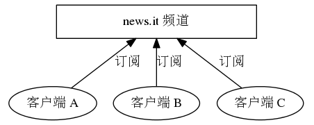
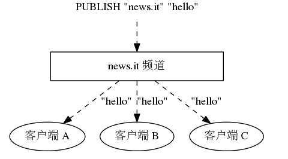
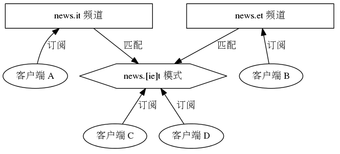
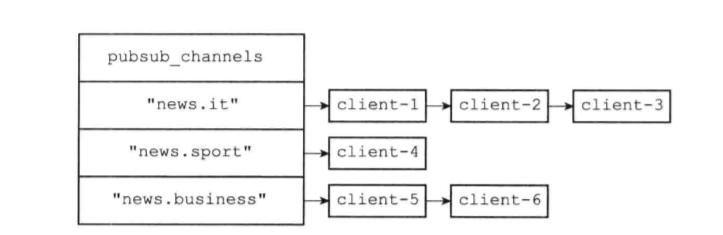
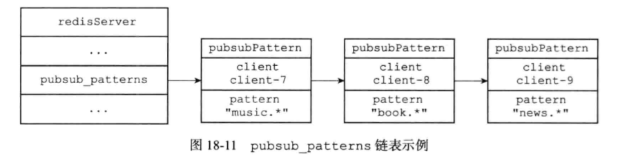

# 发布与订阅

* Redis 的发布与订阅由 ==PUBLISH,SUBSCRIBE,PSUBSCTIBE==
* 通过SUBSCRIBE命令，客户端可以订阅一个或多个频道，从而称为这些频道的订阅者（subscriber）：每当有其他客户端向被订阅的频道发送消息时，频道的所有订阅者都会受到这条消息
* PUBLISH命令可以向指定的频道发送消息
* 例子：
  * 客户端A,B,C通过SUBSCRIBE "news.it"命令订阅news.it频道
  *   
  * 某个客户端执行PUBLISH "news.it" "hello"命令向news。it频道发送消息hello，那么订阅者客户端A,B,C都会收到消息
  *   
  * PSUBSCRIBE命令可以订阅一个或多个模式，只要是模式匹配的频道的消息都会收到
  * 例子：
    * 客户端C,D订阅news.[ie]t模式，某个客户端向news.it频道发送消息，客户端C,D也可以收到
    *   


## 18.1 频道的订阅与退订
* 服务器的redisServer中有dict *pubsub_channels字典，字典的键是频道，值是链表，记录所有订阅这个频道的客户端
* 客户端向服务器发送命令（可以订阅/退订多个频道）：
  * 订阅频道： SUBSCRIBE "news.it" "news.movie"
  * 退订频道:  UNSUBSCRIBE "news.it" "news.movie"
* 如果订阅的频道在pubsub_channels中没有，则创建键，如果某个频道没有订阅者则删除键
*    


## 18.2 模式的订阅与退订
* 服务器的redisServer中有list *pubsub_patterns链表，用于保存所有模式订阅关系
* 链表每个节点有两个属性，分别是订阅这个模式的客户端redisClient和订阅的模式
* 客户端向服务器发送命令:
  * 订阅模式：PSUBSCRIBE "news.*"
  * 退订模式：PUNSUBSCRIBE "NEWS.*"
*   


## 18.3 发送消息
* 当一个Redis客户端执行```PUBLISH <channel> <message>```命令将消息message发送给频道channel的时候，服务器需要执行以下两个动作
  * 将消息message发送给channel频道的所有订阅者
    * 服务器会在pubsub_channels字典中查找channel键的所有值（订阅的客户端）
  * 如果有一个或多个模式pattern与频道channel相匹配，那么将消息message发送给pattern模式的订阅者
    * 服务器遍历pubsub_patterns链表，查找与channel频道匹配的模式
