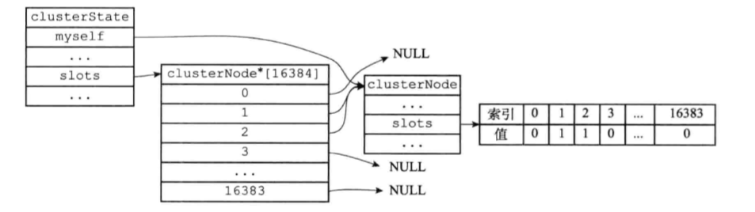

#集群


##17 集群
* Redis集群是Redis提供的分布式数据库方案，集群通过分片（sharding）来进行数据共享，并提供复制和故障转移功能。
* **集群和哨兵的区别**：
  * 集群目的是解决单机Redis内存有限和并发问题，哨兵目的是高可用性。
  * 哨兵中每个实例是全量存储，集群是分布式存储，可以最大化利用内存。

##17.1 节点
* Redis集群通常有多个节点（node）组成，可以使用命令将原本独立的节点连接起来
* 客户端使用命令： ```Cluster MEET <ip> <port>```,可以让node节点与执行的ip:port 进行握手（handshake），将其添加到当前集群中
*   


##17.1.1 启动节点
* 一个节点就是集群模式下的服务器，根据配置文件cluster-enabled决定是否为yes是开启服务器的集群模式
* 节点可以执行单机模式中的所有功能，如
  * 文件事件处理器处理命令请求和返回命令回复
  * 时间事件处理器来执行serverCron函数，而serverCron函数又会调用集群模式特有的 clusterCron函数，clusterCron函数负责执行在集群模式下需要执行的常规操作
  * 使用数据库来保存键值对数据
  * 使用RDB持久化模块和AOF持久化模块
  * 发布与订阅模块来执行PUBLISH,SUBSCRIBE 等命令。
  * 节点的复制工作
  * 执行客户端输入的Lua脚本
  * 集群模式下会使用clusterState结构，clusterNode结构，clusterLink结构


##17.1.2 集群数据结构
* 每个节点使用clusterNode结构保存节点的自己的当前状态，并为集群中其他节点都创建相应的clusterNode
```C
struct clusterNode {

    // 创建节点的时间
    mstime_t ctime;

    // 节点的名字，由 40 个十六进制字符组成
    // 例如 68eef66df23420a5862208ef5b1a7005b806f2ff
    char name[REDIS_CLUSTER_NAMELEN];

    // 节点标识
    // 使用各种不同的标识值记录节点的角色（比如主节点或者从节点），
    // 以及节点目前所处的状态（比如在线或者下线）。
    int flags;

    // 节点当前的epoch，用于实现故障转移
    uint64_t configEpoch;

    // 节点的 IP 地址
    char ip[REDIS_IP_STR_LEN];

    // 节点的端口号
    int port;

    // 保存连接节点所需的有关信息
    clusterLink *link;

    // ...
};
```
* clusterNode 结构中的clusterLink *link属性记录连接的其他节点状态，和redisClient类似
* clusterLink 和redisClient异同：二者都有套接字描述符和输入，输出缓存区，但是redisClient用于客户端，clusterLink用于连接节点
```c
typedef struct clusterLink {

    // 连接的创建时间
    mstime_t ctime;

    // TCP 套接字描述符
    int fd;

    // 输出缓冲区，保存着等待发送给其他节点的消息（message）。
    sds sndbuf;

    // 输入缓冲区，保存着从其他节点接收到的消息。
    sds rcvbuf;

    // 与这个连接相关联的节点，如果没有的话就为 NULL
    struct clusterNode *node;
} clusterLink;

```
* 每个节点下都有一个clusterState，记录当前节点的视角下，集群的状态：
  * 集群是在线还是下线
  * 集群包含多少个节点
  * 集群当前的配置纪元
* clusterState是这里最大范围的结构，每个节点一个的clusterState会存储各个clusterNode结构对应集群中其他各个节点）
```c
typedef struct clusterState {
    
    // 指向当前节点的指针
    clusterNode *myself;

    // 集群当前的配置纪元，用于实现故障转移
    uint64_t currentEpoch;

    // 集群当前的状态：是在线还是下线
    int state;

    // 集群中至少处理着一个槽的节点的数量
    int size;

    // 集群节点名单（包括 myself 节点）
    // 字典的键为节点的名字，字典的值为节点对应的 clusterNode 结构
    dict *nodes;

    // ...
} clusterState;
```
* 某个节点视角的集群图：
*   


##17.1.3 Cluster MEET命令的实现
* 向节点A发送```CLUSTER MEET <ip> <port>```让其将节点B添加到节点A的集群里，步骤如下：
  * 节点A收到命令后为节点B创建clusterNode结构，添加到clusterState.nodes 字典中
  * 节点A根据CLUSTER MEET命令给定的IP地址和端口号，向节点B发送一条MEET消息（message）
  * 如果顺序，节点B接收到MEET消息，为节点A创建clusterNode结构，添加到clusterState.nodes字典里
  * 节点B向节点A返回PONG消息
  * 如果顺利，节点A接收到PONG消息，向节点B发送PING消息
  * 如果顺利，节点B接收到PING消息，握手完成
  *   
  * 握手后，节点A将节点B的信息通过Gossip协议传播给集群中其他节点


##17.2 槽指派
* Redis集群使用分片的方式保存键值对：
  * 集群的整个数据库被分为16384个槽（slot），数据库的每个键都属于这16384个槽的其中一个，集群中的每个节点可以处理0个或最多16384个槽。
  * 当数据库的16384个槽都有节点在处理时，集群处于上线状态（ok）；相反地，如果数据库中有任何一个槽没有得到处理，那么集群处于下线状态（fail）。
  * 前面都没有指派（assign）slot所以集群处于下线状态
  * 向节点发送命令指派其负责slot：```CLUSTER ADDSLOTS <slot>[slot...],```
    * 如 127.0.0.1：7000>CLUSTER ADDSLOTS 0 1 2 3 4...5000
    * 指派127.0.0.1负责0-5000的slot

###17.2.1 记录节点的槽指派信息
* clusterNode 的slots属性和numslot属性记录节点负责的slot
```c
struct clusterNode {
    ...
    
    unsigned char slots[16384/8];
    
    int numslots;
    
    ...
};

```
* slots属性：
  * 二进制数组，16384/8=2048字节，供16384个二进制位
  * 索引i上为1代表节点slot i
  * 如下图，节点负责slot 0-7
  *   
  * numslots属性：
    * 记录节点负责slot的数量，也是slots数组中1的数量

###17.2.2 传播节点的槽指派信息
* 每个节点都会讲自己的slots数组通过消息发送给其他节点
* 当节点A接收到节点B的slots数组，则节点A在自己的clusterState.nodes字典中查找节点B的clusterNode，并且将接收到的slots数组保存/更新到该clusterNode的slots数组


###17.2.3记录集群所有槽的指派信息
* ==经过传播信息，每个节点都会记录集群所有节点负责的slots，保存在每个节点的clusterState的slots数组==（不会nodes字典保存的数组）
```c
typedef struct clusterState {
    ...
    clusterNode *slots[16384];
    ...
} clusterState;
```
* clusterState.slots数组每一项都是指向clusterNode结构的指针
* slots[i]指针只想节点B的clusterNode结构，代表slot i指派给了节点B
* 例如，节点A的视角的clusterState.slots示意图：
*   
* clusterState.slots数组记录集群中所有slot的指派信息，clusterNode.slots数组记录clusterNode结构负责的slot信息
* clusterState.slots数组在查询某个slot由**哪个节点负责**时是O(1),clusterNode.slots数组在查询某个节点负责的所有slot时比较方便


###17.2.4 CLUSTER ADDSLOTS命令的实现

CLUSTER ADDSLOTS 命令接收一个多个槽作为参数，并将所有输入的槽指派给接收该命令的节点负责：
```CLUSTER ADDSLOTS <slot> [slot ...] ```

* 举个例子，下图展示了一个节点的clusterState结构，clusterState.slots数组中的所有指针都指向NULL，并且clusterNode.slots数组中的所有二进制位的值都是0，这说明当前节点没有被指派任何槽，并且集群中的所有槽都是未指派的。
  
* 当客户端对节点执行命令：CLUSTER ADDSLOTS 1 2
* 将槽1和槽2指派给节点之后，接待你的clusterState结构将被更新成下图所示：
  * clusterState.slots数组在索引1和索引2上的指针指向了代表当前节点的clusterNode结构
  * clusterNode.slots数组在索引1和索引2上的位被设置成了1
    


## 17.3 ==在集群中执行命令==
* 所有slot指派后，集群进入上线状态，客户端可以向节点发送命令
* 接收到命令的节点根据命令请求中数据库键属于哪个slot，而做出两种操作：
  * 如果键所在的slot由当前节点负责，则直接执行命令
  * 如果不是当前节点负责，则判断键由哪个节点负责，返回给客户端MOVED错误，指引客户端转向（redirect）正确的节点，并在此发送命令
* 从key计算对应slot：
  * CRC16(key) & 16383
  * CRC16用于计算key的校验和
  * 使用 ```CLUSTER KEYSLOT<key> ```命令查看一个给定键属于哪个槽 
* 上面判断key属于哪个slot i时，访问clusterState.slots[i]是否等于自己，不等于的时候节点会根据clusterState.slots[i]只想的clusterNode结构所记录的节点IP和端口号，向客户端返回MOVED错误，指引客户端转向至正在处理槽i的节点。
* 节点接收命令流程图：
    
* MOVED错误的格式为：```MOVED <slot> <ip>:<port>```
    * 其中slot为键所在的槽，而ip和port则是负责处理槽slot的节点的IP地址和端口号
* 客户端发送命令示意图
    
  


### 17.3.4 节点数据库的实现

* 集群节点保存键值对以及键值对过期时间的方式，与单机数据库一样，区别在于：节点只使用0号数据库，而单机数据库没有限制
* 此外节点还会用 clusterState结构中的slots_to_keys跳跃表来保存槽与键之间的关系：
  * 跳跃表的clusterState中slots_to_keys跳跃表用来保存slot和key之间的关系
    * 跳跃表的key是数据库键，分数是数据库键所在的slot
    * 利用跳跃表的性质，可以实现批量操作
    * ``` CLUSTER GETKEYSINSLOT <slot> <count> ```返回最多count个属于slot i的数据库键
  *   
  * 上面键“book”所在跳跃表的分值为1337，说明book所在的槽为1337（前面数据结构这部分连上了）

* **集群存储数据库键比单机数据库多了slot属性，自然要多一个数据结构用来存储key与slot的关系**


  

## 17.4 重新分片
* Redis集群的重新分片操作可以将任意数量已经指派给某个节点的槽改为指派给另一个节点，并且相关槽所属的键值对也会从源节点被移动到目标节点。
* 重新分片操作可以在线(online)进行，在重新分片的过程中，集群不需要下线，并且源节点和目标节点可以继续处理命令请求。
* **重新分片的实现原理**：
  * Redis的集群管理软件 redis-trib负责执行的，迁移键的过程：
    

* **重新分片的过程**：
  


## 17.5 ASK错误
* 重新分片期间，源节点向目标节点迁移一个槽的过程中，可能 会出现这样一种情况：属于被迁移槽的一部分键值对保存在源节点里，而另一部分键值对则保存在目标节点里面。
* 当客户端向源节点发送一个与数据库键有关的命令，并且命令要处理的数据库键恰好就属于正在被迁移的槽时：
    
* ASK错误指引客户端转向正在导入slot的目标节点
* MOVED错误和ASK错误区别:
  * MOVED错误表示slot的负责权已经从一个节点转移到了另一个节点
  * ASK错误只是两个节点在迁移slot的过程中的临时措施

* **clusterState**
  
```c
typedef struct clusterState{
     //...
        clusterNode *importing_slots_from[16384];
        clusterNode *migrating_slots_to[16384];
     //...
}clusterState;

```
* importing_slots_from 数组存储了当前节点正在从其他节点导入的槽
* migrating_slots_to 数组记录了当前节点正在迁移至其他节点的槽
* 如果节点收到一个关于键key的命令请求，并且键key所属的槽i指派给了这个节点，节点会尝试在自己的数据库里查找键key，如果没有找到，检查自己的clusterState.migrating_slots_to[i],查看是否槽i是否在进行迁移，是否是的话，发送ASK错误，引导客户端到正在导入槽i的节点去查找键key。  而接到ASK错误的客户端会根据错误提供的IP地址和端口号，转向至正在导入操的目标节点，然后向目标节点发送ASKING命令，之后重新发送原本想要执行的命令

* MOVED错误和ASK错误区别
  * MOVED错误表示slot的负责权已经从一个节点转移到另一个节点
  * ASK错误只是两个节点在迁移slot的过程中的临时措施
## 17.6复制与故障转移
* Redis集群中的节点分为主节点(master)和从节点（slave），其中主节点用于处理槽，而从节点负责复制某个主节点，当被复制的主节点下线时，代替下线主节点继续处理命令请求。

### 17.6.1复制
> CLUSTER REPLICATE <node_id>
该命令让接收命令的节点成为node_id所指定节点的从节点，并开始对主节点进行复制
* clusterNode有几个属性，分别在表示主节点或从节点时才有值：
```C
struct clusterNode {
    ...
    
    //只有是从节点对应的clusterNode才有值
    //指针，指向这个从节点的主节点
    struct clusterNode *slaveof;
    
    //只有是主节点对应的clusterNode才会有值
    //正在复制这个主节点的从节点数量
    int nuslaves;
    //数组，每个数组项指向正在复制这个主节点的从节点的clusterNode
    struct clusterNode **slaves;
    ...
};

```
* 设置从节点步骤:
  * 向一个节点发送命令：```CLUTER REPLICATE <node_id>```,node_id是指定的主节点
  * 收到命令的节点会在自己的 clusterState.nodes字典中找到node_id所对应的节点的clusterNode结构，并将自己的cluterState.myself.slaveof 指针指向这个结构，以此来记录这个节点正在复制的主节点。
  * 节点修改自己的clusterState.myself.flags中的属性，从REDIS_NODE_MASTER修改为REDIS_NODE_SLAVE,表明自己已称为从节点
  * 目标节点根据slaveof指向的clusterNode结构所保存的ip和port，对主节点进行复制

* port:7004的节点称为port:7000的从节点示意图
  * 从节点7004是节点7000的从节点，
    

* 任意节点clusterState.node 中主节点7000示意图，（所有节点的clusterState.node中节点7000对应的clusterNode都是这样）：
  * slaves数组：存储指向这个主存点的从节点的指针
  * numslaves：从节点数量
  


### 17.6.2 ==故障检测==
* ==集群中每个节点都会定期向其他节点发送PING消息，如果规定时间内没有收到回复PONG,则将其标记为疑似下线==
  * 例如，节点7001向节点7000发送PING消息，如果没回复，则节点7001在自己的clusterState.nodes字典中找到节点7000的clusterNode，然后在结构的flags属性中打开REDIS_NODE_PFAIL标识，  

* ==集群中的各个节点会通过互相发送消息的方式来交换集群中各个节点的状态信息，例如某个节点是处于在线状态，还是疑似下线状态（PFAIL），还是已下线状态(FAIL)==
* 例如， 当节点7001通过节点7002和节点7003消息知道节点7000疑似下线。则节点7001为节点7000的clusterNode创建下线报告，如下图
* 其中，节点7001存储的节点7000的clusterNode的fail_reports属性：链表，记录所有下线报告
* 链表元素clusterNodeFailReport：包括认为节点7000疑似下线的节点7002/7003的clusterNode，和收到消息的时间戳
   
 
 * 一个集群中，半数以上处理slot的主节点会将某个节点标记为疑似下线，那么这个节点将被标记为已下线（FAIL）
   * 将某个主节点标记为FAIL后，会向集群广播该消息，收到该消息的节点也会将这个节点标记为FAIL，如图：
    


### 17.6.3故障转移
* 当从节点发现自己复制的主节点FAIL时，从节点对主节点进行故障转移，步骤如下：
  * 从所有复制FAIL主节点的从节点中选举一个节点，执行SLAVEOF no one，成为新的主节点
  * 新主节点会将FAIL主节点的slot全部指派给自己
  * 新主节点向集群广播PONG消息，让其他节点知道这个节点成为新主节点，并且已经接管了FAIL主节点的slot
  * 新主节点接收处理负责的slot的命令请求，故障转移完成

### 17.6.4 选举新的主节点
* 选举方式和选举领头Sentinel类似
  * 当从节点发现正在复制的主节点FAIL，会向集群广播消息，要求所有具有投票权的主节点向这个节点投票
  * 主节点具有投票权，那么会投票给第一个发送消息的从节点
  * 如果有从节点获得集群中具有投票权主节点数量一半以上的票，则成为新的主节点，集群的epoch增加1
  * 如果没有获得半数以上的从节点，则再次进行选举


## 17.7 消息
* 集群中各个节点通过发送和接收消息（message）来进行通信，包括以下5种：
  * MEET消息：
    * 节点接到客户端发送的CLUSTER MEET命令时，向对应的节点发送MEET消息，将其加入集群
  * PING消息
    * 集群中的节点每隔1秒，从已知节点列表中随机选择五个节点，然后对五个节点中最久没有发送PING消息的节点发送PING消息
    * 此外，如果和某个节点没有PING的时间间隔超过了配置的下线时间的一半，也会发送PING消息
  * PONG消息
    * 节点接收到MEET消息或者PING消息时，会发送PONG消息确认接收到了
    * 此外，新的主节点成功执行故障转移操作后，会向集群广播PONG消息，让其他节点知道新主节点负责了FAIL节点的slot
  * FAIL消息
    * 一个主节点A判断另一个主节点B进入FAIL状态时，会向集群广播主节点B的FAIL消息，收到消息的节点会将主节点B标记为FAIL
  * PUBLISH消息
    * 节点接收到PUBLISH命令时，节点会执行这个命令，并广播PUBLISH消息，所有接收到PUBLISH消息的节点都会执行相同的PUBLISH命令

### 17.7.1 消息头
节点发送的所有消息都由一个消息头包裹，消息头除了包含消息正文之外，还记录了消息发送者自身的一些信息，因为这些信息也会被消息接收者用到，所以严格来讲，我们可以认为消息头本身也是消息的一部分。

每个消息头都由一个 cluster.h/clusterMsg结构表示：


### 17.7.2 MEET、PING、PONG消息的实现
Redis集群中的各个节点通过Gossip协议来交换各自关于不同节点的状态信息，其中Gossip协议由MEET、PING、PONG三种消息实现。
  