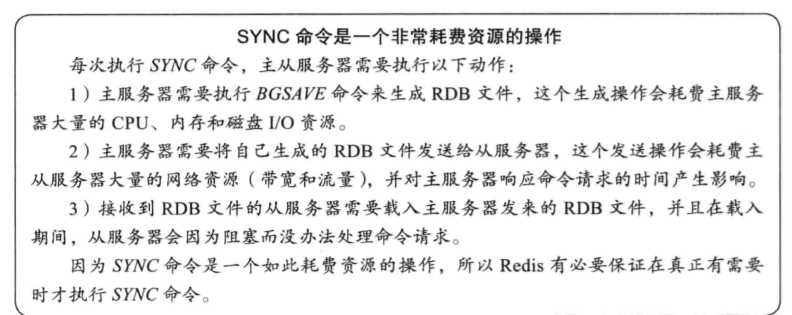
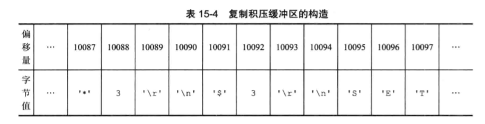

# Redis 多机数据库实现-复制

## 复制
  * 可以让一个服务器去复制（replicate）另一个服务器，被复制的称为主服务器（master），进行复制的为从服务器（slave）.
  * 命令： 127.0.0.1：123456>SLAVEOF 127.0.0.1  6379
  * 前者将成为后者的从服务器
  * 主从服务器将保存相同的数据，称为“数据库状态一致”

### 旧版复制功能
* 复制功能分为同步（sync）和命令传播（command propagate）两个操作
  * 同步：将服务器数据库更新到主服务器数据库的状态
  *  命令传播：主服务器数据库被修改，主从不一致，让主从服务器数据库重新一致

### 同步
* 客户端向从服务器发送SLAVEOF命令，要求从服务器复制主服务器，从服务器向主服务器发送SYCN命令来完成，步骤如下：
  * 从服务器相助服务器发送sync命令
  * 收到sync命令的主服务器执行BGSAVE命令，在后台生成一个RDB文件，并使用一个缓冲区记录从现在开始执行的所有写命令
  * 当主服务器的BGSAVE命令执行完毕时，主服务器会将BGSAVE命令生成的RDB文件发送给从服务器，从服务器接收并载入这个RDB文件，将自己的数据库状态更新至主服务器执行BGSAVE命令时的数据库状态
  * 主服务器将缓存器的所有写命令发送给从服务器，从服务器执行这些写命令，将自己的数据库状态更新至主服务器数据库当前所处的状态。
 
     
  

### 命令传播
* 同步操作执行完毕之后，主从服务器两者的数据库将达到一致状态，但这种一致并不是一成不变的，每当主服务器执行客户端发送的写命令时，主服务器的数据库就有可能会被修改，并导致主从服务器状态不再一致。
* 为了维护主从服务器的一致，主服务器会将执行命令进行传播，将命令发送给从服务器
* 主从服务器数据库状态再次一致

## 旧版复制功能的缺陷
* 对于从服务器第一次复制主服务器没有问题，但是处于命令传播阶段的主从服务器因为网络原因中断了，旧版复制功能再重连后会重新执行同步（SYNC）
* 虽然可以重新达到主从服务器一致，但是断线前  **同步+命令传播**  的操作没有必要再重新同步
* SYNC 命令是一个非常耗费资源的操作  

## 新版复制功能的实现
* Redis 从2.8版本开始使用新版复制功能，使用*PSYNC*命令代替*SYNC*命令
* *PSYNC*命令具有完整重同步（full resynchronization）和部分重同步（parial resynchronization)两种模式：
  * 完整重同步：用于初次复制，与SYNC命令一致
  * 部分重同步：断线后复制，若条件允许，主服务器将断线期间执行的写命令发送给从服务器，从服务器只要接收并执行这些写命令，就可以将数据库更新至主服务器当前的状态。
  *   

### 部分重同步
* 部分重同步由以下三个部分构成：
* 主服务器的复制偏移量（replication offset)和从服务器的复制偏移量。
* 主服务器的复制积压缓冲区（replication backlog）
* 服务器的运行ID

#### 复制偏移量
* 主从服务器分别维护一个复制偏移量：
  * 主服务器每次向从服务器传播N个字节数据，就将自己的复制偏移量的值加上N
  * 从服务器每次收到主服务器的N个字节数据，就将自己的复制偏移量的值加上N
* 如果主从服务器处于一致状态则 主从服务器的偏移量总是相同的
* 如果断线
*   

### 复制积压缓冲区
* 复制积压缓冲区是由主服务器维护的一个固定长度（fixed-size） 先进先出(FIFO)  队列,默认1MB(根据断线重连的时间以及主服务器每秒产生的写命令数据量决定)，若是主服务器平均每秒产生1MB的写数据，而从服务器断线之后平均要5秒才能重新连接上主服务器，则大小不能小于5MB
*   

* **当主服务器进行命令传播时，不仅将写命令发送给所有从服务器，还会将写命令入队到复制积压缓冲区**
* 从服务器重新连上主服务器时，从服务器会通过PSYNC命令将自己的复制偏移量发送给主服务器
  * 如果复制偏移量之后的数据依然存在于缓冲区，则主从服务器执行部分重同步
  * 反之，则完整重同步

### 服务器运行ID
* 部分重同步需要用到服务器运行ID(run ID)
* 每个Redis服务器，不论主服务器还是从服务，都会有自己的运行ID
* 运行ID在服务器启动时自动生成（40个随机的十六进制字符）
* 从服务器对主服务器初次复制时，主服务器会将自己的运行ID发送给从服务器
* 当从服务器断线重连时，从服务器向当前连接的主服务器发送之前保存的运行ID
  * 如果运行ID相同，说明是同一个主服务器，继续尝试部分重同步
  * 不同，则不是同一个， 执行完整重同步

## PSYNC命令的实现
* 从服务器向主服务器发送PSYNC命令的有两种：
* PSYNC？-1：从服务器没有复制任何主服务器，或者之前执行过SLAVEOF no one命令，则发送该命令请求完整重同步
* PSYNC<runid><offset>:runid 是上一次复制的主服务器运行ID，offset是从服务器的复制偏移量
* 接收到PSYNC命令的主服务器会向从服务器返回以下三种回复的其中一种
  * 主服务器返回 +FULLRESYNC <runid><offset>:
    * 主服务器将与从服务器执行完整重同步操作
    * 其中runid是主服务器的运行ID，从服务器会保存
    * offset是主服务器的当前偏移量，从服务器会将这个值作为自己的初始偏移量
  * 主服务器返回  +CONTINUE回复，
    * 表示主从服务器执行部分重同步，从服务器等待主服务器发送自己缺少的数据
  * 祝福其返回-ERR:
    * 表示主服务器版本低于Redis 2.8,无法识别PSYNC
    * 从服务器向主服务器发送SYNC命令，执行完整同步
* PSYNC命令流程图：
*   

## 复制的实现
* REDIS 2.8版本的复制功能实现的详细步骤，从初次复制开始

### 步骤1：设置主服务器的地址和端口
* 客户端会向**从服务器**发送异步命令  SLAVEOF<master_ip> <master_port>
  * 从服务器会将master_ip和master_port 存储在redisSever的masterhost属性和masterport属性种
  * 从服务器向客户端返回OK，实际的复制工作之后真正进行

### 步骤2：建立套接字连接
* 从服务器根据命令所设置的IP地址和端口号创建连向 **主服务器**的**套接字连接**
* 如果成功连接到主服务器，那么从服务器将为该 套接字关联一个专门用于复制工作的**文件事件处理器**
* 此时从服务器除了本身具有服务器的属性外，还是主服务器的客户端，主服务器会服务器创建redisClient

### 步骤3：发送PING命令
* 从服务器成为主服务器的客户端之后，发送PING命令，检查读写情况
  * 主服务器返回命令回复，但是从服务器不能再规定时限内读取到。说明网络不佳，则从服务器断开连接重新创建连向主服务器的套接字
  * 主服务器返回一个错误，说明主服务器现在无法处理从服务器的命令请求。则从服务器断开连接重新创建连向主服务器的套接字
  * 从服务器读取到"PONG"，表示正常，可以继续执行复制的下个步骤

### 步骤四：身份验证
* 从服务器接收到了“PONG”回复后，下一步要做的就是决定是否进行身份验证
  * 从服务器设置了masterauth选项，进行身份验证
  * 反之则不用
* 在需要进行身份验证时，从服务器向主服务器发送一条AUTH命令，命令的参数为从服务器masterauth选项的值
  * AUTH XXX   XXX是密码
  * 在验证时遇到的不同情况
  * 如果主服务器没有设置requirepass 选项，并且从服务器也没有设置masterauth选项，那么主服务器将继续执行从服务器发送的命令，那么继续执行复制操作
  * 如果AUTH发送的密码与主服务器requirepass 选项设置的密码相同，继续执行命令，反之则返回invalid password错误
  * 如果主服务器设置了requirepass，从服务器没有，则返回NOAUTH错误。反之，返回 no password is set
* 所有错误都将中止复制操作  

## 步骤五：发送端口信息
* 从服务器向主服务器发送自己的端口号，REPLCONF listening-port ,port-number>
* 主服务器收到后将端口号存储在redisClient 中

## 步骤六:同步
* 从服务器向主服务器发送**PSYNC**命令，执行同步操作
* 在此之前，从服务器是主服务器的客户端，在此之后二者互为客户端，这样主服务器才能向从服务器发送写命令

## 步骤7：命令传播
* 完成同步后，进入命令传播阶段

# 心跳检测
* 在命令传播阶段，从服务器默认会以每秒一次的频率，向主服务器发送命令
* **REPLCONF ACK<replication_offset>**
  * 检测主从服务器的网络连接状态（如果超过一秒钟主服务器没有收到该命令就说明连接出现了问题）
  * 辅助实现min-slaves选项（如果从服务器的数量少于3个，或者延迟打，主服务器拒绝执行写命令）
  * 检测命令丢失（**根据从服务器发送的复制偏移量检测是否有命令丢失，如果丢失就将缺少的数据重新发送**（和部分重同步类似，区别是断线与否））
  