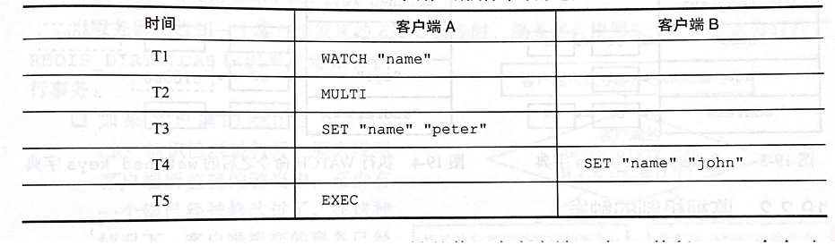
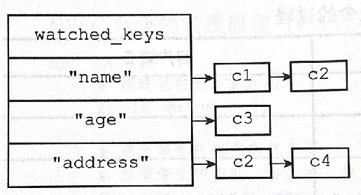
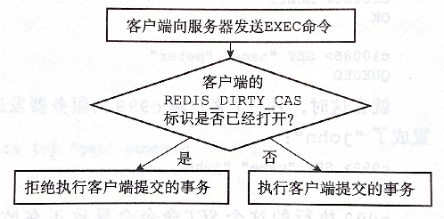

#19 事务
* Redis 通过 MULTI EXEC WATCH 等命令来实现 事务（transaction）功能。
* 事务：将多个命令请求打包，然后一次性，按顺序地执行多个命令地机制，并且在事务执行期间，服务器不会中断事务而改去执行其他客户端的命令请求（命令入队期间依然会执行其他客户端的命令请求）

##19.1 事务的实现
* 一个事务从开始到结束通常会经历以下三个阶段：
  * 1）事务开始
  * 2）命令入队
  * 3）事务执行
* **事务开始：**
  * redis>MULTI
  * multi 命令可以将执行该命令的客户端从非事务状态切换至事务状态。
  * 即，修改redisClient中flags属性，增加事务标识：redisClient.flag|=REDIS_MULTI

* **命令入队：**
  * 当一个客户端处于非事务状态时，这个客户端发送的命令会立即被服务器执行：
  * 事务状态的客户端发送EXEC,DISCARD,WATCH,MULTI四个命令以外的命令都不会立即进行，而是将这个命令放入事务队列中，然后向客户端返回QUEUED回复
    *  redis> SET "name" "The Design and Implementation of Redis"
QUEUEU
redis> GET "name"
QUEUEU
redis> SET "author" "HJH"
QUEUEU
redis> GET "author" 
QUEUEU
    * 事务队列是FIFO队列，由数组实现

* **事务执行：**
  * 处于事务状态的客户端向服务器发送EXEC命令时，EXEC命令会立即被服务器执行
  * 服务器会遍历这个客户端的事务队列，然后执行队列中的所有命令，并将这个结果全部返回客户端
    * redis>EXEC
    * "The Design and Implementation of Redis"
    * OK
    * "HJH"

## 19.2 WATCH的实现
* ==WATCH命令是一个乐观锁，可以在EXEC命令执行之前，监视任意数量的数据库键，并在EXEC命令执行时，检查监视的键是否有至少一个被修改了。如果有的话，服务器将拒绝执行事务，并向客户端返回代表事务执行失败的空回复==
* 例子，客户端B修改了name键的值，那么客户端A在执行EXEC命令时，服务器发现WATCH监视的键name被修改了，因此拒绝执行客户端A的事务，并返回(nil)空回
*   

### 19.2.1 使用WATCH命令监视数据库键
* 每个redis数据库redisDb都有dict *watched_keys字典，字典的键是被WATCH命令监视的数据库键，值是一个链表，链表记录所有监视这个数据库键的客户端
*   

### 19.2.2 监视机制的触发
* 所有对数据库进行修改的命令，如SET,LPUSH,SADD,ZRED,DEL,FLUSHDB等等，都会对watched_keys字典进行检查，查看是否有客户端正在监视刚刚被命令修改过的数据库键，、
* 如果有的话，服务器会将监视这个键的客户端redisClient.flags增加REDIS_DIRTY_CAS标识，表示该客户端的事务安全性已经被破坏

### 19.2.3 判断事务是否安全
* 服务器接收到客户端发送的EXEC命令时，会根据客户端redisClient中是否有REDIS_DIRTY_CAS标识进行决定，如图：
*   

## 19.3事务的ACID性质
* ACID: 原子性（Atomicity）、一致性（Consistency）、隔离性（Isolation）、持久性（Durability）
* AID都是数据库层面的，C是应用层。C是目的，AID是手段
  * 如果数据被改了一半（不满足A），互相干扰（I不满足），停机后丢失数据（D不满足），就肯定不可能说数据是C

* **原子性：**
  * 原子性：数据库将事务的多个操作当做一个整体来执行，要么执行，要么不执行
  * Redis的事务和传统关系型数据库事务的最大区别：
    * ==Redis不支持事务回滚机制，即使事务队列中某个命令在执行期间出现了错误，整个事务也会继续执行下去，直到将事务队列中的所有命令都执行完毕为止==
    * Redis设计者认为需要回滚的错误都是编程错误，开发中会出现，实际生产很少，没必要开发回滚机制
    * 例子：

* **一致性：**
  **“一致”**指的是数据附和数据库本身的定义和要求，没有包含非法或者无效的错误数据。
  * 关系型数据库的一致性：
    * 一致性是AID的目的，应用系统从一个正确的状态到另一个正确的状态。强调的是应用层，如：
    * 数据库的账户余额列没有任何约束，A要向B支付了100元，而A的账户中只有90元，但是业务上不允许账户余额小于0.因此支付完完成检查A的账户余额，发现余额小于0了，于是进行了事务的回滚。这样保证了执行业务前后数据库都是附和应用系统的约束的。

  * Redis的一致性：
    * 和关系型数据库类似，执行事务前后没有非法或无效的错误数据
    * 列举三种可能出错的地方，以及Redis的处理方式
      * ==入队错误==
        * 一个事务在入队命令过程中，出现了命令不存在，或者命令的格式不正确等情况，那么Redis将拒绝执行这个事务。
      * ==执行错误==
        *  有些错误不能在入队时被服务器发现的错误，这些错误只会在命令实际执行时被触发
        *  错误命令不会对数据库作任何修改，也不会对事务的一致性产生任何影响
      * ==服务器停机==
        * 执行事务期间服务器停机，不论是否持久化，数据库都是一致的

* **隔离型**
  * 隔离性：即使数据库中有多个事务并发执行，各个事务之间也不会互相影响，并发和串行执行结果相同
  * Redis使用单线程的方式执行事务，并且服务器保证执行事务期间不会对事务中断，因此事务总是以串行的方式执行，即总是具有隔离性的

* **耐久性**
  * 耐久性：一个事务执行完毕时，执行结果保存到永久性存储介质中，即使事务执行完毕后停机，执行结果也不会丢失
  * Redis耐久性措施：
  * 不使用持久化模式，肯定不具有持久性
  * 使用RDB持久化模式，因为只有在满足保存条件时才会执行BGSAVE命令，所以不具有持久性
  * 使用AOF模式，只有将appendsync选项的值设置为always，即每次执行完命令都进行AOF持久化时Redis数据库才具有持久性
  * 无论Redis在什么持久化模式下，在事务的EXEC命令之前加上一句SAVE命令，就总可以保证事务的持久性（但是效率太低，不具有实用性）
