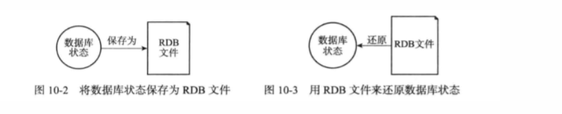
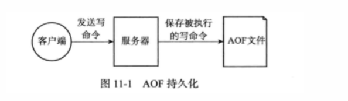
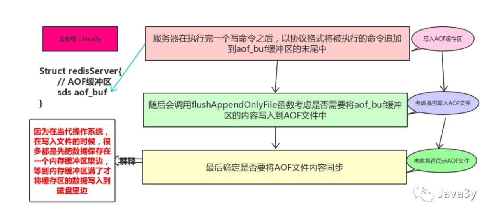
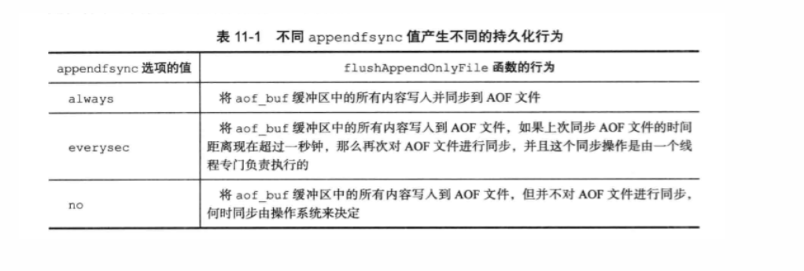
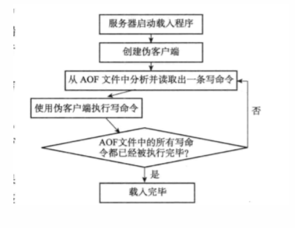
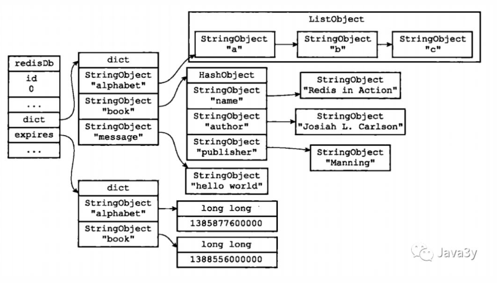
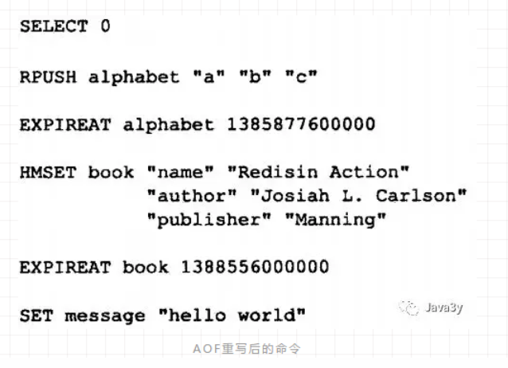
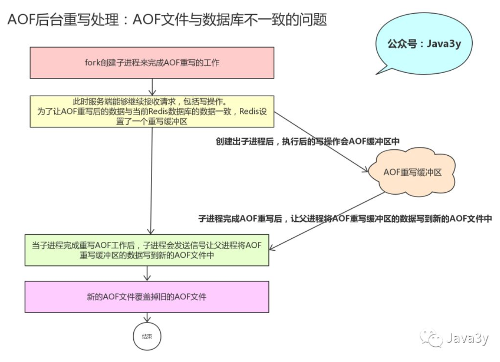

# 二.Redis持久化

​	Redis是基于内存的，如果不想办法将数据保存在硬盘上，一旦Redis重启（退出/故障），内存的数据将会全部丢失。

* 为了不想Redis里头的数据由于某些故障全部丢失，即使发生了故障也希望将Redis原有的数据恢复过来，这便是**持久化**的作用。


​	Redis提供了两种不同的**持久化方法**来讲数据存储到硬盘里边：

* RDB(基于快照)，将某一时刻的所有数据保存到一个RDB中。
* AOF(append-only-file), 当Redis服务器执行写命令的时候，将执行的写命令保存到AOF文件中。


## 2.1	RDB(快照持久化)


​		 RDB持久化可以**手动**执行，也可以根据服务器配置**定期**执行。RDB持久化所生成的RDB文件是一个经过**压缩**的二进制文件，Redis可以通过这个文件**还原**数据库的数据。



​		RDB是保存在硬盘里面的，所以即使Redis服务器进程退出，甚至运行Redis服务器的计算机停机，但只要RDB文件仍然存在，Redis服务器就可以用它来还原数据库状态。

有两个命令可以生成RDB文件：

* **SAVE** 会**阻塞** Redis 服务器进程，服务器不能接收任何请求，直到RDB文件创建完毕位置。
* **BGSAVE** 会创建出一个**子进程**，由子进程来负责创建RDB文件，服务器进程可以继续接受请求。


​		Redis服务器在启动的时候，如果发现有RDB文件，就会**自动**载入RDB文件 （不需要人工干预）

* 服务器在载入 RDB文件期间，会处于阻塞状态，直到载入工作完成。


​		除了手动调用SAVE或者BGSAVE命令生成RDB文件之外，我们可以使用配置的方式来定期执行：

在默认的配置下，如果以下的条件被触发，就会执行BGSAVE命令

```c
 save 900 1              #在900秒(15分钟)之后，至少有1个key发生变化，
 save 300 10            #在300秒(5分钟)之后，至少有10个key发生变化
 save 60 10000        #在60秒(1分钟)之后，至少有10000个key发生变化
```

接着，服务器程序会根据save选项所设置的保存条件，设置服务器状态redisServer结构的saveparams属性：

```c
struct redisSever{
	//...
	//记录了保存条件的数组
	struct saveparam *saveparams;
	//...
};
```

​		**saveparams**属性是一个数组，数组里的每一个元素都是一个saveparam结构，每个saveparam结构都保存了一个save选项设置的保存条件：

```c
struct saveparam{
	//秒数
	time_t seconds;
	int changes;
}
```

​	然后遍历参数数组，判断修改次数和时间是否附和，如果符合则调用BGSAVE来生成**RDB**文件


总结：通过手动调用SAVE 或者 BGSAVE命令 或者配置条件出发，将数据库某一时刻的数据快照，生成RDB文件实现持久化。


## 2.2 AOF(文件追加)

​	上面已经介绍了RDB持久化是通过将某一时刻数据库的数据“快照”来实现的，下面我们来看看AOF是怎么实现的。

* AOF是通过保存Redis服务器所执行的**写命令**来记录数据库的数据的。


比如我们对空白的数据库执行以下写命令：

```
redis> SET msg "hello"
OK

redis> SADD fruits "apple" "banana" "cherry"
(integer) 3

redis> RPUSH numbers 128 256 512
(integer) 3 
```

​			RDB持久化保存数据库的方法是将msg, fruits, numbers 三个键的键值对保存到RDB文件中，而AOF持久化保存数据库状态的方法是将服务器执行的SET、SADD、RPUSH三个命令保存到AOF文件中。

​			如上述过程会产生以下内容的AOF文件：


​			这些都是以Redis的命令**请求协议格式**保存的，Redis协议规范（RESP）参考资料：

* https://www.cnblogs.com/tommy-huang/p/6051577.html


### 2.2.1AOF持久化的实现

​	AOF 持久化的实现可以分为3个步骤：

* 命令追加

  ​	AOF持久化功能处于打开状态时，服务器在执行完一个写命令之后，会以**协议格式**将被执行的写命令追加到服务器的aof_buf 缓冲器的末尾：

* 文件写入

  调用flushAppendOnlyFile函数，考虑是否将aof_buf缓冲区的内容写入和保存到AOF文件里面

* 文件同步

  考虑是否将内存缓冲区的数据真正写入到硬盘

  


​			flushAppendOnlyFile函数的行为由服务器配置的**appendfsyn选项**来决定的：




### 2.2.2 AOF 文件的载入与数据还原

​				因为AOF文件里面包含了重建数据库状态所需的所有写命令，所以服务器只要读入并重新执行一遍AOF文件里面保存的写命令，就可以还原服务器关闭之前的数据库状态。

​				详细步骤如下：

* 创建一个不带网络连接的伪客户端（fake client）来执行本地AOF的命令，直到AOF命令被全部执行完毕。



### 2.2.3  AOF 重写

​		AOF持久化是通过保存被执行的写命令来记录数据库状态的，所以随着服务器运行时间的流逝而变得臃肿，因此为解决AOF文件臃肿的问题，需要对AOF文件重写。


​		AOF重写由Redis 自行触发（参数配置），也可以用 BGREWRITEAOF命令  **手动触发**重写操作。


* AOF 重写的实现

  ​    AOF重写不需要对现有的AOF文件进行任何的读取，分析。AOF 重写是通过读取服务器当前数据库的数据来实现的！

比如说现在有一个Redis 数据库的数据如下：



新的AOF 命令如下：




* AOF 后台重写

  ​		Redis将AOF重写程序放到**子进程**里执行(`BGREWRITEAOF`命令)，像`BGSAVE`命令一样fork出一个子进程来完成重写AOF的操作，从而不会影响到主进程。


​			AOF重写是不会阻塞主进程接受请求的，新的写命令请求可能会导致当前数据库和**重写后的AOF文件的数据不一致**！

​			

​			为了解决数据不一致的问题，Redis服务器设置了一个**AOF重写缓冲区**，这个缓存区会在服务器**创建出子进程之后使用**。

​			



## 2.3 RDB 和 AOF 对过期键的策略

RDB 持久化对过期键的策略：

* 执行 **SAVE** 或者 **BGSAVE** 命令 创建出的RDB 文件，程序会对数据库中的过期键检查，已过期的键不会保存在RDB文件中。
* 载入RDB 文件时，程序同样会对RDB文件中的键进行检查，**过期的键会被忽略**。


AOF 持久化对过期键的策略：

* 如果数据库的键已过期，但还没被惰性/定期删除，AOF文件不会因为这个过期键产生任何影响，当过期的键被删除了以后，会追加一条DEL命令来显示记录该键被删除了
* 重写AOF文件，程序会对RDB文件中的键进行检查，**过期的键会被忽略**。


复制模式：

* 主服务器来控制服务器统一删除过期键（保证主从服务器数据的）


## 2.4 RDB和AOF用哪个？

RDB和AOF并不排斥，它俩可以**同时使用**。


* RDB 的优点：载入时**恢复数据块**，文件体积小。
* RDB的缺点：会一定程序上丢失数据，（因为系统一旦在定时持久化之前出现宕机现象，此前没有来得及写入磁盘的数据都将丢失。）
* AOF的优点：丢失数据少（默认配置只丢失一秒的数据）。
* AOF的缺点：恢复数据相对较慢，文件体积大


如果Redis服务器同时开启了RDB和AOF 持久化，服务器会优先使用**AOF**文件来还原数据（因为AOF更新频率比RDB更新频率要高，还原的数据更完善。）

可能涉及到RDB和AOF的配置：

```
redis持久化，两种方式
1、rdb快照方式
2、aof日志方式

----------rdb快照------------
save 900 1
save 300 10
save 60 10000

stop-writes-on-bgsave-error yes
rdbcompression yes
rdbchecksum yes
dbfilename dump.rdb
dir /var/rdb/

-----------Aof的配置-----------
appendonly no # 是否打开 aof日志功能

appendfsync always #每一个命令都立即同步到aof，安全速度慢
appendfsync everysec
appendfsync no 写入工作交给操作系统，由操作系统判断缓冲区大小，统一写入到aof  同步频率低，速度快


no-appendfsync-on-rewrite yes 正在导出rdb快照的时候不要写aof
auto-aof-rewrite-percentage 100
auto-aof-rewrite-min-size 64mb 


./bin/redis-benchmark -n 20000
```

