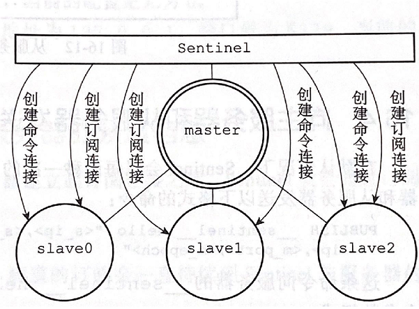

# 16 多机数据库的实现-哨兵
## 16 Sentinel
* Sentinel(哨兵)是Redis的高可用性解决方案:
  * 一个或多个哨兵实例（instance）组成**哨兵系统**可以监视任意**多个主服务器**以及属下的**所有从服务器**
  * 当主服务器下线超过设定的时限时，自动将其属下的从服务器升级为新的主服务器，并处理命令请求
  * 当以下线的服务器重新上线时，会将其设置为新主服务器的从服务器。
  *   

## 16.1 启动并初始化Sentinel

* 命令：redis-sentinel /path/to/your/sentinel.conf 或 redis-server /path/to/your/sentinel.conf --sentinel
* 当一个Sentinel启动时，它需要执行以下步骤：
  * 初始化服务器
  * 将普通Redis服务器使用的代码替换成Sentinel专用代码。
  * 初始化Sentinel状态。
  * 根据给定的配置文件，初始化Sentinel的监视主服务器列表。
  * 创建连向主服务器的网络连接。

## 16.1.1 初始化服务器

* Sentinel本质上时特殊模式的Redis服务器，初始化过程与普通Redis服务器类似，区别是：
  * 不会载入RDB文件或AOF文件
  * 一些功能不会使用，如SET,SAVE.SLAVEOF等

## 16.1.2 使用Sentinel专用代码

* 端口不同，普通服务器用redis.h/REDIS_SERVERPORT常量的值作为服务器端口，Sentinel使用26379
* Sentinel使用sentinel.c/sentinelcmds作为服务器的命令表，并且其中的INFO命令会使用Sentinel模式下的专用实现sentinel.c/sentinelInfoCommand函数，而不是普通Redis服务器使用的实现redis.c/infoCommand函数。 因此在Sentinel模式下，服务器没有在命令表中载入这些 SET, DBSIZE,EVAL命令

## 16.1.3 初始化Sentinel状态

* 服务器会初始化一个sentinel.c/sentinelState结构，保存服务器中所有和Sentinel功能有关的状态
  
```C
struct sentineState{
    //当前epoch，用于实现故障转移
    uint64_t current_epoch;
    
    //保存所有被这个sentinel监视的主服务
    //key是主服务器的名字，value是指向sentinelRedisInstance结构的指针
    dict *masters;
    
    //是否进入TILT模式
    int tilt;
    
    //目前正在执行的脚本数量
    int running_scripts;
    
    //进入TILT模式的时间
    mstime_t tile_start_time;
    
    //最后一次执行时间处理器的时间
    mstime_t previous_time;
    
    //一个FIFO队列，包含了所有需要执行的用户脚本
    list *scripts_queue;
}sentinel;
```

## 16.1.4 初始化Sentinel状态的masters属性

* sentineState中的masters字典保存所有被这个sentinel监视的主服务器
  * key 是主服务器的名字
  * value 是指向sentinelRedisInstance结构的指针
* sentinelRedisInstance，代表被Sentinel 监视的服务器实例，可以是主服务器，从服务器，或者另一个Sentinel
* 读取Sentinel配置文件，初始化实例（配置文件可以配置多个实例）
* sentinelRedisInstance源码：
```C
typedef struct sentinelRedisInstance {

    // 标识值，记录了实例的类型，以及该实例的当前状态
    int flags;

    // 本实例的名字
    // 主服务器的名字由用户在配置文件中设置
    // 从服务器以及 Sentinel 的名字由 Sentinel 自动设置
    // 格式为 ip:port ，例如 "127.0.0.1:26379"
    char *name;

    // 本实例的运行 ID
    char *runid;

    // 配置epoch，用于实现故障转移
    uint64_t config_epoch;

    // 本实例的地址，包括id和port
    sentinelAddr *addr;

    // 本实例无响应多少毫秒之后才会被判断为主观下线（subjectively down）
    mstime_t down_after_period;

    // 判断这个实例为客观下线（objectively down）所需的支持投票数量
    int quorum;

    // 在执行故障转移操作时，可以同时对新的主服务器进行同步的从服务器数量
    int parallel_syncs;

    // 刷新故障迁移状态的最大时限
    mstime_t failover_timeout;
    
    //Sentinel为监视的主服务器创建实例中包括了同时监听该主服务器的其他Sentinel
    dict *sentinels
    // ...

} sentinelRedisInstance;
```
* sentinelState 和masters字典结构图
  *   

## 16.1.5 创建连向主服务器的网络连接

* 初始化Sentinel最后一步是创建连向被监视**主服务器**的**网络连接**，Sentinel将称为主服务器的**客户端**
* Sentinel会创建两个连向主服务器的异步网络连接：
  * **命令连接：用于向主服务器发送命令，并接受命令回复**
  * **订阅连接：用于订阅主服务器的__sentinel__:hello频道**
    
*   

## 16.2 获取主服务器信息

* Sentinel 默认每10秒通过命令连接向被监视的主服务器发送**INFO命令**，通过命令回复获取/更新主服务器的当前信息。
* 根据命令回复中从服务器的ip和端口号，无需用户提供从服务器的地址信息，就可以自动发现从服务器，如果Sentinel中已经存在该从服务器实例，则更新，如果不存在就在slaves字典中创建一个实例。
* 命令回复如下：
```c
# Server
...
run_id:32hdsh0qwhrrg9ahfh2qf9hqrhrfq223432//主服务器运行ID
...

# Replication
role:master//主服务器的角色
...
slave0:ip=127.0.0.1,port=11111,state=online,offset=43,lag=0//该主服务的从服务器的ip,port,state,复制偏移量,lag
slave1:ip=127.0.0.1,port=22222,state=online,offset=43,lag=0
slave2:ip=127.0.0.1,port=33333,state=online,offset=43,lag=0
...

# Other sections
...
```
    通过分析主服务器返回的INFO命令回复，Sentinel可以获取以下两方面的信息:
* 一方面是关于主服务器本身的信息，包括run_id域记录的服务器运行ID，以及role域记录的服务器角色；
* 服务器属下所有从服务器的信息，每个从服务器都由一个“slave”字符串开头的行记录，每行的ip=域记录了从服务器的ip地址，而port=域则记录了从服务器的端口号。
* 根据这些ip地址和端口号，Sentinel无需用户提供从服务器的地址信息，就可以自动发送从服务器。


* Sentinel监视的其中一个服务器的结构示意图：
*   
* 上图主服务器的flags实例标识为SRI_MASTER，从服务器flags实例标识为SRI_SLAVE
* 主服务器的name属性由配置文件设置的，从服务器的name属性由Sentinel服务器根据ip:port设置

## 16.3 获取从服务器信息

* Sentinel发现主服务器有新的服务器后，除了会在slaves字典中创建实例之外，还会创建连接到从服务器的命令连接和订阅连接。
* 创建命令连接后，Sentinel每10秒向从服务器发送INFO命令，命令回复如下：
```c
# Server
...
run_id:234f30qfjfaafjfqjfjoq3fjqfwj242152nsaf//从服务的运行ID
...

# Replication
role:slave//从服务器的角色
master_host:127.0.0.1//主服务器的ip
master_port:6379//主服务器的port
master_link_status:up//主从服务器的连接状态
slave_repl_offset:11887//从服务器的复制偏移量
salve_priority:100//从服务器的优先级

# Other sections
...
```
*   

## 16.4 向主服务和从服务器发送信息

* Sentinel每2秒通过命令连接向被监视的主服务器和从服务器的__sentinel__:hello频道，发送如下命令：
  * PUBLISH __sentinel__:hello "<s_ip>,<s_port>,<s_runid>,<s_epoch>,<m_name>,<m_ip>,<m_port>,<m_epoch>"
  * 其中s前缀代表sentinel，m前缀代表master

## 16.5 接收来自主服务器和从服务器的频道信息

* Sentinel与主服务器或从服务器建立**订阅连接**后，就会通过订阅连接发送命令SUBSCRIBE__sentinel__:hello来订阅该频道
  * 即，Sentinel通过**命令连接**向服务器的__sentinel:hello频道发送信息，又通过订阅连接能接收服务器__sentinel__:hello频道的信息
  那么，如果有多个Sentinel监听同一个服务器，一个Sentinel发送到__sentinel__:hello频道的信息会被其他Sentinel接收到（包括自己）
  这样就可以发现其他Sentinel的存在，同时可以更新其他Sentinel的状态和被监视服务器的状态
* Sentinel和服务器之间的连接图
  
* 多个Sentinel之间的关系图
    
* Sentinel从__sentinel__:hello接收到的信息，根据ip和port判断，如果是自己发送的则无视，如果是其他Sentinel发送的则执行下面处理：

## 16.5.1 更新sentinels字典

* Sentinel为监视的**主服务器创建的sentinelRedisInstance实例**中包括了sentinels字典，记录了同时监听该主服务器的其他Sentinel
* sentinels字典：key是ip:port,value是对应的sentinelRedisInstance实例
* 当一个Sentinel通过订阅连接接收到其他Sentinel发送的信息时，会分析出发送信息的Sentinel和主服务器的ip,port,runid,epoch信息
* 如果主服务器实例的sentinels字典中不存在源Sentinel的实例，则创建，如果存在则更新
* Sentinel监视的主服务器的实例中sentinels字典结构图：
*   


##16.5.2 创建连向其他Sentinel的命令连接
* Sentinel通过频道信息发现其他Sentinel时，除了在sentinels字典中创建相应的实例，还会创建连向新Sentinel的命令连接，新Sentinel同样会创建连向这个Sentinel的命令链接
* 各个Sentinel可以用过命令请求交换信息，用于主观下线检测和客观下线检测功能
*   

## 16.6 检测主观下线状态

* Sentinel每1s向所有创建了命令连接的实例（主服务器、从服务器、其他Sentinel）发送PING命令，并通过命令回复判断实例是否在线
* 有效回复：+PONG、-LOADING、-MASTERDOWN三种回复的其中一种。
* 无效回复：其他回复，或者指定时限没有任何回复
* 如果在配置文件中指定的时间内，均是无效回复，那么认为这个实例主观下线，将这个实例的flags属性增加标识
* 即，flags=SRI_MASTER | SRI_S_DOWN
* 由于不同Sentinel配置的主观下线时限不同，所以需要多个Sentinel投票决定客观下线

## 16.7 检查客观下线状态

* Sentinel将一个主服务器判断为主观下线，会向同时监视这一主服务器的其他Sentinel发送命令询问，当其他Sentinel返回配置文件指定数量以上的确定回复后，将其设置为客观下线，并对主服务器执行故障转移操作
* 执行步骤：
  * 源Sentinel向其他Sentinel（目标Sentinel）发送命令询问是否统一主服务器已经下线：
    • 命令：SENTINEL is-master-down-by-addr <ip> <port> <current_epoch> <runid>
    • ip,port：判断为主观下线的主服务器的ip,port
    • current_epoch：发送命令的Sentinel的epoch
    • runid：如果为*代表即用于检测主服务器的客观下线，如果是源Sentinel自己的runid则用于选举领头Sentinel
  * 其他Sentinel接受到该命令请求，根据自己的配置判断主服务器是否下线，并返回命令回复：
    • <down_state>：对主服务器的检查结果，1代表已下线，0代表未下线
    • <leader_runid>：如果是*代表仅用于检测主服务器的客观下线，如果是源Sentinel发送来的runid则用于选举领头Sentinel
    • <leader_epoch>：如果leader_runid是*，则为0。如果leader_runid不是*，则是局部领头Sentinel的epoch，用于选举领头Sentinel
  * 源Sentinel接收命令回复：
    • 如果其他Sentinel的命令回复确认下线的数量超过了配置的数量，则Sentinel为主服务器实例的flags属性增加标识
    • 即，flags=SRI_MASTER | SRI_S_DOWN | SRI_O_DOWN
    • 同时可以选举出领头Sentinel

## 16.8 选举领头Sentinel

* 当主服务器被判断为客观下线后，监视这个主服务器的各个Sentinel会选举出一个领头Sentinel执行故障转移操作，规则如下：
1. 所有Sentinel都有被选为领头的资格
2. 每次进行领头Sentinel选举之后，不论是否选举成功，所有Sentinel的epoch都会+1
3. 一个epoch中，所有Sentinel都有一次将某个Sentinel设置为局部领头Sentinel的机会，并且局部领头一旦设置，在这个配置纪元里不能再修改
4. ==每个发现主服务器客观下线的Sentinel都会要求其他Sentinel将自己设置为局部领头Sentinel==
5. 源Sentinel向目标Sentinel发送的命令中runid如果不为*，则表示源Sentinel要求目标Sentinel将前者设置为后者的领头Sentinel。
6. 局部领头Sentinel的规则是先到先得，最早要求的将被设置为局部领头
7. 目标Sentinel的接收命令后，回复中leader_runid和leader_epoch分别记录了目标Sentinel的局部领头Sentinel的运行ID和配置纪元
8. 源Sentinel在接收到目标Sentinel返回的命令回复之后，会检查回复中leader_runid和leader_epoch参数的值是否和自己吻合，如果吻合则表示自己被目标Sentinel设置为局部领头
9. 如果某个Sentinel被半数以上的Sentinel局部领头Sentinel，那么这个eSentinel称为领头Sentinel
10. 一个epoch中只会出现一个领头Sentinel
11. ==如果在给定时限内，没有选举出领头Sentinel，则一段时间后重新选举==

## 16.9 故障转移

* 在选举产生出领头Sentinel之后，领头Sentinel将对已下线的主服务器执行故障转移操作，该操作包括以下三个步骤：
  1）==在已下线主服务器属下的所有从服务器里面，挑选出一个从服务器，并将其转换为主服务器==
    * 向该从服务器发送  SLAVEOF no one 命令
    

2）==让已下线主服务器属下的所有从服务器改为复制新的主服务器。==
   * SLAVEOF <> <new_master_ip> <new_master_port>命令请求 ，让其他从服务器复制新主服务器

    3）==将已下线主服务器设置为新的主服务器的从服务器，其重新上线时，作为从服务器。==
        * 先保存在下线的主服务器的实例里，当其上线后Sentinel向它发送SLAVEOF命令请求，让其成为信主服务器的从服务器。