[toc]
# Redis


## 01 基本架构：一个键值数据库包含什么？

对于键值数据库而言，基本的数据类型是key-value模型。

而Redis支持的value类型包含了String，哈希表，列表，集合等。**Redis能够在实际业务场景中得到广泛的应用，就是得益于支持多样化类型的value。**

而知道了数据模型，就要看它对数据的基本操作。即增删改查。


大体来说，一个键值数据库包含了访问框架，索引模块，操作模块和存储模块。
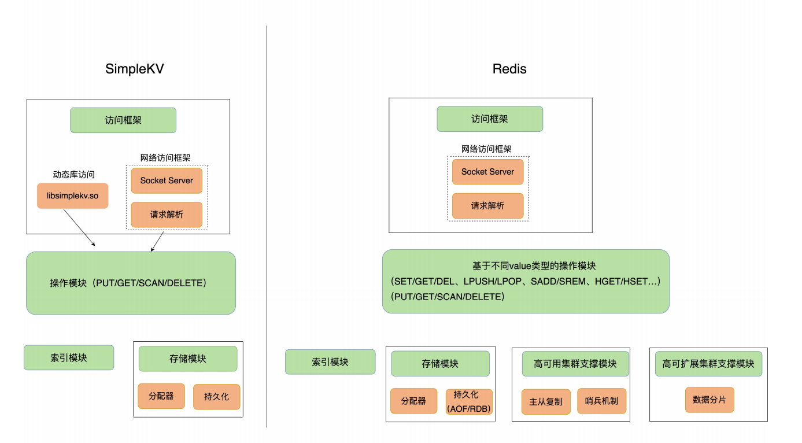

从以上对比图中，可以看到，从一个简单的键值数据库演进到redis，有以下几个重要变化：
* redis 主要通过网络框架进行访问，而不是动态库，这也使得redis可以作为一个基础性的网络服务进行访问，扩大了redis 的应用范围。
* redis数据模型中的value类型很丰富，因此也带来了更多的操作接口，例如面向列表的LPUSH/LPOP,面向集合的SADD/SREM等。
* Redis 的持久化模块能支持两种方式：**日志（AOF）和快照(RDB)**,这两种持久化方式具有不同的优劣势，影响到redis的访问性能和可靠性。
* SimpleKV是个简单的单机键值数据库，但是，Redis支持高可靠集群和高可扩展集群，因此，Redis中包含了相应的集群功能支撑模块。


## 02 数据结构：快速的Redis有哪些慢操作？

redis在接收到一个键值对操作后，能以**微秒**级别的速度找到数据，并快速完成操作。

为什么redis 可以有这么突出的表现？
* 一方面，这是因为他是内存数据库，所有操作都是基于内存的，内存的访问速度本身就很快。
* 另一方面，键值对是按一定的数据结构来组织的，操作键值对最终就是对数据结构进行增删改查操作。

**redis的数据类型和底层数据结构：**


### 键和值用什么结构组织？

为了实现从键到值得快速访问，redis使用了一个哈希表来保存所有键值对。

一个哈希表，其实就是一个数组，数组的每个元素称为一个哈希桶。所以，一个哈希表是由多个哈希桶组成的，每个哈希桶中保存了键值对数据。


哈希桶中的 entry 元素中保存了key 和value指针，分别指向了时间的键和值，这样一来，即使值是一个集合，也可以通过value指针被查找到。

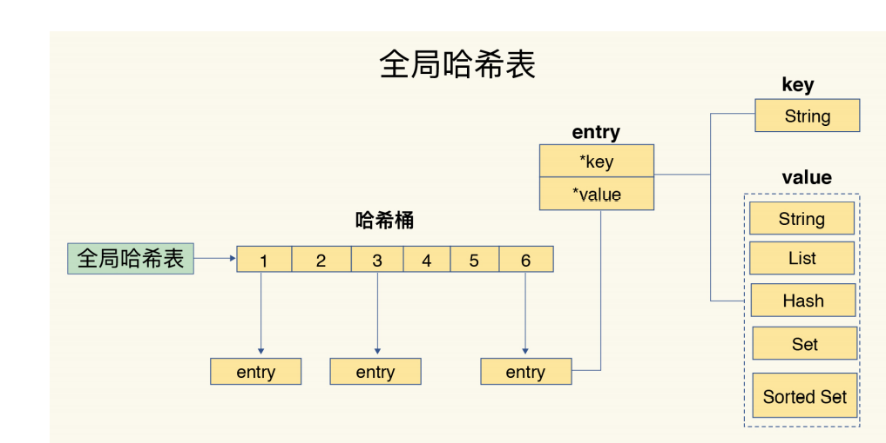

这个哈希表存储了所有的键值对，因此被称为全局哈希表。


### 为什么哈希表操作变慢了？
当往哈希表中写入更多数据时，哈希冲突是不可避免的问题。

这里的哈希冲突，是指，两个key 的哈希值和哈希桶计算对应关系时，正好落在了同一个哈希桶中。

redis 解决哈希冲突的方式，就是**链式哈希**。（跟java 的HashMap一样）同一个哈希桶中多个元素用同一个链表来保存，它们之间一次用指针连接。


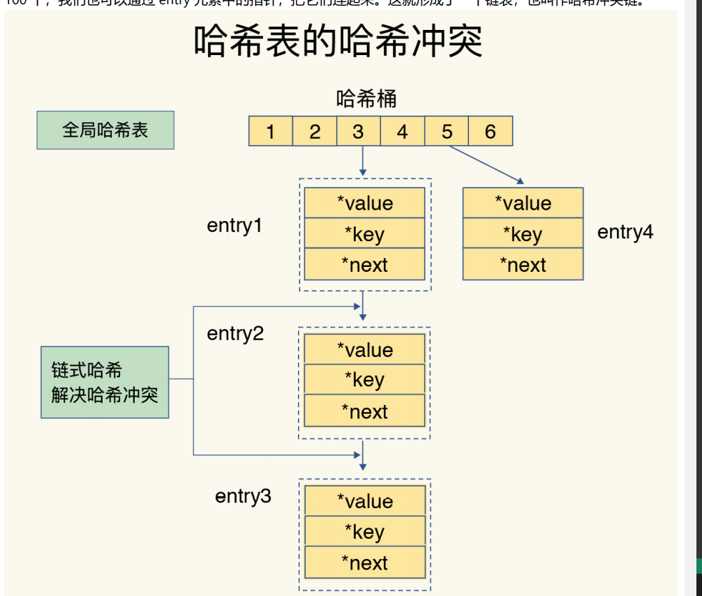


这里依然存在一个问题，哈希冲突链上的元素只能通过指针逐一查找在操作。如果哈希表中写入的数据越来越多，哈希冲突可能会越来越多，导致某个哈希冲突链过长，进而导致这个链上的元素查找耗时长，效率降低。

**redis 会对哈希表做rehash操作**。rehash 也就是增加现有的哈希桶数量，让主键增多的entry元素能在更多的桶之间分散保存，减少单个桶中的元素数量。


为了让**rehash 更加高效**。 Redis 默认使用了两个全局哈希表：哈希表1和哈希表2。一开始，当你插入数据时，默认使用哈希表1，此时的哈希表2并没有被分配空间。随着数据逐步增多，Redis开始执行rehash，这个过程分为3步：
 1. 给哈希表2分配更大的空间，例如是当前哈希表1大小的两倍；
 2. 把哈希表1中的数据重新映射并拷贝到哈希表2中；
 3. 释放哈希表1的空间


然而这个过程在第二步中涉及大量的数据拷贝，如果一习性把哈希表1中的数据都迁移完，会造成redis线程阻塞,无法服务其他请求。

为了避免这个问题，redis 采用了**渐进式rehash**。

在第二步拷贝数据时，redis依然正常处理客户端请求，每处理一个请求时，从哈希表1中的第一个索引位置开始，顺带着将这个索引位置上的所有entries拷贝到哈希表2中；等处理下一请求时，在顺带拷贝哈希表1中的下一个索引位置的entries。如下图所示：
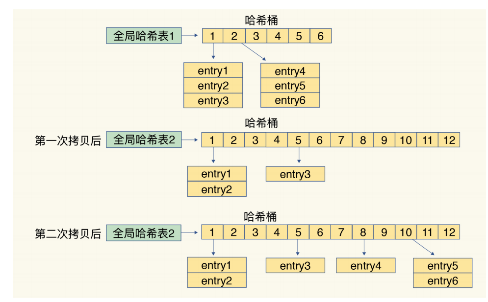

这样就巧妙地一次性大量拷贝地开销，分摊到了多次处理请求地过程中，避免了耗时操作。


### 集合数据操作效率？
和String 类型不同，集合类型地值，第一步是通过全局哈希表找到对应地哈希桶位置，第二步是在集合中再增删改查。那么，集合的**操作效率**和哪些因素相关?

1. 跟集合的底层数据结构有关，使用哈希表实现的集合比链表实现的集合访问效率更高。
2. 操作效率和操作的本身的执行特点有关，读写一个元素的操作要比读写所有元素的效率高。


### 哪些底层数据结构？
集合类型的底层数据结构有5种：**整数数组，双向链表，哈希表，压缩列表和跳表**

**哈希表的操作特点**上面已经学过，

**整数数组和双向链表**操作特征位顺序读写，即通过数组下标或者链表的指针逐个访问，操作复杂度基本是O(N),操作效率比较低


**压缩列表**类似于一个数组，数组中的每一个元素都对应保存一个数据。
压缩列表在表头有三个字段 zlbytes,zltail和zllen,分别表示**列表长度，列表尾的偏移量和列表中的entry 个数**；压缩列表在表尾还有一个zlend，表示列表结束。

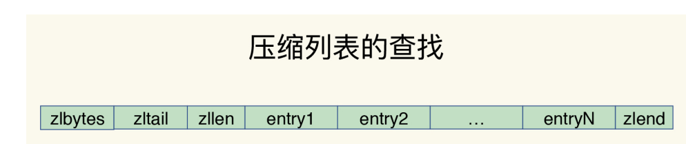

在压缩列表中，如果要**查找定位第一个元素和最后一个元素，可以通过表头三个字段的长度直接定位，复杂度是O(1)**。 而查找其他元素时，就没有那么高效了，只能逐个查找，此时的复杂度就是O(n)了。


跳表。
有序链表只能逐一查找元素，导致操作起来非常缓慢，于是出现了跳表。具体来说，跳表在链表的基础上，增加了多级索引，通过索引位置的几个跳转，实现索引位置的几个跳转，实现数据的快速定位。

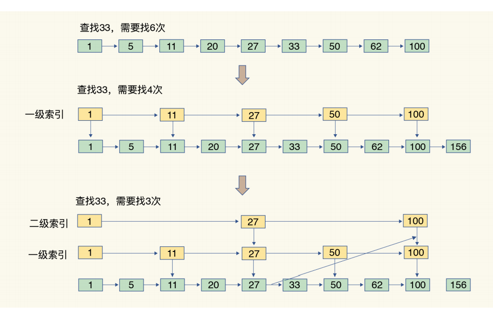

按照查找的时间复杂度给这些数据结构分类：
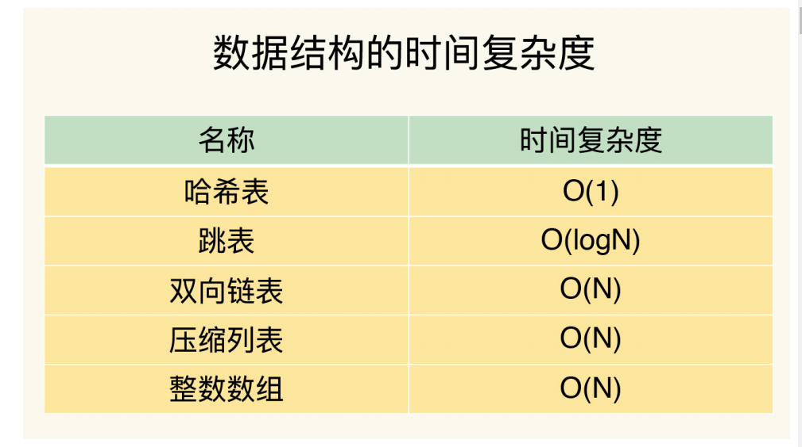


## 03 高性能IO模型：为什么单线程Redis能那么快？

redis 单线程指的是 redis 的网络io 和键值对读写是由一个线程来完成的，但redis 的其他功能，比如持久化，异步删除，集群数据同步等，是由额外的线程执行的。

### redis 为什么用单线程？
为什么要使用单线程，首先要了解多线程的开销。

### 多线程的开销
当使用多线程编程时，系统的共享资源可能会被多线程同时访问，为了保证资源的正确性，需要有额外的同步机制来保证，降低系统代码的易调试性和可维护性。为了避免这些问题，redis直接采用了单线程模式。


### 单线程为什么那么快？

1. 大部分操作基于**内存**
2. 采用了**高效的数据结构**
3. redis采用了多路复用机制，在网络io操作中能并发处理大量的客户端请求，实现高吞吐率。


### 基本IO模型与阻塞点
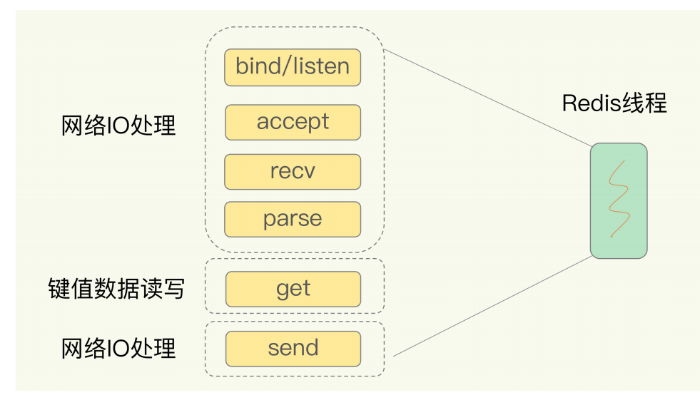

基本模型有潜在的阻塞点，分别时accept()和recv()。当Redis监听到一个客户端有连接请求，但一直未能成功建立起连接，会阻塞在这里，导致其他客户端无法和redis建立连接。


### 非阻塞模式
在socket模型中，不同操作调用后会返回不同的套接字类型。socket()方法会返回**主动套接字**，然后调用listen()方法，将主动套接字转换为**监听套接字**，此时，可以监听来自客户端的连接请求。最后，调用accept()方法接收到达的客户端连接，并返回已连接套接字。

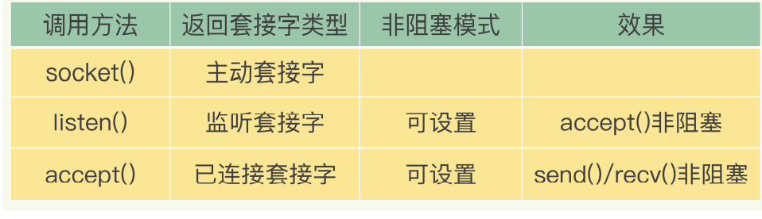

非阻塞模型：：当 Redis 调用 **accept()** 但一直未有连接请求到达时，Redis 线程可
以返回处理其他操作，而不用一直等待。但是，你要注意的是，调用 accept() 时，已经存在监听套接字了。


类似的，我们也可以针对已连接套接字设置非阻塞模式：Redis 调用 recv() 后，如果已连接套接字上一直没有数据到达，Redis 线程同样可以返回处理其他操作。我们也需要有机制继续监听该已连接套接字，并在有数据达到时通知 Redis。

这样才能保证 Redis 线程，既不会像基本 IO 模型中一直在阻塞点等待，也不会导致 Redis 无法处理实际到达的连接请求或数据。到此，Linux 中的 IO 多路复用机制就要登场了。


### 基于多路复用的高性能I/O模型

Linux 中IO多路复用机制是指一个线程处理多个IO流， 就是我们经常听到的**select/epoll机制**。

简单来说，在Redis只运行单线程的情况下，该机制允许内核中，同时存在**多个监听套接字和已连接套接字**。内核会一直监听这些套接字上的连接请求或数据请求。一旦有请求到达，就会交给redis线程处理，这就实现了一个redis线程处理多个io流的效果。

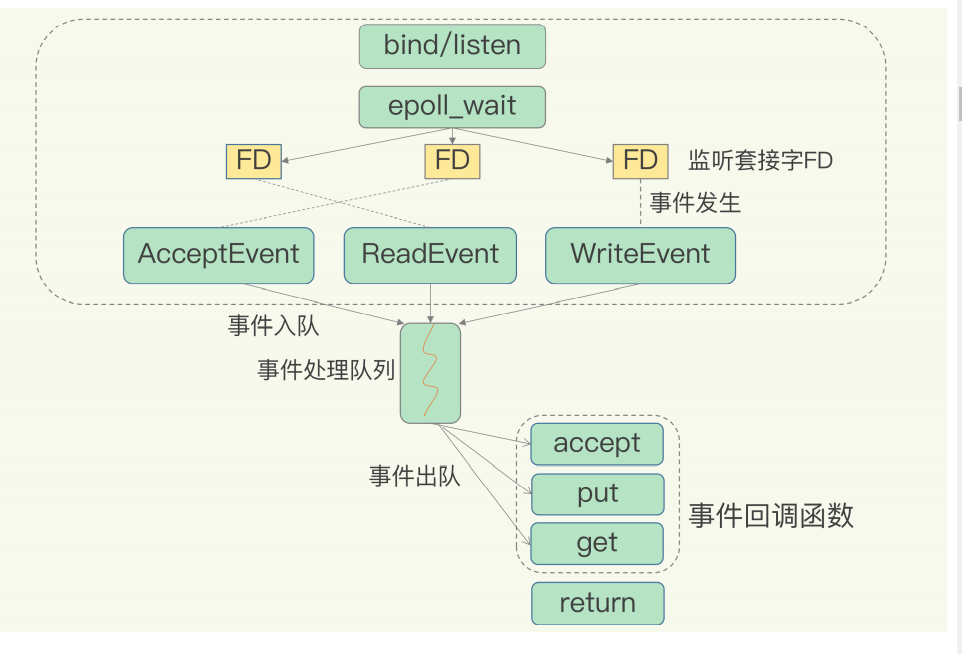

上图就是基于多路复用的redis io模型。图中的多个FD 就是刚才说的多个套接字， redis网络框架调用epoll机制，让**内核监听这些套接字**。此时，redis 线程不会阻塞在某一个特定的监听或已连接套接字上，也就是说，不会阻塞在某一个特定的客户端请求处理上。正因为此，redis可以同时和多个客户端连接并处理请求，从而提升并发性。

为了在请求到达时能通知到redis线程，**select/epoll提供了基于事件的回调机制**，即针对不同事件的发生，调用相应的处理函数。

#### 回调机制
select/epoll 一旦监听到FD上有请求到达时，就会触发相应的事件。

这些事件就会被放进一个事件队列，redis 单线程对该事件队列不断进行处理。这样一来，redis 无需一直轮询是否有请求实际发生，这就可以避免造成CPU资源浪费。同时，Redis 在对事件队列中的事件进行处理时，会调用相应的处理函数，这就实现了基于事件的回调。因为Redis一直在对事件队列进行处理，所以能及时响应客户端请求，提升Redis 的响应性能。


#### 具体例子
以连接请求和读数据请求为例，
这两个请求分别对应 Accept 事件和Read 事件，Redis 对这两个事件分别注册 accept 和get回调函数。Linux 内核监听到有连接请求或读数据请求时，就会触发 Accept 事件和 Read 事件，此时，内核就会回调 Redis相应的 accept 和 get 函数进行处理。


## 04 AOF日志： 宕机了，Redis如何避免数据丢失？

redis一般用于缓存场景，把后端数据库中的数据存储在内存中，然后直接从内存中读取数据，响应速度会非常快。 然而，当服务器宕机时，**内存中的数据将全部丢失**。


一般的解决方案，从后端数据库中恢复这些数据，但这种方式存在问题：1.需要频繁的访问数据库，给数据库造成压力  2.从慢速数据库中读取出来的，性能肯定比不上从redis中读取，导致使用这些数据的应用程序响应变慢。

对redis 来说，实现数据的持久化，避免从后端数据库中进行恢复，是至关重要的。

redis有两大机制， AOF日志和 RDB快照。

### AOF日志是如何实现的？
数据库的写前日志（Write Ahead Log,WAL）, 也就是说，在实际写数据前，先把修改的数据记到日志文件中，以便故障时进行恢复。 AOF日志正好相反，它是写后日志。（redis 先执行命令，把数据写入内存，然后才记录日志）。

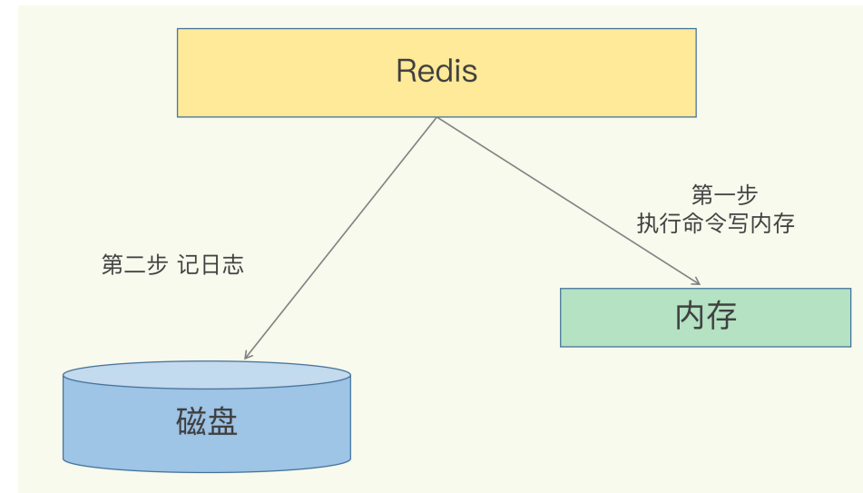

传统数据库的日志，例如 redo log（重做日志），记录的是修改后的数据，而 AOF 里记录的是 Redis 收到的每一条命令，这些命令是以文本形式保存的。

我们以 Redis 收到“set testkey testvalue”命令后记录的日志为例，看看 AOF 日志的内容。其中，“*3”表示当前命令有三个部分，每部分都是由“$+数字”开头，后面紧跟着具体的命令、键或值。这里，“数字”表示这部分中的命令、键或值一共有多少字节。例如，“$3 set”表示这部分有 3 个字节，也就是“set”命令。
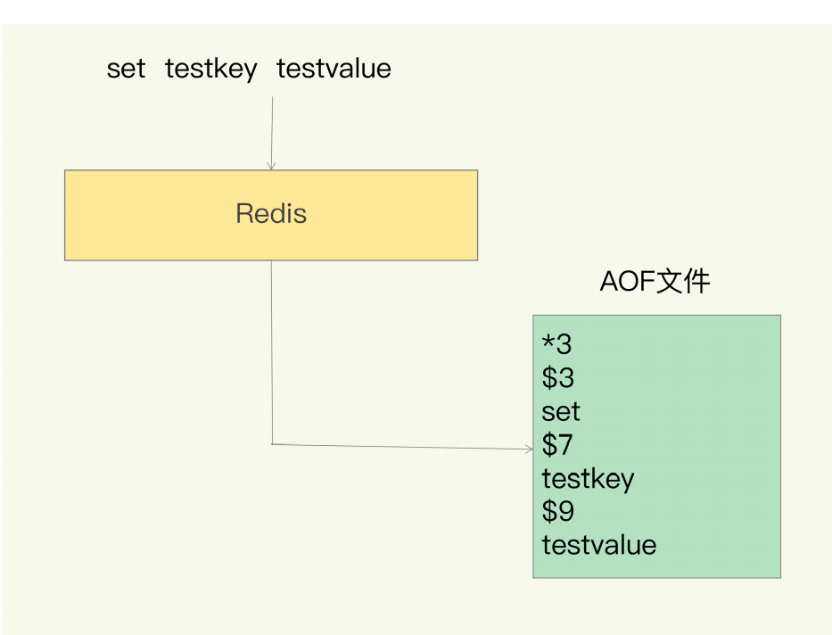

**为了避免额外的检查开销，**，redis在向AOF里面记录日志的时候，并不会先去对这些命令进行语法检查，所以，先记日志再执行命令的话，日志记了错误的命令，在使用日志恢复数据时，可能出错。（mysql 在server层会语法分析）

而写后日志这种方式，先让系统执行命令，只有命令能执行成功，才会被记录到日志中。

AOF是命令执行后才记录日志，不会阻塞**当前的写操作**。


AOF额外的风险：
执行完命令，还没写日志就宕机了。（redis做缓存可以从数据库读入进行恢复）

AOF 虽然避免了对当前命令的阻塞，但可能会给下一个操作带来阻塞风险。这是因为，AOF 日志也是在主线程中执行的，如果在把日志文件写入磁盘时，磁盘写压力大，就会导致写盘很慢，进而导致后续的操作也无法执行了。仔细分析的话，你就会发现，这两个风险都是和 AOF 写回磁盘的时机相关的。这也就意味着，如果我们能够**控制一个写命令执行完后 AOF 日志写回磁盘的时机**，这两个风险就解除了。


### 三种写回策略
AOF 机制给我们提供了三个选择，也就是 AOF 配置项 appendfsync 的三个可选值。
* **always,同步写回**： 每个写命令执行完，立马同步地将日志写回磁盘;
* **Everysec,每秒写回**：每个写命令执行完，只是先把日志写到AOF文件的内存缓冲区，每隔一秒把缓冲区的内容写入磁盘；
* **No,操作系统控制的写回**：每个写命令执行完，只是先把日志写到AOF文件的内存缓冲区，由操作系统决定何时将缓冲区内容写回磁盘。


可以根据系统对高性能和高可靠性的要求，来选择使用哪种写回策略了。总结一下就是：想要
获得高性能，就选择 No 策略；如果想要得到高可靠性保证，就选择 Always 策略；如果允许数据有一点丢失，又希望性能别受太大影响的话，那么就选择 Everysec 策略。


### 日志文件太大了怎么办？

简单来说，AOF重写机制就是在重写时，redis根据数据库的现状创建一个新的AOF文件，读取数据库中的所有键值对，然后对每一个键值对一条命令记录它的写入。

重写机制为什么可以让日志文件变小？重写机制具有“多变一”功能。所谓“多变一”，也就是说，旧日志文件中的多条命令，再重写后的新日志中变成了一条命令。


### AOF 重写会阻塞嘛？

AOF日志**主线程写**，但是重写过程是由后台子进程 bgrewriteaof 完成的，这是为了避免阻塞主线程，导致数据库性能下降。

重写的过程 总结为“**一个拷贝，两处日志**”。

每次执行重写时，主线程fork 出后台的bgrewritefork 子进程。此时，fork会把主线程的内存拷贝一份给bgrewriteaof子进程， 这里面包含了数据库的最新数据。然后bgrewriteaof子进程可以在不影响主线程的情况下，逐一把拷贝的数据写程操作，记入重写日志。


“两处日志” ： 在进行重写的时候，由于主线程未被阻塞，仍然可以处理新来的操作。此时，如果有写操作，第一处日志就是指正在使用的aof日志，redis会把这个操作写到它的缓冲区。这样一来，即使宕机了，aof文件也是齐全的，可以用于恢复。

第二处日志，指的是aof重写日志。这个操作也会被写到重写日志的缓冲区。这样，重写日志也不会丢失最新的操作。拷贝数据完后，缓冲区的操作也会写入新的aof文件，以保证数据库最新的记录。
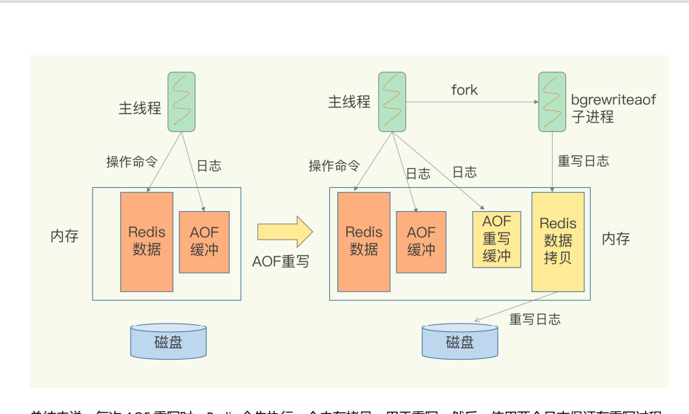


## 05 内存快照：宕机后，Redis 如何实现快速恢复？

内存快照： 指内存中的数据在某一个时刻的状态记录。


对Redis来说，它实现类似照片记录结果的方式，把某一时刻的状态以文件的形式写到磁盘上， 就是快照。

和AOF相比，RDB记录的是某一时刻的数据，并不是操作，所以，在做数据恢复时，可以直接把RDB文件读入内存，很快地完成恢复。

不过，**内存快照**需要考虑两个关键问题：
* 对哪些数据做快照？这关系到快照的执行效率问题
* 做快照时，数据还能被增删改吗？


### 给哪些内存数据做快照？
redis 的数据都在内存里，为了提供所有数据的可靠性保证，它执行的是**全量快照**。
将内存中的所有数据都记录到磁盘里。


然而Redis 是单线程模型，因此需要尽量避免阻塞主线程的操作，
Redis 提供了两个命令来生成RDB文件，分别是**save**和**bgsave**。
* save ： 在主线程中执行，会导致阻塞
* bgsave：创建一个子进程，专门用于写入RDB文件，避免了主线程的阻塞。

### 快照时数据能修改吗？

Redis 借助操作系统提供的写时复制技术（Copy-On-Write，COW），在执行快照的同时，正常处理写操作。

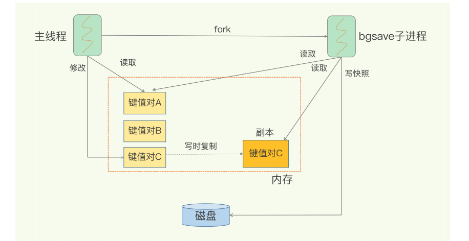

主线程对这些数据也是读操作，那么，主线程和bgsave子进程相互不影响。但是，如果主线程要修改一块数据（例如图中的键值对C），则这块数据会被复制一份，生成该数据的副本，bgsave进程会把这个副本数据写入RDB文件，这时候，主线程可以仍然修改原来的数据。


### 可以每秒做一次快照吗？

快照做的频繁可以保证宕机后数据不会丢失的很多。

然而尽管bgsave不阻塞主线程，但是，**频繁地执行全量快照，会带来两方面地开销。**

一方面，频繁将全量数据写入磁盘，会给磁盘带来很大压力，多个快照竞争有限的磁盘带宽，前一个快照还没有昨晚，后一个又开始做了，容易造成恶性循环。

另一方面，bgsave子进程需要通过fork操作从主线程创建出来，虽然，子进程在创建后不会再阻塞主线程，但是，**fork这个创建过程本身会阻塞主线程**，而且主线程的内存越大，阻塞时间越长。如果频繁fork出bgsave子进程，这就会频繁阻塞主线程了。


Redis4.0 提出了一个 混合使用AOF日志和内存快照的方法。 简单来说，内存快照以一定的频率执行，在两次快照之间，使用AOF日志记录这期间所有命令操作。

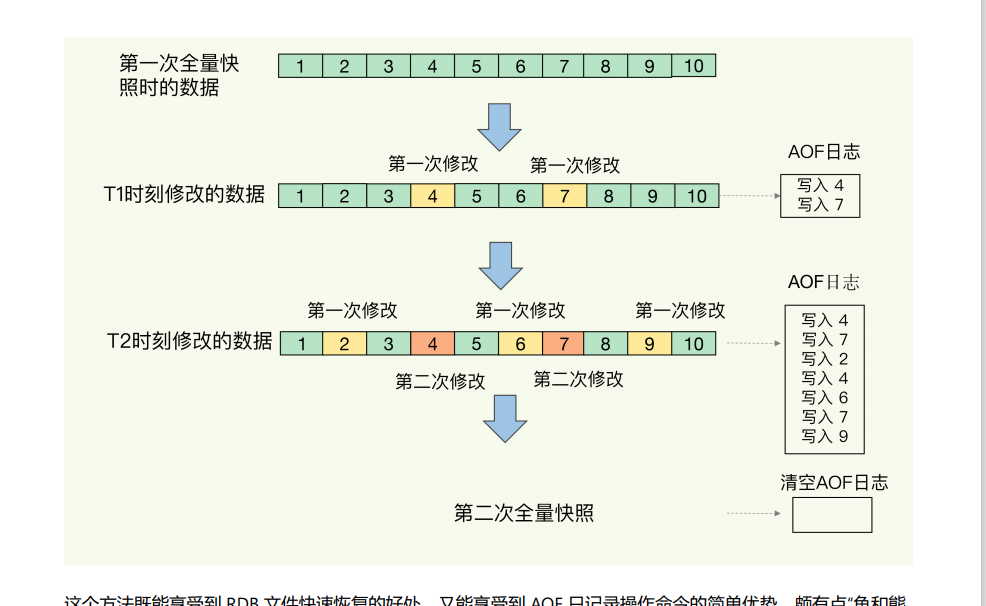


### 总结

* 数据不能丢失时，内存快照和AOF混合使用是一个很好的选择
* 如果允许分钟级别的数据丢失，可以只是用RDB；
* 如果值用AOF，优先使用everysec的配置选项，因为它在可靠性和性能之间取了一个平衡。


## 06 数据同步：主从库如何实现数据一致？

Redis具有高可靠性。这里有两层含义：
**一：数据尽量少丢失**（AOF 和 RDB 保证了前者）
**二：服务尽量少中断。** （增加副本冗余量，将一份数据同时保存在多个示例上）


Redis 提供了主从库模式，以保证数据副本的一致，主从库之间采用的是**读写分离**的方式。
* 读操作：主库，从库都可以接收；
* 写操作：首先到主库执行，然后，主库将写操作同步给从库。
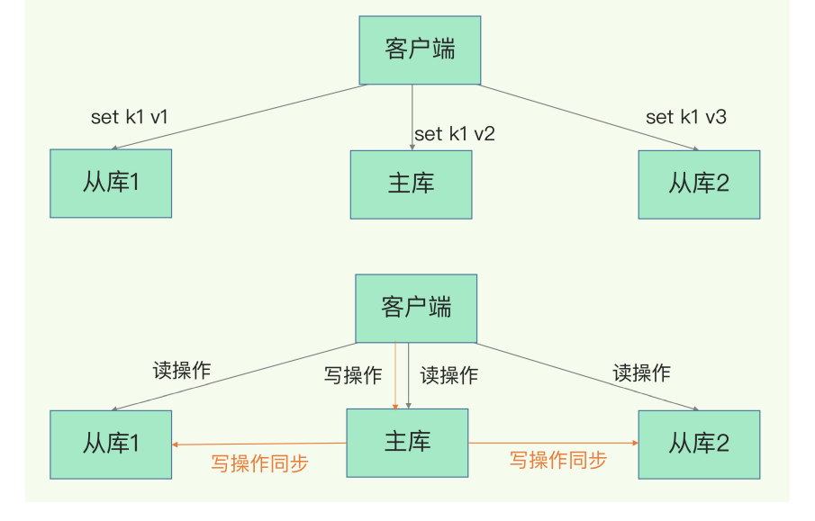


为什么要采用读写分离：如果不管是主库还是从库，都能接收客户端的写操作，那么如果客户端对某个数据修改了多次，可能会发到不同的库上，如此一来，在三个库上的数据将会不一致，如果要保持一致，就要涉及到加锁等一系列操作，会带来巨额的花销。


而出从库同步一旦采用读写分离，所有数据的修改只会在主库上进行。


### 主从库间如何进行第一次同步？
启动多个redis实例时， 通过replicaof（Redis 5.0之前使用slave of）命令形成主库和从库的关系，之后按照**三个阶段**完成数据的第一次同步。

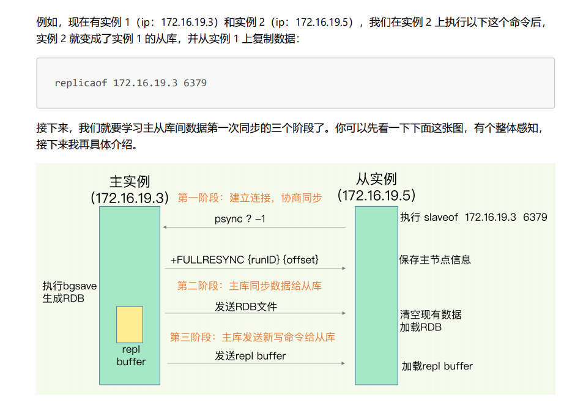

**第一阶段**：在这一步，从库和主库建立起连接，并告诉主库即将进行同步，主库确认回复后，主从库间就可以同步了。
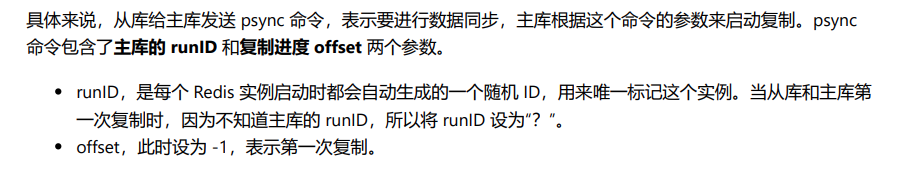
* runID, 每个Redis 实例启动时都会自动生成的一个随机ID，用来唯一标记这个实例。当从库和主库第一次复制时，因为不知道主库的runID，所以将runID设为“？”
* offset,此时设为-1，表示第一次复制。
  
主库收到psync命令后，**会用FULLRESYNC响应命令带上两个参数**：主库runID和主库目前的复制进度offset，返回给从库。从库收到响应后，会记录下这两个参数。

**FULLRESYNC 响应表示第一次复制采用的全量复制，也就是说，主库会把当前所有的数据都复制给从库。**

**第二阶段**：**主库将所有的数据同步给从库，从库收到数据后，在本地完成数据加载。**

具体来说，主库执行bgsave命令，生成RDB文件，接着将文件发给从库。从库接收到RDB文件后，会先清空当前数据库，然后加载RDB文件。

**第三阶段**：主库会把第二阶段执行过程中新收到的写命令，再发送给从库。具体的操作是，当主库完成RDB文件发送后，就会把此时 replication buffer 中的修改操作发给从库，从库再重新执行这些操作。这样一来，主从库就实现同步了。


### 主从级联模式分担全量复制时的主库压力
主从库间第一次数据同步的过程，对于主库来说，需要完成两个耗时的操作：**生成RDB文件和传输RDB文件。**

但是从库很多的时候，导致**主库会忙于fork子进程生成RDB文件，进行数据全量同步。**

可以采用“主-从-从”模式。
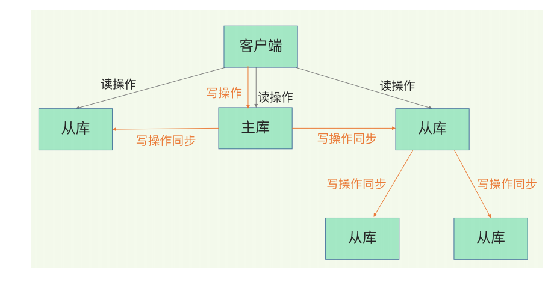

当主从库完成了数据同步的过程，之间就会一直维护一个**网络连接**，主库会通过这个连接将后续陆续收到的命令操作再同步给从库，这个过程也称为基于**长连接的命令传播**。


### 主从库间网络断了怎么办？

可以将主从库间网络断开后，主库收到的命令，同步给从库。

那么，增量复制时，主从库之间具体是怎么保持同步的呢？这里的奥妙就在于 repl_backlog_buffer 这个缓冲区。我们先来看下它是如何用于增量命令的同步的。当主从库断连后，主库会把断连期间收到的写操作命令，写入 replication buffer，同时也会把这些操作命令也写入 repl_backlog_buffer 这个缓冲区。


**repl_backlog_buffer 是一个环形缓冲区，主库会记录自己写到的位置，从库则会记录自己已经读到的位置。**

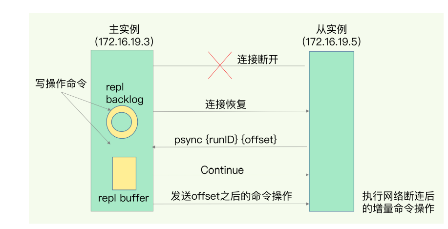

### 小结
Redis 主从库同步的基本原理，总结来说，有三种模式：**全量复制，基于长连接的命令传播，以及增量复制**


第一次同步，使用全量复制是不可避免的。


## 07 哨兵机制：主库挂了，如何不间断服务？

在主从库集群模式下，如果从库发生故障，客户端可以继续想主库或其他从库发送请求，进行相关的操作，但是如果主库发生故障了，那就直接会影响到从库的同步，因为从库没有相应的主库可以进行数据的复制操作。

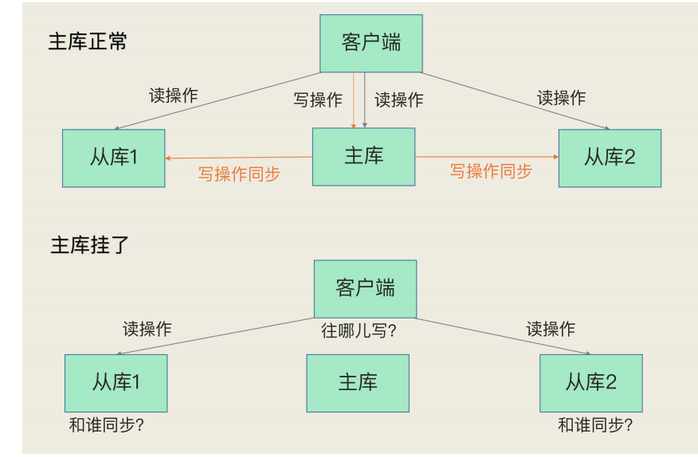

在Redis 机制是实现**主从库自动切换的关键机制**，有效地解决了**主从复制模式下故障转移的这三个问题。**


### 哨兵机制的基本流程
哨兵其实就是一个运行在特殊模式下的Redis进程，主从库实例运行的同时，它也在运行。哨兵主要负责的就是三个任务：**监控，选主和通知**


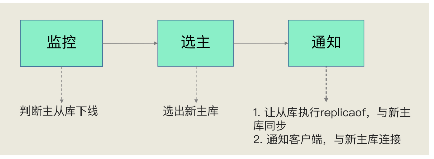

在监控和选主两个任务中，哨兵需要做出两个决策：
* 在监控任务中，哨兵需要判断主库是否处于下线状态；
* 在选主任务中，哨兵也要决定选择哪个从库实例作为主库。

### 主观下线和客观下线

哨兵对主库的下线判断有“主观下线”和“客观下线”两种。

**主观下线**：哨兵进程会使用PING命令检测它自己和主、从库的网络连接情况，用来判断实例的状态。（如果哨兵发现主库或从库对ping的响应超时，哨兵会把它标记为“主观下线”）。


对从库可以简单的标记为主观下线，因为从库影响不大。然而主库可能存在误判，因此为了减少误判，哨兵机制通常会采用**多实例组成的集群模式进行部署，即哨兵集群**。

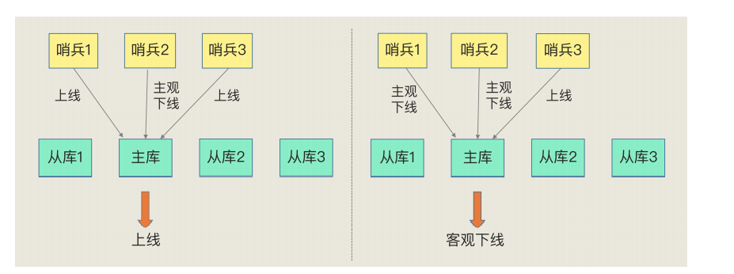
当大多数的哨兵认为主库已经“主观下线”了，主库才会被标记为“客观下线”


### 如何选定新主库？

哨兵选择新主库的过程称为“**筛选+打分**”


**筛选**：除了要检查从库的**当前在线状态**，还要判断之前的**网络连接状态**


**打分**：根据从库优先级，从库复制进度以及从库ID号。 三个规则依次进行三轮打分，只要在某一轮中，有从库得分最高没那么就是它是主库，如果没有得分最高，则进行下一轮。

**第一轮：优先级最高的从库得分高。**
用户可以通过 slave-priority配置项，给不同的从库设置不同的优先级。

**第二轮：和旧主库同步程度最接近的从库得分高。**

> 主从库同步时有个命令传播的过程。在这个过程中，主库会用master_repl_offset记录当前的最新写操作在repl_backlog_buffer中的位置，而从库会用slave_repl_offset这个值来记录当前的复制进度。

哪个从库的slave_repl_offset最接近master_repl_offset，哪个从库得分高

**第三轮：ID小的从库得分高。**


### 小结
哨兵机制是实现Redis 不间断服务的重要保证。 具体来说，**主从集群的数据同步**，是数据可靠的基础保证；而在从库发生**故障**时，**自动的主从切换是服务不间断**的关键支撑。


## 08 哨兵集群:哨兵挂了，主从库还能切换吗？

部署哨兵集群时，在配置哨兵的信息时，值用设置主库的IP和端口，并没有配置其他哨兵的连接信息。
```c
sentinel monitor <master-name> <ip> <redis-port> <quorum> 
```

### 基于pub/sub机制的哨兵集群组成（发布/订阅模式）

哨兵只要和主库建立了连接，就可以在主库上发布消息，比如说发布它自己的连接信息（IP和端口）。同时，也可以从主库上订阅消息，获得其他哨兵发布的连接信息。 当多个哨兵都与主库做了发布与订阅操作后，它们之间就能直到彼此的ip。

除了ip，自己编写的程序也可以通过Redis进行消息的发布和订阅。
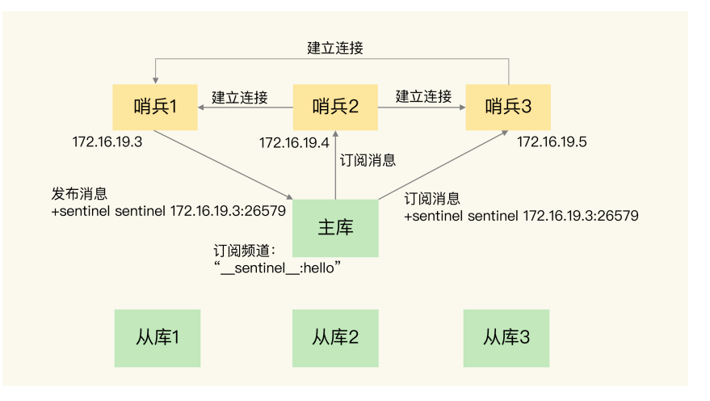


### 哨兵是如何直到从库的IP地址和端口？

这是由哨兵向主库发送INFO命令来完成的。就像下图所示，哨兵2给主库发送INFO命令，主库接收到命令后返回从库列表。
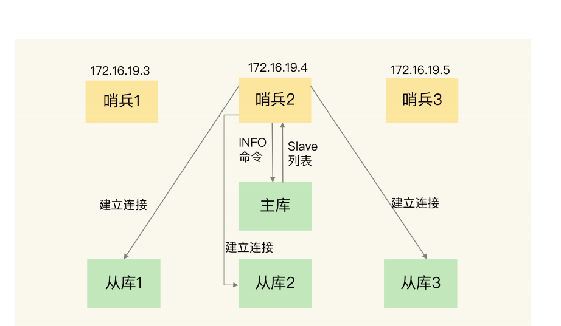


### 由哪个哨兵执行主从切换？

任何一个哨兵实例只要判断主库“主观下线”，就会给其他实例发送 is-master-down-by-addr命令。 接着，其他实例会根据主库的连接情况，做出Y或N的响应，Y相当于赞成票，N相当于反对票。

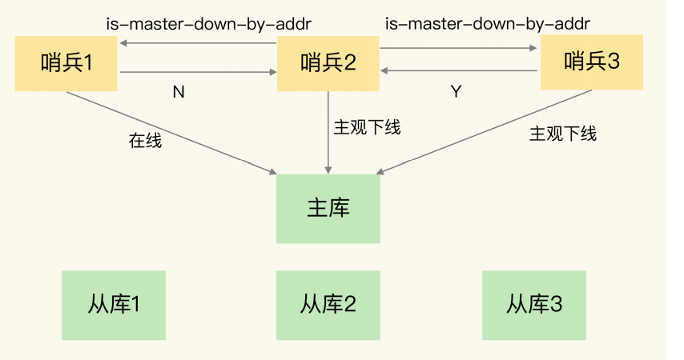


一个哨兵获得了仲裁所需的赞成票数后，就可以标记主库为“客观下线”。这个所需的赞成票数是通过哨兵配置文件中的 quorum 配置项设定的。例如，现在有 5 个哨兵，quorum 配置的是 3，那么，一个哨兵需要 3 张赞成票，就可以标记主库为“客观下线”了。这 3 张赞成票包括哨兵自己的一张赞成票和另外两个哨兵的赞成票。


## 09 切片集群：数据增多了，该加内存还是加实例。
要用 Redis 保存 5000 万个键值对，每个键值对大约是 512B，为了能快速部署并对
外提供服务，我们采用云主机来运行 Redis 实例，那么，该如何选择云主机的内存容量呢？


上述数据大概占用25GB内存，
第一个方案：选择一个32GB内存的云主机来部署Redis。

然而，这样做会导致Redis 的响应非常慢，因为Redis 的持久化会fork子进程进行，fork操作的用时和Redis的数据量是正相关的，而fork在执行时会阻塞主线程。数据量越大，fork操作造成的主线程阻塞时间越长。 这样就会导致redis响应变慢。


第二个方案：组成Redis切片集群。

切片集群，也叫分片集群，就是指启动多个Redis实例组成一个集群，然后按照一定的规则，把收到的数据划分为多份，每一份用每一个实例来保存。

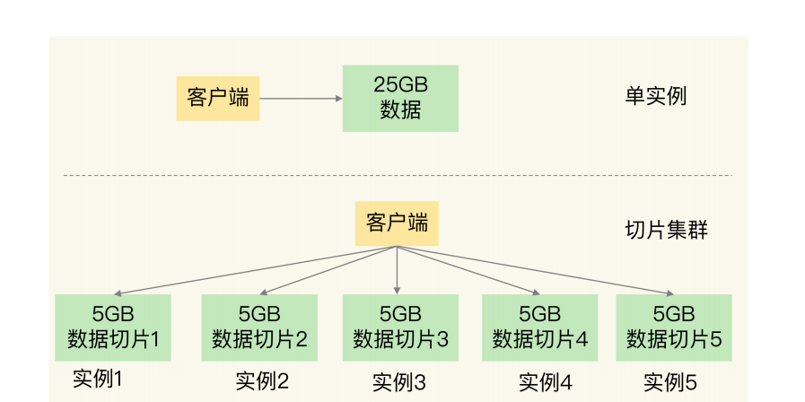

### 如何保存更多数据
为了保存大量数据：使用了大内存云主机和切片集群两种方法。实际上，分别对应着Redis应对数据量增多的两种方案：纵向扩展和横向扩展。

**纵向扩展**：升级单个Redis实例的资源配置，包括增加内存容量，增加磁盘容量，使用更高配置的CPU。（实施起来简单，直接）
**缺点**：redis数据量增加时，需要的内存也会增加，主线程fork子进程时可能会阻塞，

**横向扩展**：横向增加当前Redis实例的个数。
需要解决以下问题：
* 数据切片后，在多个实例之间如何分布？
* 客户端怎么确定想要访问的数据在哪个实例上。
  

### 数据切片和实例的对应分布关系


切片集群是一种保存大量数据的通用机制，这个机制可以有不同的实现方案。在Redis 3.0开始，官方提供了一个名为Redis Cluster 的方案，用于实现切片集群。Redis Cluster 方案中就规定了数据和实例的对应规则。

Redis Cluster方案采用哈希槽（Hash Slot），来处理数据和实例之间的映射关系。


在Redis Cluster方案中，一个切片集群共有16384个哈希槽，这些哈希槽类似于数据分区，每个键值对都会根据它的key，被映射到一个哈希槽中。

具体的映射过程分为两大步：
对key按照CRC16算法计算一个16bit的值，然后对16384取模，得到的值就是对应的槽。

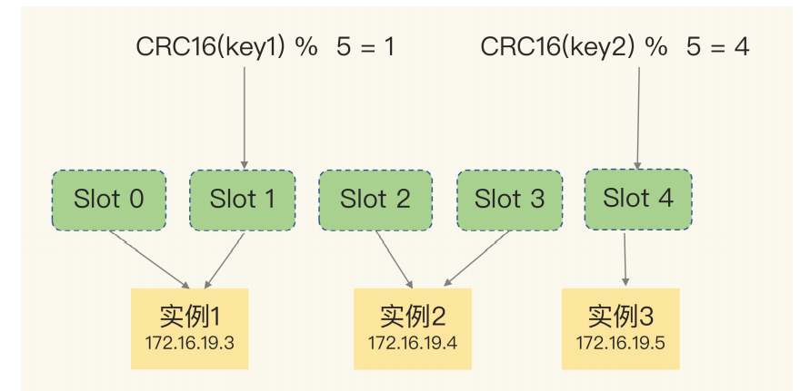

而哈希槽如何被分配给集群的redis实例。
使用cluster create 创建集群，redis 会自动把这些槽分配给集群实例上。

也可以根据不同实例的资源配置情况，cluster addslots 手动分配哈希槽。

### 客户端如何定位数据？
key->槽

客户端与集群实例建立连接后，实例就会把哈希槽的分配信息发送给客户端，（刚开始，每个实例只知道被分配了哪些槽），但是redis实例会把自己的哈希槽信息发送给其他的redis实例。当实例之间相互连接后，每个实例都有所有的哈希槽映射关系。


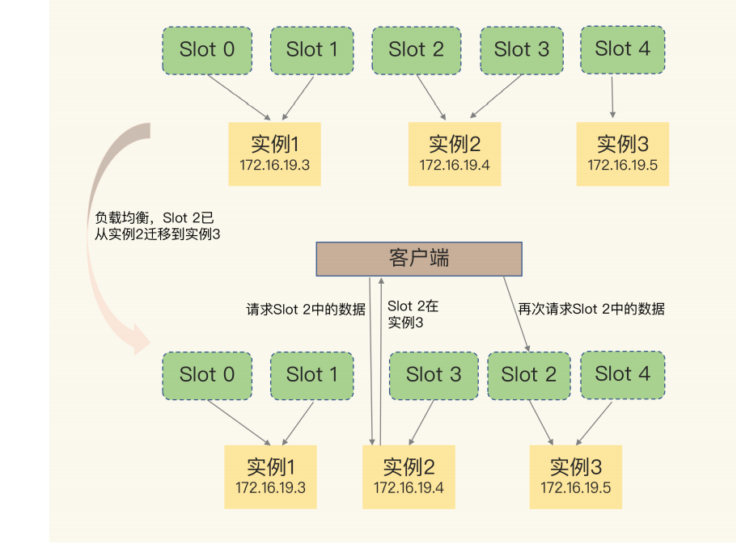


##10 常见问题
