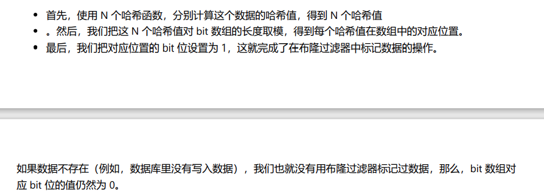
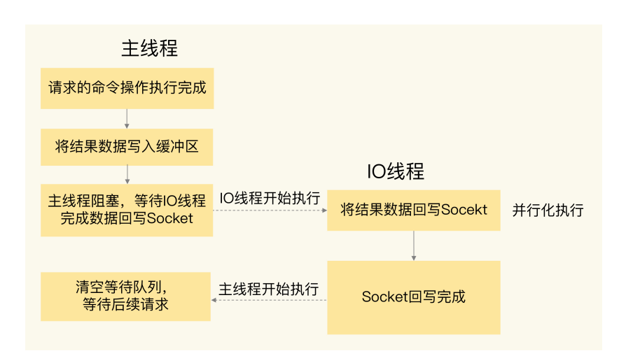

# 实践篇
[toc]


## 11 万金油的String，为什么不好用了？


开发一个图片存储系统，要求这个系统能快速地记录图片ID和图片在存储系统中保存时的ID（可以直接叫做图片存储对象ID）。还要能够根据图片ID快速查找到图片存储对象ID。

因为图片数量巨大，所以就用10位数来表示图片ID和图片存储对象ID，例如，图片ID为1101000051，它在存储系统中对应的ID号是3301000051 .


可以看到，图片ID和图片存储对象ID正好一一对应，是典型的“键-单值”模式。所谓的“单值”，就是指键值对中的值就是一个值，而不是一个集合，这和String类型提供的“一个键对应一个值的数据”的保存形式正好契合。


第一个方案就是用 String 保存数据。我们把图片 ID 和图片存储对象 ID 分别作为键值对的 key 和 value 来保存，其中，图片存储对象 ID 用了**String 类型**。


但是随着图片数据量的不断增加，redis内存使用量也在增加，结果就遇到了大内存Redis实例因为生成RDB而响应变慢的问题。


**String 类型并不是是用于所有场合的，它有一个明显的短板，就是它保存数据时所消耗的内存空间较多。**


### 为什么String 类型内存开销大

在上面的案例中，一亿张图片的信息，用了约6.4GB的内存，一个图片的ID和图片存储对象ID的记录平均用了64字节。 但实际上，只需要16字节就可以了。

图片ID和图片存储对象ID都是 10位数，我们可以用两个8字节的Long类型标识这两个ID。因为8字节的Long类型最大可以表示2的64次方的数值，所以肯定可以表示10位数。 但是String 类型却用了64字节。

因为除了记录实际数据，String 类型 还需要额外的**内存空间**记录**数据长度**，**空间使用**等信息，这些信息也叫作元数据。当实际保存的数据较小时，元数据的空间开销就显得比较大了。


然而，由于Redis 的数据类型很多，不同的数据类型都有相同的元数据要记录（最后访问时间，被引用的次数等等），因此，Redis 会用一个RedisObject结构体来统一记录这些元数据，同时指向实际数据。


为了节省内存空间，Redis 还对Long 类型整数和 SDS的内存布局做了专门的设计。

当保存的是Long类型整数时，RedisObject的指针就直接复制位整数数据。、

当保存字符串数据，如果字符串长度小于等于44字节，RedisObject中的元数据，指针和SDS是一块连续的内存区域，这样就可以避免内存碎片。 （embstr编码方式）

如果大于44字节，会给sds分配独立的空间，用指针指向SDS结构。（raw编码模式）


根据上面的RedisObject 所包含的额外元数据开销，就可以计算String 类型的内存使用量。

（8+8）*2=32 字节，两个ID加起来共使用32字节。还剩下32字节。

Redis 使用**全局哈希表**来保存所有键值对，哈希表的每一项是一个dictEntry 的结构体，用来指向一个键值对。 dictEntry结构中有三个8字节的指针，分别指向key，value以及下一个dictEntry，三个指针共24字节，如下图所示：


这里仅仅只有24字节，为什么占用了32字节？
（因为Redis 使用的内存分配库jemalloc）

jemalloc 会根据分配的内存，根据字节数N，找到一个比N大的最小的2次幂作为分配空间。
因此分配了32字节。


### 用什么数据结构可以节省内存？

Redis 有一个底层数据结构，叫压缩列表（ziplist），比较节省内存。


表头三个字段 zlbytes,zltail,zllen ：表示列表长度，列表尾的偏移量，以及列表中的entry个数。压缩列表还有一个zlend，表示列表结束。

压缩列表之所以可以节省内存，就在于它是用一系列连续的entry 保存数据。每个entry的元数据包含下面几部分。

* **prev_len**,表示前一个entry的长度。prev_len有两种取值情况：1字节或5字节。取值 1 字节时，表示上一个 entry 的长度小于 254 字节。虽然 1 字节的值能表示的数值范围是 0 到 255，但是压缩列表中zlend 的取值默认是 255，因此，就默认用 255 表示整个压缩列表的结束，其他表示长度的地方就不能再用 255 这个值了。所以，当上一个 entry 长度小于 254 字节时，prev_len 取值为 1 字节，否则，就取值为 5 字节。
* len:表示自身长度，4字节
* encoding:表示编码方式，1字节
* content:保存实际数据。


接下来以之前的图片存储对象ID为例，来分析压缩列表是如何节省内存空间的。

每个entry保存一个图片存储对象ID（8字节），此时，每个entry 的prev_len 只需要1个字节就行，因为每个entry的前一个entry长度都只有8字节，小于254字节。这样一来，一个图片的存储对象ID所占用的内存大小是14字节(1+4+1+8),实际分配16字节。

Redis 基于压缩列表实现了 List、Hash 和 Sorted Set 这样的集合类型，这样做的最大好处就是节省了 **dictEntry的开销。**当你用 String 类型时，**一个键值对就有一个 dictEntry**，要用 32 字节空间。但采用集合类型时，**一个key 就对应一个集合的数据**，能保存的数据多了很多，但也只用了一个 dictEntry，这样就节省了内存。
这个方案听起来很好，但还存在一个问题：在用集合类型保存键值对时，一个键对应了一个集合的数据，但是在我们的场景中，**一个图片 ID 只对应一个图片的存储对象 ID，我们该怎么用集合类型呢？** 换句话说，在一个键对应一个值（也就是单值键值对）的情况下，我们该怎么用集合类型来保存这种单值键值对呢？


### 如何用集合类型保存单值的键值对
保存单值的键值对，可以采用基于Hash类型的二级编码方法。

就是把一个单值的数据拆分称为两部分，前一部分作为Hash 集合的key ，后一部分作为Hash集合的value。


Hash 类型底层结构什么使用压缩列表，什么时候使用哈希表呢？其实，hash类型设置了用压缩列表保存数据时的两个阈值，一旦超过了阈值，Hash类型就会用哈希表来保存数据了。


## 12 有一亿个keys要统计，应该用哪种集合？
在web 和移动应用的业务场景中，我们经常需要保存这样一种信息：一个key对应了一个数据集合。举几个例子。
* 手机app中的每天的用户登录信息：一天对应一系列用户ID或移动设备ID
* 电商网站上商品的用户评论列表：一个商品对应了一系列的评论；
* 用户在手机App上的签到打卡信息：一天对应一系列用户的签到记录；
* 应用网站上的网页访问信息：一个网页对应一系列的访问点击。

redis 集合类型就是一个键对应一系列的数据，所以非常适合用来存取这些数据。但是，在这些场景中，除了记录信息，还需要对集合中的数据进行统计，例如：
* 在移动应用中，需要统计每天的新增用户数和第二天的留存用户数；
* 在电商网站的商品评论中，需要统计评论列表中的最新评论；
* 在签到打卡中，需要统计一个月内连续打卡的用户数；
* 在网页访问记录中，需要统计独立访客（Unique Visitor，UV）量。

因此需要选择出能够非常高效地统计大量数据（例如亿级）的集合类型。


### 聚合统计
集合元素统计的第一个场景： 聚合统计(**统计多个集合元素的聚合结果**)，包括：统计多个集合的共有元素（交集统计），把两个集合相比，统计其中一个集合独有的元素（差集统计);统计多个集合的所有元素（并集统计）。


统计手机App每天的新增用户数和第二天的留存用户数，正好对应了聚合统计。

要完成这个统计任务，我们可以用一个集合记录所有登录过App的用户ID，同时，用另一个集合记录每一天登录过App的用户ID。然后，在对这两个集合做聚合统计。


记录所有登录过app的用户id还是比较简单的，可以直接使用set类型，把key设置为user:id，表示记录的是用户ID，value就是一个set集合，里面是所有登录过App的用户ID，可以把这个set叫做累计用户set，如下图所示：


这个集合没有日期信息，不能直接统计每天的新增用户。所以，还需要把每一天登录的用户id，记录到一个新集合中，这个集合叫做每日用户set，有以下特点：
* key是user：id以及当天日期，例如 user:id:20200803
* value是set集合，记录当天登录的用户id


在统计每天的新增用户时，只要计算两个集合的差集即可。


命令

差集
```C
SDIFF key [key...]，从第一个key的集合中去除其他集合和自己的交集部分
SDIFFSTORE destination key [key...]，将差集结果存储在目标key中
```
交集
```c
SINTER key [key...]，取所有集合交集部分
SINTERSTORE destination key [key...]，将交集结果存储在目标key中
```

并集
```c
SUNION key [key...]，取所有集合的并集
SUNIONSTORE destination key [key...]，将并集结果存储在目标key中
```

####tips
set的差集，并集和交集的计算复杂度较高，在数据量较大的情况下，如果直接执行这些计算，容易导致实例阻塞。 可从**主从集群中选择一个从库，让它专门负责聚合计算，或者是把数据读到客户端，在客户端来完成聚合统计，这样就可以规避阻塞主库实例和其他从库实例的风险了。**

### 排序统计

以上述的最新评论列表的场景为例，
最新评论列表包含了所有评论中的最新留言，这就要求 **集合类型能对元素排序**，也就是说，集合中的元素可以按序排列，这种对元素排序的集合类型叫做有序集合。


在Redis 常用的四个集合类型中（list,hash,set,sorted set）,list 和sorted set就属于有序集合。

（sorted set 就是zset ，因为Set的开头字母也是S，Sorted Set缩写为SSet不合适 ，会导致命令冲突 ，所以干脆用Z代替，ZSet出生了~它的出现也是解决set天生无序的问题）

list是按照元素进入list的顺序进行排序的，而sorted set 可以根据**元素的权重**来排序。可以自己来决定每个元素的权重值，先插入的元素权重小，后插入的元素权重大。

list是通过元素在list中的位置来排序的，当有一个新元素插入时，原先的元素会在list中的位置都后移了以为，原来排在第一位的元素现在排在了第二位。list相同位置上的元素就会发生变化。

和 List 相比，Sorted Set 就不存在这个问题，因为它是根据元素的实际权重来排序和获取数据的。我们可以按评论时间的先后给每条评论设置一个权重值，然后再把评论保存到 Sorted Set 中。Sorted Set 的ZRANGEBYSCORE 命令就可以按权重排序后返回元素。这样的话，即使集合中的元素频繁更新，Sorted Set 也能通过 ZRANGEBYSCORE 命令准确地获取到按序排列的数据。假设越新的评论权重越大，目前最新评论的权重是 N，我们执行下面的命令时，就可以获得最新的 10 条评论：
```c
ZRANGEBYSCORE comments N-9 N
```
#### tips
在面对需要展示最新列表，排行榜等场景时，如果数据更新频繁或者需要分页显示，建议使用zset。


### 二值状态统计
二值状态是指集合元素的取值就只有0或1两种。在签到打卡的场景中，我们只用记录签到（1）
或未签到（0），所以它就是非常典型的二值状态。

在签到统计时，每个用户一天的签到用一个bit位就能表示一个bit位就能表示，一个月的签到情况用31bit位就可以，而一年的签到也只需要用365个bit位，根本不用太复杂的集合类型。这个时候，就可以使用bitmap。 这是redis提供的扩展数据类型。


#### 实现原理
Bitmap 本身是用String 类型作为底层数据结构实现的一种统计二值状态的数据类型。 String类型是会保存位二进制的字节数组，所以，Redis就把字节数组的每个bit位利用起来，用来表示一个元素的二值状态。把Bitmap 看作是一个bit数组。

Bitmap 提供了 GETBIT/SETBIT操作，使用一个偏移值offset对bit数组的某一个bit位进行读和写。不过，bitmap的偏移量是从0开始算的，当使用setbit对一个bit位进行写操作时，这个bit位会被设置位1。Bitmap 还提供了BITCOUNT操作，用来统计这个bit数组中所有“1”的个数。

#### 具体实例
假设要统计ID3000 的用户在2020年8月份的签到情况，就可以按照下面的步骤。

就可以知道该用户在8月份的签到情况。


**那么如果**记录了一亿个用户10天的签到情况，你有办法统计出这10天连续签到的用户总数嘛。

在举例之前，要先知道，Bitmap支持用BITOP命令对多个Bitmap按位做“与”或“异或”的操作，操作的结果会保存到一个新的Bitmap中。


回到刚刚的问题，在统计一亿个用户连续十天的签到情况时，你可以把每天的日期当作当作key，每个key对应要给1亿位的bitmap，每个bit对应一个用户当天的签到情况。


接下来，对10个bitmap做按位“与”操作，得到的结果也是一个Bitmap，大约占12mb（10^8/8/1024/1024）的内存。

#### tips
如果只需要统计数据的二值状态，例如商品有没有，用户在不在等，就可以使用Bitmap，只用一个bit位就能表示0或1.在记录海量数据时，Bitmap能苟有效地节省内存空间。


### 基数统计
基数统计就是指统计一个集合中不重复的元素个数。对应到我们的场景中，就是统计网页的UV。

网页UV的统计有个独特的地方，就是需要去重，一个用户一天内的多次访问只能算作一次。在Redis的集合类型中，Set类型默认支持去重，所以看到有去重需求时，使用set类型。


有一个用户user1访问page1 时，你把这个信息加到set中：
```c
SADD page1:uv user1
```

但是，如果page1非常火爆，UV达到了千万，这个时候，一个set就要记录千万个用户ID。对于一个搞大促的电商网站而言，这样的页面可能有成千上万个，如果每个页面都能这样的一个set，就会消耗很大的内存空间。


那什么技能完成统计，还能节省内存呢？

这里可以用到Redis 提供的 HyperLogLog了。

**HyperLogLog**是一种用于统计基数的数据集合类型，它的最大优势在于，**当集合元素数量非常多时，它计算基数所需的空间总是固定的，而且还很小。**

在统计UV时，你可以用PFADD命令（用于向HyperLogLog中添加新元素）把访问页面的每个用户都添加到HyperLogLog中。

```c
PFADD page1:uv user1 user2 user3 user4 user5
```

接下来，就可以用PFCOUNT命令直接获得page1的UV值了，这个命令的作用就是返回HyperLogLog的统计结果。
```c
PFCOUNT page1:uv
```

HyperLogLog 的统计规则时**基于概率完成**的，因此可能有误差。


## 13 GEO是什么？ 还可以定义新的数据类型吗？

Redis的5大基本数据类型：**String，List，Hash，Set和Sorted Set**，它们可以满足大多数的数据需求，但是在面对海量数据统计时，他们的内存开销很大，而且对于一些特殊的场景，它们是无法支持的。所以，Redis还提供了**3种扩展数据类型** ， 分别是 Bitmap， HyperLogLog 和 GEO 。

这里，具体讲一讲GEO。


### 面向LBS应用的GEO数据类型
在日常生活中，我们越来越依赖搜索“附近的餐馆”，在打车软件上叫车，这些都离不开**基于位置信息服务**
（Location-Based Service,LBS）**的应用**。 LBS应用访问的数据是和人或物关联的一组经纬度信息，而且要能查询相邻的经纬度范围，GEO就非常适合应用在LBS服务的场景中，来看一下它的底层结构。

#### GEO的底层结构

一般来说，在设计要给数据类型的底层结构时，我们需要知道，要处理的数据有什么访问特点。 所以，我们需要现搞清楚位置信息到底时怎么被存取的。

以叫车服务为例，来分析LBS应用中经纬度的存取特点。

1. 每一辆网约车都有一个编号（例如33），网络车需要将自己的经度信息（例如116.034579）和纬度信息（例如 39.00452）发给叫车应用。
2. 用户在叫车的时候，叫车应用会根据用户的经纬度位置（例如经度116.054579，维度39.030452），查找
用户的附近车辆，并进行匹配。
3. 等把位置相近的用户和车辆匹配上以后，叫车应用就会根据车辆的编号，获取车辆的信息，并返回给用户。

这种数据记录模式一个key(例如车ID)对应一个value(一组经纬度)。当有很多车辆信息要保存时，就需要有一个集合来保存车辆ID和经纬度的对应关系，所以，我们可以把不同车辆的ID和它们对应的经纬度信息存在Hash集合里。


同时，Hash类型的HSET操作命令，会根据key来设置相应的value 值，所以，我们可以用它来快速地更新车辆变化的经纬度信息。

但是，对于一个LBS应用来说，**除了记录经纬度信息**，**还需要根据用户的经纬度信息在车辆的hash集合中进行范围查询。**一旦涉及到范围查询，就意味着集合中的元素需要有序，但Hash类型的集合时无序的，显然不能满足我们的要求。

那么zset类型是不是合适呢？

zset类型也支持一个key对应一个value的记录模式，其中，而 value 则是元素的权重分数。更重要的是，zset 可以根据元素的权重分数排序，支持范围查询。这就能满足 LBS服务中查找相邻位置的需求了。

而这里 GEO类型的底层数据结构用zset来实现的。
用zset来保存车辆的经纬度信息，zset的元素是车辆ID， 元素的权重分数是经纬度信息，如下图所示：


这时问题来了，zset的权重分数是一个浮点数，而一组经纬度包含的是经度和维度两个值，是不能保存浮点数的。
这里用到GEO类型中的GeoHash编码了。


#### GeoHash编码
对经度和维度分别编码，然后合成一个最终编码

在进行第一次二分区时，经度范围[-180,180]会被分成两个子区间：[-180,0) 和[0,180]（我称之为左、右分
区）。此时，我们可以查看一下要编码的经度值落在了左分区还是右分区。如果是落在左分区，我们就用 0 表
示；如果落在右分区，就用 1 表示。这样一来，每做完一次二分区，我们就可以得到 1 位编码值。
然后，我们再对经度值所属的分区再做一次二分区，同时再次查看经度值落在了二分区后的左分区还是右分
区，按照刚才的规则再做 1 位编码。当做完 N 次的二分区后，经度值就可以用一个 N bit 的数来表示了。

当一组经纬度值都编完码后，我们再把它们的各自编码值组合在一起，组合的规则是：最终编码值的偶数位上
依次是经度的编码值，奇数位上依次是纬度的编码值，其中，偶数位从 0 开始，奇数位从 1 开始。
我们刚刚计算的经纬度（116.37，39.86）的各自编码值是 11010 和 10111，组合之后，第 0 位是经度的第 0位 1，第 1 位是纬度的第 0 位 1，第 2 位是经度的第 1 位 1，第 3 位是纬度的第 1 位 0，以此类推，就能得到最终编码值 1110011101，如下图所示：


#### 如何操作GEO类型？


以叫车应用的车辆匹配场景，具体如何使用这两个命令。

假设车辆ID是33，经纬度位置是（116.034579，39.030452），我们可以用一个GEO集合保存所有车辆的经纬度，集合key是cars:locations。
```c
GEOADD cars:locations 116.034579 39.030452 33
```
当用户想要寻找自己附近的网约车时，LBS 应用就可以使用 GEORADIUS 命令。
例如，LBS 应用执行下面的命令时，Redis 会根据输入的用户的经纬度信息（116.054579，39.030452 ），查找以这个经纬度为中心的 5 公里内的车辆信息，并返回给 LBS 应用。当然， 你可以修改“5”这个参数，来返回更大或更小范围内的车辆信息。

```c
GEORADIUS cars:locations 116.054579 39.030452 5 km ASC COUNT 10
```

#### 如何自定义数据类型？


## 14 如何在Redis中保存时间序列数据？
记录用户在网站或者App上的点击行为数据，来分析用户行为。 这里的数据一般包括用户ID，行为类型（例如浏览，登录，下单等），行为发生的时间戳：

```c
UserID, Type, TimeStamp
```
比如一个物联网项目的数据存取需求，和这个很相似。我们需要周期性地统计近万台设备的实时状态，包括设备id，压力，温度，湿度，以及对应的时间戳
```c
DeviceID, Pressure, Temperature, Humidity, TimeStamp
```

这种与发生时间相关的一组数据，就是**时间序列数据**。这些数据的特点是没有严格的关系模型，记录的信息可以表示成键和值的关系，所以，并不需要专门用关系型数据库来保存。而Redis的键值数据模型，正好可以满足这里的数据存取需求。Redis基于自身数据结构以及扩展模块，提供了两种解决方案。


### 时间序列数据的读写特点
时间序列数据通常是**持续高并发写入**的，例如，需要连续记录数万个设备的实时状态值。

时间序列数据的写入就是插入数据，原来的数据不会被修改。 因此选择的数据类型复杂度尽可能要低，尽量不要阻塞。


时间序列的读 需要有 单条记录的查询（查询某个设备在某一个时刻的运行状态信息，对应的就是这个设备的一条记录），也有对某个时间范围内的数据的查询（例如每天早上八点到10点的所有设备的状态信息）


时间序列的读 ，（比如对事件序列进行聚合计算）查询模式多


针对时间序列数据的“写要快”，Redis 的高性能写特性直接就可以满足了；而针对“查询模式多”，也就是支持单点查询，范围查询和聚合计算，Redis提供了保存时间序列数据的两种方法，分别可以基**于Hash和zset**实现，以及基于**RedisTimeSeries**模块实现。


### 基于Hash 和 zset保存时间序列数据


hash和zset都是redis内在的数据类型，代码成熟和性能稳定。

**为什么保存时间序列数据，要同时使用这两种类型。**  

使用hash集合记录设备的温度值的示意图：

查询语句
```c
HGET device:temperature 202008030905
"25.1"
HMGET device:temperature 202008030905 202008030907 202008030908
1) "25.1"
2) "25.9"
3) "24.9"

```
然而hash不支持范围查询，因此使用zset来支持范围查询。


zset使用时间戳来作为权重排序。

范围查询
```c
ZRANGEBYSCORE device:temperature 202008030907 202008030910
1) "25.9"
2) "24.9"
3) "25.3"
4) "25.2"
```


然而，如果用了这两个数据结构可以保证 了读写要求，那么还需要满足一个，**即保证写入hash和zset是一个原子性的操作？**

使用redis 的原子性操作？
* multi命令：表示一系列原子性操作的开始。收到这个命令后，redis知道接下来收到的命令需要放到一个队列中，后续一起执行，保证原子性。
* exec命令：表示一系列原子性操作的结束。一旦redis 收到了这个命令，就表示所有要保证原子性的命令操作都已经发送完成了。


还有一个问题，如何对时间序列进行聚合计算？
**聚合计算一般被用来周期性地统计时间窗口内的数据汇总状态，在实时监控与预警等场景下会频繁执行。**


因为 Sorted Set 只支持范围查询，无法直接进行聚合计算，所以，我们只能先把时间范围内的数据取回到客户端，然后在客户端自行完成聚合计算。这个方法虽然能完成聚合计算，但是会带来一定的潜在风险，也就是大量数据在 Redis 实例和客户端间频繁传输，这会和其他操作命令竞争网络资源，导致其他操作变慢。

因此当需要进行大量的聚合计算，同时网络带宽条件不是太耗时，hash和zset的组合就不太适合了。此时，使用RedisTimeSeries就更加合适一些。


#### 基于RedisTimesSeries 模块保存事件序列数据

RedisTimeSeries 是 Redis 的一个扩展模块。它专门面向时间序列数据提供了数据类型和访问接口，并且支持在Redis 实例上直接对数据进行按时间范围的聚合计算。
因为 RedisTimeSeries 不属于 Redis 的内建功能模块，在使用时，我们需要先把它的源码单独编译成动态链接库redistimeseries.so，再使用 loadmodule 命令进行加载，如下所示：
```c
loadmodule redistimeseries.so
```


具体细节看pdf


### 总结

组合使用 Hash 和 Sorted Set，或者使用 RedisTimeSeries，在支持时间序列数据存取上各有优劣势。

* 如果你的部署环境中网络带宽高、Redis 实例内存大，可以优先考虑第一种方案；
* 如果你的部署环境中网络、内存资源有限，而且数据量大，聚合计算频繁，需要按数据集合属性查询，
可以优先考虑第二种方案。


## 15 消息队列的考验： Redis 有哪些解决方案？

现在互联网应用基本上都是采用分布式系统架构进行设计的。而很多分布式系统必备的一个基础软件就是消息队列。

消息队列要求能支持组件通信消息的快速读写，而Redis本身支持数据的告诉访问，正好可以满足消息队列的读写性能需求。不过，除了性能，消息队列还有其他的要求。 “Redis适合做消息队列嘛”

Redis 要做消息队列，首先要考虑以下两方面
* 消息队列的消息存取需求是什么？
* Redis如何实现实习队列的需求？


### 消息队列的消息存取需求
在分布式系统中，当两个组件要基于消息队列进行通信时，一个组件
会把要处理的数据以消息的形式传递给消息队列，然后，这个组件就可以继续执行其他操作了；远端的另一个组件从消息队列中把消息读取出来，再在本地进行处理。


在使用消息队列时，消费者可以异步读取生产者消息，然后再进行处理，这样一来，即使生产者发送的消息的速度远远超过了消费者处理消息的速度，生产者已经发送的消息也可以缓存在消息队列中，避免阻塞生产者，这是消息队列作为分布式组件通信的一大优势。

消息队列再存取消息时，必须要满足三个需求，分别是**消息保序，处理重复的消息和保证消息可靠性。**

#### 消息保序
虽然消费者是异步处理消息，但是，消费者仍然需要按照生产者发送消息的顺序来处理消息，避免后发送的消息被先处理了。对于要求消息保序的场景来说，一旦出现这种消息被乱序处理的情况，就可能会导致业务逻辑被错误执行，从而给业务方造成损失。

RocketMQ 可以按照 任务id来分配 同一个队列

#### 重复消息
消费者从消息队列读取消息时，有时会因为网络堵塞而出现消息重传的情况。此时，消费者可能会收到多条重复的消息。对于重复的消息，消费者如果多次处理的话，就可能造成一个业务逻辑被多次执行，如果业务逻辑正好是要修改数据，那就会出现数据被多次修改的问题了。

#### 消息可靠性
另外，消费者在处理消息的时候，还可能出现因为故障或宕机导致消息没有处理完成的情况。此时，消息队列需要能提供消息可靠性的保证，也就是说，当消费者重启后，可以重新读取消息再次进行处理，否则，就会出现消息漏处理的问题了。


Redis 的 List 和 Streams 两种数据类型，就可以满足消息队列的这三个需求。我们先来了解下基于 List 的消息队列实现方法。

### 基于List的消息队列解决方案

#### 顺序消息
List 本身就是按照先进先出的顺序对数据进行存取的，所以，如果使用List作为消息队列保存消息的话，就已经能满足消息保序的需求了。


注： 在生产者往List 写入数据时，List并不会主动地通知消费者有消息写入，如果消费者想要及时处理消息，就需要在程序中不停地调用RPOP命令，（while循环不断读取），
这样就会导致消费者程序的CPU一直消耗在执行RPOP命令上，带来不必要的性能损失。

Redis 提供了**RBPOP命令， BRPOP 命令也称为阻塞式读取，客户端在没有读到队列数据时，自动阻塞，直到有新的数据写入队列，再开始读取新数据。**

#### 重复消息
要解决重复消息的问题，消息队列需要能够对**重复消息进行判断**。


一方面，消息队列要能给每一个消息提供全局唯一的 ID 号；另一方面，消费者程序要把已经处理过的消息的ID 号记录下来
。
当收到一条消息后，消费者程序就可以对比收到的消息 ID 和记录的已处理过的消息 ID，来判断当前收到的消息有没有经过处理。如果已经处理过，那么，消费者程序就不再进行处理了。这种处理特性也称为幂等性，幂等性就是指，对于同一条消息，消费者收到一次的处理结果和收到多次的处理结果是一致的


#### 可靠性

**为了留存消息，List 类型 提供了BRPOPLPUSH命令，这个命令的作用是让消费者程序从一个List读取消息，同时，Redis 会把这个消息再插入到另一个List 留存。**

### 基于Streams 的消息队列解决方案
Streams 是 Redis 专门为消息队列设计的数据类型，它提供了丰富的消息队列操作命令。

* **XADD**: 插入消息，保证有序，可以自动生成全局唯一ID；
* **XREAD**:用于读取消息，可以按ID读取数据；
* **XREADGROUP**:按消费组形式读取消息；
* **XPENDING 和  XACK**: XPENDING 命令可以用来查询每个消费组内所有消费者已读取但尚未确认的消息，而XACK命令用于向消息队列确认消息处理已完成。


## 16 异步机制：如何避免单线程模型的阻塞？

影响Redis性能的5大方面的潜在因素，分别是：
* Redis内部的阻塞式操作
* CPU核和NUMA架构的影响
* Redis关键系统配置
* Redis内存碎片
* Redis缓冲区。

这章介绍**Redis内部的阻塞式操作以及应对的方法**。


### Redis 实例有哪些阻塞点？
Redis 实例在运行时，要和很多对象进行交互，这些不同的交互就会涉及不同的操作，
* 客户端： 网络IO，键值对增删改查操作，数据库操作；
* 磁盘：生成RDB快照，记录AOF日志，AOF日志重写
* 主从节点：主库完成，传输RDB文件，从库接收RDB文件，清空数据库，加载RDB文件；
* 切片集群实例：向其他实例传输哈希槽信息，数据迁移


#### 1.和客户端交互时的阻塞点
网络 IO 有时候会比较慢，但是 Redis 使用了 IO 多路复用机制，避免了主线程一直处在等待网络连接或请求到来的状态，所以，网络 IO 不是导致 Redis 阻塞的因素。

键值对的增删改查操作是 Redis 和客户端交互的主要部分，也是 Redis 主线程执行的主要任务。所以，**复杂度高的增删改查**操作肯定会阻塞 Redis。

如何判断操作复杂度，**看操作的复杂度是否为O(N).**

Redis 中涉及集合的操作复杂度通常为O（N）,例如集合元素全量查询操作 HGETALL,SMEMBERS，以及集合的聚合统计操作， 这些操作可以作为Redis的第一个阻塞点：**集合全量查询和聚合操作。**

除此之后，**集合自身的删除操作同样也有潜在的阻塞风险。**（删除操作的本质是要释放键值对占用的内存，在释放内存时，操作系统需要把释放掉的内存块插入到一个空闲内存块的链表，以便后续进行管理以及再分配。释放内存过大时，空闲内存块链表操作时间就会操作增加）。

那什么时候释放大量内存。删除大量键值对数据的时候。删除包含了大量元素的集合，也成为bigkey删除


**bigkey 删除操作就是Redis的第二个阻塞点**

既然清除键值对都是潜在的阻塞点了，那么在Redis的数据库级别操作中，清空数据库必然也是一个潜在的阻塞风险。

#### 2.和磁盘交互时的阻塞点

磁盘IO一般比较费时费力，因此Redis 开发者认为磁盘IO会带来阻塞，所以就把Redis涉及为采用子进程的方式生成RDB快照文件，以及执行AOF日志重写操作。

但是，Redis直接记录AOF日志时，会根据不同的写回策略对数据做落盘保存。一个同步写磁盘的操作的耗时大约时1~2ms，如果有大量的写操作需要记录在AOF记录中，并同步写回的话，就会阻塞主线程了。

这就是Redis的**第四个阻塞点：AOF日志同步写。**


#### 3.主从节点的阻塞点
在主从集群中，主库需要生成RDB文件，并传输给从库。主库在复制的过程中，创建和传输 RDB 文件都是由子进程来完成的，不会阻塞主线程。但是，对于从库来说，它在接收了 RDB 文件后，需要使用 **FLUSHDB **命令清空当前数据库，这就正好撞上了刚才我们分析的**第三个阻塞点。**

此外，从库在清空当前数据库后，还需要把 RDB 文件加载到内存，这个过程的快慢和 RDB 文件的大小密切相关，RDB 文件越大，加载过程越慢，所以，加载 RDB 文件就成为了 Redis 的第五个阻塞点。


#### 4.切片集群实例交互时的阻塞点


上面存在着5大阻塞，那么这五大阻塞如果可以异步执行，则可以减少主线程的阻塞。


### 哪些阻塞点可以异步执行？
如果有一个操作能被异步执行，就意味着，它并不是Redis主线程的关键路径上的操作。
即Redis不用返回数据结果的操作。


对于Redis来说，**读操作时典型的关键路径操作**，因为客户端发送了读操作之后，就需要读取的数据返回。而第一个Redis阻塞点“集合全量查询以及聚合操作”都涉及到了读操作，因此不能进行异步操作。


而删除操作不需要给客户端返回结果，因此 第二个阻塞点 ，第三个都可以使用后台子进程来异步操作。


第四个阻塞点“AOF日志同步写”来说，为了保证数据可靠性，Redis 实例需要保证AOF日志中的操作记录已经落盘，这个操作不需要返回结果给客户端，因此可以启动一个子进程来执行AOF日志的同步写，而不用让主线程等待AOF日志的写完成。


加载RDB需要主线程加载。


### 异步的子线程机制
Redis 主线程启动后，会使用操作系统提供的 pthread_create 函数创建 3 个子线程，分别由它们负责 AOF 日志写操作、键值对删除以及文件关闭的异步执行。


### 小结
在上文的五大阻塞点中，bigkey删除，清空数据库，AOF日志同步写不属于关键路径操作，可以使用**异步子线程**机制来完成。


## 17 为什么CPU结构也会影响Redis 的性能？


## 18 波动的响应延迟：如何应对变慢的Redis？（上）


## 19 波动的响应延迟：如何应对变慢的Redis？（下）


## 20 删除数据后，为什么内存占用率还是很高？


## 21 缓冲区，一个可能引发惨案的地方


## 23 旁路缓存：Redis 是如何工作的？
Redis 提供了高性能的数据存取功能，所以广泛应用在缓存场景中，既能有效地提升业务应用地响应速度，还可以避免把高并发大压力地请求发送到数据库层。

**但是，如果Redis 做缓存时出现了问题，比如说缓存失效，那么，大量请求都会积压到数据库层，必然会给数据库带来巨大的压力，很可能会导致数据库宕机或是故障，那么业务应用就没有办法存取数据，响应用户请求了。**


Redis 用作缓存的普遍性以及它在业务应用中的重要作用，因此，需要系统得掌握缓存的一系列内容，包括工作原理，替换策略，异常处理和扩展机制。
* Redis 缓存具体时怎么工作的？
* Redis 缓存如果满了，该怎么办？
* 为什么会有缓存一致性，缓存穿透，缓存雪崩，缓存击穿等异常，该如何应对？
* Redis 的内存毕竟优先，如果用快速的固态硬盘来保存数据，可以增加缓存的数据量，那么,Redis 缓存可以使用快速固态硬盘嘛？


### 缓存的特征

由于一个系统的不同层之间的访问速度不一样，才需要缓存，这样就可以把频繁访问的数据放在缓存中，以加快它们的访问速度。


下图时计算机系统中的三层存储结构，以及它们各自的常用容量和访问性能，。


从上图中可以看到，CPU,内存和磁盘这三层的访问速度从几十ns到100ns，再到几ms，性能的差异很大。

如果每次CPU处理数据时，都要从ms级别的慢速磁盘中读取数据，然后在进行处理，那么CPU只能等磁盘的数据传输完成。这样一来，高速的CPU就被慢速的磁盘拖累了，这个计算机系统的运行速度会变的非常慢。

所以，计算机系统中，默认有两种缓存：
* CPU里面的末级缓存，即LLC，用来缓存内存的数据，避免每次都从内存中存取数据
* 内存中的高速页缓存，即page cache，用来缓存磁盘中的数据，避免每次从磁盘中存取数据。


跟内存相比，LLC的访问速度更快，而和磁盘相比，内存的访问时更快的。所以，我们可以看出缓存的**第一个特征**，在一个层次化的系统中，缓存一定是**一个快速子系统**，数据存在缓存中，**能避免每次从慢速子系统中存取数据。**  对应到互联网应用中，Redis就是快速子系统，而数据库就是慢速子系统。

而从上面的分层结构中，可以看到，**缓存系统的容量大小总是小于后端慢速系统的，我们不可能把所有数据都放在缓存系统中。**

它表明了，缓存的容量终究是有限的，缓存中的数据量也是有限的，肯定是没法时刻都满足访问需求。所以，缓存和后端慢速系统之间，必定存在数据写回再读取的交互过程。 简单来说，**缓存中的数据需要按一定规则淘汰出去，写回后端系统，而新的数据又要从后端系统中读取进来，写入缓存。**（Redis 本身按照一定规则淘汰数据）


### Redis 缓存处理的两种情况
把Redis 用作缓存时，可以把Redis 部署在数据库的前端，业务应用在访问数据时，会先查询Redis 中是否保存了相应的数据。 此时，根据数据是否存在缓存中，会有两种情况。
* 缓存命中：Redis中有相应数据，就直接读取Redis，性能非常快
* 缓存缺失：Redis中没有保存相应数据，就从后端数据库中读取数据，性能就会变慢。而且，一旦发生缓存缺失，为了让后续请求能从缓存中读取到数据，需要把缺失的数据写入Redis，这个过程叫做缓存更新。**缓存更新操作会涉及到保证缓存和数据库之间的数据一致性问题。**

下图展示了这两种情况：


假设在一个Web应用中，使用Redis 作为缓存，用户请求发送到Tomcat，Tomcat负责处理业务逻辑，如果要访问数据，就需要从MySQL中读写数据。 那么，可以把Redis 部署在MySQL前端。如果访问的数据在Redis中，此时缓存命中，Tomcat可以直接从Redis中读取数据，加速应用的访问。否则，Tomcat就需要从慢速的数据库中读取数据了。

使用Redis缓存中，基本有三个操作：
* 应用读取数据时，需要先读取Redis
* 发生缓存缺失时，需要从数据库读取数据
* 发生缺失时，还需要更新缓存。


### Redis 作为旁路缓存的使用操作

Redis 是一个独立的系统软件，和业务应用程序是两个软件，当我们部署了 Redis 实例后，它只会被动地等待客户端发送请求，然后再进行处理。所以，如果应用程序想要使用 Redis 缓存，我们就要在程序中增加相应的缓存操作代码。所以，我们也把 Redis 称为旁路缓存，也就是说，**读取缓存、读取数据库和更新缓存的操作**都需要在应用程序中来完成。

那么，使用Redis 缓存时，需要在应用程序中增加三方面的代码：
* 当应用程序需要读取数据时，需要在代码中显式调用Redis 的GET操作接口，进行查询
* 如果缓存缺失了，应用程序需要再和数据库连接，从数据库中读取数据；
* 当缓存中的数据需要更新时，我们也需要在应用程序中显式地调用SET操作接口，把更新地数据写入缓存。

redis缓存的伪代码示例
```c
String cacheKey = “productid_11010003”;
String cacheValue = redisCache.get(cacheKey)；
//缓存命中
if ( cacheValue != NULL)
 return cacheValue;
//缓存缺失
else
 cacheValue = getProductFromDB();
 redisCache.put(cacheValue) //缓存更新
```

可以看到，为了使用缓存，Web应用程序需要有一个表示缓存系统的实例对象redisCache，还需要主动调用Redis 的GET接口，并且要处理缓存命中和缓存缺失时的逻辑，例如在缓存缺失时，需要更新缓存。


因此，在使用Redis缓存时，有一个地方需要注意：因为需要新增程序代码来使用缓存，所以，Redis 并不适用于哪些无法获得源码的应用。


在使用旁路缓存时，我们需要在应用程序中增加操作代码，增加了使用Redis 缓存的额外工作量，但是，也正因为Redis 是旁路缓存，是一个独立的系统，可以单独的对Redis 缓存进行扩容或性能优化。而且，只要保持操作接口不变，在应用程序中增加的代码就不用再修改了。


### 缓存的类型

按照Redis缓存是否接收写请求， 可以把它分为只读缓存和读写缓存。


#### 只读缓存
当 Redis 用作只读缓存时，应用要读取数据的话，会先调用 Redis GET 接口，查询数据是否存在。而所有的数据写请求，会直接发往后端的数据库，在数据库中增删改。对于删改的数据来说，如果 Redis 已经缓存了相应的数据，应用需要把这些缓存的数据删除，Redis 中就没有这些数据了。当应用再次读取这些数据时，会发生缓存缺失，应用会把这些数据从数据库中读出来，并写到缓存中。这样一来，这些数据后续再被读取时，就可以直接从缓存中获取了，能起到加速访问的效果。


只读缓存直接在数据库中更新数据的好处是，所有最新的数据都在数据库中，而数据库是提供数据可靠性保障的，这些数据不会有丢失的风险。当我们需要缓存图片、短视频这些用户只读的数据时，就可以使用只读缓存这个类型了。

#### 读写缓存
对于读写缓存来说，除了读请求会发送到缓存进行处理（直接在缓存中查询数据是否存在)，所有的写请求也会发送到缓存，在缓存中直接对数据进行增删改操作。此时，得益于 Redis 的高性能访问特性，数据的增删改操作可以在缓存中快速完成，处理结果也会快速返回给业务应用，这就可以提升业务应用的响应速度。

但是，和只读缓存不一样的是，在使用读写缓存时，最新的数据是在 Redis 中，而 Redis 是内存数据库，一旦出现掉电或宕机，内存中的数据就会丢失。这也就是说，**应用的最新数据可能会丢失，给应用业务带来风险。**


所以，根据业务应用对数据可靠性和缓存性能的不同要求，会有同步直写和异步写回两种策略。

* 同步直写：写请求给缓存的同时，还会给后端数据库进行处理，等到缓存和数据库都写完数据，才给客户端返回。这样，即使缓存宕机或发生故障，最新的数据仍然保存在数据库中，提供了数据可靠性保证。


* 异步写回：考虑到了响应延迟，所有写请求都现在缓存中处理，等到这些增改的数据要被缓存中淘汰出来时，缓存将它们写回后端数据库。 这样一来，数据的操作是在缓存中进行的，很快就能完成。


关于选择只读缓存还是读写缓存，主要看我们对写请求是否有加速的需求。
* 如果需要对写请求进行加速，选择读写缓存
* 如果写请求很少，或者是只需要提升读请求的响应速度的话，选择只读缓存。


## 24 替换策略：缓存满了怎么办？

Redis 缓存使用内存来保存数据，避免业务应用从后端数据库中读取数据，可以提升应用的响应速度。那么，如果我们要把所有要访问的数据都放入缓存，是不是一个很好的设计选择呢？
这样做的性价比反而不高。  举个例子，MySQL中有1TB的数据，如果使用Redis把这1TB的数据都缓存起来，虽然应用都能在内存中访问数据了，但是，这样配置并不合理，因为性价比很低。

一方面，1TB的内存的价格大约是3.5万元，而1TB磁盘的价格大约是1000元。另一方面，数据库的访问都是由局限性的，也就是通常所说的“八二原理”，80%的请求实际只访问了20%的数据。

为了保证较高的性价比，缓存的空间容量必然要小于后端数据库的数据总量。不过，随着要缓存的数据量越来越大，有限的缓存空间不可避免地会被写满。

为了解决这个问题， 涉及到了缓存系统的重要机制，即**缓存数据的淘汰机制**。


### 设置多大的缓存容量合适？
缓存容量设置得是否合理，会直接影响到使用缓存的性价比。我们通常以最小的代价获得最大的收益，所以，把昂贵的内存资源用在关键地方就非常重要了。

根据“八二原理",80%的访问实际上只访问了20%的数据，然而考虑到种种因素，实际上不一定如此。

需要**结合应用数据实际访问特征和成本开销来综合考虑的。** 建议把缓存容量设置为总数据量的15%-30%，兼顾访问性能和内存空间开销。


### Redis 缓存有哪些淘汰策略？

Redis4.0 前一共实现了6种内存淘汰策略，在4.0之后，又增加了2种策略。 可以按照是否会进行数据淘汰把他们分成2类：
* 不进行数据淘汰的策略，只有noeviction
* 会进行淘汰的7种其他策略。

会进行淘汰的7种策略，在根据 淘汰候选数据集的范围分为两类：
* 设置了过期时间的数据中进行淘汰
* 在所有数据范围内淘汰


接下来具体解释下各个策略。

1. noecvtion: 当Redis在使用的内存空间超过maxmemory值时，并不会淘汰数据。对应到缓存，一旦缓存被写满了，再有写请求时，Redis 不再提供服务，而是直接返回错误。 
2. volatile-ttl：在针对设置了过期时间的键值对，根据过期时间的先后进行删除，越早过期的越先被删除
3. volatile-random: 在针对设置了过期时间的键值对，随机删除
4. volatile-lru: 使用lru算法进行筛选设置了过期时间的键值对
5. volatile-lfu: 使用lfu算法筛选设置了过期时间的键值对
6. allkeys-random: 从所有键值对中随机选择并删除的键值对中，进行随机删除。
7. allkeys-lru: 使用lru在所有数据中进行筛选
8. allkeys-lfu: 使用lfu在所有数据中进行筛选


LRU 会把所有的数据组织成一个链表，链表的头和尾分别表示MRU端和LRU端，分别代表最近最常使用 的数据和最近最不常用的数据。


LRU算法在实际实现时，需要用链表管理所有的缓存数据，这会带来**额外的空间开销**。而且，当有数据被访问时，需要在链表上把该数据移动到MRU端，如果有大量数据被访问，就会带来很多链表移动操作，会很耗时，进而会降低Redis 缓存性能。

所以，Redis中，LRU算法被做了简化，Redis 会默认个数据的最近一次访问的时间戳（由键值对数据结构 RedisObject 中的 lru 字段记录）。然后，Redis 在决定淘汰的数据时，第一次会随机选出 N 个数据，把它们作为一个候选集合。接下来，Redis 会比较这 N 个数据的
lru 字段，把 lru 字段值最小的数据从缓存中淘汰出去。


### tips
* 优先使用allkeys-lru策略。这样，可以充分利用LRU这一经典缓存算法的优势，把最近最常访问的数据留在缓存中，提升应用的访问性能。 如果业务数据中有明显的冷热数据区分，使用allkeys-lru 策略。
* 业务应用中的数据访问频率相差不大，没有明显的冷热数据区分，建议使用allkeys-random策略，随机选择淘汰的数据就行。
* 如果业务中有置顶的需求，比如置顶新闻，置顶视频，那么，可以使用volatile-lru 策略，同时不给这些置顶数据设置过期时间。


### 如何处理被淘汰的数据？
一般来说，被淘汰的数据选定后，如果这个数据是干净数据，我们就直接删除；如果这个数据是脏数据，我们需要把它写回数据库，如下图所示:


不过，**对于 Redis 来说，**它决定了被淘汰的数据后，会把它们删除。即使淘汰的数据是脏数据，Redis 也不会把它们写回数据库。所以，我们在使用 Redis 缓存时，如果数据被修改了，需要在数据修改时就将它写回数据库。否则，这个脏数据被淘汰时，会被 Redis 删除，而数据库里也没有最新的数据了。


##  25 缓存异常（上）：如何解决缓存和数据库的数据不一致问题？
在实际应用Redis 缓存时，我们经常会遇到一些异常问题，概括来说有4个方面：缓存中的数据和数据库中的不一致;  缓存雪崩；缓存击穿和缓存穿透。


### 缓存和数据库的数据不一致是如何发生的？

数据一致性 包含了以下两种情况：
* 缓存中有数据，那么，缓存的数据值需要和数据库的值相同
* 缓存中本身没有数据，那么数据库的值必须是最新值。

不符合这两种情况的，就属于缓存和数据库的不一致问题了。不过，当缓存的读写模式不同时，缓存数据不一致的发生情况不一样，应对方法也会有所不同，所以，先按照缓存读写模式，来分别了解下不同模式下的缓存不一致情况。


对于**读写缓存**来说，如果要对数据库进行增删改，就需要在缓存中进行，同时还要根据采取的写回策略，决定是否同步协会到数据库中。

* **同步直写策略**：写缓存时，也同步写数据库，缓存和数据库中的数据一致；
* **异步写回策略**：写缓存时不同步写数据库，等到数据从缓存中淘汰时，再写回数据库。使用这种策略时，如果数据还没有写回数据库，缓存就发生了故障，那么，此时，数据库就没有最新的数据了。


所以，对于读写缓存来说，要想保证缓存和数据库中的数据一致，就要采用**同步直写策略**。不过，需要注意的是，如果采用这种策略，就需要**同时更新缓存和数据库**。所以，我们要在业务应用中使用事务机制，来保证缓存和数据库的更新具有原子性，也就是说，两者要不一起更新，要不都不更新，返回错误信息，进行重试。否则，我们就无法实现同步直写。


而对于**只读缓存**，对于只读缓存来说，如果有数据新增，会直接写入数据库；而有的数据删改时，就需要把只读缓存中的数据标记为无效。这样一来，应用后续再访问这些增删改的数据时，因为缓存中没有响应的数据，就会发生缓存缺失。此时，应用再从数据库中把数据读入缓存，这样后续再访问数据时，就可以直接从缓存中读取了。


上图，可以看到 Tomcat上的应用，无论是新增，修改，还是删除数据X，都会直接再数据库中增改删。当然，如果应用执行的是修改或删除操作，还会删除缓存的数据X。

那么，这个过程会不会出现数据不一致的情况呢？考虑到新增数据和删改数据的情况不一致，所以分开来看。

#### 1.新增数据
新增数据 数据直接写到数据库中，不用对缓存做任何操作，此时，缓存中本身就没有新增数据，而数据库中是最新值，因此是一致的。

#### 2. 删改数据
如果发生删改操作，应用既要更新数据库，也要再缓存中删除数据。这两个操作如果无法保证原子性，也就是说，要不都完成，要不都没完成，此时就会发生缓存不一致的情况。

假设应用先删除缓存，再更新数据库，如果缓存删除成功，但是数据库更新失败，那么，应用再访问数据时，缓存中没有数据，就会发生缓存缺失。然后，应用再访问数据库，但是数据库中的值为旧值，应用就访问到旧值了。


如果先更新数据库，再删除缓存中的值，

但是如果应用先完成了数据库的更新，但是，删除缓存失败了，那么数据库中的值是新值，而缓存中的旧值，这肯定是不一致的，这个时候，如果有其他的并发请求来访问数据，按照正常的缓存访问流程，就会现在缓存中查询，但此时，就会读到旧值了。


### 如何解决数据不一致的问题？

**重试机制**

可以把要删除的缓存值或者是要更新的数据库暂存到消息队列中。当应用没有能够成功地删除缓存值或者成功地删除缓存值或者是更新数据库值时，可以从消息队列中重新读取这些值，然后再次进行删除和更新。


如果能够成功地删除或更新，我们就要把这些值从消息队列中去除，以免重复操作，此时，我们也可以保证数据库和缓存的数据一致了。否则的话，我们还需要再次进行重试。如果重试超过的一定次数，还是没有成功，我们就需要向业务层发送报错信息了。


刚刚说的是在更新数据库和删除缓存值得过程中，一个操作失败的情况，实际上，即使这两个操作第一次执行时都没有失败，当有大量并发请求时，应用还是有可能读到不一致的数据。

接下来，按照不同的删除
#### 情况一：先删除缓存，在更新数据库。
假设线程A 删除缓存值后，还没有来得及更新数据库，线程B就开始读取数据了，那么这个时候，线程B就会发现缓存缺失，就只能去数据库读取。这会带来两个问题：
1. 线程B读到了旧值
2. 线程B是在缓存缺失的情况下读取的数据库，所以，他还会把旧值写入缓存，这可能会导致其他线程从缓存中读到旧值，

等到线程B从数据库读取完数据，更新了缓存后，线程A才开始更新数据库，此时，缓存中的数据是旧值，而数据库中的是最新值，两者就不一致了。


这里可以让 线程A 更新完数据库以后，可以让它先sleep一小段时间，在进行一次缓存删除操作。

这里之所以要加上sleep的这段时间后，就是为了让线程B能够先从数据库读取数据，再把缺失的数据写入缓存，然后，线程A在进行删除。 所以，线程A sleep的时间，就需要大于线程B 读取数据再写入缓存的时间。（这个时间 可以在业务运行的时候，统计下线程读数据和写缓存的操作时间，以此为基础来进行评估）

这样一来，其他线程读取数据时，会发生缺失，所以会从数据中读取最新值。因为这个方案会在第一次删除缓存值后，延迟一段时间再次进行删除，所以叫做“**延迟双删**”


#### 情况二：先更新数据库值，在删除缓存值。

如果线程A更新了数据库的值，但还没来得及删除缓存值，线程B就开始读取数据了，那么此时，线程B查询缓存时，发生缓存命中，就会直接从缓存中读取旧值。不过，在这种情况下，如果，其他线程并发读缓存的请求不多，就不会有很多请求读取到旧值。而且，线程A一般也会很快删除缓存值，这样一来，其他线程再次读取时，就会发生缓存缺失。进而从数据库中读取最新值。**所以，这种情况对业务的影响较小。**


### 小结
缓存不一致主要由两个原因导致的：
* 删除缓存和更新数据库失败而导致数据不一致，可以使用重试机制确保删除或更新操作成功
* 在删除缓存值，更新数据库的这两步操作中，有其他线程的并发度操作，导致其他线程读取到旧值，应对方案是延迟双删。
  
对于**读写缓存**来说，采用同步写回的策略，可以保证缓存和数据库的数据一致。

而对于**只读缓存**来说，有以下方法。


对于上述方法来说，优先使用 先更新数据库，在删除缓存的方法，原因主要由两个：


 1. 先删除缓存值再更新数据库，有可能导致请求因缓存缺失而访问数据库，给数据库带来压力。
 2. 如果业务应用读取数据库和写缓存的时间不好估算，延迟双删中的等待时间就不好设置。

如果业务层要求必须读取一致的消息，则再更新数据库的时候，在Redis缓存客户端暂停读请求，等到数据库删完，缓存值删除后，在读取数据，从而保证数据一致性。


## 26 缓存异常（下）：如何解决缓存雪崩，击穿，穿透难题？

缓存除了数据不一致问题，常常还会面临缓存异常的三个问题，分别是**缓存雪崩，缓存击穿，缓存穿透。** 这三个问题一旦发生，会导致大量的请求积压到数据库层。如果请求的并发量很大，就会导致数据库宕机或是故障。


### 缓存雪崩
是指大量的请求无法在Redis 缓存中进行处理，紧接着，应用将大量请求发送到数据库层，导致数据库层的压力激增。

缓存雪崩一般是由两个原因导致的，应对方案也有所不同，

####第一个原因是：**缓存中有大量数据同时过期，导致大量请求无法得到处理。**


对于上面这个原因：提供两种解决方案：

1） **避免给大量的数据设置大量的过期时间，**
通过expire 命令给每个数据设置过期时间，给这些数据的过期时间增加一个较小的随机数（例如随机增加1-3分钟）

2）**服务降级**
所谓的服务降级，是指发生缓存雪崩时，针对不同的数据采取不同的处理方式。
* 当业务应用访问的是 **非核心数据**（例如电商商品属性）时，暂时停止从缓存中查询这些数据，而是直接返回预定义信息，空值或是错误信息
* 当业务应用访问的是**核心数据**时，仍然允许查询缓存，如果缓存缺失，也可以继续通过数据库读取。


#### 第二个原因， Redis 缓存实例发生故障宕机了，无法处理请求

第一个建议，**是在业务系统中实现服务熔断或请求限流机制。**

所谓的服务熔断，是指在发生缓存雪崩时，为了防止引发连锁的数据库雪崩，甚至是整个系统的崩溃，我们暂停业务应用对缓存系统的接口访问。再具体点说，就是业务应用调用缓存接口时，缓存客户端并不把请求发给Redis 缓存实例，而是直接返回，等到 Redis 缓存实例重新恢复服务后，再允许应用请求发送到缓存系统。


 **请求限流**
假设业务系统正常运行时，请求入口前端允许每秒进入系统的请求是 1 万个，其中，9000 个请求都能在缓存系统中进行处理，只有 1000 个请求会被应用发送到数据库进行处理。
一旦发生了缓存雪崩，数据库的每秒请求数突然增加到每秒 1 万个，此时，我们就可以启动请求限流机制，在请求入口前端只允许每秒进入系统的请求数为 1000 个，再多的请求就会在入口前端被直接拒绝服务。所以，使用了请求限流，就可以避免大量并发请求压力传递到数据库层


第二个建议，事前预防
通过主从节点的方式构建 Redis 缓存高可靠集群。如果 Redis 缓存的主节点故障宕机了，从节点还可以切换成为主节点，继续提供缓存服务，避免了由于缓存实例宕机而导致的缓存雪崩问题。缓存雪崩是发生在大量数据同时失效的场景下，而接下来我要向你介绍的缓存击穿，是发生在某个热点数据失效的场景下。和缓存雪崩相比，缓存击穿失效的数据数量要小很多，应对方法也不一样，我们来看下。


### 缓存击穿
缓存击穿是指，针对某个访问非常频繁的热点数据的请求，无法在缓存中进行处理，紧接着，访问该数据的大量请求，一下子都发送到了后端数据库，导致了数据库压力激增，会影响数据库处理其他请求。缓存击穿的情况，经常发生在热点数据过期失效时，如下图所示：


**对于访问特别频繁的热点数据，我们就不设置过期时间了。**


### 缓存穿透
是指数据既不在redis 也不在  数据库中，导致请求在访问缓存时，发生缓存缺失，再去访问数据库时，也没有。


为了避免缓存击穿的影响，提供三种应对方案。

**第一种方案是，缓存控制或缺省值。**

一旦发生缓存穿透，我们就可以针对查询的数据，在 Redis 中缓存一个空值或是和业务层协商确定的缺省值（例如，库存的缺省值可以设为 0）。紧接着，应用发送的后续请求再进行查询时，就可以直接从 Redis 中读取空值或缺省值，返回给业务应用了，避免了把大量请求发送给数据库处理，保持了数据库的正常运行。


第二种方案是：**使用布隆过滤器快速判断数据是否存在，避免从数据库中查询数据是否存在，减轻数据库压力。**

布隆过滤器由一个初值都为 0 的 bit 数组和 N 个哈希函数组成，可以用来快速判断某个数据是否存在。当我们想标记某个数据存在时（例如，数据已被写入数据库），布隆过滤器会通过三个操作完成标记：



第三种方案： 在请求**入口的前端进行请求检测。**

缓存穿透的一个原因是有大量的恶意请求访问不存在的数据，所以，一个有效的应对方案是在请求入口前端，对业务系统接收到的请求进行合法性检测，把恶意的请求（例如请求参数不合理、请求参数是非法值、请求字段不存在）直接过滤掉，不让它们访问后端缓存和数据
库。这样一来，也就不会出现缓存穿透问题了。


## 27 缓存被污染了，该怎么办？
**什么是缓存污染**：

在一些场景下，有些数据被访问的次数非常少，甚至只会被访问一次。当这些数据服务完访问请求后，如果还继续留存在缓存中的话，就只会白白占用缓存空间，这种情况，就是缓存污染。

当缓存污染不严重时，只有少量数据占据缓存空间，此时，对缓存系统的影响不大。但是，缓存污染一旦变得严重后，就会有大量不再访问的数据滞留在缓存中。如果这时数据占满了缓存空间，我们再往缓存中写入新数据时，就需要先把这些数据逐步淘汰出缓存，这就会引入额外的操作时间开销，进而会影响应用的性能。


### 如何解决缓存污染问题？

使用数据淘汰策略：
noeviction---不淘汰，因此没法解决
volatile-random---随机淘汰---肯定不能
volatile-ttl---针对过期时间找到时间最短的淘汰---不一定（除非你知道数据再什么时候被访问）
volatile-lru----
volatile-lfu
allkeys-lru----
allkeys-random----随机访问，肯定不行
allkeys-lfu----

接下来针对剩下的几种策略进行分析


### LRU 缓存策略
lru策略的核心思想：如果一个数据刚刚被访问，那么这个数据肯定是热数据，还会被再次访问。

Redis的LRU策略，会在每个数据对应的RedisObject 结构体设置一个lru字段，用来记录数据的访问时间戳。再进行数据淘汰时，LRU策略会在候选数据集中中淘汰掉lru字段最小的数据。


所以，在数据被频繁访问的时候，LRU策略可以有效留存访问时间最近的数据。而且，因为留存的这些数据还会被再次访问，所以又可以提升业务应用的访问速度。


### LFU 缓存策略

LFU缓存策略是在LRU基础策略上，为每个数据增加了一个计数器，来统计这个数据的访问次数。当使用LFU策略筛选淘汰数据时，首先会根据数据的访问次数进行筛选，把访问次数最低的数据淘汰出缓存。如果两个次数的访问次数相同，LFU策略再比较这两个数据的访问时效性，把距离上一次访问时间更久的数据淘汰出缓存。

为了避免操作链表的开销，Redis 在实现LRU策略使用了两个近似方法：
* Redis 使用RedisObject 结构来保存数据的，RedisObject 结构中设置了一个lru字段，用来记录数据的访问时间戳；
* Redis 并没有为所有的数据维护了一个全局的链表，而是通过随机采样方式，选取一定数量的数据（例如10个）的数据放入候选集合，后续在候选集合中根据lru字段值的大小进行筛选。


**在此基础上，Redis 在实现 LFU 策略的时候，只是把原来的24bit 的lru字段，又进一步拆分成了两部分。**

* 1.ldt值： lru字段的前16bit，表示数据的访问时间戳
* 2.counter值： lru字段的后8bit，表示数据的访问次数。

在实际应用中，一个数据可能会被访问成千上万次，如果访问一次加1，那么只要访问次数超过了255，数据的counter值就一样了。在进行数据淘汰时，LFU策略就无法很好地区分并筛选这些数据，反而还是可能把不怎么访问的数据留存在了缓存里。


因此，Redis **在实现LFU策略时，Redis 并没有采用数据每被访问一次，就给对应的counter值加1 的计数规则，而是采用了一个更优化的技术规则。**，即：
* 每当数据被访问一次时，首先，用计数器当前的值乘以配置项 lfu_log_factor 再加1，再取其倒数，得到一个p值；然后，把这个p值和一个取值范围在(0,1)间的随机数r值比大小，只有p值大于r值时，计数器才加1.


redis的部分源码如下：

```c
double r = (double)rand()/RAND_MAX;
...
double p = 1.0/(baseval*server.lfu_log_factor+1);
if (r < p) counter++;
```


### tips
缓存污染问题指的是 留存在缓存中的数据，实际不会被再次访问了，但是又占据了缓存空间，如果这样的数据体量很大，甚至占满了内存，每次有新数据写入缓存时，还需要把这些数据逐步淘汰出缓存，就会增加缓存操作的时间开销。

因此，采用LFU来解决缓存污染问题。

如果业务应用中有短时高频访问的数据，除了LFU策略本身会对数据的访问次数进行自动衰减以外：可以优先使用volatile-lfu策略，，并根据这些数据的访问时限设置它们的过期时间，以免它们留存在缓存中造成污染。


## 28 Pika: 如何基于SSD实现大容量Redis？


## 29 无锁的原子操作：Redis 如何应对并发访问？
在使用Redis 时，不可避免地会遇到并发访问地问题，比如说如果多个用户同时下单，就会对缓存在Redis 中的商品库存并发更新。一旦有了并发写操作，数据就会被修改，如果我没有对并发写做好控制，就可能导致数据被改错，影响到业务的正常使用(例如库存数据错误，导致下单异常)。为了保证并发访问的正确性，Redis 提供了两种方法，分别是**加锁和原子操作**。


**加锁**是一种常用的方法，在读取数据前，客户端需要先获得锁，否则就无法进行操作。当一个客户端获得锁后，就会一直持有这把锁，知道客户端完成数据更新，才释放这把锁。


这里存在两个问题: 一个是，**如果加锁操作多，会降低系统的并发访问性能**；
第二个是：Redis客户端要加锁时，**需要用到分布式锁，而分布式锁实现复杂，需要用额外的存储系统来提供加解锁操作**。


原子操作是另一种提供并发访问控制的方法。 原子操作是指执行过程保持原子性的操作，而且原子操作执行时并不需要加锁，实现了无锁操作，这样一来，既能保证并发控制，还能减少对系统并发性能的影响。


### 并发访问中需要对什么进行控制？

并发访问控制，是指多个客户端访问操作同一份数据的过程进行控制，以保证任何客户端发送的操作在Redis 实例上执行时具有互斥性。 例如，客户端A 的访问操作在执行时，客户端B的操作不能执行，需要等到A的操作结束后，才能执行。

并发访问控制对应的操作主要是数据修改操作。当客户端需要修改数据时，基本流程分为两步：
* 1. 客户端先把数据读取到本地，在本地进行修改
* 2. 客户端修改完数据后，再写回Redis。

我们把这个流程叫做“**读取-修改-写回**”操作（Read-Modify-Write，简称位RMW操作）。当有多个客户端对同一份数据执行RMW操作的话，我们就需要让RMW操作涉及的代码以原子性方式执行。访问同一份数据的RMW操作代码，叫做**临界区**代码。

不过，当有多个客户端并发执行临界区代码时，就会存在一些潜在问题，接下来，用一个多客户端更新商品库存的例子来解释一下。

临界区代码如下：为对商品库存执行扣减1的操作，伪代码如下所示：

```c
current = GET(id)
current--
SET(id, current)
```

客户端首先会根据商品id，从Redis中读取商品的当前库存值current ，然后，客户端对库存值减1，再把库存值写回Redis。 当有多个客户端执行这段代码时，这就是一份临界区代码。


如果对临界区代码的执行没有控制，就会出现数据更新错误，在刚才的例子中，假设现在有两个客户端A和B，同时执行上面的临界区代码，就会出现错误。


出现上述这个现象的原因时，临界区代码中的客户端读取数据，更新数据，再写回数据涉及了三个操作，而这三个操作在执行时并不具有互斥性，多个客户端基于相同的初始值进行修改，而不是基于前一个客户端修改后的值在修改。

#### 加锁
为了保证数据并发修改的正确性，可以用锁把并行操作变成串行操作，串行操作就具有互斥性。一个客户端持有锁后，其他客户端只能等到锁释放，才能拿锁再进行修改。

```c
LOCK()
current = GET(id)
current--
SET(id, current)
UNLOCK()
```

虽然加锁保证了互斥性，但是**加锁也会导致系统并发性能降低**。


#### 原子操作

Redis 的两种原子操作方法：
1. 把多个操作在Redis 实现成 一个操作，也就是单命令操作；
2. 把多个操作写到一个Lua脚本中， 以原子性方式执行单个Lua脚本。


Redis 本身的单命令操作。

Redis 是使用单线程来串行处理客户端的请求操作命令的，所以，当Redis执行某个命令操作时，其他命令时无法执行的，这相当于命令操作是 互斥执行的。当然，Redis 的快照生成，AOF重写这些操作，可以使用后台线程或者是子进程执行，也就是和主线程的操作并行执行。不过，这些操作只是读取数据，不会修改数据，所以，不需要对他们进行做并发控制。


尽管，Redis 的单个命令操作可以原子性地执行，但是在实际应用中，数据修改可能包含多个操作，至少包括**读数据，数据增减，写回数据**三个操作，这显然就不是单个命令操作了，那该怎么办？

##### 单独地加减命令
在这里 Redis  提供了**INCR/DECR** 命令，将三个操作转变为一个原子操作了。 INCR/DECR 命令可以对数据进行增值/减少操作，而且它们本身就是单个命令操作，Redis 执行它们时，本身具有互斥性。

比如说，在刚才地库存扣减例子中，客户端可以使用下面地代码，直接完成对商品id地库存值减1.
```c
DECR id 
```


#### 复杂命令
如果要执行的操作不是简单地增减数据，而是有更加复杂地判断逻辑或者是其他操作，那么，Redis 的单命令已经无法保证多个操作地互斥执行了。这个时候，就需要使用Lua 脚本。


Redis 会把整个Lua脚本作为一个整体执行，在执行的过程中不会被其他命令打断，从而保证了Lua脚本中操作的原子性，如果 有多个操作要执行，但是又无法用INCR/DECR 这种命令操作来实现，就可以把这些要执行的操作编写到一个lua脚本中。然后，可以使用Redis 的 EVAL命令来执行脚本。这样一来。这些操作在执行时具有了互斥性。

```c
//获取ip对应的访问次数
current = GET(ip)
//如果超过访问次数超过20次，则报错
IF current != NULL AND current > 20 THEN
 ERROR "exceed 20 accesses per second"
ELSE
 //如果访问次数不足20次，增加一次访问计数
 value = INCR(ip)
 //如果是第一次访问，将键值对的过期时间设置为60s后
 IF value == 1 THEN
 EXPIRE(ip,60)
 END
 //执行其他操作
 DO THINGS
END
```


```c
local current
current = redis.call("incr",KEYS[1])
if tonumber(current) == 1 then
 redis.call("expire",KEYS[1],60)
end
```


```c
redis-cli --eval lua.script keys , args
```


## 如何用Redis 实现分布式锁

在应对并发问题时，除了原子操作，Redis 客户端还可以通过加锁的方式，来控制并发写操作对共享数据的修改，从而保证数据的正确性。

但是，Redis 属于分布式系统，当有**多个客户端要争抢锁的时候**，必须要保证，**这把锁不能是某个客户端本地的锁**。否则的话，其他客户端时无法访问这把锁的当然也就不能获取这把锁了。


所以，在分布式系统中，当有多个客户端需要获取锁时，我们需要分布式锁，此时，锁是保存在一个共享存储系统中的，可以被多个客户端共享访问和获取。


Redis 本身可以被多个客户端共享访问，正好就是一个共享存储系统，可以用来保存分布式锁。而且，Redis的读写性能高，可以应对高并发的锁操作场景。 


### 单机上的锁和分布式锁的联系与区别

可以先看单机上的锁，
对于在单机上的多线程程序来说，锁本身可以用一个变量表示。

* 变量为0，表示没有线程没有获得锁
* 变量为1，表示已有线程获得锁了。

然而在分布式场景下， **锁变量需要由一个共享系统来维护**，只有这样，多个客户端才可以通过访问共享存储系统来访问锁变量。**相应的，加锁和释放锁的操作就变成了读取，判断和设置共享存储系统中的锁变量值。**


这样一来，我们就可以得出实现分布式锁的两个要求。
* 要求一：分布式锁的加锁和释放锁的过程，涉及多个操作。所以，在实现分布式锁时，我们需要保证**这些锁操作的原子性；**
* 要求二：共享存储系统保存了锁变量，如果共享存储系统发生故障或宕机，那么客户端也就无法进行锁操作了。在实现分布式锁时，我们需要考虑保证共享存储系统的可靠性，进而**保证锁的可靠性。**


### 基于单个Redis 节点实现分布式锁
作为分布式锁实现过程中的共享存储系统，Redis 可以使用键值对来保存锁变量，再接收和处理不同客户端发送的加锁和释放锁的操作请求。那么，键值对的键和值具体是怎么定的呢？

我们要赋予锁变量一个变量名，把这个变量名作为键值对的键，而锁变量的值，则是键值对的值，这样一来，Redis 就能保存锁变量了，客户端也就可以通过Redis的命令操作来实现锁操作。


可以看到，Redis 可以使用一个键值对对lock_key:0来保存锁变量，其中，键是lock_key，也就是锁变量的初始值是0.


再来分析下加锁操作。

在图中，客户端A和C同时请求加锁。因为Redis 使用单线程处理请求，所以，即使客户端A和C同时把加锁请求发给了Redis，Redis也会串行处理它们的请求。


假设Redis先处理客户端A的请求，读取lock_key 的值，发现 lock_key 为0，所以，Redis 就把lock_key 的value置为1，表示已经**加锁**了。紧接着，Redis 处理客户端C的请求，此时，Redis 会发现lock_key 的值已经为1；所以就返回**加锁失败**的信息。


而释放锁就是将锁变量设置为0。


因为加锁包含了三个操作（读取锁变量，判断锁变量值以及把锁变量设置为1）而这三个操作在执行时需要保证原子性。那怎么保证原子性呢？


根据上一章节的方法，分别是使用Redis 的单命令操作和使用lua脚本。

可以先看下，Redis 可以用哪些单命令操作实现加锁操作。

首先是SETNX 命令， 用于设置键值对的值，具体来说，就是**这个命令在执行时会判断键值对是否存在，如果不存在，就设置键值对的值，如果存在，就不做任何设置。**（预测一波，最后解锁就是删除）

举个例子，如果执行下面的命令时，key不存在，那么key会被创建，并且值会被设置为null；如果key已经存在，SETNX不做任何复制操作
```c
SETNX key value
```

对于释放锁操作来说，我们可以在执行完业务逻辑后，使用DEL命令删除锁变量。不过，你不用担心锁变量被删除后，其他客户端无法请求加锁了。因为SETNX命令在执行时，如果要设置的键值对不存在，SETNX命令会先创建键值对，然后设置它的值。所以，释放锁之后，再有客户端请求加锁时，SETNX命令会先创建保存锁变量的键值对，并设置锁变量的值，完成加锁。


因此，可以用**SETNX 和 DEL**，命令组合来实现加锁和释放锁操作。下面的伪代码示例显示了锁操作的过程，你可以看下。
```c
// 加锁
SETNX lock_key 1
// 业务逻辑
DO THINGS
// 释放锁
DEL lock_key
```

不过，使用这两个命令  **SETNX 和 DEL** 组合，**存在两个潜在的风险**。

**第一个风险**：假设某个客户端在执行SETNX命令，加锁之后，紧接着却在操作共享数据的时候出现了异常，结果没有一直没有 执行 最后的DEL 命令释放锁。因此，锁就一直被这个客户端持有，其他客户端无法拿到锁，也无法访问共享数据和执行后续操作，这会给业务应用带来影响。

可以给 锁变量设置一个 **过期时间**。


第二个风险：客户端A执行了SETNX 命令，客户端B执行 DEL命令释放锁，此时，客户端A的锁就被**误释放**了。 如果客户端C正好也在申请锁，就可以成功获得锁，进而操作共享数据。

为了应对这个问题，需要 **区分来自不同客户端的锁操作**：

在使用SETNX命令加锁的方法中，通过把锁变量值设置为1或0，表示是否加锁成功。1 和 0 只有两种状态，无法表示究竟是哪个客户端进行的锁操作。所以，在加锁操作时，可以让每个客户端给锁变量设置一个唯一值，这里的唯一值就可以用来标识 当前操作的客户端，在释放锁操作时，客户端需要判断，当前锁变量的值是否**和自己的唯一标识相等**，只有在相等的情况下，才能释放锁。这样一来，就不会出现误释放锁的问题。


那么，具体的代码如下：

```c
// 加锁, unique_value作为客户端唯一性的标识
SET lock_key unique_value NX PX 10000
```
其中，unique_value 是客户端的唯一标识，可以用一个随机生成的字符串来表示，PX 10000 则表示 lock_key会在 10s 后过期，以免客户端在这期间发生异常而无法释放锁。


释放锁，
```c
//释放锁 比较unique_value是否相等，避免误释放
if redis.call("get",KEYS[1]) == ARGV[1] then
 return redis.call("del",KEYS[1])
else
 return 0
end

// 使用lua脚本，因为删除锁的操作包含了读取锁，判断值，以及删除等多个操作
redis-cli --eval unlock.script lock_key , unique_value 
```


### 基于多个Redis 节点的高可靠的分布式锁
为了避免Redis 示例故障而导致锁无法工作的问题，Redis 的开发者Antirez提供了 **分布式锁算法 Redlock**

Redlock 算法的基本思路： 让客户端和多个独立的Redis 示例依次请求锁，如果客户端能够和半数以上的示例完成加锁操作，那么就认为，客户端成功地获得分布式锁了，否则加锁失败。


## 事务机制：Redis 能实现ACID属性嘛？
事务是数据库的一个重要功能。所谓的事务，就是对数据进行读写的一系列操作。事务在执行时，会提供专门的属性保证，保证**原子性(Atomicity)，一致性(Consistency),隔离性(Isolation)和持久性(Durability)**,也就是ACID属性。这些属性既包括了对事务执行结果的要求，也有对数据库在事务执行前后的数据状态变化的要求。


### 事务ACID属性的要求

原子性：假设用户在一个订单中购买了两个商品A和B，那么，数据库就需要把这两个商品的库存都进行扣减。如果只扣减了一个商品的库存，那么，这个订单完成后，另一个商品的库存肯定就错了。

第二个属性是一致性。 数据库中的数据在事务执行前后是一致的。

隔离性：数据库在执行一个事务时，其他操作无法存取到正在执行事务访问的数据。


持久性：数据库执行事务后，数据的修改要被持久化保存下来。


### Redis 如何实现事务？
Redis 提供了 MULTI,EXEC 两个命令来完成这三个步骤。

第一个，客户端要使用一个命令显式地表示一个事务地开启。在Redis中，这个命令就是MULTI，EXEC这两个命令来完成这三个步骤，来分析下：

第一步，客户端要使用一个命令显式地表示一个事务的开启。在Redis，这个命令就是MULTI。

第二步，客户端把事务中本身要执行的具体操作发送给服务器端。这些操作就是Redis本身提供的数据读写命令，例如GET,SET等。不过，这些命令虽然被客户端发送到了服务器端，但Redis 实例只能把这些命令暂存到一个命令队列中，并不会立即执行。

第三步，客户端向服务器端发送提交事务的命令，让数据库实际执行第二步中发送的具体操作。
Redis 提供的EXEC 命令就是执行事务提交的。当服务器端收到EXEC命令后，才会实际执行命令队列中的所有命令。


### Redis 的事务机制能保证哪些属性？

原子性：

Redis **中并没有提供回滚机制**。虽然**Redis 提供了DISCARD命令，但是，这个命令只能用来主动放弃事务执行，把暂存的命令队列清空，起不到回滚的作用。**


一致性：


隔离性：
事务的隔离性保证，会受到和事务一起执行的并发操作的影响。而事务执行又可以分为命令入队(EXEC命令执行前)和命令实际执行（EXEC命令执行后）两个阶段，所以，就针对这两个阶段，分成两种情况来分析：

1.**并发操作在EXEC命令前执行**，此时，隔离性的保证要使用WATCH机制来实现，否则隔离性无法保证；
2. **并发操作在EXEC命令后执行**，此时，隔离性可以保证。


上述为并发操作在**EXEC**命令前执行，第二种情况：并发操作在EXEC命令之后被服务器端接收并执行


持久性： Redis 是内存数据库，所以数据是否持久化保存完全取决于Redis的持久化配置模式。

如果Redis没有使用RDB或AOF，那么事务的持久化属性肯定得不到保证，如果Redis使用了RDB模式，那么，在一个事务执行后，而下一次的RDB快照还未执行前，如果发生了实例宕机，也是不能保证持久化的。

如果 Redis 采用了 AOF 模式，因为 AOF 模式的三种配置选项 no、everysec 和 always 都会存在数据丢失的情况，所以，事务的持久性属性也还是得不到保证。


## 32 Redis 主从同步与故障切换


### 主从数据不一致


## 33 脑裂：一次奇怪的数据丢失

## 34  总结

## 35  Codis VS Redis Cluster：我该选择哪一个集群方案？

 

## 36 Redis 支撑秒杀场景的关键技术和实践都有哪些？

秒杀场景的业务特点是**限时限量**，业务系统要处理瞬时的大量高并发请求，而Redis就经常被用来支撑秒杀活动。

### 秒杀场景的负载特征对支撑系统的要求

* 特征一：瞬时并发访问量特别高
第一个特征是瞬时并发访问量非常高。一般数据库每秒只能支撑千级别的并发请求，而Redis的并发处理能力能达到万级别，甚至更高。所以，当有大量并发请求涌入秒杀系统时，我们就需要使用Redis 先拦截大部分请求，避免大量请求直接发送给数据库，把数据库压垮。

* 特征二：读多写少，读操作是简单的查询操作
在秒杀场景下，用户需要先查验商品是否还有库存（也就是根据商品 ID 查询该商品的库存还有多少），只有库存有余量时，秒杀系统才能进行库存扣减和下单操作。

库存查验操作是典型的键值对查询，而Redis对键值对查询的高效支持，正好和这个操作的要求相匹配。

不过，秒杀活动中只有少部分用户能成功下单，所以，商品库存查询操作(读操作)要远多于库存扣减和下单操作（写操作）。

### Redis 可以在秒杀场景的哪些环节发挥作用？
一般把秒杀活动分为三个阶段，在每一个阶段，Redis所发挥的作用也不一样。

第一阶段**秒杀活动前**
在这个阶段，用户会不断刷新商品详情页，这会导致详情页的瞬时请求量剧增。这个阶段的应对方案，一般是尽量**把商品详情页的页面元素静态化，然后使用 CDN 或是浏览器把这些静态化的元素缓存起来。**这样一来，秒杀前的大量请求可以直接由 CDN 或是浏览器缓存服务，不会到达服务器端了，这就减轻了服务器端的压力。在这个阶段，有 CDN 和浏览器缓存服务请求就足够了，我们还不需要使用 Redis。

第二阶段**秒杀活动开始**。
大量用户点击商品详情页上的秒杀按钮，会产生大量的并发请求查询库存。一旦某个请求查询到有库存，紧接着系统就会进行库存扣减。然后，系统会生成实际订单，并进行后续处理，例如订单支付和物流服务。如果请求查不到库存，就会返回。用户通常会继续点击秒杀按钮，继续查询库存。


这个阶段的操作就是三个：**库存查验，库存扣减和订单处理**。每个秒杀请求都会查询库存，而请求只有查到有库存余量后，后续的库存扣减和订单处理才会被执行。所以，这个阶段的最大并发压力都在**库存查验**上。


为了支撑大量高并发的库存查验请求，我们需要在这个环节使用 Redis 保存库存量，这样一来，请求可以直接从 Redis 中读取库存并进行查验。那么，库存扣减和订单处理是否都可以交给后端的数据库来执行呢?

其实，订单处理可以在数据库中执行，但库存扣减操作，不能交给后端数据库处理。
如果把库存扣减放到数据库进行，会带来两个问题：
* 1. 额外的开销。Redis中保存了库存量，而库存量的最新值又是数据库在维护，所以数据库更新后，还需要和Redis进行同步，这个过程增加了额外的操作逻辑，也带来了额外的开销。

* 2. **下单量超过实际库存量，出现超售。** 由于数据库的处理速度较慢，不能及时更新库存余量，这就导致大量库存查验的请求读取到旧的库存值，并进行下单。此时，就会出现下单数量大于实际的库存量，导致出现超售，这就不符合业务层的要求了。

所以，我们就需要直接在 Redis 中进行库存扣减。具体的操作是，当库存查验完成后，一旦库存有余量，我们就立即在 Redis 中扣减库存。而且，为了避免请求查询到旧的库存值，**库存查验和库存扣减这两个操作需要保证原子性。**

第三个阶段就是**秒杀活动结束后**。这部分用于请求量已经下降很多了，服务器端一般都能支撑，就不重点讨论了。


###**Redis 的哪些方法可以支撑秒杀场景？**

秒杀场景对Redis 操作的根本要求有两个：
1. 支持高并发。
2. 保证库存查验和库存扣减 原子性执行。针对这条要求，我们就可以使用**Redis 的原子操作**或是**分布式锁**这两个功能特性来支撑了。


#### 基于原子操作支撑秒杀场景


#### 基于分布式锁来支撑秒杀场景
**使用分布式锁来支撑秒杀场景的具体做法是，先让客户端向 Redis 申请分布式锁，只有拿到锁的客户端才能执行库存查验和库存扣减。**这样一来，大量的秒杀请求就会在争夺分布式锁时被过滤掉。而且，库存查验和扣减也不用使用原子操作了，因为多个并发客户端只有一个客户端能够拿到锁，已经保证了客户端并发访问的互斥性。

## 37 如何应对数据倾斜


## 39 Redis6.0 的新特性：多线程，客户端缓存与安全
Redis 官方在2020年 5 月份正式推出了 6.0 版本，这个版本中有很多的新特性。所以，6.0 刚刚推出，就受到了业界的广泛关注。Redis 6.0 中的几个关键新特性，分别是面向网络处理的多 IO 线程、客户端缓存、细粒度的权限控制，以及 RESP 3 协议的使用。


### 从单线程处理网络请求到多线程处理

在 Redis 6.0 中，非常受关注的第一个新特性就是多线程。这是因为，Redis 一直被大家熟知的就是它的单线程架构，虽然有些命令操作可以用后台线程或子进程执行（比如数据删除、快照生成、AOF 重写），但是，从网络 IO 处理到实际的读写命令处理，都是由**单个线程完成**的。
随着网络硬件的性能提升，Redis 的性能瓶颈有时会出现在网络 IO 的处理上，也就是说，**单个主线程处理网络请求的速度跟不上底层网络硬件的速度。**

因此采用了**多个IO线程来处理网络请求**，提高网络请求处理的并行度。Redis 6.0就是采用的这种方法。


但是，Redis 的多IO线程只是用来处理网络请求的，对于对写命令，Redis 仍然使用单线程来处理。这是因为，Redis 处理请求时，网络处理经常是瓶颈，通过多个IO线程并行处理网络操作，可以提升实例的整体处理性能。 而继续使用单线程执行命令操作，就不用为了保证Lua脚本，事务的原子性，额外开发多线程互斥机制。

可以把主线程和多IO线程的协作分为四个阶段。

#### 阶段一：服务端和客户端建立Socket连接，并分配处理线程。
首先，主线程负责接收建立连接请求。当有客户端请求和实例建立Socket连接时，主线程会创建和客户端的连接，并把Socket 放入全局等待队列中。紧接着，主线程通过轮询方法把Socket连接分配给IO线程。

#### 阶段二：IO线程读取并解析请求
主线程一旦把 Socket 分配给 IO 线程，就会进入阻塞状态，等待 IO 线程完成客户端请求读取和解析。因为有多个 IO 线程在并行处理，所以，这个过程很快就可以完成。

#### 阶段三：主线程执行请求操作
等到 IO 线程解析完请求，主线程还是会以单线程的方式执行这些命令操作。下面这张图显示了刚才介绍的这三个阶段，你可以看下，加深理解。


#### 阶段四：IO线程回写Socket 和主线程清空全局队列
当主线程执行完请求操作后，会把需要返回的结果写入缓冲区，然后，主线程会阻塞等待 IO 线程把这些结果回写到 Socket 中，并返回给客户端。
和 IO 线程读取和解析请求一样，IO 线程回写 Socket 时，也是有多个线程在并发执行，所以回写 Socket 的速度也很快。等到 IO 线程回写 Socket 完毕，主线程会清空全局队列，等待客户端的后续请求。



## 40 Redis 的下一步：基于NVM内存的实践