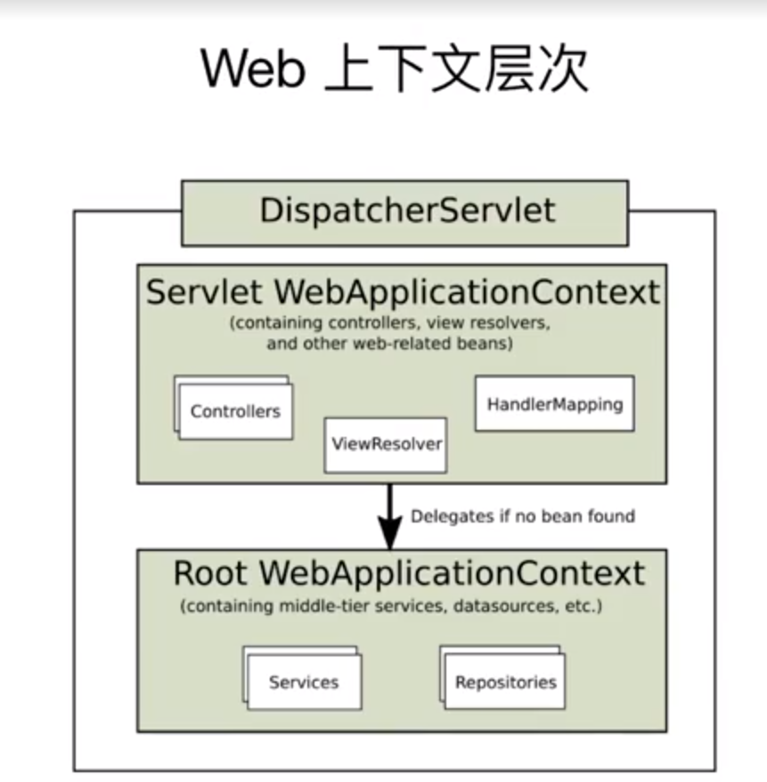

# Spring 的应用上下文

Spring 的依赖注入，通过spring的ApplicationContext实现的。

关于上下文常用的接口及其实现

* BeanFactory(一般不使用)
  * DefaultListableBeanFactory
* ApplicationContext(通常使用ApplicationContext的实现类)
  * ClassPathXmlApplicationContext
  * FileSystemXmlApplicationContext
  * AnnotationConfigApplicationContext
* WebApplicationContext

代码详见
Chapter 6 ---  context-hierarchy-demo

本次实验背景为 开发人员用AOP增强的时候，发现没有生效。原因就是在子类Context里配置了切面，但是目标对象在父类Context中，所以AOP没有生效。

代码如下：

