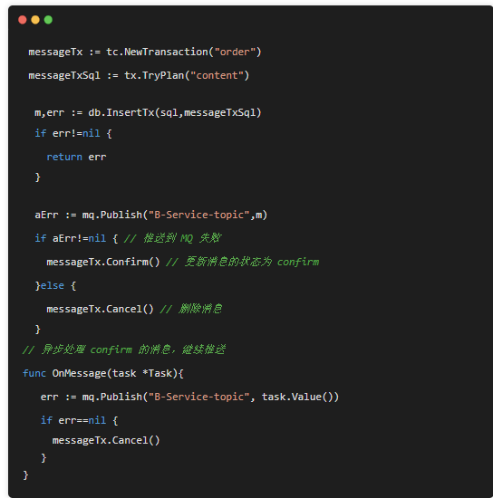
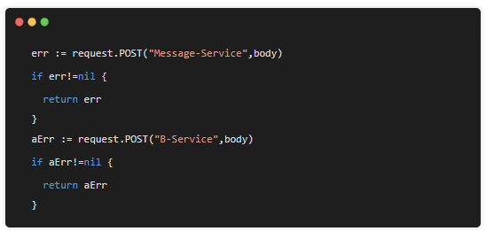

[toc]

# 什么是分布式事务？有哪些实现方案？
在分布式系统中，一次业务处理可能需要多个应用来实现，比如用户发送一次下单请求，就涉及到订单系统创建订单，库存系统减库存，而对于一次下单，订单创建与减库存应该是要同时成功或同时失败的，但在分布式系统中，如果不做处理，就很有可能出现订单创建成功，但是减库存失败，那么解决这类问题，就需要用到分布式事务。常用解决方案有：
1. 本地消息表：创建订单时，将减库存消息加入在本地事务中，一起提交到数据库如本地消息表，然后调用库存系统，如果调用成功则修改本地消息状态成功，如果调用库存系统失败，则由后台定时任务从本地消息表中取出未成功的消息，重试调用库存系统
2. 消息队列：目前RocketMQ中支持事务消息，它的工作原理是：
   a. 生产者订单系统先发送一条half消息到Broker，half消息对消费者而言是不可见的
   b. 再创建订单，根据创建订单成功与否，向Broker发送commit或rollback
   c. 并且生产者订单系统还可以提供Broker回调接口，当Broker发现一段时间half消息没有收到任何操作命令，则会主动调此接口来查询订单是否创建成功
   d. 一旦half消息commit了，消费者库存系统就会来消费，如果消费成功，则消息销毁，分布式事务成功
   e. 如果消费失败，则根据重试机制进行重试，最后还失败则进入死信队列，等待进一步处理
3. Seata：阿里开源的分布式事务框架，支持AT，TCC等多种模式，底层都是基于两阶段提交理论来实现的


# 分布式事务的6种解决方案

## 介绍
分布式系统，微服务架构大行其道的今天，服务间互相调用出现失败已经成为常态。如何处理异常，如何保证数据一致性，成为微服务设计过程中。在不同的业务场景下，解决方案会有所差异，常见的方式有：
1. 阻塞式重试；
2. 2PC,3PC传统事务
3. 使用队列，后台异步处理
4. TCC补偿事务
5. 本地消息表（异步确保）
6. MQ事务


## 阻塞式重试


如上，当请求B服务的API失败后，发起最多三次重试。如果三次还是失败，就打印日志，继续执行下或向上层抛出错误。这种方式会带来以下问题
1. 调用B服务成功，但由于网络超时原因，当前服务认为其失败了，继续重试，这样B服务会产生2条一样的数据
2. 调用B服务失败，由于B服务不可用，重试3次依然失败，当前服务在前面代码中插入到DB的一条记录，就变成了脏数据。
3. 重试会增加上游对本次调用的延迟，如果下游负载较大，重试会放大下游服务的压力。

第一个问题：通过让B服务的API支持幂等性来解决。

第二个问题：可以通过后台定时脚步去修正数据，但这并不是一个很好的办法。

第三个问题：这是通过阻塞式重试提高一致性，可用性，必不可少的牺牲。

阻塞式重试适用于业务对一致性要求不敏感的场景下。如果对数据一致性有要求的话，就必须要引入额外的机制来解决。


## 异步队列
在解决方案演化的过程中，引入队列是个比较常见也较好的方式。如下示例：


在当前服务将数据写入DB后，推送一条信息给MQ，由独立的服务去消费MQ处理业务逻辑。和阻塞式重试，虽然MQ在稳定性上远高于普通的业务服务，但在推送消息到MQ中的调用，还是会有失败的可能性，比如网络问题，当前服务宕机等。这样还是会遇到阻塞式重试相同的问题，即DB写入成功了，但推送失败了。

理论上讲，分布式系统中，涉及多个服务调用的代码都存在这样的情况，在长期运行中，调用失败的情况一定会出现，这也是分布式系统设计的难点之一。


## TCC补偿事务

在对事务有要求，且不方便解耦的情况下，TCC补偿式事务是个较好的选择。

TCC把调用每个服务都分为2个阶段，3个操作：
* 阶段一  Try操作：对业务资源做检测，资源预留，比如对库存的检查，预扣。
* 阶段二  Confirm 操作：提交确认Try操作的资源预留。比如把库存预扣更新为扣除
* 阶段二  Cancel操作：Try操作失败后，释放其预扣的资源。比如把库存预扣的加回来


TCC要求每个服务都实现上面3个操作的API，服务接入TCC事务前一次调用就完成的操作，现在需要分2阶段完成，三次操作来完成。

比如一个商城应用调用A库存服务，B金额服务，C积分服务，如下伪代码：
```java
 m := db.Insert(sql)
 aResult, aErr := A.Try(m)
 bResult, bErr := B.Try(m)
 cResult, cErr := C.Try(m)
 if cErr != nil {
  A.Cancel()
  B.Cancel()
  C.Cancel()
 } else {
  A.Confirm()
  B.Confirm()
  C.Confirm()
 }
```
代码中分别调用 A、B、C 服务 API 检查并保留资源，都返回成功了再提交确认（Confirm）操作；如果 C 服务 Try 操作失败后，则分别调用 A、B、C 的 Cancel API 释放其保留的资源。


TCC 在业务上解决了分布式系统下，跨多个服务、跨多个数据库的数据一致性问题。但 TCC 方式依然存在一些问题，实际使用中需要注意，包括上面章节提到的调用失败的情况。


### 空释放
上面代码中如果C.Try()是真正调用失败，那下面多余的C.Cancel()调用会出现 释放并没有锁定资源的行为。这是因为当前服务无法判断调用失败是不是真的锁定C资源了。如果不调用，实际上成功了，但由于网络原因返回失败了，这会导致C的资源被锁定，一直得不到释放。

空释放在生产环境经常出现，服务在实现TCC事务API时，应支持空释放的执行。

### 时序
上面代码中如果C.Try()失败，接着调用C.Cancel()操作。因为网络原因，有可能会出现C.Cancel()请求会先到C服务，C.Try()请求后到，这会导致空释放问题，同时引起C的资源被锁定，一直得不到释放。


### 调用失败
Cancel，Confirm在调用过程中，还是会存在失败的情况，比如常见的网络原因。

Cancel()或Confirm()操作失败都会导致资源被锁定，一直得不到释放。这种情况常见解决方案有：
1. 阻塞式重试。但有同样的问题，比如宕机，一直失败的情况。
2. 写入日志，队列，然后有单独的异步服务自动或人工介入处理。但一样会有问题，写日志或队列时，会存在失败的情况。

理论上来讲非原子性，事务性的二段代码，都会存在中间态，有中间态就会有失败的可能性。


## 本地消息表
本地消息表最初时ebay提出的，它让本地消息表与业务数据表处于同一个数据库中，这样就能利用本地事务来满足事务特性。

具体做法是在本地事务中插入业务数据时，也插入一条消息数据。然后再做后续操作，如果其他操作成功，则删除该消息，如果失败则不删除，异步监听这个消息，不断重试。

本地消息表是一个很好的思路，可以有多种使用方式：

上面代码中其messageTxSql 是插入本地消息表的一段SQL:


它和业务 SQL 在同一个事务中去执行，要么成功，要么失败。

成功则推送到队列，推送成功，则调用 messageTx.Cancel() 
删除本地消息；推送失败则标记消息为 confirm。本地消息表中 status 有 2 种状态 try、confirm， 无论哪种状态在 OnMessage 都可以监听到，从而发起重试。

本地事务保障消息和业务一定会写入数据库，此后的执行无论宕机还是网络推送失败，异步监听都可以进行后续处理，从而保障了消息一定会推到 MQ。

而 MQ 则保障一定会到达消费者服务中，利用 MQ 的 QOS 策略，消费者服务一定能处理，或继续投递到下一个业务队列中，从而保障了事务的完整性。


### 配合服务调用

这是本地消息表+调用其他服务的例子，没有MQ的引入。这种使用异步重试，并用本地消息表保障消息的可靠性，解决了阻塞式重试带来的问题，在日常开发中比较常见。

如果本地没有要写DB的操作，可以只写入本地消息表，同样在OnMessage中处理：


### 消息过期
配置本地消息表的Try 和 Confirm 消息的处理器：


在消息处理函数中要判断当前消息任务是否存在过久，比如一直重试了一个小时，还是失败，就考虑发邮件，短信，日志告警等方式，让人工介入。


在 Try 处理函数中，还要单独判断当前消息任务是否存在过短，因为Try状态的消息，可能才刚刚创建，还没确认提交或删除。这会和正常业务逻辑的执行重复，意味着成功的调用，也会被重试；为尽量避免这种情况，可以检测消息的创建时间是否很短，短的话可以跳过。

重试机制必然依赖下游api在业务逻辑上的幂等性，虽然不处理也可行，但设计上还是要尽量避免干扰正常的请求。


### 独立消息服务
独立消息服务是本地消息表的升级版，把本地消息表抽离成一个独立的服务。所有操作之前现在消息服务添加个消息，后续操作成功则删除消息，失败则提交确认消息。

然后用异步逻辑去监听消息，做对应的处理，和本地消息表的处理逻辑基本一致。但由于向消息服务添加消息，无法和本地操作放到一个事务里，所以会存在添加消息成功，后续失败，则此时的消息就是个无用消息。

如下实例场景：


这个无用的消息，需要消息服务去确认这个消息是否执行成功，没有则删除，有继续执行后续逻辑。相比本地事务表**try** 和**confirm**，消息服务在前面多了一种状态 **prepare** 。


## MQ事务

可以从上面看。


## 总结
从分布式系统实践中来看，要保障数据一致性的场景，必然要引入额外的机制处理。

TCC 的优点是作用于业务服务层，不依赖某个具体数据库、不与具体框架耦合、资源锁的粒度比较灵活，非常适用于微服务场景下。缺点是每个服务都要实现 3 个 API，对于业务侵入和改动较大，要处理各种失败异常。开发者很难完整处理各种情况，找个成熟的框架可以大大降低成本，比如阿里的 Fescar。

本地消息表的优点是简单、不依赖其他服务的改造、可以很好的配合服务调用和 MQ 一起使用，在大多业务场景下都比较实用。缺点是本地数据库多了消息表，和业务表耦合在一起。文中本地消息表方式的示例，来源于作者写的一个库，有兴趣的同学可以参考下 https://github.com/mushroomsir/tcc

MQ 事务和独立消息服务的优点是抽离出一个公共的服务来解决事务问题，避免每个服务都有消息表和服务耦合在一起，增加服务自身的处理复杂性。缺点是支持事务的 MQ 很少；且每次操作前都先调用 API 添加个消息，会增加整体调用的延迟，在绝大多数正常响应的业务场景下，是一种多余的开销。


