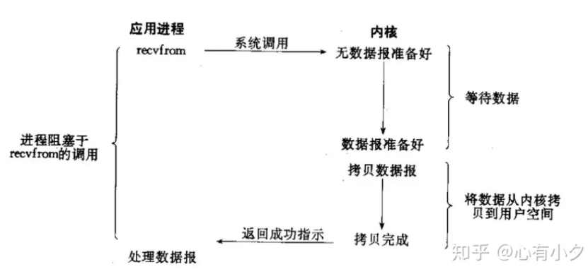
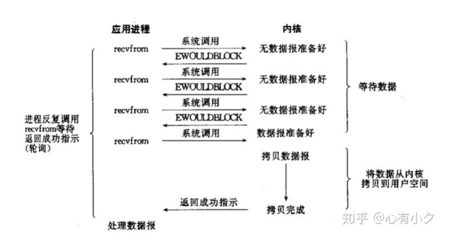
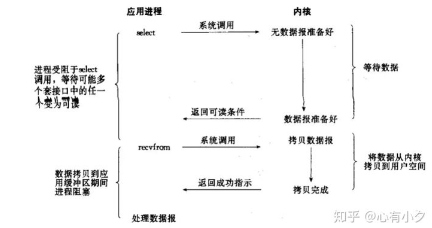
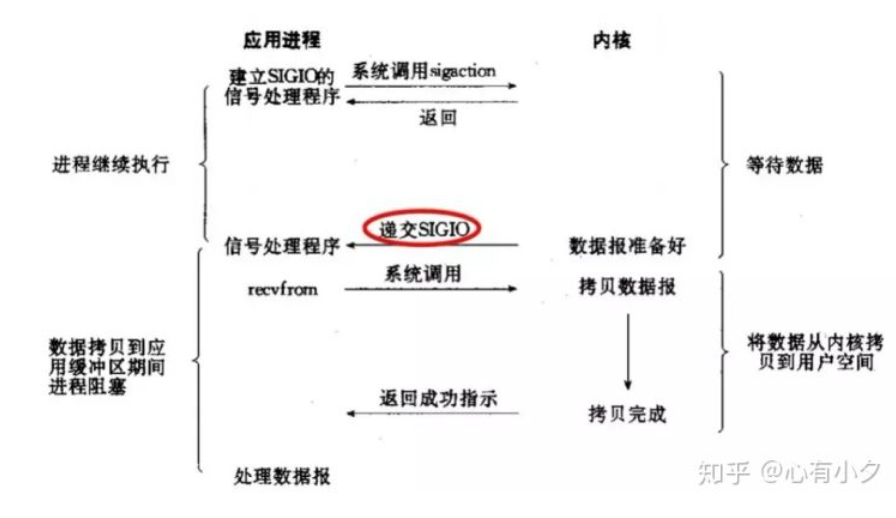
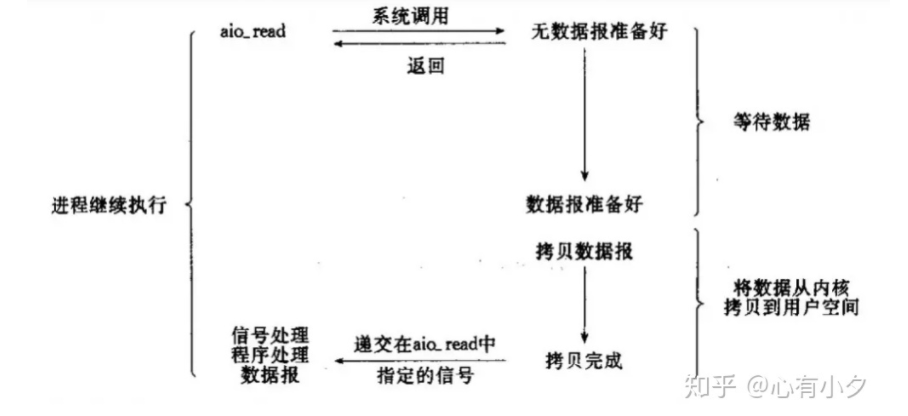

# BIO,NIO,AIO区别


介绍
* BIO 就是传统的java.io 包， 它是基于流模型实现的，交互的方式是同步，阻塞方式，也就是说在读入输入流或者输出流时，在读写动作完成之前，线程会一直阻塞在那里，它们之间的调用时可靠的线性顺序。它的优点时代码简单。直观；缺点就是IO的效率和扩展性很低，容易成为应用性能瓶颈。
* NIO 是java 1.4 引入的java.nio 包，提供了channel，selectro，buffer等新的抽象，可以构建多路复用的，同步非阻塞io程序，同时提供了更接近操作系统底层高性能的数据操作方式。
* AIO 是java 1.7 之后引入的包，是NIO 的升级版本，提供了异步非阻塞的IO操作方式，所以人们叫它AIO，异步IO是基于事件和回调机制实现的，也就是应用操作之后会直接返回，不会阻塞在那里，当后台处理完成后，操作系统会通知响应的线程进行后续的操作。


## 五种IO模型
Linux下的五种I/O模型
1） 阻塞I/O 
2） 非阻塞I/O 
3） I/O 复用
4） 信号驱动 I/O
5)  异步I/O


### 阻塞 （Blocking IO）
阻塞 I/O 在调用一个io函数的时候，如果没有获取到的数据的情况下，那么就会一直等待；等待的过程中会导致整个应用程序一直是一个阻塞的过程，无法去做其他的实现。


应用程序 想要读取数据就会调用recvfrom，而recvfrom 会通知os来执行，os就会判断数据报是否准备好（比如判断是否收到了一个完整的udp报文，如果收到udp报文不完整，那么就继续等待）
当数据包准备好了之后，os就会将数据从内核空间拷贝到用户空间。（因为我们的用户程序只能获取用户空间的内存，无法直接获取内核空间的内存）。拷贝完成后socket.read()就会解除阻塞，并得到read的结果。


>阻塞两个地方：1. OS等待数据报准备好，2. 将数据从内核空间拷贝到用户空间。

```java
BIO阻塞代码
public class ServerTcpSocket {
    static byte[] bytes = new byte[1024];

    public static void main(String[] args) {
        ExecutorService executorService = Executors.newCachedThreadPool();
        try {
            // 1.创建一个ServerSocket连接
            final ServerSocket serverSocket = new ServerSocket();
            // 2.绑定端口号
            serverSocket.bind(new InetSocketAddress(8080));
            // 3.当前线程放弃cpu资源等待获取数据
            System.out.println("等待获取数据...");
            while (true) {
                final Socket socket = serverSocket.accept();
                executorService.execute(new Runnable() {
                    public void run() {
                        try {
                            System.out.println("获取到数据...");
                            // 4.读取数据
                            int read = socket.getInputStream().read(bytes);
                            String result = new String(bytes);
                            System.out.println(result);
                        } catch (Exception e) {

                        }
                    }
                });

            }
        } catch (Exception e) {

        }
    }
}

```

### 非阻塞
非阻塞 I/O 不管是否有获取到数据，都会立马获取结果，如果没有获取数据的话，那么就不间断的循环重试，但是我们整个应用程序不会实现阻塞。

```java
NIO非阻塞式代码
public class ServerNioTcpSocket {
    static ByteBuffer byteBuffer = ByteBuffer.allocate(512);

    public static void main(String[] args) {
        try {
            // 1.创建一个ServerSocketChannel连接
            final ServerSocketChannel serverSocketChannel = ServerSocketChannel.open();
            // 2.绑定端口号
            serverSocketChannel.bind(new InetSocketAddress(8080));
            // 设置为非阻塞式
            serverSocketChannel.configureBlocking(false);
            // 非阻塞式
            SocketChannel socketChannel = serverSocketChannel.accept();
            if (socketChannel != null) {
                int j = socketChannel.read(byteBuffer);
                if (j > 0) {
                    byte[] bytes = Arrays.copyOf(byteBuffer.array(), byteBuffer.limit());
                    System.out.println("获取到数据" + new String(bytes));
                }
            }
            System.out.println("程序执行完毕..");

        } catch (Exception e) {
            e.printStackTrace();
        }
    }
}
```

NIO 中提供了集中Channel： ServerSocketChannel; SocketChannel;FileChannel;DatagramChannel 只有 FileChannel 无法设置成非阻塞模式，其他Channel 都可以设置为非阻塞模式。

设置为非阻塞后，socket.read() 方法就会立即得到一个返回结果，我们可以根据返回结果执行不同的逻辑，比如在失败时，可以做一些其他的事情。 但事实上这种方式也是低效的，因为我们不得不使用轮询方法区一直问os：我们数据好了没。 
NIO 不会再recvfrom 也就是socket.read()时候阻塞，但是还是会将**数据从内核空间拷贝用户空间阻塞**。一定要注意这个地方，**Non-Blocking 还是会阻塞的**。


## I/O 复用
IO实际指的就是网络的IO、多路也就是多个不同的tcp连接；复用也就是指使用同一个线程合并处理多个不同的IO操作，这样的话可以减少CPU资源。（单个线程可以同时处理多个不同的io操作，应用场景非常广泛：redis原理。Mysql连接原理）


操作系统提供一种机制（poll、select、epoll），允许注册IO请求，当有任何一个请求被触发，会有反馈
poll、select每次都要遍历所有的注册，并且轮询
epoll只会返回对应被触发的注册时间（并且提供了边缘触发，允许有条件的获取数据），并轮询

在windows操作系统中使用select实现轮训机制时间复杂度是为 o(n),而且这种情况也会存在空轮训的情况，效率非常低、其次默认对我们的轮训有一定限制，所以这样的话很难支持上万tcp连接。

所以在这时候linux操作就出现epoll实现事件驱动回调形式通知，不会存在空轮训的情况，只是对活跃的socket实现主动回调，这样的性能有很大的提升 所以时间复杂度为是o（1）
windows操作系统没有epoll、只有linux操作系统有。

为什么Nginx、redis能够支持非常高的并发 最终都是靠的linux版本的 io多路复用机制epoll

Redis的底层是采用nio 多路io复用机制实现对多个不同的连接（tcp）实现io的复用；能够非常好的支持高并发，同时能够先天性支持线程安全的问题。


## 信号驱动I/O 

发出一个请求实现观察监听，当有数据的时候直接走我们异步回调；


## 异步I/O



Asynchronous IO调用中是真正的无阻塞，其他IO model中多少会有点阻塞。程序发起read操作之后，立刻就可以开始去做其它的事。而在内核角度，当它受到一个asynchronous read之后，首先它会立刻返回，所以不会对用户进程产生任何block。然后，kernel会等待数据准备完成，然后将数据拷贝到用户内存，当这一切都完成之后，kernel会给用户进程发送一个signal，告诉它read操作完成了。