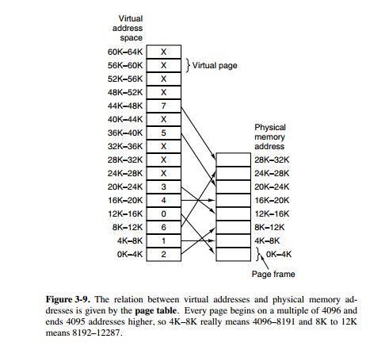
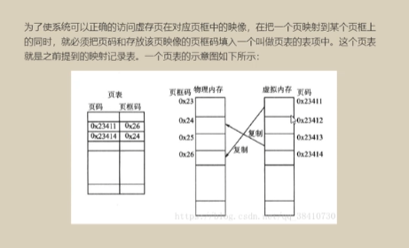
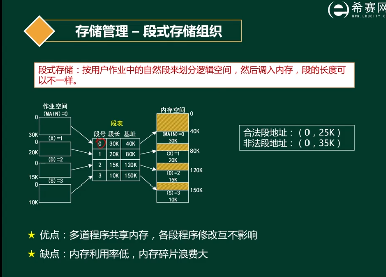
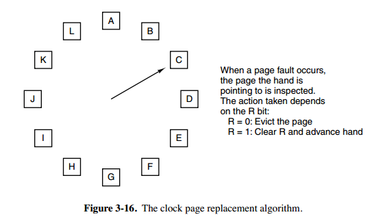

[TOC]

#内存管理

##虚拟内存
* **虚拟内存的目的是为了让物理内存扩充成更大的逻辑内存，从而让程序获得更多的可用内存。**
* 为了更好的管理内存，**操作系统将内存抽象为地址空间。每个程序拥有自己的地址空间，这个地址空间被分割成多个块，每一块称为一页。这些页被映射到物理内存，但不需要映射到连续的物理内存，也不需要所有页都必须在物理内存中。** 当程序引用到不在物理内存中的页时，由硬件执行必要的映射，将缺失的部分装入物理内存并重新执行失败的指令。
* 从上面的描述可以看出，虚拟内存允许程序不用将地址空间中的每一页都映射到物理内存，也就是说**一个程序不需要全部调入内存就可以运行，**这使得有限的内存运行大程序称为可能，例如有一台计算机可以产生16位地址， 那么一个程序的地址空间范围是0~64K。该计算机只有32KB的物理内存，虚拟内存技术允许该计算机运行一个64K大小的程序。
  

##分页管理
分页存储管理是将一个进程的逻辑地址空间分成若干个大小相等的片，称为页面或页，并为各页加以编号，从0开始，如第0页、第1页等。相应地，也把内存空间分成与页面相同大小的若干个存储块，称为(物理)块或页框(frame)，也同样为它们加以编号，如0#块、1#块等等。在为进程分配内存时，以块为单位将进程中的若干个页分别装入到多个可以不相邻接的物理块中。由于进程的最后一页经常装不满一块而形成了不可利用的碎片，称之为“页内碎片”。

==优缺点：没有外部碎片，内存利用率高。但各页中内容没有关联，不利于编程和共享。==

##分段管理

程序通过分段(segmentation)划分为多个模块，如代码段、数据段、共享段。内存每段的大小都匹配程序段，不会产生内部碎片。 优缺点： 可以针对不同类型的段采取不同的保护。 可以按段为单位来进行共享，包括通过动态链接进行代码共享。 ==不会产生内部碎片，但会产生外部碎片，内存利用率比分页低。==

##段页式管理
一个进程中所包含的具有独立逻辑功能的程序或数据仍被划分为段，并有各自的段号s。这反映相继承了段式管理的特征。其次，对于段s中的程序或数据，则按照一定的大小将其划分为不同的页。和页式系统一样，最后不足一页的部分仍占一页。这反映了段页式管理中的页式特征。从而，段页式管理时的进程的虚拟地址空间中的虚拟地址由三部分组成：即段号s，页号P和页内相对地址d。虚拟空间的最小单位是页而不是段，从而内存可用区也就被划分成为若干个大小相等的页面，且每段所拥有的程序和数据在内存中可以分开存放。分段的大小也不再受内存可用区的限制。 **优缺点：** 既有具有独立逻辑功能的段，又以大小相同的页为内存分配单位进而不会产生外部碎片。但仍会有内部碎片。

##页面置换算法

> 地址映射过程中，若在页面中发现索要访问的页面不在内存中，则产生缺页中断。当发生缺页中断时操作系统必须在内存选择一个页面将其移出内存，以便为即将调入的页面让出空间。则用来选择淘汰哪一页的规则叫做页面置换算法。常见的置换算法有:

* 最佳置换算法(OPT):所选择的被换出的页面将是最长时间内不再被访问，通常可以保证获得最低的缺页率。是一种理论上的算法，因为无法知道一个页面多长时间不再被访问。
* 先进先出置换算法(FIFO):选择换出的页面是最先进入的页面。该算法会将那些经常被访问的页面换出，**导致缺页率升高**
* 第二次机会算法：当页面被访问(读或写)时设置该页面的R位为1。需要替换的时候，检查最老页面的R位。如果R位是0，那么这个页面既老又没有被使用，可以立即置换掉；如果是1，就将R位清0.并将该页面放到链表的尾端，修改它的装入时间使它就像刚装入的一样，然后继续从链表的头部开始搜索。
* 最近最久未使用（LRU）算法：为了实现LRU，需要在内存中维护一个所有页面的链表。当一个页面被访问时，将这个页面移到链表表头。这样就能保证链表表尾的页面是最近最久未访问的。（每次访问都需要更新链表，因此这种方式实现的LRU代价很高）
* 最近未使用（NRU）:每个页面都有两个状态位： R 与 M， 当页面被访问时设置页面的R=1，当页面被修改时设置M=1.其中 R位会定时被清零。 可以将页面分为以下四类：
  * R=0，M=0
  * R=0，M=1
  * R=1，M=0
  * R=1，M=1
  * 当发生缺页中断时，NRU算法随机地从类编号最小的非空类中挑选一个页面将它换出。
  * NRU优先换出已经被修改的脏页面(R=0,M=1),而不是被频繁使用的干净页面（R=1，M=0）.
* 时钟（CLOCK）：第二次机会算法需要在链表中移动页面，降低了效率。时钟算法使用环形链表将页面连接起来，再使用一个指针只想最老的页面。
  
