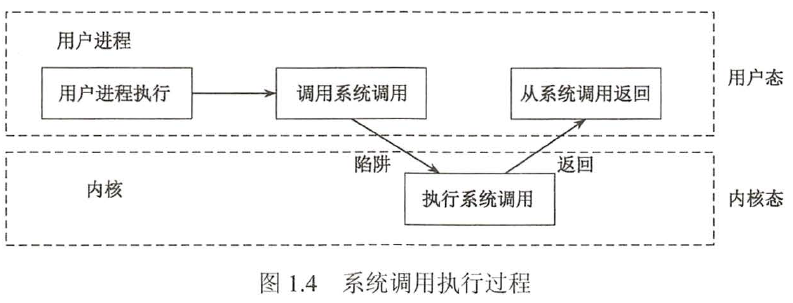
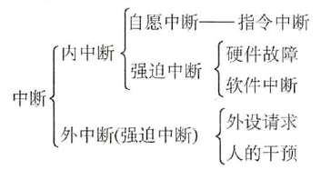
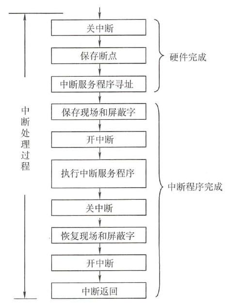
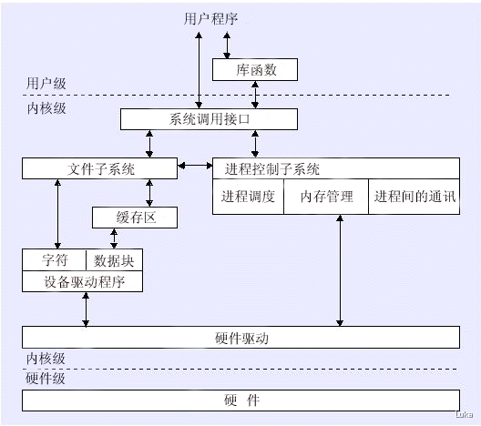

#操作系统概述
[TOC]
##基本特征

1. 并发
   * 并发是指宏观上在一段时间内能同时运行多个程序，而并行则指同一时刻能运行多个指令。
   * 并行需要硬件支持，如多流水线，多核处理器或者分布式计算系统
   * 操作系统通过引入进程和线程，使得程序能够并发运行。
2. 共享
   * 共享是指系统中的资源可以被多个并发进程共同使用。
   * 有两种共享方式：互斥共享和同时共享。
   * 互斥共享的资源称为临界资源，例如打印机等，在同一时刻只允许一个进程访问，需要用同步机制来实现互斥访问。
3. 虚拟
   * 虚拟技术把一个物理实体转换为多个逻辑实体
   * 主要有两种虚拟技术： 时分复用技术和空分复用技术。
   * 多个进程能在同一处理器上并发执行使用了 时分复用技术，让每个进程轮流占用处理器，每次只执行一小个时间片并快速切换。
   * **虚拟内存使用了空分复用技术，它将物理内存抽象为地址空间，每个进程都有各自的地址空间。地址空间的页被映射到物理内存，地址空间的页并不需要全部在物理内存中，当使用到一个没有在物理内存的页时，执行页面置换算法，将该页置换到内存中**
4. 异步
   * 异步指进程不是一次性执行完毕

##基本功能
1. 进程管理
   * 进程控制，进程同步，进程通信，思索处理，处理机调度等
2. 内存管理
   * 内存分配，地址映射，内存保护与共享，虚拟内存等
3. 文件管理
   * 文件存储空间的管理，目录管理，文件读写管理和保护等
4. 设备管理
   * 完成用户的I/O请求，方便用户使用各种设备，并提高设备的利用率。
   * 主要包括缓冲管理，设备分配，设备处理，虚拟设备等。

##系统调用
* 如果一个进程在用户态需要使用内核态的功能，就进行系统调用从而陷入内核，由操作系统代为完成
* 凡是与资源有关的操作（存储分配，I/O，管理文件等），都必须通过系统调用方式向操作系统提出服务请求，并由操作系统代为完成
* 用户程序执行陷入指令（trap指令）发起系统请求，将CPU使用权主动交给操作系统内核，即CPU状态会从用户态进入内核态
* 操作系统处理完系统调用的请求后，又会把CPU使用权还给用户程序，即CPU状态会从内核态回到用户态
* 目的：用户程序不能直接执行对系统影响非常大的操作，保证系统的稳定性和安全性，防止用户程序随意更改或访问重要的系统资源，影响其他进程的运行
* PS:从用户态到内核态，不仅状态需要切换，而且所用的堆栈也可能需要从用户堆栈切换为系统堆栈(系统堆栈也属于该进程)
    
* 系统调用可以分为如下几类：
  * 设备管理：完成设备的请求和释放，已经设备启动等功能
  * 文件管理：完成文件的读，写，创建及删除等功能
  * 进程控制：完成进程的撞见，撤销，阻塞及唤醒等功能
  * 进程通信：完成进程之间的消息传递或信号传递等功能
  * 内存管理：完成内存的分配，回收以及获取作业占用内存大小即初始地址等功能。

##中断分类
  

1. 中断(也称外中断)
   * 由CPU执行指令以外的事件引起，即与处理器运行的程序无关
   * I/O中断：表示设备输入/输出处理已经完成，希望处理器能够发送下一个输入/输出请求，同时让完成输入/输出的程序继续运行
2. 异常（也称内中断）
   * 由CPU执行指令的内部时间引起，如非法操作码，地址越界，算术溢出等
3. 硬中断/软中断
   * 硬中断：
     * 硬中断是由硬件产生的，比如，像磁盘，网卡，键盘，时钟等。每个设备或设备集都有它自己的IRQ(中断请求)
     * 当中断产生的时候，CPU会中断当前正在运行的任务，来处理中断。在有多核心的系统上，一个中断通常只能中断一颗CPU
     * 硬中断可以直接中断CPU。它会引起内核中相关的代码被出发。对于那些需要花费一些时间去处理的进程
     * 对于时钟中断，内核调度代码会将当前正在运行的进程挂起，从而让其他的进程来运行。它的存在是为了让调度代码可以调度多任务。

* 软中断：
  * 软中断是利用硬件中断的概念，用软件方式进行模拟，实现宏观上的异步执行效果。很多情况下，软中断和“信号”有些类似，同时，软中断又是和硬中断相对应的，“硬中断是外部设备对CPU的中断”，“软中断通常是硬中断服务程序对内核的中断”，“信号则是由内核（或其他进程）对某个进程的中断”
  * 软中断是实现系统API函数调用的手段
  * 通常，软终端是一些I/O的请求。这些请求会调用内核中可以调度I/O发生的程序。
  * 软中断仅与内核相联系。而内核主要负责对需要运行的任何其他的进程进行调度。
  * 软中断并不会直接中断CPU。也只有当前正在运行的代码（或进程）才会产生软中断。这种中断是一种需要内核为正在运行的进程去做一些事情（通常为I/O）的请求。有一个特殊的软中断是Yield调用，它的作用是请求内核调度器去查看是否有一些其他的进程可以运行。

##中断处理的流程
  
* 1-3步在CPU进入中断周期后，由硬件自动完成，4-9步由中断服务程序完成
* 恢复现场指在中断返回前，必须将寄存器的内容恢复到中断处理前的状态，由中断服务程序完成

1. 关中断
   * CPU关闭响应更高级中断源的中断请求，否则线程保存不完整
2. 保存断点
   * 将原来程序的程序计数器PC保存起来
3. 引出中断服务程序
   * 取出中断服务程序的入口地址;送去程序技术去PC中
4. 保存线程和屏蔽字
   * 允许中断程序后，首先保存现场信息：程序状态字寄存器PSWR和某些通用寄存器内容
5. 开中断
   * 允许更高级别中断请求得到响应
6. 执行中断服务程序
   * 中断请求的目的就是执行中断服务程序
7. 关中断
   * 保证在恢复线程和屏蔽字时不被中断
8. 恢复现场和屏蔽字
   * 将现场和屏蔽字恢复到原来的状态
9.  开中断，中断返回
    * 中断服务程序的最后一条指令通常是中断返回指令，时期返回原程序断点处，以便继续执行原程序。

##用户态/内核态
* 操作系统为什么分为用户态和内核态:
  * 在CPU的所有指令中，有一些指令是非常危险的，如果错用，将导致整个系统崩溃，比如：清内存，设置时钟等
  * CPU将指令分为特权指令和非特权指令，特权指令只能由内核态运行

* 从用户空间到内核空间有两种触发手段
  * 用户空间的应用程序，通过**系统调用**，进入内核空间
    * 这个时候用户空间的进程要传递很多变量，参数的值给内核，内核态运行的时候也要保存用户进程的一些寄存器值，变量等
    * 所谓的“进程上下文”，可以看做是用户进程传递给内核的这些参数以及内核要保存的那一整套的变量和寄存器值和当时的环境等
  * 硬件通过触发信号，导致内核调用**中断**处理程序，进入内核空间
    * 这个过程中，硬件的一些变量和参数也要传递给内核，内核通过这些参数进行中断处理
    * 所谓的“中断上下文”，其实也可以看做就是硬件传递过来的这些参数和内核需要保存的一些其他环境（主要是当前被打断执行的进程环境）
* 用户态和内核态的关系：
    

