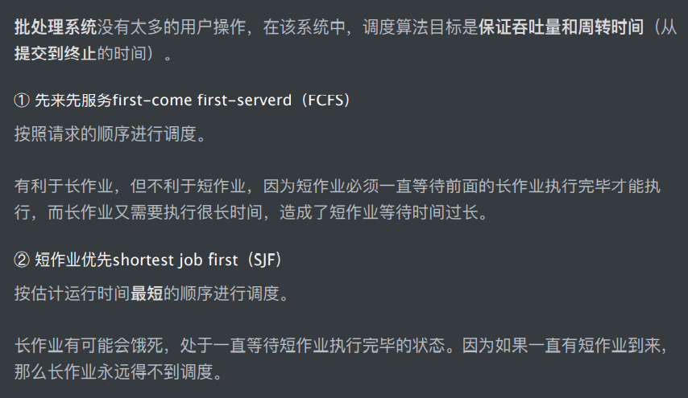
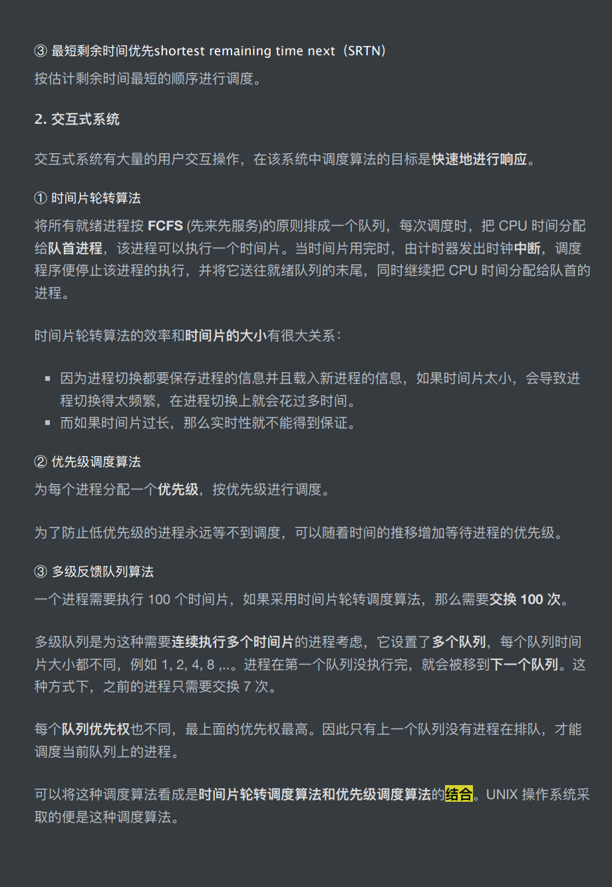

[toc]
# 操作系统面经

## 进程，线程，协程

进程，直观点说，保存在硬盘上的程序运行以后，会在内存空间里形成一个独立的内存体，这个内存体有自己独立的地址空间，有自己的堆，上级挂靠单位是操作系统。操作系统会以进程为单位，分配系统资源（CPU时间片，内存等资源），**进程是资源分配的最小单位**。

进程和线程的区别
1. 线程是程序执行的**最小单位**，而进程是操作系统**分配资源**的最小单位；
2. 一个进程由一个或多个线程组成，线程是一个进程中代码的不同执行路线；
3. 进程之间相互独立，但同一进程下的各个线程之间共享程序的内存空间及一些进程级的资源，某进程内的线程在其他进程不可见；
4. 调度和切换：线程上下文切换比进程上下文切换要快的多

## 任务调度
大部分操作系统 的任务调度是采用**时间片轮转的抢占式调度**方式。

在一个进程中，当一个线程任务执行几毫秒后，会由操作系统的**内核进行调度**，通过硬件的计数器中断处理器，让该线程强制暂停并将该线程的寄存器放入内存中，通过查看线程列表决定接下来执行哪一个线程，并从内存中恢复该线程的寄存器，最后恢复该线程的执行，从而取执行下一个任务。上述过程中，任务执行的那一小段时间叫做时间片，任务正在执行时的状态叫运行状态，被暂停的线程任务状态叫做就绪状态，意为等待下一个属于它的时间片的到来。

## 进程通信方法
1. 管道

命名管道FIFO，无名管道Pipe，除了简历，打开，删除的方式不同外，这两种管道几乎是一样的。他们都是通过内核缓冲区实现数据传输。

2. 消息队列：就是**一系列保存在内核中消息的列表**。用户进程可以向消息队列添加消息，也可以向消息队列读取消息。消息队列与管道通信相比，其优势是对每个消息指定特定的消息类型，接收的时候不需要按照队列次序，而是可以根据自定义条件接收特定类型的消息。可以把消息看作一个记录，具有特定的格式以及特定的优先级。

3. 共享内存：共享内存允许两个或多个进程共享一个给定的存储区，这一段存储区可以被两个或两个以上的进程映射至自身的地址空间中，一个进程写入共享内存的信息，可以被其他使用这个共享内存的进程，通过一个简单的内存读取读出，从而实现了进程间的通信。

4. 信号量：

5. 信号：

6. 套接字（socket）：可用于不同机器间的进程通信。通过运行一个进程监听某个端口进行通信。

## 虚拟内存
虚拟内存的重要意义是它定义了⼀个连续的虚拟地址空间，并且把内存扩展到硬盘空间。虚
拟内存让进程有独享地址空间的错觉。让程序可以拥有超过系统物理内存⼤⼩的可⽤内存空
间。

## linux 进程调度算法

## 死锁预防
1. 破坏互斥条件

2. 破坏占有和等待条件
   
3. 破坏不可抢占条件
   
4. 破坏环路等待

## 死锁避免
1. 判断“系统安全状态”法
   在进行系统资源分配之间，**先计算此处资源分配的安全性**。若此次分配不会导致系统进入不安全状态，则将资源分配给**进程**；**否则，让进程**等待。
2. 银行家算法

## 协程为什么比线程更轻量级
因为协程不需要进行用户态到内核态的切换，协程的整个调度在用户程序层面进行。协程占用的资源量更小，同时在一个线程上运行，不存在写变量冲突的问题，共享资源不需要加锁，所以可以减少大量的开销。

## 内核态和用户态切换为什么会消耗性能？

程序执行到系统调用时，首先使用类似int 80H的软中断指令，**保存现场**，去的系统调用号，在内核态执行，然后恢复现场，每个进程都会有两个栈，一个内核态栈和一个用户态栈。当执行int中断执行时就会由用户态，栈转向内核栈。系统调用时需要进行栈的切换。而且内核代码对用户不信任，需要进行额外的检查。**系统调用的返回过程有很多额外工作，比如检查是否需要调度等。**

## 页面置换算法
1. 最佳置换算法OPT(理想)
2. 最近最久未使用LRU()
   内存中维护一个所有页面的链表。当一个页面被访问时，将这个页面移动到链表表头。这样就能保证链表表尾的页面是最近最久未访问的。
3. 最近未使用NRU
   NRU优先换出已经被修改的脏页面（R=0,M=1）,而不是被频繁使用的干净页面（R=1,M=0）
4. 先进先出FIFO
5. 第二次机会算法
6. 时钟