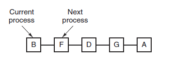
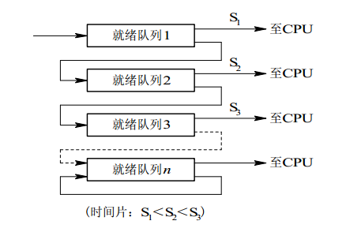
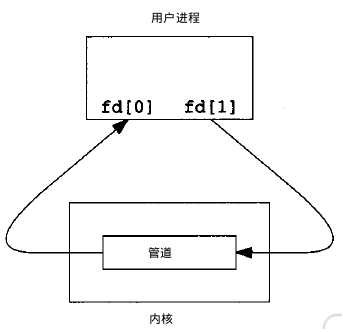

[TOC]
##线程与进程的区别

* 根本区别：进程是操作系统资源分配的基本单位，线程是处理器任务调度和执行的基本单位
* 资源开销：每个进程都有独立的代码和数据空间，程序之间的切换会有较大的开销;线程可以看做轻量级的进程，同一类线程共享代码和数据空间，每个线程都有自己独立的运行栈和程序计数器（PC），线程之间切换的开销小。
* 内存分配：同一进程的线程共享本进程的地址空间和资源，而进程之间的地址空间和资源是相互独立的
* 包含关系：如果一个进程内有多个线程，则执行过程不是一条线的，而是多条线（线程）共同完成的；线程是进程的一部分，所以线程也被称为轻量级进程
* 与进程不同的是同类的多个线程共享进程的**堆**和**方法区**资源，但每个线程有自己的**程序计数器，虚拟机栈**和**本地方法栈**，所以系统在产生一个线程，或是在各个线程之间切换工作时，负担要比进程小得多，也正因为如此，线程也被称为轻量级进程。

举例子：比如， main函数启动了 JVM进程，同时main就是其中的线程，还有垃圾回收等线程。

以下方为例作简单的比喻： 进程=火车，线程=车厢

* 线程在进程下行进（单纯的车厢无法运行）
* 一个进程可以包含多个线程（一辆货车可以有多个车厢）
* 不同进程间数据很难共享（一辆货车上的乘客很难换到另外一辆火车，比如站点换乘）
* 同一进程下不同线程间数据很难共享（A车厢换到B车厢很容易）
* 进程要比线程消耗更多的计算机资源（采用多列火车相比多个车厢更耗资源）
* 进程间不会相互影响，一个线程挂掉将导致整个进程挂掉（一列火车不会影响到另外一列火车，但是如果一列火车上中间的一节车厢着火了，将影响到所有车厢）
* 进程可以拓展到多级，进程最多适合多核（不同火车可以开在多个轨道上，同一火车的车厢不能再行进的不同的轨道上）
* 进程使用的内存地址可以上锁，即一个线程使用某些共享内存时，其他线程必须等它结束，才能使用这一块内存。（比如火车上的洗手间）---“互斥锁”
* 进程使用的内存地址可以限定使用量（比如火车上的餐厅，最多只允许多少人进入，如果满了需要在门口等，等有人出来了才能进去）

##协程
* 协程：协程是一种用户态的轻量级进程，这种由程序员自己写程序来管理的轻量级线程叫做[用户空间线程]，自助开辟的异步任务，具有对内核来说不可见的特性
* 正如一个进程可以拥有多个线程一样，一个线程
* **协程的目的**
  * 当出现长时间的 I/O操作时，通过让出目前的协程调度，执行下一个任务的方式， **减少ContextSwitch上的开销**
  * 如果遇到很耗时的I/O行为，则整个系统的吞吐立刻下降，同时，较多的线程会带来很多的上下文切换的开销
  * 由于协程的暂停完全由程序控制，发生在用户态上；而线程的阻塞状态是由操作系统内核进行切换，发生在内核态上。因此，协程的开销远远小于线程的开销。
* **协程的特点**
  * 线程的切换由操作系统负责调度，协程由用户自己进行调度，减少了上下文切换，提高了效率
  * 线程的默认Stack大小是1M，而协程更轻量，接近1K。 因此可以在相同的内存中开启更多的协程。
  * 由于在同一线程上，因此可以避免竞争关系而使用锁
  * 适用于被阻塞的，且需要大量并发的场景。但不适用于大量计算的多线程

* **协程的原理**
  * 当出现IO阻塞的时候，由协程的调度器进行调度，通过将数据流立刻yield掉，并且记录当前栈上的数据
  * 阻塞完立刻再通过线程恢复栈，并把阻塞的结果放到这个线程上去跑，这样看上去好像同步代码一样
  * 整个流程可以称为 coroutine，而跑在由coroutine负责调度的线程称为Fiber。比如Golang里go关键字其实就是负责开启一个Fiber，让func逻辑跑在上面

##进程状态的切换
  
* 就绪状态(ready): 进程获取了除处理器以外的一切所需资源，等待被调度，多个处于就绪状态的进程拍成就绪队列
* 运行状态(running):进程正在处理器上运行
* 阻塞状态(waiting):等待某资源为可用
* 创建态(created): 进程正在被创建，尚未转到就绪态
* 结束态(terminated)：进程正从系统消失，可能是进程正常结束或其他原因中断退出运行

应该注意以下内容：
* 只有就绪态和运行态可以相互转换，其他的都是单向转换。就绪状态的进程通过调度算法从而获得CPU时间，转为运行状态;而运行状态的进程，在分配给它的CPU时间片用完之后就会转为就绪状态，等待下一次的调度。
* 阻塞状态是缺少需要的资源从而由运行状态转换而来，但是该资源不包括CPU时间，缺少CPU时间会从运行态转换为就绪态。

##进程调度
* 调度：从就绪队列中按照一定的算法选择一个进程并将处理器分配给它运行，以实现进程并发执行
* 处理器的三级调度
  * 低级调度（进程调度）
    * 最基本的调度，按照某种算法从就绪队列中选取一个进程，并将处理器分配给它
    * 进程调度的频率很高，一般几十ms一次
  * 中级调度（内存调度）
    * 作用:提高内存利用率和系统吞吐量
    * 将暂时不能运行的进程调至外存等待，此时的该进程称为挂起态
    * 当其具备运行条件且有空闲时，由中级调度将外存上的就绪进程重新调入内存，并修改其状态为就绪态，挂在就绪队列上等待
  * 高级调度(作业调度)
    * 按一定的规则从外存上处于后备状态的作业挑选一个或多个作业，给它们分配内存，输入输出设备必要的资源，并建立相应的进程
    * 多道批处理系统中大多配有作业调度，而其他系统中通常不需要配置作业调度，作业调度执行频率低，通常几分钟一次

* 进程切换
  * 进程切换在调度完成后立刻发生
  * 操作系统内核将原进程的现场信息推入当前进程的内核堆栈来保存它们，并更新堆栈指针
  * 内核完成从新进程的内核栈中装入新进程的现场信息，更新当前运行进程空间指针，重设PC寄存器等工作
  * 开始运行新的进程

* **不能马上进行调度与切换的情况**：
  * 处理中断的过程中：
    * 中断过程复杂，实现上很难做到进程切换，而中断处理是系统的一部分，逻辑上不属于某一个进程，不应被剥夺处理器资源
    * 进程在操作系统内核程序临界区中：
      * 进入临界区后，需要独占式访问共享数据，解锁前不应切换到其他进程运行
    * 需要完全屏蔽中断的原子操作过程中：
      * 加锁，解锁，中断现场保护，恢复等原子操作，中断都要屏蔽，更不应该进行进程调度和切换

* **进程调度方式**
    * 非剥夺调度方式（非抢占方式）：
        * 一旦把CPU分配给一个进程，该进程会保持CPU直到终止或转换到等待态
        * 优点：系统开销小，适合批处理系统
        * 缺点：不能用于分时系统和实时系统
    * 剥夺调度方式（抢占方式）：
        *  当进程正在CPU上执行时，若某个更重要/紧迫的进程需要使用CPU，则立即暂停正在执行的进程，将处理机分配给这个更为重要/紧迫的进程

* 调度的基本准则
  * CPU利用率：尽可能使CPU利用率最高
  * 系统吞吐量：单位时间内CPU完成作业的数量
  * 周转时间：从作业提交到作业完成所经历的时间
  * 等待时间：进程处于等待CPU状态的时间纸盒
  * 响应时间：从用户提交到系统首次产生响应所用的时间

##调度算法
###批处理系统
* 批处理系统在很老的计算机时使用，没有太多的用户操作，在该系统中，调度算法目标是保证吞吐量和周转时间(从提交到终止的时间)

####先来先服务 first-come first-serverd（FCFS）
* 非抢占式的调度算法，按照请求的顺序进行调度
* 有利于长作业，但不利于短作业，因为短作业必须一直等待前面的长作业执行完毕才能执行，而长作业又需要执行很长时间，造成了短作业等待时间过长
####短作业优先 shortest job first(SJF)
* 非抢占式的调度算法，按估计运行时间最短的顺序进行调度
* **长作业**可能会饿死，处于一直等待短作业执行完毕的状态。因为如果一直由短作业到来，那么长作业永远得不到调度
#### 高响应比优先
* 高响应比优先调度算法是FCFS和SJF的综合平衡，每次进行作业调度时，先计算后备作业队列中每个作业的响应比，从中选出响应比最高的作业投入运行
*   
* 要求服务时间段，响应比高，有利于短作业
* 等待时间长，响应比高，不会出现长作业饿死的情况
###交互式系统
* 交互式系统有大量的用户交互操作，在该系统中调度算法的目标是快速地进行响应
####时间片轮转
* 将所有就绪进程按先到先来原则排成一个队列，每次调度时，把CPU时间分配给队首进程，该进程可以执行一个时间片
* 当时间片用完时，由计时器发出时钟中断，调度程序便停止该进程的执行，并将它送往就绪队列的末尾，同时继续把CPU时间分配给队首的进程
* 时间片轮转算法的效率和时间片的大小有很大关系：
  * 因为进程切换都要保存进程的信息并且载入新进程的信息，如果**时间片太小，会导致进程切换的太频繁，在进程切换上就会花过多时间。**
  * 而如果**时间片太长，那么实时性就不能得到保证**。
  

####优先级调度
* 为每个进程分配一个优先级，按优先级进程调度
* 为了防止低优先级的进程永远等不到调度，可以随着时间的推移增加等待进程的优先级

####多级反馈队列
* 一个进程需要执行100个时间片，如果采用时间片轮转调度算法，那么需要交换100次
* 多级多列是为这种需要连续执行多个时间片的进程考虑，设置了多个队列，每个队列时间片大小都不同，例如1，2，4，8,.。。进程在第一个队列没执行完，就会被移到下一个队列。这种方式下，之前的进程只需要交换7次
* 每个队列优先权也不同，最上面的优先级最高。因此只有上一个队列没有在进程在排队，才能调度当前队列中的进程
* 可以将这种调度算法看成是时间片轮转调度算法和优先级调度算法的结合。
*   

###实时系统
实时系统要求一个请求在一个确定时间内得到响应。
分为硬实时和软实时，前者必须满足绝对的截止时间，后者可以容忍一定的超时。

##进程间通信(IPC,InterProcess Communication)

###进程通信的目的
* 数据传输：一个进程需要将它的数据发送给另一个进程。
* 通知事件：一个进程需要向另一个或一组进程发送消息，通知它发生了某种事件（如进程终止时要通知父进程）。
* 资源共享：多个进程之间共享同样的资源。为了做到这一点，需要内核提供互斥和同步机制。
* 进程控制：有些进程希望完全控制另一个进程的执行（如Debug进程),此时控制进程希望能够拦截另一个进程的所有陷入和异常，并能够及时知道它的状态改变
* 共享数据：多个进程想要操作共享数据，一个进程对共享数据的修改，别的进程应该可以立即看到
* IPC方式包括：管道，系统IPC（信号量，消息队列，共享内存）和套接字（socket）

###通信方式

####管道（pipe）
* **管道的特点**：
  * 管道是半双工，数据只能向一个方向流动；双方需要互相通信时，需要建立起两个管道
  * 只能用于具有亲缘关系的进程（**父子进程或者兄弟进程**）之间
  * 管道对于两端通信的进程来说就只是一种**文件**，一种**不属于文件系统仅存在内存中的“伪文件”**
  * 管道的通信方式为：写端每次都将数据写入管道缓冲区的**末尾**，而读端每次都从管道缓冲区的头部读出数据
  * 当一个管道建立时，它会创建两个文件描述符：fd[0]为读而打开，fd[1]为写而打开，要关闭管道只需将这两个文件描述符关闭即可。如下图：
     
* **管道的实质**
  * 管道的实质是一个==内核缓冲区==，进程以先进先出的方式从缓冲区存取数据：管道一端的进程顺序地将进程数据写入缓冲区，另一端的进程则顺序地读取数据
  * 该缓冲区可以看做一个循环队列，读和写都是自动增加的，一个数据只能被读一次，读出以后在缓冲区都不复存在了
  * 当缓冲区读空或者写满时，有一定的规则控制相应的读进程或写进程是否进入等待队列，当空的缓冲区有新数据写入或慢的缓冲区有数据读出时，就唤醒等待队列中的进程继续读写。

####信号量
* 信号量是一个计数器，可以用来控制多个进程对共享资源的访问
* 它常作为一种锁机制，防止某进程正在访问共享资源时，其他进程也访问该资源
* 因此，主要作为进程间以及同一进程内不同线程之间的同步手段。

####信号（signals）
* **信号**是一种比较复杂的通信方式，用于通知接受进程某个事件已经发生。
  
####消息队列(message)
* 消息队列的特点：
  * 消息队列是消息的链接表，存放在内核中。一个消息队列由一个标识符（即队列ID）来标识
  * 消息队列克服了信号传递信息少，管道只能承载无格式字节流以及缓冲区受限等特点
  * 消息队列允许一个或多个进程向他写入与读取消息
  * 管道和消息队列的通信数据都是先进先出的原则
  * 与管道相比，管道发送的数据没有类型；消息队列有类型，读端可以根据数据类型读取特定的数据
  
####共享内存（share memory）
* 使得多个进程可以直接读写同一块内存空间，是最快的可用IPC形式。是针对其他通信机制运行效率较低而设计的
* 为了在多个进程间交换信息，内核专门流出了一块内存区，可以由需要访问的进程将其映射到自己的私有地址空间。进程可以直接读写这一块内存而不需要进程数据的拷贝，从而大大提高效率
* 信号量+共享内存通常结合在一起使用，信号量用来同步对共享内存的访问

####套接字（socket）
* 适合同一主机的不同进程间和不同主机的进程间进行全双工网络通信。

##进程同步
###临界区 
* 对临界资源（仅允许一个进程访问的资源--打印机，）进行访问的那段代码称为临界区。
* 为了互斥访问临界资源，每个进程在进入临界区之前，需要先进行检查。
* // entry section
* // critical section
* // exit section

###同步和互斥
* 同步：多个进程因为合作产生的直接制约关系，使得进程有一定的先后执行关系
  
* 互斥：多个进程在同一时刻只有一个进程能进入临界区。

###信号量
* 信号量（Semaphore）是一个整型变量，可以对其执行down和up操作，也就是常见的P和V操作。
  * down：如果信号量大于0，执行-1操作；如果信号量等于0，进程睡眠，等待信号量大于0；
  * up:对信号量执行+1操作，唤醒睡眠的进程 

* 如果信号量的取值只能为0或者1，那么就成为了互斥量（Mutex），0 表示临界区已经加锁，1 表示临界区解锁。

###管程
* 使用信号量机制实现的生产者消费者问题需要客户端做很多控制，而管程把控制的代码独立出来，不仅不容易出错，也使得客户端代码调用更容易。
* 管程有一个重要特性：在一个时刻只能有一个进程使用管程。进程在无法继续的时候不能一直占用管程，否则其他进程永远不能使用管程。
* 管程引入了条件变量 以及相关的操作：wait()和singnal()来实现同步操作。对条件变量执行wait()操作会导致调用进程阻塞，把管程让出来给另一个进程持有。signal()操作用于唤醒被阻塞的进程。