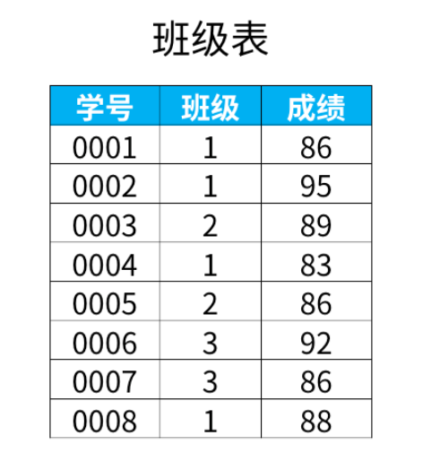
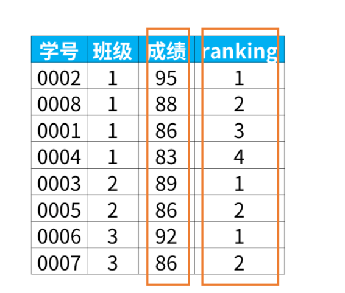
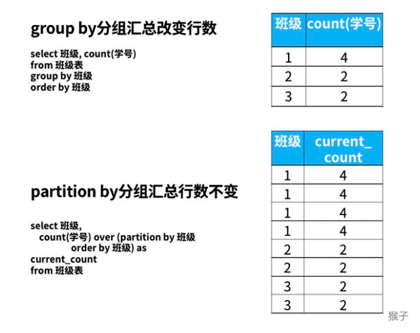
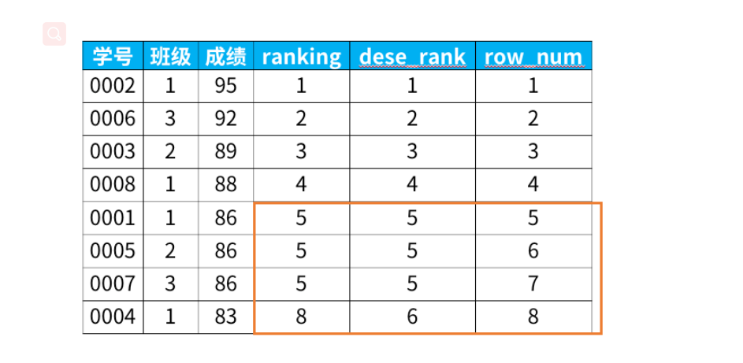
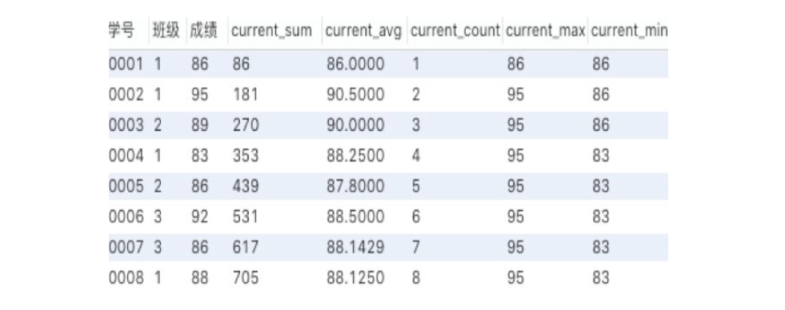

#SQL 窗口函数

## 一. 查询分析的利器---窗口函数


### 窗口函数有什么用？
在日常工作中，经常会遇到需要在每组内排名，比如下面的业务需求：
> 排名问题
> topN问题:找出每个部门排名前N的员工进行奖励

面对这类需求，就需要使用sql的高级功能窗口函数了。

### 什么是窗口函数？
窗口函数，也叫OLAP函数（Online Anallytical Processing，联机分析处理），可以对数据库数据进行实时分析处理。

窗口函数的基本语法如下：

<窗口函数> over (partition by <用于分组的列名> order by <用于排序的列名>)

那么语法中的<窗口函数>有哪些呢？
<窗口函数>的位置，可以放以下两种函数：
1）专用窗口函数，包括后面要将的rank，dense_rank,row_number 等专用窗口函数。
2）聚合函数， sum ，avg，count，max，min等

因为窗口函数是对where 或者group by 子句处理后的结果进行操作，所以**窗口函数原则上只能写在select 子句中**。


### 如何使用？


#### 1.专用窗口函数rank


以班级“1” 为例，这个班级的成绩排在第一位，这个班级的83排在第4位。


sql代码如下：
```sql
select *, rank() over (partition by 班级 order by 成绩 desc) as ranking
from 班级表
```

窗口函数具备了我们之前学过的group by子句分组的功能和order by子句排序的功能。那么，为什么还要用窗口函数呢？

这是因为，group by分组汇总后改变了表的行数，一行只有一个类别。而partiition by和rank函数不会减少原表中的行数。例如下面统计每个班级的人数。



#### 其他专用窗口函数
专用窗口函数 rank，dense_rank,row_number 有什么区别
```sql
select *,
   rank() over (order by 成绩 desc) as ranking,
   dense_rank() over (order by 成绩 desc) as dese_rank,
   row_number() over (order by 成绩 desc) as row_num
from 班级表
```



#### 聚合函数作为窗口函数
聚和窗口函数和上面提到的专用窗口函数用法完全相同，只需要把聚合函数写在窗口函数的位置即可，但是函数后面括号里面不能为空，需要指定聚合的列名。

我们来看一下窗口函数是聚合函数时，会出来什么结果：
```sql
select *,
   sum(成绩) over (order by 学号) as current_sum,
   avg(成绩) over (order by 学号) as current_avg,
   count(成绩) over (order by 学号) as current_count,
   max(成绩) over (order by 学号) as current_max,
   min(成绩) over (order by 学号) as current_min
from 班级表
```
