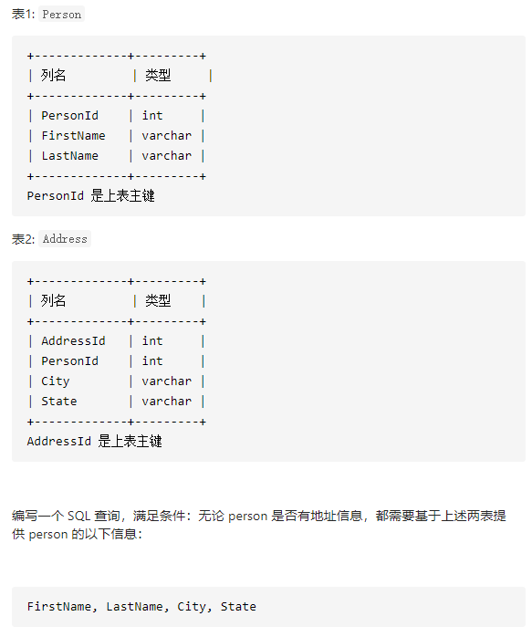
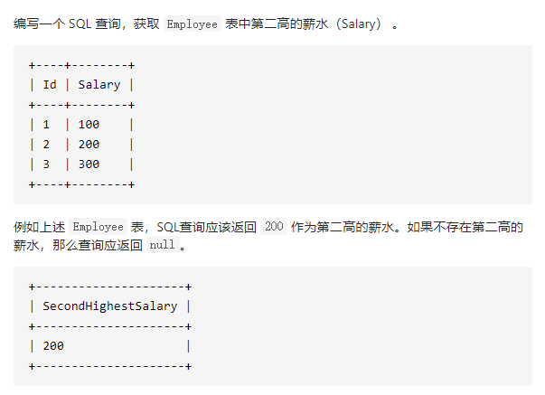
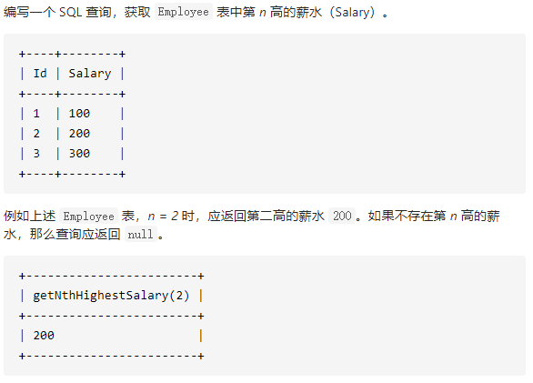
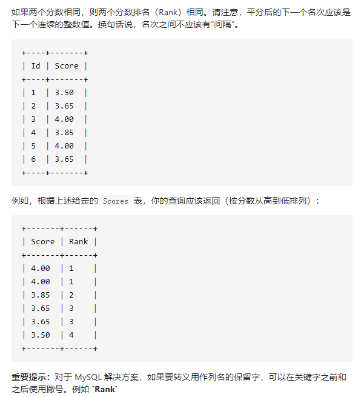
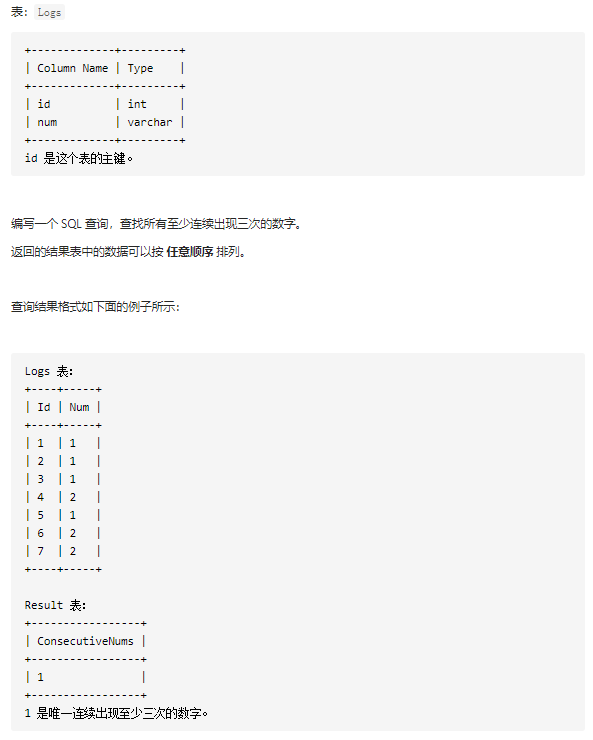
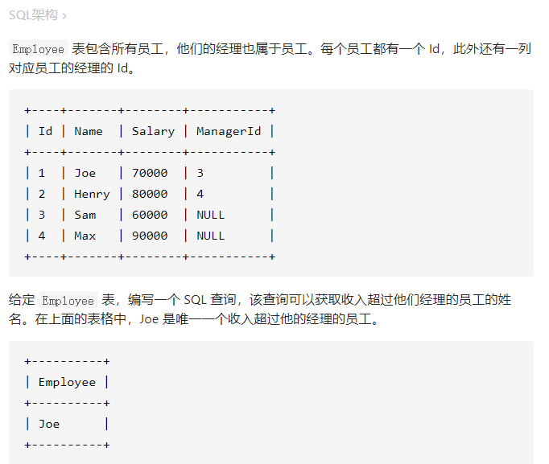
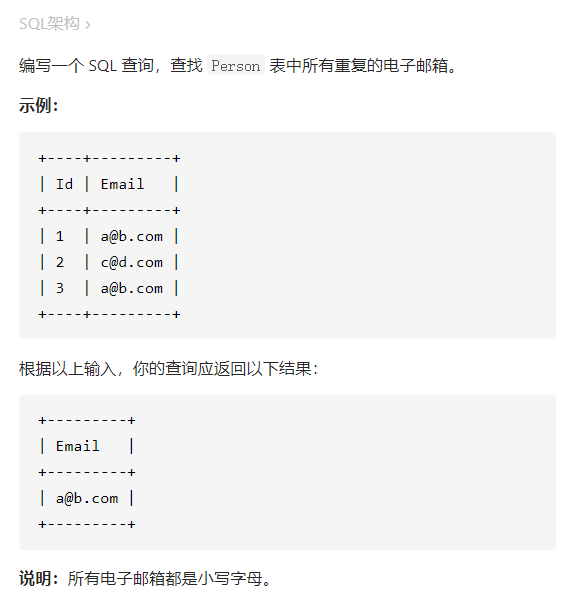
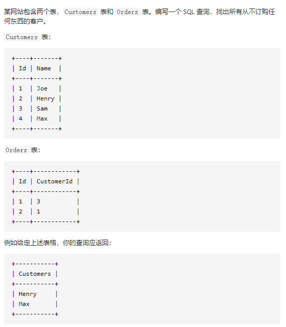
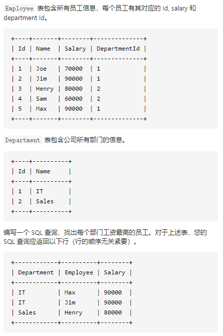
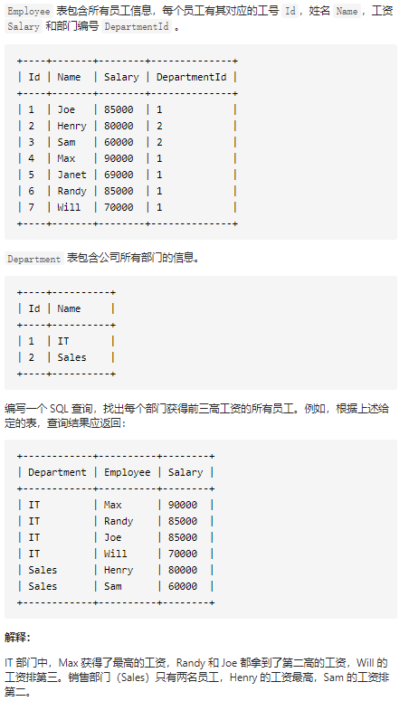

#数据库
[TOC]


##175.组合两个表

  

* 代码
```sql
select FirstName, LastName,City,State from Person as p left outer join Address as a on p.PersonId = a.PersonId;
```

##176.第二高的薪水
  

* 代码
  
```sql
select (select DISTINCT Salary  from Employee order by Salary desc limit 1,1) as SecondHighestSalary;
```


##177.第N高的薪水
  

* 代码

```sql
CREATE FUNCTION getNthHighestSalary(N INT) RETURNS INT
BEGIN
  SET N = N-1;
  RETURN (
      # Write your MySQL query statement below.
     select DISTINCT Salary from Employee order by Salary desc limit N,1
  );
END

```


##178.分数排名
  
* 代码
```sql
select a.Score as Score,
(select count(DISTINCT b.Score) from Scores as b where b.Score>=a.Score) as `Rank`
from Scores as a  order by Score DESC
```


##180.连续出现的数字
  

* 代码
```sql
select DISTINCT(l1.Num) as ConsecutiveNums
from Logs as l1,Logs as l2,Logs as l3
where l1.Id=l2.Id-1 and l1.Num=l2.Num
  and l2.Id=l3.Id-1 and l2.num=l3.num
```


##181.超过经理收入的员工
  
* 代码
```sql
select a.Name as 'Employee'
from Employee as a,Employee as b
where a.ManagerId=b.Id
and a.Salary >b.Salary
```


##182.查找重复的电子邮箱
  
* 代码
```sql
select Email from
(select Email, count(Email) as num from Person group by Email) as a
where num>1

```
临时表需要有别名


##183.从不订购的客户
  

* 代码
```sql
select a.Name  as 'Customers'
from Customers as a
where a.Id NOT IN(
    select CustomerId from Orders
)

```

##184.部门工资最高的员工
  

* 代码
```sql
select Department.Name as 'Department', Employee.Name as 'Employee', Salary
from  Department join Employee on Employee.DepartmentId =Department.Id 
where (Department.Id,Salary) IN
(select DepartmentId,max(Salary) from Employee group by DepartmentId)
```


##185.部分工资前三高的所有员工
  

* 代码
```sql

```