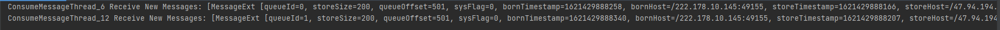
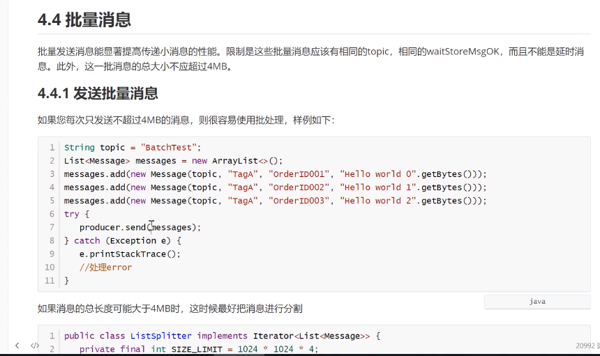

[toc]

# RocketMQ 生产者消费者


## 基本样例

注意： 这里要注意客户端依赖的版本。由于使用了4.8.0的RocketMQ，这里的客户端rocketmq-client 一定要使用4.4.0的
```xml
	<dependency>
      <groupId>org.apache.rocketmq</groupId>
      <artifactId>rocketmq-client</artifactId>
      <version>4.4.0</version>
    </dependency>
```


## 生产者

### 消息发送者步骤分析
>1.创建消息生产者producer,并制定生产者组名
>2.指定Nameserver地址
>3.启动producer
>4.创建消息对象，指定主题Topic，Tag和消息体
>5.发送消息
>6.关闭生产者producer

### 发送同步消息（消息的生产者发送消息，发送到broker后，需要mq发回消息，才会继续）
这种可靠性同步地发送方式使用地比较广泛，比如：重要地消息通知，短信通知


```java
public class SyncProducer {
    public static void main(String[] args) throws MQClientException, RemotingException, InterruptedException, MQBrokerException, UnsupportedEncodingException {

        //实例化消息生产者Producer
        DefaultMQProducer producer=new DefaultMQProducer("abs");

        producer.setVipChannelEnabled(false);
        // 设置NameServer的地址
        producer.setNamesrvAddr("47.94.194.165:9876");
        // 启动producer实例
        producer.start();

        for(int i=0;i<2;i++){
            // 创建消息，并指定topic，tag和消息体
            Message msg= new Message("TopicTest","TagA",("Hello RocketMQ"+ i).getBytes(RemotingHelper.DEFAULT_CHARSET));

            SendResult sendResult=producer.send(msg,10000);
            System.out.printf("%s%n",sendResult);
        }

        producer.shutdown();
    }
}

```
坑：生产者在发送消息的时候，除非你的RocketMQ和你当前是属于同一个局域网，否则在producer.send的时候一定要指定超时时间。否则大概率会报异常，默认超时时间是3000毫秒，而我这边连到远程的rocketMQ基本都是3500毫秒以上，所以就会报超时异常。


**坑**： 还有需要注意的是，生产者启动的时候出现了以下的错。
connect to XXXX:10909 failed
经过排查后是由于阿里云的多网卡造成的，因此启动broker的指令要修改，通过指定broker 的配置文件加载，
```shell
nohup sh mqbroker -n localhost:9876 -c ../conf/broker.conf &

```



## 发送异步消息
异步消息通常用在对响应时间敏感的业务场景，即发送端不能容忍长时间的等待Broker的响应
```java
public class AsycProducer {

    public static void main(String[] args) throws MQClientException, InterruptedException, RemotingException, UnsupportedEncodingException {
        //实例化消息生产者Producer
        DefaultMQProducer producer=new DefaultMQProducer("abs");

        producer.setVipChannelEnabled(false);
        // 设置NameServer的地址
        producer.setNamesrvAddr("47.94.194.165:9876");
        // 启动producer实例
        producer.start();

        for(int i=0;i<2;i++){
            // 创建消息，并指定topic，tag和消息体
            Message msg= new Message("TopicTest","TagA",("Hello RocketMQ"+ i).getBytes(RemotingHelper.DEFAULT_CHARSET));
          // 发送异步消息
           producer.send(msg, new SendCallback() {
                //发送成功回调函数
                @Override
                public void onSuccess(SendResult sendResult) {
                    System.out.println("发送结果："+sendResult);
                }
                //发送失败回调函数
                @Override
                public void onException(Throwable throwable) {
                    System.out.println("发送异常"+ throwable);
                }
            });
            TimeUnit.SECONDS.sleep(1);

        }

        producer.shutdown();
    }
}
```


## 消费者

### 消息消费者步骤分析
>1. 创建消费者Consumer，制定消费者组名
>2. 指定Nameserver地址
>3. 订阅主题Topic和Tag
>4. 设置回调函数，处理消息
>5. 启动消费者consumer

###  消费者
```java

public class SyncConsume {
    public static void main(String[] args) throws MQClientException {
        // 实例化消费者
        DefaultMQPushConsumer consumer = new DefaultMQPushConsumer("abs");
       //
        consumer.setNamesrvAddr("47.94.194.165:9876");

        consumer.subscribe("TopicTest","TagA");

        consumer.registerMessageListener(new MessageListenerConcurrently() {
            @Override
            public ConsumeConcurrentlyStatus consumeMessage(List<MessageExt> list, ConsumeConcurrentlyContext consumeConcurrentlyContext) {
                System.out.printf("%s Receive New Messages: %s%n",Thread.currentThread().getName(),list);
                return ConsumeConcurrentlyStatus.CONSUME_SUCCESS;
            }
        });

        consumer.start();
        System.out.printf("Consumer Started.%n");

    }
}

```


###  消费者广播模式和负载均衡模式

#### 1）负载均衡模式
消费者采用负载均衡方式消费消息，多个消费者共同消费队列消息，每个消费者处理的消息不同（默认）


#### 2）广播模式
消费者采用广播的方式消费消息，每个消费者消费的消息都是相同的
```java
//设定消费模式：负载均衡|广播模式
consumer.setMessageModel(MessageModel.BROADCASTING);

consumer.setMessageModel(MessageModel.CLUSTERING);
```


## 顺序消息
消息有序指的是可以按照消息的发送顺序来消费（FIFO）。RocketMQ可以严格的保证消息有序，可以分为分区有序或者全局有序。

顺序消费的原理解析，在默认的情况下消息发送回采取Round Robin轮询方式把消息发送到不同的queue（分区队列）；而消费消息的时候从多个queue 上拉取消息，这种情况发送和消费不能保证顺序，但是如果控制发送的顺序消息只依次发送到同一个queue中，消费的时候只会从这个queue上依次拉取，则就保证了顺序。当发送和消费参与的queue只有一个，则全局有序；如果多个queue参与，则为分区有序，即相对每个queue，消息都是有序的。


下面用订单进行分区有序的示例，一个订单的顺序流程是：创建，付款，推送，完成。订单号相同的消息会被先后发送到同一个队列中，消费时同一个OrderId获取到的肯定是同一个队列。

### 订单
```java
@Data
public class OrderStep {

    private long orderId;

    private String desc;

    @Override
    public String toString() {
        return "OrderStep{" +
                "orderId=" + orderId +
                ", desc='" + desc + '\'' +
                '}';
    }

    public static List<OrderStep> buildOrders(){
        List<OrderStep> orderList= new ArrayList<>();

        OrderStep orderDemo=new OrderStep();
        orderDemo.setOrderId(1039L);
        orderDemo.setDesc("创建");
        orderList.add(orderDemo);

        orderDemo =new OrderStep();

        orderDemo.setOrderId(1050L);
        orderDemo.setDesc("创建");
        orderList.add(orderDemo);


        orderDemo =new OrderStep();

        orderDemo.setOrderId(1039L);
        orderDemo.setDesc("付款");
        orderList.add(orderDemo);


        orderDemo =new OrderStep();

        orderDemo.setOrderId(1050L);
        orderDemo.setDesc("付款");
        orderList.add(orderDemo);


        orderDemo =new OrderStep();

        orderDemo.setOrderId(1039L);
        orderDemo.setDesc("成功");
        orderList.add(orderDemo);


        orderDemo =new OrderStep();

        orderDemo.setOrderId(1050L);
        orderDemo.setDesc("成功");
        orderList.add(orderDemo);

        return  orderList;

    }
}

```

### 生产者
```java
public class Producer {

    public static void main(String[] args) throws MQClientException, RemotingException, InterruptedException, MQBrokerException {
        DefaultMQProducer producer=new DefaultMQProducer("abs");

        producer.setVipChannelEnabled(false);
        // 设置NameServer的地址
        producer.setNamesrvAddr("47.94.194.165:9876");
        // 启动producer实例
        producer.start();
        List<OrderStep> list= OrderStep.buildOrders();

        for(int i=0;i<list.size();i++){

            String body=list.get(i)+"";

            Message message=new Message("TopicTest","Order","i"+i,body.getBytes(StandardCharsets.UTF_8));

            /*
            *
            * @param: 消息对象
            * @param：消息队列选择器
            * @param: 选择队列的业务标识（订单id）
            */
            SendResult sendResult = producer.send(message, new MessageQueueSelector() {
                @Override
                public MessageQueue select(List<MessageQueue> mqs, Message message, Object arg) {
                    long id = (long) arg;
                    long size = id % mqs.size();
                    return mqs.get((int) size);

                }
            }, list.get(i).getOrderId());
        }

        producer.shutdown();
    }
}

```

### 消费者
```java
public class Consumer {
    public static void main(String[] args) throws MQClientException {
        DefaultMQPushConsumer consumer = new DefaultMQPushConsumer("abs");
        //
        consumer.setNamesrvAddr("47.94.194.165:9876");
        //订阅
        consumer.subscribe("TopicTest","Order");


//        consumer.registerMessageListener(new MessageListenerConcurrently() {
//            @Override
//            public ConsumeConcurrentlyStatus consumeMessage(List<MessageExt> list, ConsumeConcurrentlyContext consumeConcurrentlyContext) {
//                System.out.printf("%s Receive New Messages: %s%n",Thread.currentThread().getName(),list);
//                return ConsumeConcurrentlyStatus.CONSUME_SUCCESS;
//            }
//        });

        //顺序消息
        consumer.registerMessageListener(new MessageListenerOrderly() {
            @Override
            public ConsumeOrderlyStatus consumeMessage(List<MessageExt> msgs, ConsumeOrderlyContext context) {
                for(MessageExt msg:msgs){
                    System.out.println("线程名称"+Thread.currentThread()+"消费消息"+new String(msg.getBody()));
                }
                return ConsumeOrderlyStatus.SUCCESS;
            }
        });

        consumer.start();
        System.out.printf("Consumer Started.%n");
    }
}

```


## 延时消息
比如在电商里，提交了一个订单就可以发送一个延时消息，1h后去检查这个订单的状态，如果还是未付款就取消订单释放库存。

```java
//设置延时时间
msg.setDelayTimeLevel();
```

## 批量消息
批量发送消息能显著提高传递消息的性能。限制是这些批量消息应该有相同的topic，相同的waitStoreMsgOK，而且不能是延时消息。此外，这一批消息的总大小不超过4mb。

